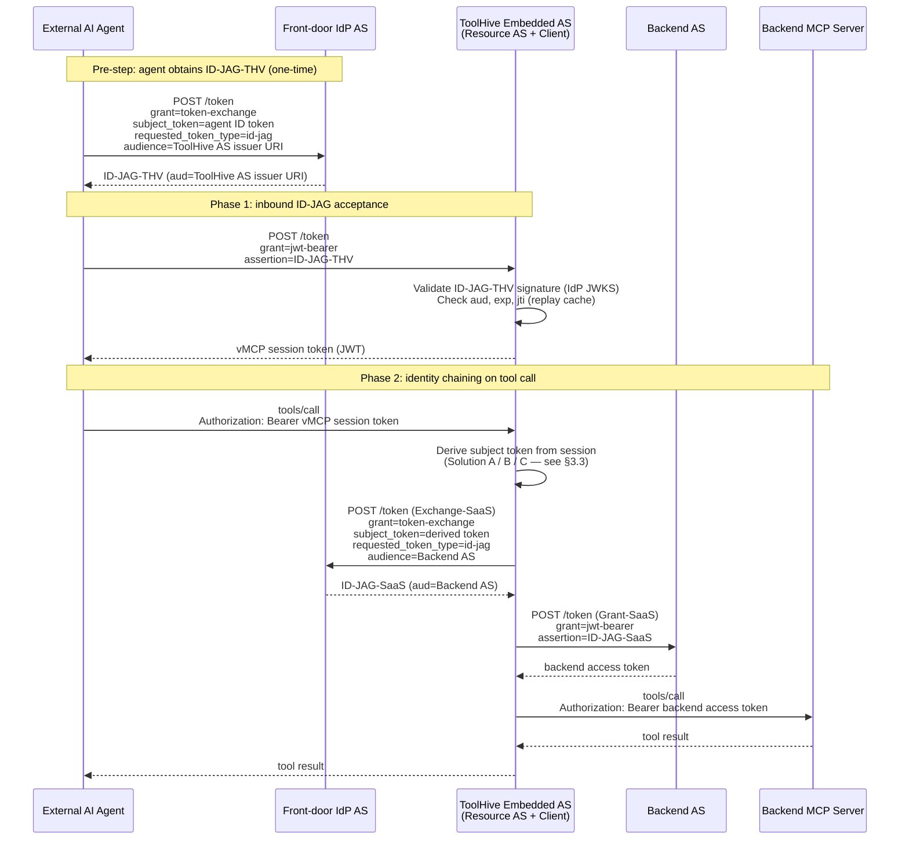

# RFC-0080: XAA Identity Chaining Intermediary

- **Status**: Draft
- **Author(s)**: Jakub Hrozek (@jhrozek)
- **Created**: 2026-07-01
- **Last Updated**: 2026-07-01
- **Target Repository**: toolhive
- **Related Issues**: [stacklok/toolhive#5218](https://github.com/stacklok/toolhive/issues/5218)

## Summary

[THV-0079](./THV-0079-cross-app-access-grant.md) makes the vMCP an XAA *client*: it holds the user's upstream ID token from the embedded auth server's SSO login and uses it to obtain backend access tokens via the two-step ID-JAG protocol. This RFC addresses a different scenario: an external client — an AI agent, an automation pipeline, or another application — already holds an ID-JAG and wants to call ToolHive's vMCP *without* a browser redirect.

This RFC is split into two independent phases:

- **Phase 1 — Inbound ID-JAG Acceptance.** ToolHive's embedded AS gains a new `jwt-bearer` grant handler. An external client presents an ID-JAG-THV addressed to ToolHive's AS issuer URI; ToolHive validates it and issues a vMCP session token. No browser redirect required. Works immediately with any backend using `header_injection`, `token_exchange`, or `upstream_inject` outgoing auth.

- **Phase 2 — Identity Chaining Intermediary.** For backends that themselves use the `xaa` outgoing strategy, ToolHive performs outbound XAA on the user's behalf: it derives a subject token from the Phase 1 session and uses it to obtain a backend-specific ID-JAG-SaaS via a fresh Exchange-SaaS. Phase 2 is additive on top of Phase 1 and can be shipped independently.

---

## 1. Background

This section describes what exists in ToolHive and in the OAuth ecosystem today. It contains no proposal content.

### 1.1 What THV-0079 Solves and What It Does Not

[THV-0079](./THV-0079-cross-app-access-grant.md) establishes the `xaa` outgoing-auth strategy for the vMCP. When a user authenticates via a browser OIDC flow, the embedded auth server ([THV-0053](./THV-0053-vmcp-embedded-authserver.md)) captures their upstream ID token. The `xaa` strategy reads that ID token and performs the two-step ID-JAG protocol on every backend call: Exchange-THV at the front-door IdP to mint an ID-JAG, Grant-THV at the resource AS to redeem it for a backend access token.

This path requires a prior browser login to seed the upstream ID token. It covers the interactive user case but leaves a gap: automated clients — AI agents, CI pipelines, service-to-service calls — cannot drive a browser redirect. They already hold an identity credential from their own IdP, and they want to present that credential directly to ToolHive's vMCP token endpoint, with no redirect, and receive a session token they can use to call tools.

### 1.2 The Inbound Gap

The embedded auth server today issues tokens only to clients that have completed the OIDC authorization code flow. It has no grant handler for `urn:ietf:params:oauth:grant-type:jwt-bearer`. A non-interactive caller with a valid ID-JAG — an assertion that the user's IdP already minted and that ToolHive's AS could validate — has no entry point. The session token endpoint returns `unsupported_grant_type`.

Closing this gap is the first phase of this RFC: add an inbound ID-JAG acceptance path to the embedded AS (acting as Resource AS). This alone enables the browser-less use case for backends that use `header_injection`, `token_exchange`, `upstream_inject`, or any outgoing strategy that does not itself require an upstream ID token from a browser login.

### 1.3 The Chaining Scenario

For backends that are themselves protected via XAA — that is, backends whose `MCPExternalAuthConfig` is type `xaa` — the `xaa` outgoing strategy expects an upstream ID token in `Identity.UpstreamIDTokens`. After Phase 1, that map is empty for an inbound ID-JAG session: no browser login happened, so no upstream ID token was captured and stored. Phase 2 fills this gap by deriving a subject token that the `xaa` outgoing strategy (Exchange-SaaS) can use, without requiring the external client to supply any additional credential.

The full four-step chain and ToolHive's role in each:

| Step | Who performs it | Role |
|------|-----------------|------|
| **Exchange-THV** — external client exchanges its ID token at the IdP for ID-JAG-THV (aud=ToolHive AS) | External client (AI agent) | Client |
| **Grant-THV** — external client presents ID-JAG-THV to ToolHive's AS; ToolHive issues a vMCP session token | ToolHive | Resource Authorization Server |
| **Exchange-SaaS** — ToolHive exchanges a derived subject token at the IdP for ID-JAG-SaaS (aud=backend AS) | ToolHive | Client |
| **Grant-SaaS** — ToolHive presents ID-JAG-SaaS to the backend AS; backend AS issues an access token | ToolHive | Client |

ToolHive is absent from Exchange-THV — that step is the external client's responsibility, performed before any interaction with ToolHive.

`draft-ietf-oauth-identity-assertion-authz-grant-04` §9.3 explicitly permits a single piece of software to serve both roles: "This does not preclude a single piece of software from being both an IdP issuing ID-JAGs as well as a Resource Authorization Server consuming ID-JAGs." This RFC uses the term **Identity Chaining Intermediary** for ToolHive in this dual role. It is not a term from the draft — it is defined locally here to describe a deployment topology that the draft explicitly allows but does not name.

### 1.4 Vocabulary

Base vocabulary (Client, Resource AS, IdP AS, ID-JAG, upstream ID token, backend access token) is defined in [THV-0079 §1.5](./THV-0079-cross-app-access-grant.md). The following terms are new to this RFC:

| Term | Source | Meaning |
|------|--------|---------|
| **ID-JAG-THV** | ToolHive | The inbound ID-JAG presented by the external client to ToolHive's AS at Grant-THV. Its `aud` is ToolHive's AS issuer URI. |
| **ID-JAG-SaaS** | ToolHive | The outbound ID-JAG obtained by ToolHive at Exchange-SaaS and used at Grant-SaaS. Its `aud` is the backend AS issuer URI. |
| **vMCP session token** | ToolHive | The JWT issued by ToolHive's embedded AS to the external client after validating ID-JAG-THV. Authorizes subsequent tool calls. |
| **Identity Chaining Intermediary** | ToolHive | ToolHive in a deployment where it accepts an inbound ID-JAG-THV (Resource AS role) and issues outbound ID-JAG-SaaS requests (Client role) on the same request path. |
| **act claim** | RFC 8693 §4.1 | JWT claim recording the actor that performed a delegation step; used to preserve the full identity chain when ToolHive issues derived tokens in Phase 2. |
| **Backend AS** | ToolHive | The resource AS protecting a specific backend MCP server; the Grant-SaaS target. |

### 1.5 The Two-Step ID-JAG Protocol

The full wire format for Steps A and B is defined in [THV-0079 §1.3](./THV-0079-cross-app-access-grant.md). In summary:

- **Exchange-THV / Exchange-SaaS** (`grant_type=token-exchange` at the IdP): the Client presents a user ID token as `subject_token` and receives an ID-JAG with `token_type=N_A` and `issued_token_type=urn:ietf:params:oauth:token-type:id-jag`. The ID-JAG is a signed JWT with `typ: oauth-id-jag+jwt`, bound to a specific Resource AS via `aud` and to a specific API via `resource`.
- **Grant-THV / Grant-SaaS** (`grant_type=jwt-bearer` at the Resource AS): the Client presents the ID-JAG as `assertion` and receives a standard Bearer access token.

In this RFC:
- The **inbound path** is a Grant-THV call *into* ToolHive's embedded AS — ToolHive is the Resource AS, and the ID-JAG it receives is ID-JAG-THV.
- The **outbound path** on a Phase 2 tool call is Exchange-SaaS (ToolHive requests ID-JAG-SaaS from the IdP) followed by Grant-SaaS (ToolHive presents ID-JAG-SaaS to the backend AS).

---

## 2. Design Goals

### 2.0 Phase Definitions

| Phase | Scope | Shippable independently? | Backends it unlocks |
|-------|-------|--------------------------|---------------------|
| **Phase 1** — Inbound ID-JAG acceptance | Embedded AS gains a `jwt-bearer` grant handler; validates ID-JAG-THV, issues vMCP session token | Yes | `header_injection`, `token_exchange`, `upstream_inject` |
| **Phase 2** — Identity Chaining Intermediary | Derives a subject token from the Phase 1 session; performs outbound Exchange-SaaS + Grant-SaaS | Requires Phase 1 | `xaa` (backends that themselves use ID-JAG) |

Phase 1 alone is useful and safe to ship. Phase 2 is an additive extension and can follow in a subsequent release.

### 2.1 Goals

- Add an inbound RFC 7523 JWT bearer grant handler to the vMCP embedded AS so that external clients can obtain a vMCP session token by presenting a valid ID-JAG-THV, with no browser redirect (Phase 1).
- Validate ID-JAG-THV against a configurable per-issuer JWKS trust registry so the AS can trust assertions from multiple IdPs without trusting all of them.
- Enforce `jti` replay prevention on accepted ID-JAGs₁ so that a single assertion cannot be reused within its validity window.
- Expose Phase 1 acceptance in the AS discovery document so that clients can discover the supported grant types.
- Enable the full Identity Chaining Intermediary topology for backends using the `xaa` outgoing strategy by deriving a valid subject token for Exchange-SaaS from the inbound session, using one of the three mechanisms described in §3.3 (Phase 2).
- Preserve the full identity chain in all derived tokens via the `act` claim (RFC 8693 §4.1), so that every downstream AS can observe "user X via agent Y via ToolHive".
- Stay strictly additive with respect to [THV-0079](./THV-0079-cross-app-access-grant.md): the browser-login path is unchanged, and the `xaa` outgoing strategy continues to work without modification for vMCP sessions seeded by a browser login.

### 2.2 Non-Goals

- **Replacing the browser-login path.** The OIDC authorization code flow and the `xaa` outgoing strategy for browser-seeded sessions ([THV-0079](./THV-0079-cross-app-access-grant.md)) are unchanged. This RFC adds a *parallel* entry point, not a replacement.
- **Supporting Entra user-delegated chaining.** Microsoft Entra requires an interactive user consent step for delegated on-behalf-of flows. Machine-to-machine chaining through Entra is restricted to app-only tokens, which do not carry user identity. This use case is out of scope.
- **Implementing a full OIDC provider.** Phase 1 adds one new grant type to the existing token endpoint. The AS does not gain userinfo, dynamic client registration, or any endpoint beyond what it already exposes. Phase 2 Solution B issues short-lived internal ID tokens for the purpose of Exchange-SaaS only; this does not make ToolHive a general-purpose OIDC provider.
- **Client cooperation (forwarding credentials from the inbound client).** The external client presents ID-JAG-THV and nothing more. Phase 2 must work without the client supplying a refresh token, a second ID token, or any additional credential beyond what ID-JAG-THV already asserts.
- **Interactive step-up re-authentication.** Out of scope for the same reasons given in [THV-0079](./THV-0079-cross-app-access-grant.md) §2.2.
- **Multi-actor chaining beyond one delegation level.** This RFC carries one user identity and one agent identity per inbound token. Nested `act.act…` chains are not modelled.

---

## 3. Solution Design

### 3.1 Architecture Overview

The two phases of this RFC layer cleanly on the existing vMCP embedded AS architecture. Phase 1 is purely an inbound grant-handler addition; it does not touch the outgoing-auth layer at all. Phase 2 adds a derivation step between inbound session establishment and outgoing-auth strategy invocation.

The full Phase 2 flow, end to end:



### 3.2 Phase 1 — Inbound ID-JAG Acceptance

Phase 1 adds a single new grant handler to the vMCP embedded AS. The handler accepts requests of the form:

```http
POST /token HTTP/1.1
Host: auth.example.com
Authorization: Basic <client credentials>
Content-Type: application/x-www-form-urlencoded

grant_type=urn%3Aietf%3Aparams%3Aoauth%3Agrant-type%3Ajwt-bearer
&assertion=<ID-JAG-THV>
```

The handler performs the following validation steps before issuing any token:

1. **Parse the assertion.** Extract the JWT header and claims without signature verification. Confirm `typ` is `oauth-id-jag+jwt`.
2. **Resolve the issuer trust entry.** Look up `iss` in the per-issuer JWKS trust registry (§3.4). Reject with `invalid_grant` if the issuer is not configured.
3. **Verify the signature** against the resolved JWKS. Reject with `invalid_grant` on any JOSE error.
4. **Validate standard JWT claims.** `exp` not in the past, `nbf` if present not in the future, `iat` present and recent (bounded clock skew, configurable up to 300 s). Reject with `invalid_grant` on any failure.
5. **Validate `aud`.** Performed by fosite's `rfc7523.Handler` against `AuthorizationServerConfig.GetTokenURLs()`. Fosite's default `GetTokenURLs()` returns only the AS's token endpoint URL (`<issuer>/oauth/token`); this RFC overrides it (§3.2.2) to also accept the bare AS issuer URI, since that is the value this RFC documents external IdPs should use for `aud`. Reject with `invalid_grant` (fosite's built-in behavior) if the audience matches neither.
6. **Check `jti` replay.** Look up `jti` in the replay-prevention cache (§3.5). Reject with `invalid_grant` if the `jti` has been seen before. Insert on first acceptance, with TTL equal to the assertion's `exp − now`.
7. **Extract identity.** Read `sub` and `iss` from the validated claims. Optionally read an email claim if the IdP includes one.
8. **Issue vMCP session token.** Mint a standard signed JWT using the embedded AS's signing key, with `sub` from the assertion, `iss` equal to the AS issuer URI, `aud` equal to the configured MCP resource URL, and `exp` equal to `min(ID-JAG-THV.exp, now + configured_session_lifetime)`. Include an `act` claim recording the original IdP `iss` and `sub`. Mint a fresh `tsid` (token-session-id) claim, matching the shape used for OIDC-callback sessions, and write a session record to the same session storage backend (§3.6) keyed by that `tsid`, with `ExpiresAt` equal to the token's own `exp`. Phase 2 §3.3.1 (Solution A) extends this record with the raw ID-JAG-THV.

No upstream ID token is stored in session storage for Phase 1 sessions. The session record exists only to validate subsequent incoming bearer tokens; the `UpstreamIDTokens` map is empty for Phase 1 sessions (relevant to Phase 2 — see §3.3).

The existing fosite-based token endpoint ([THV-0053](./THV-0053-vmcp-embedded-authserver.md)) gains a new `Factory` (§3.2.2) registered alongside the existing ones in `pkg/authserver/server/provider.go`'s `NewAuthorizationServer(..., factories...)` call. Phase 1 does **not** register `compose.RFC7523AssertionGrantFactory` unmodified — two of the validation steps above (the `typ` check in step 1 and the `allowedClientIDs` filtering in step 2) are not reachable through fosite's `rfc7523.Handler` as shipped: its storage callbacks receive only `(issuer, subject, keyId)`, never the raw assertion, and it performs no `typ` check at all. §3.2.2 describes the integration this RFC actually implements.

The AS discovery document (`/.well-known/oauth-authorization-server`) is updated to include `urn:ietf:params:oauth:grant-type:jwt-bearer` in the `grant_types_supported` array.

#### 3.2.1 Trust Registry Configuration

The per-issuer JWKS trust registry is expressed as a new field on the vMCP embedded AS configuration:

```yaml
authServerConfig:
  issuer: https://auth.example.com/vmcp
  # ... existing fields ...
  inboundJWKSTrust:
    - issuer: https://idp.xaa.dev
      jwksUri: https://idp.xaa.dev/jwks
      # Optional: restrict which client IDs in ID-JAG-THV this entry accepts.
      allowedClientIDs:
        - client_3a2341f833945fbb
```

Multiple trust entries are permitted to support federated deployments where different external clients authenticate against different IdPs.

The operator CRD equivalent is a new `InboundJWKSTrust []InboundJWKSTrustEntry` field on the embedded AS spec, with `InboundJWKSTrustEntry` carrying `Issuer`, `JWKSUri`, and `AllowedClientIDs`.

JWKS content is fetched at registration time and cached with a configurable TTL (default 1 h), with refresh-on-verify-failure to handle key rotation. The fetch URL must be HTTPS; plain HTTP is rejected at configuration validation time.

#### 3.2.2 Fosite Integration

Phase 1 registers a custom `Factory` (matching the `Factory func(config *AuthorizationServerConfig, storage fosite.Storage, strategy any) any` signature `pkg/authserver/server/provider.go` already uses for the other grant handlers) built from two pieces:

1. **`InboundTrustKeyStorage`** implements fosite's `rfc7523.RFC7523KeyStorage` interface against the trust registry (§3.4):
   - `GetPublicKey`/`GetPublicKeys(ctx, issuer, subject, ...)` ignore `subject` entirely and resolve the cached JWKS by `issuer` alone. This is a deliberate mismatch with `rfc7523`'s original design target (per-subject pre-registered service-account keys): ID-JAG-THV is trusted by *issuer*, not by an individually registered subject, so `subject` carries no meaning here. Unconfigured issuers return an error, which fosite maps to `invalid_grant`.
   - `GetPublicKeyScopes` is unreachable in practice: fosite only calls it when `request.GetRequestedScopes()` is non-empty, and Phase 1's Grant-THV wire format (§3.2) never includes a `scope` parameter — Phase 1 explicitly rejects any Grant-THV request that supplies one, with `invalid_scope`. This is dead code by construction, not an unspecified behavior; it is implemented to satisfy the interface and never meaningfully invoked.
   - `IsJWTUsed`/`MarkJWTUsedForTime` **are** the `jti` replay-prevention cache described in §3.5 — fosite's `rfc7523.Handler.validateTokenClaims` calls these two methods directly. §3.5 is not a separate hook layered on top of the fosite integration; it is this interface, backed by the storage described there (in-memory LRU or Redis).

2. **A thin `fosite.TokenEndpointHandler` decorator** wrapping a `*rfc7523.Handler{Storage: InboundTrustKeyStorage{...}}`. Before delegating, the decorator re-parses the `assertion` form parameter — the same string fosite's own handler parses internally — to check: (a) the JWT `typ` header equals `oauth-id-jag+jwt` (step 1 of §3.2), rejecting with `invalid_grant` if not; (b) if the resolved trust entry's `allowedClientIDs` is non-empty, the assertion's `client_id` claim is a member (step 2), rejecting with `invalid_grant` if not. Both checks run on unverified claims purely to fail fast before the more expensive JWKS/signature path; the decorator then delegates to the wrapped `*rfc7523.Handler`, which performs the security-critical checks (signature, `aud`, `exp`/`nbf`/`iat`, `jti`) using fosite's own, already-reviewed validation logic. `CanHandleTokenEndpointRequest` and `CanSkipClientAuth` on the decorator pass through to the wrapped handler unchanged.

This is more implementation work than "register a factory," but it is the only way to enforce `typ` and `allowedClientIDs` given that fosite's storage callbacks never expose the raw assertion. The checks that are security-critical — signature verification, `aud`, `exp`/`nbf`/`iat`, `jti` replay — still run entirely inside fosite's own `rfc7523.Handler`; the decorator only adds two additional fast-fail checks in front of it, matching the same shape fosite already uses for pluggable client-authentication and scope-strategy hooks elsewhere in the provider.

### 3.3 Phase 2 — Subject Token Derivation for Outbound XAA

When the `xaa` outgoing strategy runs for a Phase 1 session, `Identity.UpstreamIDTokens` is empty: no browser login captured an upstream ID token. Exchange-SaaS of the outgoing `xaa` strategy requires a `subject_token` (§4.3 of the draft) — typically an ID token. Without one, the strategy returns `ErrUpstreamTokenNotFound` and the call fails.

Phase 2 introduces a **subject token derivation** hook invoked between session validation and outgoing-strategy execution for Phase 1 sessions. The hook produces a subject token that the `xaa` strategy can present at Exchange-SaaS without any additional credential from the external client. Three mechanisms are supported, chosen per-deployment by operator configuration:

#### 3.3.1 Solution A — Audience Alignment (Generic RFC 8693 IdPs)

**Mechanism.** ToolHive's OAuth client registration at the IdP uses a `client_id` equal to ToolHive's AS issuer URI. Under this condition, §4.3.3 of the draft is satisfied when ToolHive presents ID-JAG-THV as the `subject_token` at Exchange-SaaS: the `aud` of ID-JAG-THV equals ToolHive's issuer URI, which equals ToolHive's `client_id` at the IdP, which is the credential used to authenticate the Exchange-SaaS token-exchange request.

This resolves the §9.3 concern as well. Section 9.3 prohibits forwarding ID-JAG-THV as an *authorization grant* at a downstream AS (Grant-SaaS). Presenting it as a `subject_token` in an RFC 8693 token-exchange at Exchange-SaaS is not a jwt-bearer grant; it is input to a token exchange where the IdP validates and transforms it, producing a new ID-JAG-SaaS. The ID-JAG-THV is consumed, not forwarded.

**IdP support requirements.** The IdP must support `grant_type=urn:ietf:params:oauth:grant-type:token-exchange` (RFC 8693) and must accept the `id-jag` token type as a subject token type. Not all IdPs that issue ID-JAGs also accept them as exchange inputs; operator testing is required.

**Configuration signal.** The outgoing `xaa` strategy configuration on the backend gains a `subjectTokenSource: audience_alignment` field. When this value is set, the strategy reads the Phase 1 session record via the identity's `tsid` claim — the same lookup path used for `Identity.UpstreamTokens`/`UpstreamIDTokens` — and retrieves ID-JAG-THV from a new `InboundAssertionJWT` field on that record. The record's TTL matches ID-JAG-THV's own `exp`, so it never outlives the assertion it holds. It is passed directly as `subject_token` with `subject_token_type=urn:ietf:params:oauth:token-type:id-jag` at Exchange-SaaS.

**ID-JAG-THV is never embedded in the vMCP session token itself** — only referenced by `tsid`. A leaked or stolen vMCP session token therefore does not by itself disclose ID-JAG-THV; disclosure additionally requires access to the session store. This mirrors how upstream OIDC tokens are already kept server-side rather than round-tripped through the client-visible token (see §4.5).

#### 3.3.2 Solution B — ToolHive-Issued Internal ID Token (Generic IdPs)

**Mechanism.** ToolHive's embedded AS issues a short-lived OIDC ID token for the user derived from the validated ID-JAG-THV. The claims are:

- `sub`: the `sub` from ID-JAG-THV (preserving user identity).
- `iss`: ToolHive's AS issuer URI (ToolHive is the issuer).
- `aud`: ToolHive's `client_id` at the backend IdP (satisfying §4.3.3 for Exchange-SaaS).
- `exp`: `min(ID-JAG-THV.exp, now + 60 s)` — hard-bound to ID-JAG-THV's remaining validity, capped at 60 seconds.
- `iat`, `jti`: standard; `jti` is a fresh random UUID per issuance.
- `act`: `{ "iss": ID-JAG-THV.iss, "sub": ID-JAG-THV.sub }` — RFC 8693 §4.1 actor claim recording the original identity assertion's issuer, so the backend IdP can observe the full chain.
- Optional domain claim (e.g. `hd` or `email_domain`) if the IdP requires per-tenant claim validation in multi-tenant deployments.

This token is used as `subject_token` at Exchange-SaaS. The backend IdP must be configured to trust ToolHive's issuer URI as an OIDC upstream (JWKS discovery via `<issuer>/.well-known/openid-configuration`). In effect, ToolHive becomes a trusted upstream for the backend IdP — but only for the specific `aud` of the token.

**Security requirements (all mandatory for Solution B deployments):**
- The `act` claim MUST be present and MUST carry the original IdP `iss` and `sub`. A token without `act` MUST NOT be issued.
- `exp` MUST be `min(ID-JAG-THV.exp, now + 60 s)`. A token whose `exp` exceeds ID-JAG-THV's `exp` MUST NOT be issued.
- Multi-tenant deployments MUST include a per-tenant domain claim and the backend IdP MUST enforce it. The alternative is per-tenant signing keys; operators MUST choose one of the two mitigations.
- All issued tokens MUST carry a unique `jti`. The backend IdP SHOULD maintain a short-window use cache to prevent replay within `exp`.
- The JWKS used for these tokens SHOULD be distinct from the JWKS used for vMCP session tokens to limit blast radius if a signing key is compromised.

**Configuration signal.** `subjectTokenSource: th_issued_id_token` on the `xaa` backend config, plus a `backendIdpClientId` field identifying ToolHive's `client_id` at the backend IdP.

#### 3.3.3 Solution C — Okta Agent-to-Agent (Okta-Specific)

**Mechanism.** Okta's Early Access "agent-to-agent" feature allows an AI agent (registered as `test-cwo-app` type with its own custom AS) to obtain access tokens scoped to another application. ToolHive is registered in the Okta org as an AI agent application with its own custom AS. The inbound Phase 1 path issues a vMCP session token from ToolHive's custom Okta AS (T3 — a standard Okta access token). T3 carries the full `act` chain (`sub=user`, `act={ client_id=<Claude app> }`).

At Exchange-SaaS, ToolHive presents T3 as the `subject_token` with `subject_token_type=urn:ietf:params:oauth:token-type:access_token` (RFC 8693 §2.1). Because T3 is issued by ToolHive's Okta custom AS and ToolHive is registered as a cross-app grant source for the backend resource application, the Okta AS accepts T3 and mints ID-JAG-SaaS scoped to the backend.

**Requirements:**
- ToolHive registered as `test-cwo-app` in the Okta org with a custom AS.
- Cross-app delegation link configured between the external client's Okta app and ToolHive's Okta app.
- Resource connection configured between ToolHive's Okta app and the backend resource application.
- After initial admin configuration and user consent, subsequent calls require no user interaction.

**Limitation.** Okta's client IDs are not URIs; they are opaque strings (`client_id ≠ issuer URI`). Solution A's §4.3.3 audience-alignment trick does not apply directly to Okta without testing against the specific Okta AS version in use (`integrator-3683736.okta.com`).

**Configuration signal.** `subjectTokenSource: okta_agent_to_agent` on the `xaa` backend config.

#### 3.3.4 Solution Selection Summary

| IdP | Phase 1 works? | Phase 2 path | Notes |
|-----|----------------|--------------|-------|
| Generic RFC 8693 AS (e.g. xaa.dev) | Yes | Solution A or B | A preferred if `client_id = issuer URI` is achievable at the IdP |
| Okta | Yes | Solution C (agent-to-agent EA) | Solution A may work pending §9.2 open-question testing |
| Keycloak | Yes | Solution B | Keycloak does not issue ID-JAGs — its token exchange returns a regular access token; Solution B's ToolHive-issued ID token path applies |
| Microsoft Entra | Yes | App-only via WIF only | User-delegated chain requires interactive Entra flow; out of scope per §2.2 |

### 3.4 JWKS Trust Registry

The trust registry is consulted at two points: during Phase 1 inbound assertion validation (to resolve the signing JWKS for ID-JAG-THV), and optionally during Phase 2 Solution B issuance (to determine the `aud` claim for the derived ID token).

The registry is implemented as an in-process map keyed by issuer URI. Each entry holds:

- The configured `jwksUri`.
- The cached JWKS (fetched at startup, refreshed on TTL expiry and on signature-verification failure).
- A list of `allowedClientIDs` (empty = accept any `client_id` in the assertion).

JWKS refresh uses the standard ToolHive HTTP client with TLS, a configurable timeout (default 10 s), and exponential backoff. A failed refresh does not immediately invalidate the cached key set; validation continues against the stale cache until the cache entry expires (configurable, default 15 m), preventing a JWKS endpoint outage from locking out all inbound clients.

The registry is initialized from operator configuration at AS startup and is read-only at runtime. Dynamic registration is not supported.

### 3.5 Replay Prevention Cache

The `jti` replay-prevention cache prevents a presented ID-JAG-THV from being accepted more than once within its validity window. It is implemented as the `IsJWTUsed`/`MarkJWTUsedForTime` methods of the `InboundTrustKeyStorage` adapter described in §3.2.2 — fosite's `rfc7523.Handler` calls these directly during claim validation; there is no separate replay-check code path to build. Implementation requirements:

- Keyed by `(iss, jti)` — the issuer is included so that two IdPs issuing the same `jti` value do not collide. (`MarkJWTUsedForTime`'s signature only takes `jti`; the adapter prefixes it with the assertion's `iss` before writing.)
- TTL per entry equals `exp − now` at insertion time.
- Must be shared across all instances in a horizontally scaled deployment (§3.6).
- In single-instance deployments a local in-memory LRU cache (bounded by max-assertions-in-flight × max-assertion-lifetime) is sufficient.
- In multi-instance deployments the same Redis backend used for upstream token storage ([THV-0035](./THV-0035-auth-server-redis-storage.md)) is used, with a prefixed key space (`th:jti:<iss>:<jti>`).

The cache type (in-memory vs. Redis) is determined by the same `storageConfig` field that governs the rest of the AS session storage; no separate configuration key is introduced.

### 3.6 Horizontal Scaling

[THV-0047](./THV-0047-vmcp-proxyrunner-horizontal-scaling.md) describes the Redis-backed session storage that enables multiple vMCP proxy-runner pods to share session state. Phase 1 of this RFC integrates naturally with that model: the `jti` replay cache (§3.5) uses the same Redis backend, and the vMCP session tokens issued in Phase 1 are validated by the same token-reader used for browser-login sessions. No per-instance state is introduced.

The new `InboundAssertionJWT` session-record field (§3.2, §3.3.1) piggybacks on this same Redis-backed storage; no new storage backend is introduced, and it is subject to the same per-session TTL and eviction behavior already governing OIDC-derived sessions.

Phase 2 Solution B adds one new at-rest artifact: the per-tenant signing key for ToolHive-issued ID tokens (when per-tenant keys are chosen over the per-tenant domain-claim mitigation). These keys must be stored in a location readable by all replicas — Kubernetes Secrets, mounted via the existing signing-key secret mechanism.

### 3.7 Configuration

New fields introduced by this RFC (full YAML examples are in the operator guide):

**`VirtualMCPServer.spec.authServerConfig.inboundJWKSTrust[]`** (Phase 1) — list of trusted inbound ID-JAG issuers. Each entry has `issuer` (URI, required), `jwksUri` (HTTPS, required), and `allowedClientIDs` (optional whitelist). An empty list disables Phase 1.

**`MCPExternalAuthConfig.spec.xaa.subjectTokenSource`** (Phase 2) — selects the subject token derivation mechanism:

| Value | Solution | Description |
|---|---|---|
| `upstream_id_token` | (default, THV-0079) | Browser-login upstream ID token |
| `audience_alignment` | A | ID-JAG-THV as subject_token (requires `idpClientId = AS issuer URI`) |
| `th_issued_id_token` | B | ToolHive-issued derived ID token |
| `okta_agent_to_agent` | C | Okta EA agent-to-agent T3 path |

**`MCPExternalAuthConfig.spec.xaa.backendIdpClientId`** (Phase 2 Solution B only) — ToolHive's `client_id` at the backend IdP, used as `aud` in derived ID tokens.

The issued vMCP session token includes an `act` claim tracing back to ID-JAG-THV's `iss` and `sub` so the full delegation chain is auditable.

---

## 4. Security Considerations

Identity chaining requires ToolHive to assert user identity it did not directly authenticate via a browser interaction. Every step in this chain is a site where a failure — misconfiguration, validation gap, or implementation error — can make ToolHive a confused deputy: an entity that does something on a user's behalf that the user did not intend or that the downstream system should not have been asked to do. The subsections below cover each identified threat and the corresponding mandatory mitigations.

### 4.1 Identity Authority Without Direct Authentication

**Threat.** ToolHive issues a vMCP session token (Phase 1) and potentially a derived ID token (Phase 2 Solution B) for a user it has never interactively authenticated. Its authority to do so rests entirely on validating ID-JAG-THV. If that validation is incomplete or skipped, ToolHive can be induced to issue tokens for arbitrary users.

**Mitigations:**
- The full validation chain (signature, `aud`, `exp`, `jti`, issuer trust registry) in §3.2 is mandatory. Each step is independently necessary; none may be skipped or soft-degraded.
- Issuance is gated on a configured trust registry entry for the assertion's `iss`. Assertions from issuers not in the registry are rejected at the first validation step, before any JOSE operation.
- Derived tokens (Phase 2 Solution B) include the `act` claim tracing back to the original IdP's `iss` and `sub`. An `act`-less derived token MUST NOT be issued; the issuance path fails closed.

### 4.2 Revocation Gap

**Threat.** After ToolHive has accepted ID-JAG-THV and issued a vMCP session token, the user's account may be disabled, their session revoked, or the IdP's grant policy may change. ToolHive has no ongoing visibility into the IdP's revocation state during the session lifetime.

**Mitigations:**
- The vMCP session token's `exp` is hard-bound to `min(ID-JAG-THV.exp, now + configured_session_lifetime)`. ToolHive cannot issue a session that outlives the original assertion.
- Derived tokens in Phase 2 Solution B have `exp = min(ID-JAG-THV.exp, now + 60 s)` — they expire at the earlier of ID-JAG-THV's expiry or 60 seconds. This minimizes the window during which ToolHive can act on behalf of a revoked user at the outbound chain.
- Operators should configure `configured_session_lifetime` conservatively (e.g., 1 h) relative to their IdP's assertion lifetimes and rotation policy.
- There is currently no mechanism for the IdP to push revocation events to ToolHive mid-session. This is a known limitation; introspection-based revocation polling is a potential future extension.

### 4.3 Replay Attack on ID-JAG-THV

**Threat.** A valid ID-JAG-THV intercepted during transit (e.g., through a TLS-stripping proxy or via log exfiltration) could be replayed against ToolHive's token endpoint to create additional sessions for the same user within the assertion's validity window.

**Mitigations:**
- The `jti` replay-prevention cache (§3.5) ensures each `jti` value is accepted exactly once per issuer within the assertion's validity window.
- In horizontally scaled deployments, the replay cache uses Redis so that no two instances accept the same `jti` independently.
- ToolHive's token endpoint MUST be served over TLS only (this is an existing requirement; not changed by this RFC).

### 4.4 Multi-Tenant Scope Confusion (Phase 2 Solution B)

**Threat.** When ToolHive issues derived ID tokens (Solution B), the backend IdP trusts ToolHive's JWKS. In a multi-tenant deployment, a user authenticating against one tenant's IdP could receive a ToolHive-issued token that is accepted by the backend IdP configured for a different tenant, if the IdP does not enforce per-tenant claim constraints.

**Mitigations (at least one MUST be implemented for multi-tenant Solution B deployments):**
- **Per-tenant domain claims.** ToolHive includes a tenant-bound domain claim (e.g., `hd` = Google Workspace domain, or a custom `tenant_id` claim) in derived tokens. The backend IdP MUST be configured to enforce this claim. Tokens without a matching domain claim are rejected.
- **Per-tenant signing keys.** ToolHive uses a distinct signing key per tenant for derived ID tokens. The backend IdP is registered to trust only the specific tenant's JWKS endpoint (e.g., `https://auth.example.com/vmcp/tenant/acme/.well-known/jwks`). A token signed by the wrong tenant's key fails signature verification.

Single-tenant deployments are not affected by this concern; the mitigation requirement applies only when multiple tenants share the same ToolHive AS instance.

### 4.5 Additional Controls

- **§9.3 compliance.** ToolHive MUST NOT forward ID-JAG-THV as an authorization grant to any downstream AS. All three Phase 2 solutions produce a new credential (ID-JAG-SaaS or T3) for Grant-SaaS; ID-JAG-THV is consumed, not forwarded.
- **Derived token replay.** Phase 2 Solution B tokens carry a unique `jti` and `exp = min(ID-JAG-THV.exp, now + 60 s)`. Backend IdPs SHOULD maintain a `jti` use cache. Each derivation produces a fresh token; ToolHive does not reuse derived tokens across parallel requests.
- **Audit logging.** The following events MUST be emitted as structured records: ID-JAG-THV accepted/rejected (with `iss`, `sub`, `jti`); subject token derived (with solution used); Exchange-SaaS/B' succeeded/failed (with `sub`, target IdP/AS, scopes or error code). Token values MUST NOT appear in logs.
- **JWKS SSRF.** `jwksUri` entries in the trust registry are HTTPS-only; this is enforced at config validation time. Consistent with the `idpTokenUrl` posture in [THV-0079](./THV-0079-cross-app-access-grant.md) §4.8.
- **Clock skew.** `exp`/`nbf` validation uses a configurable tolerance (default 60 s, maximum 300 s).
- **Session-store isolation for ID-JAG-THV.** ID-JAG-THV is stored server-side in the Phase 1 session record, referenced by `tsid`, and is never embedded in the vMCP session token handed to the external client. A compromised or leaked vMCP session token therefore does not by itself disclose ID-JAG-THV — a second, independent compromise (the session store) is required. This is a deliberate design choice, not an incidental property.

---

## 5. Alternatives Considered

### 5.1 Forward ID-JAG-THV Directly to Backend AS

The simplest conceivable Phase 2 would forward ID-JAG-THV to each backend AS directly as a jwt-bearer assertion. This violates §9.3 of the draft (the `aud` of ID-JAG-THV is ToolHive's issuer URI, not the backend AS issuer URI) and would be rejected by a spec-compliant backend AS with `invalid_grant`. It also creates a single bearer credential that, if intercepted, grants access to both ToolHive and every backend — unacceptable blast radius. Not viable.

### 5.2 Require the Client to Supply Upstream ID Tokens Separately

Rather than deriving a subject token, require the external client to also include the user's upstream ID token in the Phase 1 request. This violates the "no client cooperation" non-goal (§2.2): agents that obtained ID-JAG-THV via their own IdP may not have access to the user's upstream ID token from the front-door IdP — that token belongs to the user's browser session. Requiring it would restrict the pattern to clients that have special-cased ToolHive and would negate the benefit of the standard ID-JAG protocol.

### 5.3 Store ID-JAG-THV and Use It Directly at Exchange-SaaS

Store ID-JAG-THV in the session record and present it as `subject_token` at Exchange-SaaS with a new `subject_token_type` URN. This conflates the use of ID-JAG-THV as a session-establishment credential with its use as a step-A' input. The draft defines no `subject_token_type` URN for ID-JAGs, so IdPs would need to be extended to accept a non-standard type. Solution A achieves the same result with a standard §4.3.3 audience-alignment approach that requires no IdP extension and produces a well-formed RFC 8693 request.

### 5.4 OAuth 2.0 Token Introspection for Revocation

Add a revocation-polling loop that periodically introspects the vMCP session token against the original IdP's introspection endpoint and revokes ToolHive's session if the IdP reports the credential as inactive. This would address §4.2's revocation gap. It was considered and deferred: introspection is not universally supported (and many IdPs restrict it to confidential clients); the polling interval introduces a revocation window regardless; and the operational complexity is high relative to the short session lifetimes already enforced. Deferred to a follow-up RFC.

---

## 6. Compatibility

### 6.1 Backward Compatibility

This RFC is strictly additive:

- Phase 1 adds a new grant type to the token endpoint behind configuration (`inboundJWKSTrust`). When `inboundJWKSTrust` is empty (the default), the new grant handler is not registered and behavior is identical to today.
- Phase 2 adds `subjectTokenSource` to `XAAConfig`. An absent field means the existing browser-login path applies — `Identity.UpstreamIDTokens` is populated from the browser-captured ID token, and `xaa` works as described in [THV-0079](./THV-0079-cross-app-access-grant.md). No existing `xaa` deployment is affected.
- The vMCP session tokens issued in Phase 1 are standard JWTs with an additional `act` claim. Existing incoming-auth middleware validates them identically to browser-login tokens (signature + `aud` + `exp`); the `act` claim is ignored by the middleware but available for downstream inspection.
- `InboundJWKSTrust` is a new CRD field with zero value = disabled; existing CRD instances need no migration.

### 6.2 Forward Compatibility

- The three Phase 2 solutions (A, B, C) are selected via a `subjectTokenSource` string field. Additional solutions can be added as new enum values without breaking existing configurations.
- The trust registry `InboundJWKSTrustEntry` struct is extensible: additional filtering fields (e.g., `allowedScopes`, `allowedSubjectPatterns`) can be added without breaking existing entries.
- If `draft-ietf-oauth-identity-assertion-authz-grant` gains a defined `subject_token_type` URN for ID-JAGs, Solution A's wire format can be updated to use it without breaking the `audience_alignment` configuration surface.

---

## 7. Implementation Plan

### Phase 1 — Inbound ID-JAG Acceptance (Resource AS)

Goal: ToolHive accepts ID-JAG-THV as a grant and issues a vMCP session token. No browser login required.

- Implement `InboundTrustKeyStorage` (fosite's `rfc7523.RFC7523KeyStorage`) against the trust registry, and the `fosite.TokenEndpointHandler` decorator that wraps `*rfc7523.Handler` with the `typ`/`allowedClientIDs` pre-checks (§3.2.2). Register the decorator's `Factory` in the fosite token endpoint configuration — not `compose.RFC7523AssertionGrantFactory` unmodified.
- Override `AuthorizationServerConfig.GetTokenURLs()` to accept both the token endpoint URL and the bare AS issuer URI as valid `aud` values (§3.2, Critical Issue resolved in review).
- Implement `InboundJWKSTrust` config parsing and JWKS-fetch/cache machinery.
- Wire `IsJWTUsed`/`MarkJWTUsedForTime` on `InboundTrustKeyStorage` to the `jti` replay store (in-memory for single-instance; §3.5 describes the Redis path for multi-instance) — this *is* the replay cache, not an add-on.
- Emit vMCP session token with `act` and `tsid` claims; write the corresponding session record (§3.2 step 8).
- Update AS discovery document.
- Add `InboundJWKSTrust` CRD field and operator converter.

#### Dependencies

- [THV-0053](./THV-0053-vmcp-embedded-authserver.md) — embedded AS; fosite token endpoint, `pkg/authserver/server/provider.go`'s `Factory` mechanism.
- [THV-0035](./THV-0035-auth-server-redis-storage.md) — Redis session storage; used for the multi-instance replay cache and the new `InboundAssertionJWT` session-record field.
- `github.com/ory/fosite/handler/rfc7523` (already a transitive dependency via `ory/fosite`) — the server-side JWT-bearer grant handler this RFC wraps. Not to be confused with `pkg/oauthproto/jwtbearer` (THV-0079), which is a *client* package for outbound Step B and is not reused on this inbound path.

### Phase 2 — Identity Chaining Intermediary (Client + Resource AS)

Goal: inbound sessions can drive outbound `xaa` by deriving a valid subject token.

- Add `subjectTokenSource` field to `XAAConfig` and CRD `XAASpec`.
- Extend the Phase 1 session record (§3.2) with an `InboundAssertionJWT` field, written at Grant-THV time and keyed by the same `tsid` claim carried on the issued vMCP session token. Solution A reads it via the existing tsid-keyed session lookup — no new storage backend.
- Implement Solution A: read `InboundAssertionJWT` from the session record via the identity's `tsid`, populate `subject_token`/`subject_token_type` for Exchange-SaaS.
- Implement Solution B: OIDC ID-token issuance from ToolHive's AS, `act` claim injection, per-tenant key/claim selection.
- Implement Solution C: Okta-specific T3 subject token path (can be shipped after A and B).
- Unit tests covering all three solutions with mock IdP / backend AS servers.

#### Dependencies

- Phase 1 of this RFC (inbound acceptance, `inboundAssertionJWT` session field).
- [THV-0079](./THV-0079-cross-app-access-grant.md) — `xaa` outgoing strategy; Phase 2 extends its `XAAConfig`, not replaces it.

#### Documentation

- Update the vMCP embedded AS operator guide to document `inboundJWKSTrust` configuration.
- Add `docs/arch/xaa-identity-chaining-intermediary.md` covering the dual-role topology, the three Phase 2 solutions, and the per-IdP compatibility table.
- Add a runbook section covering `jti` replay cache eviction for Redis deployments and JWKS endpoint failure response.

---

## 8. Testing Strategy

### 8.1 Unit Tests

- Phase 1 grant handler against `httptest` mock assertion issuers: happy path, missing `inboundJWKSTrust`, invalid signature, wrong `aud`, expired assertion, duplicate `jti` (replay), unknown issuer.
- `InboundTrustKeyStorage`: `GetPublicKey`/`GetPublicKeys` resolve by issuer regardless of `subject`; `IsJWTUsed`/`MarkJWTUsedForTime` round-trip against the same store backing §3.5.
- Decorator pre-checks: assertion with wrong `typ` header rejected before signature verification; assertion whose `client_id` is absent from a configured `allowedClientIDs` rejected; both checks are bypassed correctly when `allowedClientIDs` is empty.
- `GetTokenURLs()` override: assertions with `aud` = token endpoint URL and `aud` = bare issuer URI both accepted; an unrelated `aud` rejected.
- JWKS cache: TTL expiry triggers refresh, refresh-on-verify-failure, stale-cache grace period during outage.
- Phase 2 Solution A: session record retrieval via `tsid`, correct `subject_token_type` in Exchange-SaaS request.
- Phase 2 Solution B: derived token claims (`act`, `exp` bound, `jti` uniqueness, `aud` = `backendIdpClientId`), multi-tenant domain claim inclusion, fail-closed on missing `act`.
- vMCP session token `act` claim round-trip: accept inbound → issue session → validate session in middleware, `act` preserved.

### 8.2 Integration Tests

- Phase 1 end-to-end against the xaa.dev sandbox: external agent obtains ID-JAG-THV from `idp.xaa.dev`, presents to ToolHive's AS, receives session token, calls `tools/list`.
- Phase 2 Solution A end-to-end: same session calls a backend configured with `subjectTokenSource: audience_alignment`; assert that the backend returns a tool result and that Exchange-SaaS logs include the correct IdP audience.

### 8.3 Security Tests

- `jti` replay: present the same ID-JAG-THV twice in rapid succession; the second must be rejected.
- Expired ID-JAG-THV (1 s past `exp`, zero clock-skew tolerance): rejected.
- Wrong `aud` (ID-JAG-THV addressed to a different AS): rejected.
- Derived ID token `exp` > ID-JAG-THV `exp`: issuance path returns error (not a silent override).
- Solution B token without `act` claim: issuance path fails closed.

---

## Open Questions

1. **Okta §4.3.3 testing.** Does Okta's XAA AS accept ID-JAG-THV as `subject_token` when ToolHive's `client_id` equals its AS issuer URI? This would enable Solution A for Okta, avoiding the Early Access dependency on agent-to-agent. Needs testing against `integrator-3683736.okta.com`.

2. **Solution B token lifetime.** Security review suggests `min(ID-JAG-THV.exp, now + 60 s)`. Is 60 s too short for high-latency Exchange-SaaS calls in some deployments? A configurable ceiling (default 60 s) is proposed; feedback welcome.

3. **Phase 1 with plain OIDC ID tokens.** Should the Phase 1 handler also accept a standard OIDC `id_token` (not an ID-JAG)? This would enable browser-less access for clients whose IdP cannot issue ID-JAGs. It deviates from strict XAA semantics but is valid under RFC 7523.

4. **Repeated presentation of ID-JAG-THV as `subject_token`.** Solution A presents the same ID-JAG-THV at Exchange-SaaS on every Phase 2 tool call within the session's lifetime — potentially many times. This is not a jwt-bearer grant replay (RFC 8693 token exchange is designed for repeated presentation of a `subject_token`), but individual IdPs may apply their own rate-limiting or replay heuristics to repeated exchange requests carrying the same `subject_token` `jti`. Untested against xaa.dev, Okta, or Keycloak; needs validation during Phase 2 implementation.

---

## References

- IETF: *Identity Assertion JWT Authorization Grant*, `draft-ietf-oauth-identity-assertion-authz-grant-04`, revised May 2026. <https://datatracker.ietf.org/doc/draft-ietf-oauth-identity-assertion-authz-grant/>
- [RFC 8693 — OAuth 2.0 Token Exchange](https://datatracker.ietf.org/doc/html/rfc8693) (Exchange-THV / Exchange-SaaS).
- [RFC 7523 — JWT Profile for OAuth 2.0 Client Authentication and Authorization Grants](https://datatracker.ietf.org/doc/html/rfc7523) (Grant-THV / Grant-SaaS / Phase 1 grant handler).
- [RFC 7521 — Assertion Framework for OAuth 2.0](https://datatracker.ietf.org/doc/html/rfc7521).
- [RFC 7519 — JSON Web Token (JWT)](https://datatracker.ietf.org/doc/html/rfc7519).
- [RFC 9470 — OAuth 2.0 Step Up Authentication Challenge Protocol](https://datatracker.ietf.org/doc/html/rfc9470).
- *xaa.dev cross-app access sandbox*: <https://xaa.dev>.
- *Okta AI Agent docs — cross-app access*: <https://developer.okta.com/docs/guides/configure-cross-app-access/main/>.
- [THV-0007](./THV-0007-token-exchange-middleware.md) — Token-exchange middleware (RFC 8693 outbound foundation).
- [THV-0031](./THV-0031-auth-server-integration.md) — Embedded Authorization Server in the Proxy Runner.
- [THV-0035](./THV-0035-auth-server-redis-storage.md) — Redis-backed AS session storage.
- [THV-0047](./THV-0047-vmcp-proxyrunner-horizontal-scaling.md) — vMCP proxy-runner horizontal scaling.
- [THV-0053](./THV-0053-vmcp-embedded-authserver.md) — vMCP Embedded Authorization Server.
- [THV-0054](./THV-0054-vmcp-upstream-inject-strategy.md) — vMCP `upstream_inject` outgoing-auth strategy.
- [THV-0079](./THV-0079-cross-app-access-grant.md) — XAA outgoing strategy (ID-JAG client, browser-login path).
- ToolHive code: `pkg/oauthproto/jwtbearer/`, `pkg/auth/identity.go`, `pkg/vmcp/auth/strategies/xaa.go`, `pkg/vmcp/auth/converters/xaa.go`, `cmd/thv-operator/api/v1beta1/mcpexternalauthconfig_types.go`.

---

## RFC Lifecycle

<!-- This section is maintained by RFC reviewers -->

### Review History

| Date | Reviewer | Decision | Notes |
|------|----------|----------|-------|
| 2026-07-01 | @jhrozek | Draft | Initial submission |

### Implementation Tracking

| Repository | PR | Status |
|------------|-----|--------|
| toolhive | — | Not started |
