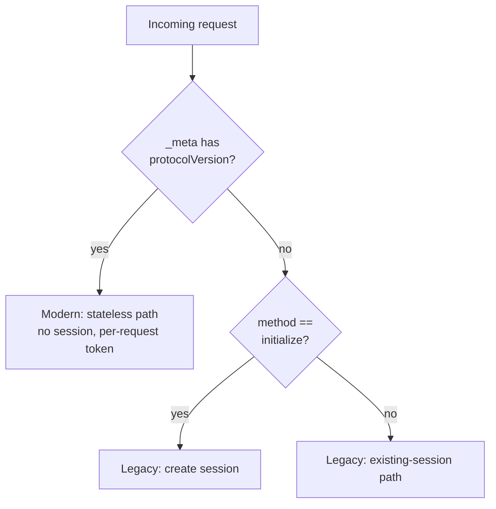

# RFC-0081: Stateless Transport Proxy Support (MCP 2026-07-28)

- **Status**: Draft
- **Author(s)**: Jakub Hrozek (@jhrozek)
- **Created**: 2026-07-15
- **Last Updated**: 2026-07-15
- **Target Repository**: toolhive
- **Related Issues**: [toolhive#5755](https://github.com/stacklok/toolhive/issues/5755)

## Summary

The upcoming MCP 2026-07-28 revision is stateless: it removes the `initialize`
handshake, protocol sessions, and the GET SSE stream, replacing them with
per-request `_meta` metadata and a `server/discover` RPC. This RFC proposes making
ToolHive's transparent and streamable transport proxies serve both the current
(2025-11-25) and the stateless revision on the same endpoint, discriminating per
request rather than at a cutover.

## Problem Statement

The 2026-07-28 revision removes exactly the mechanisms the transport proxies are
built around:

- the `initialize` handshake (replaced by per-request `_meta` carrying
  `protocolVersion`, `clientInfo`, `clientCapabilities`, plus a `server/discover` RPC),
- protocol sessions and the `Mcp-Session-Id` header (traffic becomes stateless), and
- the standalone GET SSE stream.

ToolHive's proxies currently treat the `initialize` request as a trigger for session
creation, backend-pod pinning (Kubernetes multi-replica affinity), and health-check
enablement. Under the new revision that trigger never arrives.

Crucially, the ecosystem will straddle both revisions for a long time. SDKs (go-sdk
v1.7, TS SDK v2) serve both on one endpoint, and clients, servers, and backends will
upgrade independently. ToolHive therefore cannot do a flag-day cutover; it must
discriminate the revision **per request** so a 2025-11-25 peer keeps working unchanged
while a 2026-07-28 peer is served natively. Everyone running ToolHive as a proxy in
front of MCP servers is affected once either side of the connection upgrades.

## Goals

- Serve 2025-11-25 (Legacy) and 2026-07-28 (Modern) traffic on the same proxy endpoint,
  chosen per request.
- Zero behavior change for existing 2025-11-25 traffic.
- Add the minimum new machinery: a per-request revision classifier and revision-aware
  handling in the two proxies.
- Preserve the existing per-request response-correlation confidentiality invariant.
- Remove, for Modern traffic, the Kubernetes cross-replica affinity burden that only
  exists to support session-ful backends.

## Non-Goals

- vMCP stateless support and the cross-generation bridge (a client on either revision
  reaching a backend on either revision) — tracked separately ([toolhive#5756]).
- The go-sdk v1.7 adoption / `mcpcompat` stateless plumbing ([toolhive#5754]). This RFC
  argues the transport-proxy work is independent of it (see Compatibility / Alternatives).
- OAuth RFC 9207 `iss` validation ([toolhive#5760]) — genuine but unrelated work in
  ToolHive's own OAuth client.
- MRTR, Tasks, the `x-mcp-header` tool-parameter mirroring extension, and caching metadata.
- Off-diagonal era translation in the transport proxies (see Proposed Solution) — deferred.

## Proposed Solution

### High-Level Design

Each request is classified per-request as **Modern** (2026-07-28, stateless) or
**Legacy** (≤2025-11-25, `initialize`-based). Legacy traffic follows today's code
paths unchanged; Modern traffic takes a stateless path. Classification is a pure
function called at the points where the proxies already decode the JSON-RPC body — the
proxies parse bodies themselves (`golang.org/x/exp/jsonrpc2`), so this lives in
ToolHive-owned code rather than in an SDK.



The proxy fronts one backend and serves whatever client connects; the two sides have
independent revisions, giving a client × backend matrix:

| Client | Backend | Proxy behavior |
|--------|---------|----------------|
| Legacy | Legacy | Today's path, unchanged. |
| Modern | Modern | Stateless pass-through. |
| Legacy | Modern | Unbridged — spec marks this "Fails" (no client fall-forward). Deferred to vMCP. |
| Modern | Legacy | Client's probe-then-fallback downgrades to `initialize`; the pass-through proxy forwards and classifies it Legacy. No new proxy work. |

The two diagonal cells are the scope of this RFC. The **Modern-client / Legacy-server**
cell needs no proxy work either: the MCP-normative probe-then-fallback runs client-side,
so the client downgrades to an `initialize` handshake that the transparent proxy forwards
to the Legacy backend and classifies as Legacy. That leaves only the **Legacy-client /
Modern-server** cell genuinely unbridged — the spec's compatibility matrix marks it
"Fails" ("Legacy clients have no fall-forward mechanism"), so only a gateway could bridge
it, and that work belongs to vMCP. The agentgateway project, as an aggregator that cannot
rely on transparent pass-through, instead actively synthesizes the handshake for the
Modern-client / Legacy-server cell (`stateless_send_and_initialize`); it likewise leaves
Legacy-client / Modern-server unbridged.

### Detailed Design

#### Component Changes

**Classifier (`pkg/mcp`).** A pure function, called at the existing decode points
(the transparent proxy's `detectInitialize` inside `RoundTrip`, the streamable proxy's
`resolveSessionForRequest`). Neither proxy reads the shared `ParsedMCPRequest` on its
routing path, so classification is not threaded through a context object. A connection
does not change revision mid-stream, so the transparent proxy classifies once and
stores the result in session metadata.

**Streamable proxy (HTTP→stdio).** For Modern requests, unconditionally mint a fresh
per-request routing token and ignore any client-supplied `Mcp-Session-Id`. The proxy
already has a sessionless branch, but it is guarded on the absence of a session header;
Modern is sessionless by definition, so the header must be ignored rather than trusted
(see Security Considerations). No `Mcp-Session-Id` is minted and the session manager is
not consulted.

**Transparent proxy (HTTP→HTTP).** Modern requests never mint a session, so the
sticky-session machinery (session guard, pod-pinning, init-body storage, re-init replay,
backend-SID rewrite) simply does not engage. Because there is no shared pipe, Go's
`http.Transport` correlates responses to requests natively and the Modern path collapses
to a plain reverse proxy. The internal health-monitor gate today flips ready on the `initialize` 200 or a
`Mcp-Session-Id` response header — neither of which occurs on the Modern path, so the
gate would never open. The Modern path must therefore acquire an alternate readiness
trigger: gate off the first successful backend contact (and never default the gate ready,
which would start the monitor before the backend is warm and risk self-stopping the proxy).

**Parser vocabulary.** Register `server/discover` (currently unlabeled, yielding an
empty resource ID) and the Modern request headers `Mcp-Method` (required on all requests)
/ `Mcp-Name` (required for `tools/call`, `resources/read`, `prompts/get`) so they are
labeled for authz/audit; source `clientInfo`/protocolVersion from `_meta`
for Modern requests.

#### API Changes

Internal API only; no user-facing or CRD API changes.

```go
// pkg/mcp
type Revision int // Legacy, Modern

// ClassifyRevision decides the MCP era of a single request from its method,
// decoded _meta, and (on Streamable HTTP) the MCP-Protocol-Version header.
func ClassifyRevision(method string, meta map[string]any, protoHeader string) (Revision, error)
```

Classification rule: **Modern** iff `_meta` carries
`io.modelcontextprotocol/protocolVersion` (required on every Modern request); on
Streamable HTTP that value is mirrored into the `MCP-Protocol-Version` header, and a
header/body mismatch is rejected with `400` and JSON-RPC error `-32020` (the body is
authoritative). **Legacy** otherwise, with `method == "initialize"` marking session
start. A malformed or absent `_meta` classifies as Legacy — the safe direction.

#### Configuration Changes

None. The classifier is auto-detected from request content and needs no CRD, operator,
or CLI configuration. The existing `--stateless` run flag is orthogonal (see
Compatibility).

#### Data Model Changes

None. The session manager (`pkg/transport/session`) is trigger-agnostic and unchanged;
only the proxy call sites that create sessions move behind the Legacy branch.

## Security Considerations

### Threat Model

- **Attacker**: an authenticated client of the proxy (authentication is unaffected —
  see below), attempting to read another client's responses or ride another client's
  routing state.
- **Primary threat**: response cross-delivery in the streamable proxy. Responses arriving
  over the single shared stdio pipe are demultiplexed to the waiting HTTP handler by a
  composite key of (routing token, JSON-RPC id). If two concurrent requests share a
  routing token and reuse a JSON-RPC id (trivial — ids commonly start at `1`), the second
  overwrites the first's waiter entry and one client's response payload is delivered to
  the other.

### Authentication and Authorization

- Authentication is **not** on the session/initialize axis. It runs in the middleware
  chain before request routing, so making Modern traffic sessionless does not move any
  request off the authenticated path.
- The per-request `_meta` fields (`protocolVersion`, `clientInfo`, `clientCapabilities`)
  and the mirrored headers are client-controlled and now appear on every request. They
  are telemetry and labels, **never a security principal**; authorization must continue
  to key off the authenticated identity, not client-asserted `_meta`.
- Registering `server/discover` in the parser method tables is partly a security measure:
  an unknown method currently yields an empty resource ID, so authorization must
  default-deny rather than match a broad allow rule.

### Data Security

The routing token is an in-process correlation nonce, not persisted and not exposed to
clients (the proxy never returns it as a session header on the Modern path). Its
uniqueness is what prevents the cross-delivery leak described in the threat model.

### Input Validation

- `_meta` is decoded with guarded type assertions; malformed or absent metadata
  classifies as Legacy, preserving the existing session guard (fail-safe direction).
- `Mcp-Method` (all requests) / `Mcp-Name` (`tools/call`, `resources/read`, `prompts/get`)
  and `MCP-Protocol-Version` are validated against the body;
  mismatch is rejected with `-32020`. As an intermediary that reads bodies for
  authz/audit, the proxy should verify that the protocol version indicates a
  header-validation-required revision before trusting any mirrored header value.

### Secrets Management

Not applicable — this change handles no secrets or credentials.

### Audit and Logging

`clientInfo` moves from a once-per-session handshake value to a per-request `_meta`
field. Audit labeling must source it per request. It remains a structured log field
(not interpolated into messages), so it introduces no log-forging vector.

### Mitigations

- **Streamable proxy**: for Modern requests, unconditionally mint a fresh UUID routing
  token and ignore any client-supplied `Mcp-Session-Id`. A unique token guarantees a
  unique composite key even when clients reuse JSON-RPC ids, closing the cross-delivery
  leak by construction. Ignoring the header is safe because Modern has no legitimate
  session header.
- **Transparent proxy**: gate the backend-SID rewrite on Legacy so a Modern request's
  session header can never be rewritten onto a pinned backend.
- **Verification**: a concurrency test asserting that two concurrent Modern requests
  sharing a JSON-RPC id — one carrying a foreign session header — never cross-deliver.

## Alternatives Considered

### Alternative 1: Extend the existing `--stateless` flag as the axis

- Description: reuse ToolHive's per-server `--stateless` flag ("POST-only, no SSE") as
  the stateless switch instead of a per-request classifier.
- Pros: reuses existing mechanism (GET/DELETE method gate, POST-ping health check).
- Cons: `--stateless` is a per-server, operator-set declaration; it cannot express a
  dual-era endpoint where a Legacy client (which needs GET SSE) and a Modern request
  arrive concurrently. Its server-global GET/DELETE gate would reject a Legacy client's
  SSE stream. It also does not touch the POST session/initialize path at all.
- Why not chosen: it is orthogonal to protocol era. The classifier composes with it
  additively; the one interaction is that the global GET/DELETE gate must become
  revision-aware under dual-era.

### Alternative 2: Do stateless handling in the SDK / gate on go-sdk v1.7

- Description: rely on go-sdk v1.7's stateless mode instead of ToolHive proxy code, and
  sequence this work behind the SDK bump.
- Pros: less ToolHive-side code; SDK handles discover/MRTR/caching internally.
- Cons: the transport proxies' routing/session/forwarding path never constructs an
  mcpcompat/go-sdk client or server — it is hand-rolled JSON-RPC over
  `golang.org/x/exp/jsonrpc2`. The SDK's stateless mode governs SDK-built servers/clients,
  not ToolHive's proxy data path. Gating on a prerelease SDK would also delay work that
  has no actual dependency on it.
- Why not chosen: the proxy work is SDK-independent and can proceed in parallel with the
  bump. (The SDK bump remains relevant for ToolHive's client-role code and for vMCP.)

### Alternative 3: Full bidirectional era bridge in the transport proxies

- Description: implement all four matrix cells, including gateway-side translation for
  Legacy-client / Modern-server and Modern-client / Legacy-server.
- Pros: any client reaches any backend regardless of era.
- Cons: the Legacy-client / Modern-server cell requires the gateway to synthesize and
  hold session state the spec has no client-side fallback for — the spec's own
  compatibility matrix marks this cell "Fails" ("Legacy clients have no fall-forward
  mechanism"). It is also more naturally a gateway-aggregation concern than a
  transport-proxy one.
- Why not chosen: deferred; the cross-generation bridge belongs to vMCP ([toolhive#5756]).
  This RFC scopes to the diagonal cells and relies on the spec-normative client fallback
  for Modern-client / Legacy-server.

## Compatibility

### Backward Compatibility

Fully backward compatible. All traffic classifies as Legacy unless a request carries
Modern `_meta`, so 2025-11-25 clients, servers, and backends behave exactly as today.
No CRD or operator change is required (the classifier is auto-detected), so a rolling
proxy upgrade is safe: old and new proxy pods can share one Service and session store,
and Modern traffic adds no session writes.

**Dependency note**: [toolhive#5755] currently lists a dependency on the go-sdk v1.7
adoption issue ([toolhive#5754]). Per Alternative 2, the transport-proxy work does not
depend on it and this RFC proposes decoupling that edge.

### Forward Compatibility

The binary Modern/Legacy classification suffices while there is a single Modern revision.
When a second ships, `DiscoverResult.supportedVersions` and
`UnsupportedProtocolVersionError.data.supported` are version lists, so the classifier
would need real version-string negotiation rather than a boolean. `ClassifyRevision` is
the single extension point for that: `Revision` would grow from an enum into a type that
carries the negotiated version string — a signature-level change, not a drop-in.

## Implementation Plan

### Phase 1: Classifier and parser vocabulary (no behavior change)

- Add `ClassifyRevision`; wire it at the decode points; store `Revision` in transparent-proxy
  session metadata.
- Register `server/discover`, `Mcp-Method`, `Mcp-Name` in the parser; source `clientInfo`
  from `_meta` for Modern requests.

### Phase 2: Streamable proxy — Modern is stateless

- Unconditionally mint a per-request routing token and ignore client `Mcp-Session-Id`
  for Modern; do not mint a session.

### Phase 3: Transparent proxy — gate the initialize-triggered machinery

- Gate the session guard, pod-pinning, re-init replay, and backend-SID rewrite on Legacy;
  gate the health monitor off first backend contact rather than defaulting ready.

### Phase 4 (deferred): Off-diagonal translation

- Only if the cross-era cells are taken on for the transport proxies; otherwise this stays
  with vMCP.

### Dependencies

None blocking. Independent of [toolhive#5754] (see Compatibility). Off-diagonal work, if
pursued, needs backend-revision detection (probe `server/discover` on stdio backends;
inspect the `400` body on HTTP backends).

## Testing Strategy

- **Unit**: `ClassifyRevision` truth table (Modern `_meta`, absent/malformed `_meta`,
  `initialize`, header/body mismatch → `-32020`).
- **Integration**: dual-era matrix — Legacy and Modern requests against the same endpoint;
  verify Legacy session behavior is unchanged and Modern requests mint no session and emit
  no `Mcp-Session-Id`.
- **Security**: concurrency test asserting no response cross-delivery for concurrent Modern
  requests sharing a JSON-RPC id, one carrying a foreign session header.
- **Kubernetes**: Modern request to a multi-replica backend routes without pod-pinning and
  does not re-initialize on backend `404`; the internal monitor does not self-stop on a
  cold-starting Modern backend.

## Documentation

- Architecture doc: `docs/arch/stateless-transport-proxies-design.md` (already drafted,
  [toolhive#5808]) — this RFC is its decision-level counterpart.
- Update `docs/arch/03-transport-architecture.md` when Phase 2/3 land.

## Open Questions

1. Should the revision-aware GET/DELETE gate on the transparent proxy be a refinement of
   the existing `statelessMethodGate`, or a distinct mechanism keyed on `MCP-Protocol-Version`?
2. Timing: file the Phase 1–3 implementation issues on acceptance, or after go-sdk v1.7
   final (given the spec is still finalizing)?
3. Do we want the optional future tie-in where `--stateless` implies an "assume Modern"
   fast-path, or keep the two strictly orthogonal?

## References

- MCP draft specification: `basic/versioning` (era terminology, compatibility matrix,
  fallback), `server/discover`, `basic/transports/{stdio,streamable-http}`.
- Prior art — agentgateway: `crates/agentgateway/src/mcp/README.md` and `session.rs`
  (`stateless_send_and_initialize`); evolution via issue #221 and PRs #262, #2365, #2477.
- ToolHive architecture doc: `docs/arch/stateless-transport-proxies-design.md`
  ([toolhive#5808]).
- Related: [toolhive#5755] (this work), [toolhive#5756] (vMCP stateless), [toolhive#5754]
  (go-sdk v1.7), [toolhive#5760] (OAuth `iss`).

---

## RFC Lifecycle

### Review History

| Date | Reviewer | Decision | Notes |
|------|----------|----------|-------|
| 2026-07-15 | — | Draft | Initial submission |

### Implementation Tracking

| Repository | PR | Status |
|------------|-----|--------|
| toolhive | — | Not started |
