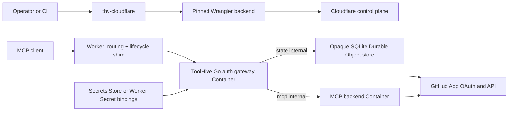
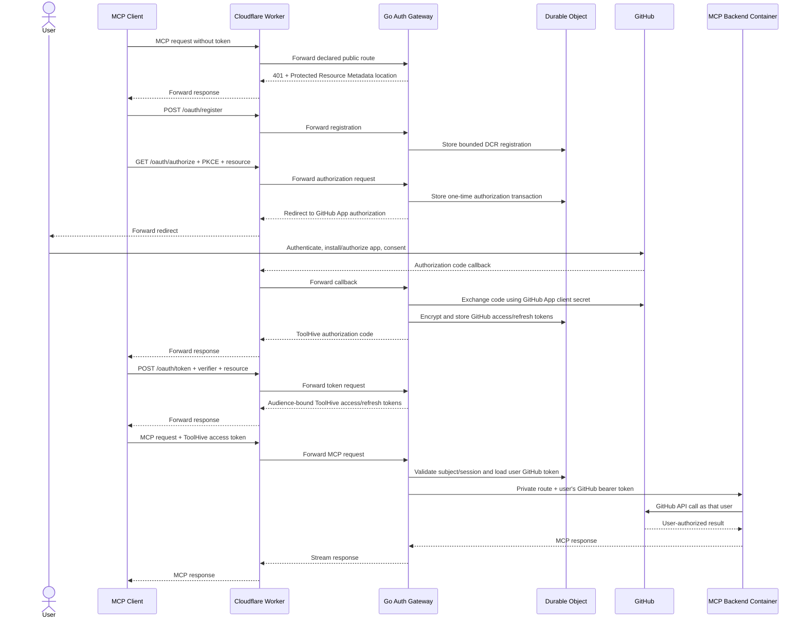
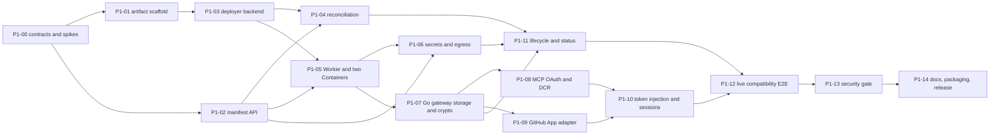

# RFC-0082: Cloudflare Deployment Artifact for ToolHive MCP Servers

- **Status**: Draft
- **Author(s)**: @samuv
- **Created**: 2026-07-20
- **Last Updated**: 2026-07-22
- **Target Repository**: toolhive
- **Related Issues**: [toolhive#5854](https://github.com/stacklok/toolhive/issues/5854)

## Summary

Introduce `thv-cloudflare`, a dedicated artifact that reconciles one declarative
`MCPServerDeployment` manifest into a Cloudflare Worker, a trusted ToolHive Go
auth-gateway Container, an isolated MCP-server Container, and the state and
secret bindings required to expose a secure Streamable HTTP MCP endpoint. The
first phase is a complete vertical slice: two users can connect with standard
MCP clients, register through Dynamic Client Registration (DCR), authenticate
through a GitHub App, and call a compatible GitHub-backed MCP server using their
own GitHub identity and permissions.

Phase 1 deliberately validates one server and one upstream provider rather than
a Git-managed fleet. The reconciliation and provider boundaries remain reusable
for later daemon, fleet, vMCP, registry, and native Cloudflare API work.

## Problem Statement

ToolHive can run and secure MCP servers locally and through the Kubernetes
operator, but it has no deployment mode for Cloudflare Workers and Containers.
Users who want Cloudflare's edge, scale-to-zero container runtime, and global
routing must currently assemble Worker code, container bindings, authentication,
OAuth state, secrets, and lifecycle automation themselves.

A thin container deployment alone is insufficient. A public MCP deployment also
needs:

- repeatable apply, update, readiness, status, and delete behavior;
- authentication compatible with MCP clients;
- per-user upstream credentials instead of one shared personal access token;
- protection against one user reusing another user's MCP session;
- secret references that keep values out of manifests and CLI state;
- explicit egress and unsafe-public-endpoint controls; and
- a documented compatibility boundary for arbitrary MCP server images.

The distinction between the two authorization planes is central to this RFC:

1. **MCP-facing authorization** determines which user and client may call the
   deployed MCP endpoint.
2. **Upstream authorization** determines which GitHub identity the backend uses
   when it calls GitHub APIs.

DCR solves client registration on the first plane. It does not authenticate the
user to GitHub or provide a GitHub token. Using one `GITHUB_TOKEN` environment
variable would make every caller act as the same GitHub identity, which is not a
multi-user deployment.

## Goals

- Ship Cloudflare support as a dedicated `thv-cloudflare` artifact, without
  adding Cloudflare dependencies to `thv`.
- Reconcile one provider-explicit ToolHive manifest through validate, plan, apply,
  readiness, status, update, idempotent re-apply, and explicit delete.
- Deploy one Streamable HTTP MCP server behind a Worker with one deterministic
  ToolHive Go auth-gateway instance and one deterministic MCP backend instance.
- Be authenticated by default and require
  `--allow-insecure-public-endpoint` for an unauthenticated public deployment.
- Reuse ToolHive's Go authorization core in a dedicated auth-gateway Container
  for DCR, Authorization Code with PKCE, Protected Resource Metadata,
  Authorization Server Metadata, JWKS, access tokens, and refresh tokens.
- Use a pre-registered GitHub App with expiring user access tokens as the single
  Phase 1 upstream provider.
- Swap the ToolHive access token for the authenticated user's GitHub token on
  each request to a compatible backend.
- Store OAuth and session state in SQLite-backed Durable Object storage, with
  application-layer encryption for upstream tokens.
- Reference pre-existing Cloudflare Secrets Store values or encrypted per-Worker
  secret bindings without reading, uploading, hashing, or logging the secret
  values in `thv-cloudflare`.
- Preserve ToolHive's secure-default posture for public exposure and network
  egress.
- Track compatibility explicitly so later phases extend a known matrix rather
  than silently broadening assumptions.

## Non-Goals

Phase 1 does not include:

- Git repository watching, a long-running reconciliation daemon, or pruning
  resources absent from a directory;
- groups, vMCP aggregation, or multiple MCP servers in one deployment;
- horizontal replicas or per-user MCP Container instances; Phase 1 uses exactly
  one auth-gateway instance and one MCP backend instance;
- custom domains; Phase 1 uses the deterministic `workers.dev` endpoint;
- stdio or legacy SSE transports;
- upstream providers other than GitHub;
- generic OIDC federation or multiple linked upstream identities;
- Client ID Metadata Documents (CIMD); DCR is the initial client-registration
  mechanism and CIMD compatibility is tracked separately;
- automatic registry resolution, GHCR mirroring, image signature verification,
  or garbage collection;
- hostname-level egress allowlists that depend on HTTPS interception and a
  Cloudflare CA being installed in arbitrary images;
- transparent multi-user support for servers that only read credentials from
  process environment variables or cache one credential globally;
- general tool-level authorization or Cedar policy evaluation at the Worker;
- Cloudflare Access as the MCP authorization protocol; or
- a native Go implementation of every Cloudflare API used by the deployer.

## Relationship to toolhive#5854

The originating issue was exploratory rather than an accepted implementation
contract. This RFC deliberately changes several of its proposed choices. The
differences are recorded here so the RFC can be reviewed on its actual scope
without requiring a line-by-line comparison with the issue.

| Issue #5854 direction | Phase 1 decision | Rationale and consequence | Reconsideration point |
|---|---|---|---|
| Read a Git repository and reconcile it with `thv-cloudflare --once` | Explicit `validate`, `plan`, `apply`, `status`, and `delete` commands operate on one manifest | Establishes idempotent lifecycle behavior before adding repository discovery; Phase 1 does not watch Git, prune, or correct drift unless invoked | After the one-manifest lifecycle and ownership model pass the live release gate |
| Add daemon and self-hosted-on-Cloudflare modes after `--once` | Both remain later-phase candidates | Avoids an always-on control plane before one complete deployment is proven | After invocation, retry, concurrency, credential, and upgrade contracts stabilize |
| Removing YAML removes its Worker and Container | Delete is explicit and missing manifests do not imply deletion | Prevents an incomplete directory, branch, or CI checkout from deleting live resources; fleet pruning is unavailable | With Git reconciliation, tombstones, ownership, and previewable fleet plans |
| Use pure Go Cloudflare REST APIs with no Node.js dependency | Invoke a pinned Wrangler version behind `CloudflareDeployer` | `cloudflare-go` v7 already covers Worker scripts, routes, Durable Object bindings and migrations, and secret resources, but not the complete Containers lifecycle, Worker container-binding metadata, or a documented registry push/authentication flow; Node.js is a Phase 1 dependency | When Cloudflare publishes the required Containers REST API and registry workflow and `cloudflare-go` ships Containers and container-binding support |
| Mirror OCI images automatically with `go-containerregistry` | Require an existing Cloudflare-readable MCP image and document manual mirroring | Separates deployment/auth validation from registry credentials, copying, provenance, and garbage collection; Phase 1 is not one-command deployment from GHCR | After the two-Container E2E is stable and registry credential/image-lifecycle contracts are defined |
| Parse the Kubernetes CRDs directly as plain YAML | Introduce provider-explicit `MCPServerDeployment` and lower its portable core into existing ToolHive types | Kubernetes scheduling and pod fields do not map honestly to Cloudflare; conversion is explicit rather than implied | Expand mappings as additional provider backends or CRD conversion use cases are implemented |
| Validate existing JWT/OIDC tokens in a TypeScript Worker shim | Keep the Worker non-security-sensitive and reuse ToolHive's Go auth core in a dedicated gateway | Eliminates an independently evolving OAuth/security implementation; adds a trusted gateway image and cold-start boundary | A future Go Worker/Wasm path may consolidate the gateway only after compatibility and resource-limit proof |
| Deploy one Worker and one standalone MCP Container | Deploy one Worker, one trusted Go auth-gateway Container, and one isolated MCP backend Container | Keeps signing/encryption keys and refresh tokens outside the arbitrary MCP workload; increases lifecycle and routing complexity | Revisit only if Cloudflare provides an equally strong isolated sidecar or native Worker execution model |
| Make vMCP/groups the recommended multi-server shape | Validate one standalone MCP server and no groups | Produces one bounded multi-user vertical slice before aggregation and lazy discovery | After the standalone compatibility and security gates pass |
| Enforce hostname egress allowlists on day one with `interceptOutboundHttp` | Reserve `allowlist`, but support only `disabled` and explicit `unrestricted` in Phase 1 | Arbitrary MCP images may not trust the interception CA or may use pinning, raw TCP, or incompatible TLS stacks | After the documented CA, runtime, protocol, and failure-mode compatibility matrix passes |

These are Phase 1 decisions, not claims that the issue's longer-term goals are
invalid. Later phases should extend the accepted contracts here rather than
silently restoring assumptions from the issue.

## Proposed Solution

### High-Level Design

`thv-cloudflare` is a Go command in `cmd/thv-cloudflare`. It validates the
manifest, renders a versioned Worker bundle and Wrangler configuration, and
invokes a pinned Wrangler version through a narrow deployment interface.
Cloudflare-specific Node.js tooling is therefore isolated from the main `thv`
artifact and can later be replaced by a native Go API backend.

The deployed Worker is a thin public router and lifecycle shim. It contains no
OAuth policy, token lifecycle, provider, or cryptographic implementation. Public
OAuth and MCP requests are forwarded to a ToolHive-controlled Go auth gateway
that reuses the existing ToolHive authorization-server and `upstreamInject`
implementation. The auth gateway and the user-selected MCP server run in
separate Container instances; neither has a direct public route.

The auth gateway reaches a generic SQLite-backed Durable Object store and the
MCP backend through fixed private virtual hosts implemented with Container
outbound handlers. The Go gateway owns security decisions and cryptography. The
Worker-side store exposes only bounded atomic storage operations and persists
security-sensitive values only as gateway-produced ciphertext or hashes.



The auth flow runs through the existing ToolHive Go embedded authorization
server and `upstreamInject` model. Cloudflare-specific Worker code supplies only
routing, lifecycle, secret delivery, and atomic storage adapters:



### Phase 1 Success Criteria

The vertical slice is complete only when all of the following are demonstrated:

1. A manifest creates the Worker, auth-gateway and MCP backend Container
   applications, Durable Object, private routes, and selected secret bindings.
2. Reapplying an unchanged manifest is a no-op.
3. Updating the image or non-breaking runtime configuration converges without
   losing auth state.
4. A standard DCR-capable MCP client completes an interactive GitHub login.
5. Two different GitHub users initialize independent MCP sessions against the
   same deployment.
6. Each user observes only GitHub resources permitted to that user and the
   installed GitHub App.
7. Reusing user A's `Mcp-Session-Id` with user B's access token is rejected.
8. Neither the ToolHive token nor user A's GitHub token reaches user B's backend
   requests.
9. The endpoint is not publicly usable without authentication unless the
   exceptional insecure flag was supplied at apply time.
10. Status, readiness, update, and delete behavior work against a live
    Cloudflare account.

### Detailed Design

#### Dedicated Artifact and Package Boundaries

The implementation adds:

- `cmd/thv-cloudflare`: command parsing and user-facing output;
- `pkg/cloudflare/manifest`: schema, defaulting, canonicalization, and
  validation;
- `pkg/cloudflare/reconcile`: desired/actual comparison and ordered actions;
- `pkg/cloudflare/deploy`: control-plane interface;
- `pkg/cloudflare/deploy/wrangler`: pinned Wrangler implementation;
- `cmd/thv-cloudflare-gateway`: trusted Go Container entrypoint that wires the
  existing ToolHive authorization server, GitHub provider, token service,
  `upstreamInject`, and backend reverse proxy;
- `pkg/cloudflare/authstate`: Cloudflare-backed implementation of the existing
  Go auth-storage interfaces; and
- `pkg/cloudflare/worker`: embedded, versioned Worker bundle for public routing,
  Container lifecycle, private outbound handlers, and the generic Durable
  Object storage shim.

The Worker bundle does not reimplement DCR, PKCE, OAuth token semantics,
provider behavior, token encryption, refresh-token families, JWT validation, or
upstream injection. Those behaviors remain in Go and continue to use the
existing ToolHive conformance and security tests. Cloudflare-specific changes to
the Go packages are limited to extracting portable wiring where necessary and
adding the remote atomic-storage adapter.

The deployer boundary is intentionally independent of command execution:

```go
type CloudflareDeployer interface {
    Inspect(ctx context.Context, desired *Deployment) (*ActualState, error)
    Plan(ctx context.Context, desired *Deployment, actual *ActualState) (*Plan, error)
    Apply(ctx context.Context, plan *Plan) (*ApplyResult, error)
    Delete(ctx context.Context, desired *Deployment, actual *ActualState) error
    WaitReady(ctx context.Context, desired *Deployment, timeout time.Duration) (*Status, error)
}
```

The deployer exposes stable error categories for caller control flow:

```go
var (
    ErrUnownedCollision = errors.New("unowned resource collision")
    ErrVersionDrift     = errors.New("unsupported Wrangler version")
    ErrPreflightFailed  = errors.New("Cloudflare preflight failed")
)

type UnownedCollisionError struct {
    ResourceType string
    ResourceName string
}

type VersionDriftError struct {
    Required string
    Actual   string
}

type PreflightError struct {
    Check string
}
```

The concrete errors implement `Error` and unwrap to the corresponding sentinel,
so callers use `errors.Is` rather than parse strings. Structured fields contain
only bounded, non-sensitive resource or check context. Provider response bodies,
credentials, generated configuration, and secret binding values never appear in
these errors.

Wrangler is invoked with an argument array, never through a shell command
string. Generated files are written to a permission-restricted temporary
directory and removed after the operation. The required Wrangler version is
pinned by `thv-cloudflare`; version drift fails before mutation with a clear
installation command and `ErrVersionDrift`.

Phase 1 requires Node.js and the exact pinned Wrangler version to be installed
separately. The CLI neither downloads them nor distributes a managed companion
bundle. Preflight validates both versions before mutation, and the release and
compatibility records identify the exact versions tested.

`CLOUDFLARE_API_TOKEN` is the only supported Cloudflare credential source. The
deployer constructs the Wrangler subprocess environment explicitly, passes that
credential only to the pinned Wrangler process, uses an isolated non-interactive
configuration directory, and does not rely on persisted Wrangler login state or
legacy API-key/email variables. Non-secret runtime variables required to locate
Node.js, Wrangler, and the temporary directory may also be passed. The token is
never written to generated configuration or temporary files and is never
included in Worker bindings, either Container environment, logs, status, or
errors.

#### Commands

Phase 1 exposes one-manifest operations:

```text
thv-cloudflare validate -f deployment.yaml
thv-cloudflare plan     -f deployment.yaml
thv-cloudflare apply    -f deployment.yaml [--no-wait] [--timeout 15m]
thv-cloudflare status   -f deployment.yaml [--wait] [--timeout 15m]
thv-cloudflare delete   -f deployment.yaml
```

`apply` has a 15-minute default deadline and waits with bounded exponential
backoff. Readiness includes:

1. both Container applications are reported ready;
2. the deterministic auth-gateway and MCP backend instances start and their
   configured ports become ready;
3. the public Worker answers its health endpoint; and
4. when an MCP bearer token is supplied for verification, an authenticated MCP
   `initialize` succeeds.

`--no-wait` returns after accepted control-plane changes. `status --wait`
performs the same readiness sequence later and uses the same 15-minute default.
`--timeout=0` and negative durations are invalid; every deployer method honors
context cancellation and the remaining deadline. `--no-wait` skips readiness
polling but retains the deadline for inspection, preflight, and control-plane
mutation. Wrangler subprocesses cannot outlive the calling context.

If `spec.auth` is absent, `apply` and any mutating `plan` fail unless
`--allow-insecure-public-endpoint` is supplied. The flag affects only that
invocation; the resulting Worker carries an explicit insecure ownership marker,
and every subsequent plan and status call emits a high-severity warning.

When the manifest references an encrypted Worker Secret that does not yet exist,
the first `apply` may create only the deterministic, owned Worker bootstrap with
all public routes closed. It reports the required binding names and exits with a
`MissingRequiredSecrets` condition. The operator provisions those values
directly through Cloudflare's Wrangler or dashboard secret workflow and reruns
`apply`; only then may the gateway, backend, and public route become ready.

`thv-cloudflare` never accepts application secret values through arguments,
stdin, environment forwarding, `--secrets-file`, or generated configuration.
This does not include the separately scoped Cloudflare deployment credential.
The deployer does not silently switch a Secrets Store reference to a same-named
Worker Secret, or the reverse.

#### Manifest API

Phase 1 introduces a provider-explicit deployment kind in ToolHive's existing
API namespace rather than claiming that a Kubernetes `MCPServer` can be applied
unchanged. The portable fields map to existing ToolHive runtime concepts while
Cloudflare lifecycle fields remain explicitly provider-specific.

```yaml
apiVersion: toolhive.stacklok.dev/v1alpha1
kind: MCPServerDeployment
metadata:
  name: github-team
spec:
  provider: cloudflare

  server:
    # Phase 1 requires an image already readable by Cloudflare.
    image: registry.example.com/github-mcp-server@sha256:0123456789abcdef0123456789abcdef0123456789abcdef0123456789abcdef
    transport:
      type: streamable-http
      port: 8080
      path: /mcp
    args: []
    env:
      GITHUB_TOOLSETS: repos,issues,pull_requests

  runtime:
    instanceName: singleton
    maxInstances: 1

  permissions:
    egress:
      mode: unrestricted # disabled | unrestricted | allowlist (reserved)

  auth:
    type: github-app
    githubApp:
      clientId: Iv1.example
      callbackUrl: https://github-team.example.workers.dev/oauth/callback/github
      clientSecretRef:
        secretsStore:
          storeId: 11111111-1111-1111-1111-111111111111
          secretName: github-app-client-secret
    clientRegistration:
      type: dcr
      maxRegistrations: 1000
      registrationTtl: 720h
    signingKeys:
      - keyId: 2026-07
        secretRef:
          secretsStore:
            storeId: 11111111-1111-1111-1111-111111111111
            secretName: mcp-jwt-signing-key-2026-07
    tokenEncryptionKeys:
      - keyId: 2026-07
        secretRef:
          secretsStore:
            storeId: 11111111-1111-1111-1111-111111111111
            secretName: mcp-token-encryption-key-2026-07

  secrets:
    - targetEnvName: OPTIONAL_STATIC_BACKEND_SECRET
      secretRef:
        secretsStore:
          storeId: 11111111-1111-1111-1111-111111111111
          secretName: optional-static-backend-secret
```

Any individual reference may instead select a pre-provisioned encrypted Worker
Secret binding, for example:

```yaml
clientSecretRef:
  workerSecret:
    bindingName: GITHUB_APP_CLIENT_SECRET
```

Secret backends may be mixed within one deployment, but each individual
reference selects exactly one backend. Binding names are non-secret metadata.

Defaults and validation:

- `provider` is required and must be `cloudflare` in Phase 1.
- `transport.type` must be `streamable-http`.
- `transport.path` defaults to `/mcp`.
- `runtime.instanceName` defaults to `singleton` and `maxInstances` must equal
  `1`.
- `permissions.egress.mode` defaults to `disabled`. The schema recognizes
  `disabled`, `unrestricted`, and `allowlist`; selecting `allowlist` returns an
  actionable Phase 1 unsupported-feature error rather than an unknown enum
  value. Activation requires the CA/interception compatibility gate described
  under Egress.
- `auth.type`, when present, must be `github-app`.
- `auth.githubApp.callbackUrl` is required and must exactly equal the callback
  derived from the canonical Worker URL and fixed `/oauth/callback/github` path.
  `validate`, `plan`, and `apply` reject a mismatch before control-plane
  mutation.
- DCR is enabled for authenticated Phase 1 deployments and cannot be combined
  with CIMD configuration.
- A secret reference is a strict, mutually exclusive union of
  `secretsStore: {storeId, secretName}` and
  `workerSecret: {bindingName}`. Exactly one backend is required; secret values,
  file paths, and upload directives are never valid manifest fields.
- Environment names, arguments, ports, paths, image references, Cloudflare names,
  durations, and URLs are length- and character-bounded.
- Mutable image tags are allowed for the walking skeleton but produce a warning;
  digest references are recommended. Phase 1 does not resolve or pin tags.
- Sensitive credential names such as `GITHUB_TOKEN` or `GITHUB_PAT` are rejected
  when specified as plaintext `env` values. A secret reference targeting one of
  those names is allowed but produces a multi-user compatibility warning because
  it overrides per-user semantics in many server images.

#### Portable Core Mapping

The manifest is lowered through one internal portable deployment model before
Cloudflare reconciliation. The Cloudflare packages do not define independent
auth, permission, transport, or secret semantics.

| Manifest field | Existing ToolHive concept | Classification |
|---|---|---|
| `metadata.name` | `runner.RunConfig.Name` and the `MCPServer` identity | Portable |
| `spec.server.image` | `MCPServerSpec.Image` / `runner.RunConfig.Image` | Portable |
| `spec.server.transport.type`, `port`, `path` | `MCPServerSpec.Transport`, `MCPPort`, `EndpointPrefix` and corresponding `RunConfig` transport fields | Portable subset |
| `spec.server.args`, `env` | `MCPServerSpec.Args`, `Env` / `RunConfig.CmdArgs`, `EnvVars` | Portable |
| `spec.permissions.egress.mode: disabled` | deny-all `PermissionProfileSpec.Network.Outbound` policy | Portable lowering |
| `spec.permissions.egress.mode: unrestricted` | `OutboundNetworkPermissions.InsecureAllowAll` | Portable lowering with explicit risk |
| reserved `spec.permissions.egress.mode: allowlist` | `OutboundNetworkPermissions.AllowHost` / `AllowPort` | Portable shape; unsupported by the Phase 1 Cloudflare backend |
| `spec.auth` | `runner.RunConfig.EmbeddedAuthServerConfig`, existing auth-server provider configuration, and `UpstreamSwapConfig` / `upstreamInject` | Portable security behavior |
| `clientSecretRef`, signing/encryption key references, and `spec.secrets` | `SecretKeyRef` semantics: a non-secret reference resolved by the target runtime | Portable reference semantics with Cloudflare-specific Secrets Store or Worker Secret locator |
| `spec.runtime.instanceName`, `maxInstances` | Cloudflare Container identity and lifecycle configuration | Provider-specific |
| Worker routes, bindings, Durable Object IDs, and Container deployment IDs | No portable runtime equivalent | Provider-specific |

Tests cover the lowering from the manifest into the shared Go auth, permission,
transport, and secret-reference types. Provider-specific code receives the
lowered model plus a separate Cloudflare configuration and cannot reinterpret
portable fields.

The GitHub App is created outside ToolHive. Its callback URL is derived from the
canonical Worker URL and printed by `validate` and `plan`. The manifest repeats
that non-secret value as an explicit operator assertion, and `apply` requires an
exact match before mutation. GitHub does not expose the registered callback URL
list through an API available to the Phase 1 client credentials, so this check
validates deployment input rather than claiming remote proof of the GitHub App
setting. The live OAuth acceptance test is authoritative for the remote setting.
The client ID is non-secret; the client secret, JWT signing private keys, and
token-encryption keys are references resolved through the selected Cloudflare
secret backend.

#### Reconciliation and Ownership

Phase 1 stores no local state file. Desired state comes from the manifest and
actual state comes from Cloudflare.

Resource names are deterministic from the manifest name and account. The Worker
configuration contains non-secret metadata:

```text
TOOLHIVE_MANAGED_BY=thv-cloudflare
TOOLHIVE_MANIFEST_NAME=github-team
TOOLHIVE_DESIRED_DIGEST=sha256:<canonical-manifest-and-bundle-digest>
TOOLHIVE_SCHEMA_VERSION=v1alpha1
```

The digest covers the canonical, defaulted manifest, the `thv-cloudflare`
version, the embedded Worker bundle version, and the pinned Go auth-gateway
image digest. It includes secret reference identifiers but never secret values.

Reconciliation rules:

- an absent resource is created;
- a resource with the matching ownership marker is compared and updated;
- a matching digest is a no-op;
- a deterministic-name collision without the marker is refused;
- Phase 1 never adopts an unowned resource;
- delete only targets resources whose marker and manifest identity match; and
- missing resources during delete are treated as already deleted.

`status -f` recalculates the canonical desired digest and compares it with the
live `TOOLHIVE_DESIRED_DIGEST` marker and inspected managed-resource fields. It
reports a portable `Drifted` condition without mutating Cloudflare:

| Status | Reason | Meaning |
|---|---|---|
| `False` | `DesiredStateMatch` | The live marker and inspected owned resources match the canonical desired state |
| `True` | `DesiredDigestMismatch` | The marker is missing, malformed, or differs from the canonical manifest-and-artifact digest |
| `True` | `LiveStateMismatch` | The marker matches, but an inspected owned resource differs from the state represented by it |
| `Unknown` | `InspectionFailed` | Cloudflare state could not be read completely enough to determine drift |

Human status prints `thv-cloudflare apply -f <manifest>` as the remediation for
managed drift. JSON status includes desired and observed digests without a local
filesystem path. An unowned deterministic-name collision remains
`UnownedCollision`, not `Drifted`; `apply` continues to refuse adoption.

Changes to the canonical issuer/hostname are replacement operations because
OAuth issuer, audience, callback, and persisted client bindings would change.
Image and compatible runtime changes preserve the Durable Object namespace and
auth state.

#### Worker, Auth Gateway, and MCP Backend Routing

The public route terminates at the Worker. The auth-gateway and MCP backend
Container applications have no separate public routes. The Worker obtains one
deterministic instance of each. Public OAuth and MCP requests are forwarded to
the auth gateway; the Worker never forwards a public request directly to the MCP
backend.

The Go gateway reaches two fixed virtual hosts through outbound handlers:

- `state.internal` maps only the bounded auth-storage protocol to the
  deployment's Durable Object; and
- `mcp.internal` maps only the configured Streamable HTTP path and methods to
  the deterministic MCP backend instance.

The handlers are attached only to the auth-gateway Container class, scope calls
to the expected gateway instance ID, reject user-selected destinations, and are
not published through DNS or Worker routes. Both Container applications disable
SSH explicitly; Phase 1 neither creates authorized keys nor relies on
interactive Container access for lifecycle or diagnostics.

The Worker owns the following routes:

```text
/.well-known/oauth-protected-resource[/...]
/.well-known/oauth-authorization-server[/...]
/oauth/register
/oauth/authorize
/oauth/callback/github
/oauth/token
/oauth/revoke
/oauth/jwks
/healthz
<configured MCP path>
```

The Worker may serve immutable metadata documents and `/healthz` directly, but
their values are generated from the same canonical gateway configuration. Every
stateful OAuth endpoint and the configured MCP path are handled by Go. Requests
for undeclared paths are rejected. Host and forwarded-host values are not
trusted when constructing issuer, callback, audience, or resource values; those
values come from the reconciled canonical URL.

P1-00 must prove that the gateway-to-backend outbound-handler chain preserves
Streamable HTTP request and response streaming, cancellation, backpressure, and
session headers without buffering. Failure of that feasibility gate requires a
revision to this RFC; it does not permit a silent fallback to a TypeScript auth
implementation.

#### MCP-Facing Authorization Server

The Go auth gateway reuses ToolHive's embedded authorization server to implement
the subset of OAuth 2.1 required for the Phase 1 MCP authorization flow:

- OAuth 2.0 Protected Resource Metadata (RFC 9728);
- OAuth Authorization Server Metadata (RFC 8414);
- DCR (RFC 7591);
- Authorization Code with mandatory PKCE `S256`;
- mandatory `resource` indicators bound to the canonical MCP URL;
- public MCP clients using `token_endpoint_auth_method=none`;
- one-time authorization codes;
- short-lived signed access tokens;
- rotating, hashed refresh tokens; and
- JWKS publication for current and verification-only signing keys.

Default lifetimes are:

| Artifact | Default |
|---|---:|
| Authorization transaction | 10 minutes |
| Authorization code | 5 minutes |
| ToolHive access token | 15 minutes |
| ToolHive refresh token/session | 7 days |
| Unused DCR registration | 30 days |

DCR is anonymous by protocol design, so it is bounded rather than trusted:

- rate limits apply per source and deployment;
- registration count and document sizes are capped;
- registrations expire when unused;
- redirect URIs must be exact HTTPS URIs or valid loopback redirect URIs;
- wildcard hosts and fragments are rejected;
- native clients must declare an appropriate application type;
- PKCE `S256` is mandatory regardless of registration metadata; and
- client, issuer, authorization transaction, resource, and redirect URI are
  bound and rechecked at the token endpoint.

CIMD is not silently treated as DCR. The published metadata advertises only the
mechanisms the Go gateway implements. CIMD is tracked in the compatibility plan
and aligns with [RFC-0071](./THV-0071-cimd-support.md).

#### GitHub App Provider

Phase 1 has one provider adapter: GitHub App user authorization.

The GitHub App must use expiring user access tokens. GitHub currently issues
eight-hour user tokens and refresh tokens when expiration is enabled. ToolHive
rotates the upstream refresh token atomically; a failed or replayed refresh
causes that session to require interactive reauthorization.

After the callback, the Go gateway retrieves the stable numeric GitHub user ID
and constructs a provider-scoped subject such as `github:123456`. GitHub App
access is the intersection of:

- the user's GitHub permissions;
- the GitHub App's configured permissions; and
- the repositories or organizations where the app is installed.

The RFC does not attempt to encode GitHub App installation permissions in the
Cloudflare manifest. The reference guide defines a minimal read-oriented app
configuration and explains how additional GitHub MCP toolsets require additional
app permissions.

DCR remains between the MCP client and the ToolHive Go gateway at the canonical
Worker URL. The GitHub App is pre-registered with GitHub; this is required
because GitHub does not offer DCR for this integration.

#### Per-User Upstream Token Injection

The ToolHive access token contains a random token-session identifier (`tsid`) and
the provider-scoped subject. It never contains a GitHub access or refresh token.

For every authenticated MCP request, the Go gateway:

1. validates signature, issuer, audience, expiry, client, and resource;
2. loads the session identified by `tsid`;
3. verifies the session still belongs to the token subject and client;
4. refreshes the GitHub token under a storage lock when required;
5. removes the MCP-facing `Authorization` header;
6. sets `Authorization: Bearer <user GitHub token>` for the backend request; and
7. forwards the request through `mcp.internal` to the deterministic MCP backend
   instance.

No user-selectable header can override the injected credential.

This is not OAuth token passthrough at the public MCP resource boundary. The Go
gateway accepts and validates only ToolHive tokens issued for its own resource;
the GitHub token is retrieved server-side and injected on the private
gateway-to-backend hop, matching ToolHive's existing `upstreamInject` model.

This mode is supported only when the MCP server treats bearer credentials as
per-request state. A backend that reads one token from an environment variable,
stores the first caller's token globally, or binds credentials globally to the
process is not multi-user compatible. Such a backend may still use a referenced
static service credential, but every caller then acts as the same upstream
identity and status reports `SingleIdentity`.

#### MCP Session Identity Binding

One shared MCP backend instance serves multiple users, so transport sessions
must not become an authorization channel.

When an initialize response creates an `Mcp-Session-Id`, the Go gateway records
a binding to deployment, authenticated subject, OAuth client, and `tsid`. Every
later request carrying that session ID must match the binding. Unknown,
cross-subject, and cross-client session IDs are rejected before reaching the MCP
backend. The binding is deleted on the Streamable HTTP session-delete request
and expires with the auth session.

The `Mcp-Session-Id` remains untrusted opaque input and is length-bounded before
storage lookup or logging.

#### Durable Object State

Each deployment receives one SQLite-backed Durable Object. It is a generic
strongly consistent storage service for the Go gateway and contains no OAuth,
provider, token-validation, or cryptographic policy. It stores:

- DCR client registrations and last-used timestamps;
- authorization transactions, state, PKCE bindings, and one-time codes;
- hashed ToolHive refresh tokens and their rotation families;
- encrypted GitHub access and refresh tokens with expiration metadata;
- provider subject and ToolHive `tsid` mappings;
- MCP transport-session identity bindings; and
- bounded security and cleanup metadata.

The storage shim exposes a narrow, versioned protocol with bounded `Get`, `Put`,
`PutIfAbsent`, `ConsumeOnce`, `CompareAndSwap`, `Delete`, and cleanup operations.
One-time authorization codes and refresh-token rotation never use a separable
read-then-write sequence. The Go storage adapter maps existing ToolHive auth
storage interfaces onto these atomic primitives. Any storage error or ambiguous
result fails closed.

Requests reach the Durable Object only through the auth-gateway Container's
`state.internal` outbound handler. The handler verifies the expected Container
class and deployment-scoped instance identity, bounds keys and payloads, and
does not expose a public Worker route. The schema is versioned and migrated
transactionally. Records have explicit expiration times and are removed
opportunistically and by alarms. The single Durable Object is an intentional
Phase 1 simplification aligned with one deployment; performance tests establish
when per-user token-vault sharding becomes necessary.

GitHub tokens are encrypted by the Go gateway with AES-256-GCM before being
written. Ciphertexts store a key ID and random nonce; associated data binds
deployment, provider, subject, client, record type, and schema version.
`tokenEncryptionKeys[0]` is the active encryption key and later entries are
decrypt-only keys. Reads using an old key are re-encrypted with the active key
after successful decryption. Encryption keys and plaintext GitHub refresh tokens
are never passed to the Durable Object storage shim or MCP backend.

Cloudflare's own encryption at rest remains defense in depth rather than the only
token-storage control.

#### Secret Backends

The design follows the Kubernetes operator's reference-only pattern: the
deployer passes references into platform bindings and does not retrieve secret
values. This statement applies to application secrets; `thv-cloudflare` still
uses the operator-supplied Cloudflare API credential required to inspect and
mutate the deployment and must protect it from generated files and logs.

Phase 1 supports two explicit Cloudflare secret backends:

| Backend | Scope | Phase 1 role | Operational consequence |
|---|---|---|---|
| Secrets Store | Account-level and reusable | Preferred | The service is beta; `validate`, `plan`, and `status` display that accepted stability risk |
| Encrypted Worker Secret | One Worker deployment | Supported fallback | The value must be provisioned out of band after the closed Worker bootstrap and repeated for each deployment |

There is no automatic fallback. A reference resolves only through its declared
backend, and a missing binding fails closed. This prevents a coincidentally
matching binding name from selecting an unintended credential.

At runtime, the trusted Worker resolves auth secret bindings and passes their
values only to the deterministic Go auth-gateway instance. Optional static
backend secrets are passed only to the MCP backend. The auth gateway and MCP
backend never share environment variables, a filesystem, a process namespace,
or a Container instance. Both disable SSH, and the released topology neither
enables nor relies on interactive command execution.

Phase 1 secret types are:

- GitHub App client secret;
- ToolHive JWT signing private key(s);
- upstream-token encryption key(s); and
- optional static backend environment secrets.

The Cloudflare deployment credential needs permission to attach an existing
secret binding and inspect binding metadata without reading secret values. The
exact least-privilege role and secret scopes are validated before mutation.
Secrets Store service limits and beta/stability status are reported by
`validate`, `plan`, and `status` and maintained in the compatibility matrix.

For Worker Secrets, the deployer verifies only the presence of each declared
binding name. It never creates, updates, exports, or compares the value. Adding
or rotating a Worker Secret uses Cloudflare's secret-management workflow, after
which `apply` converges the deployment. Removing a required binding immediately
makes readiness fail and closes the public route on the next reconciliation.

Private registry credentials must also be configured in Cloudflare before
apply. Phase 1 can reference an existing registry configuration but does not
prompt for, read from stdin, or upload registry credentials.

#### Egress

Phase 1 exposes two egress modes:

| Mode | MCP backend internet access | Default | Intended use |
|---|---|---|---|
| `disabled` | No | Yes | Servers needing no upstream network |
| `unrestricted` | Yes | No | GitHub and other external APIs |

The GitHub reference deployment necessarily selects `unrestricted` so the MCP
server can call GitHub. This is explicit in the manifest and surfaced in plan.
The setting controls only MCP backend egress. The trusted Go auth gateway has a
separate, non-configurable deny-by-default policy that permits its fixed internal
virtual hosts and the GitHub authorization, token, identity, and revocation
endpoints needed by the configured provider. Manifest input cannot add gateway
destinations.

The `interceptOutboundHttp` mechanism proposed in issue #5854 is explicitly
deferred. Cloudflare's hostname-level enforcement requires HTTPS interception;
arbitrary MCP images may not trust the Cloudflare CA, may use certificate
pinning, may use nonstandard TLS libraries, or may open raw TCP connections. A
future compatibility milestone must test CA installation, language runtimes,
certificate pinning, HTTP/2, WebSockets, raw TCP, and failure modes before
`interceptOutboundHttp`-backed allowlists are represented as a reliable control.

#### Image Sources

Phase 1 requires an image already readable by Cloudflare, including a supported
Cloudflare registry path or a supported Docker Hub, ECR, or GAR configuration.
GHCR references fail validation with instructions to mirror the image manually.

The `thv-cloudflare` release publishes a ToolHive-controlled, `linux/amd64`,
digest-pinned auth-gateway image built from `cmd/thv-cloudflare-gateway`. Its
digest is locked to the CLI and embedded Worker bundle release and is not
user-selectable in Phase 1. It is published with checksums, an SBOM, provenance,
and the repository-standard vulnerability scan results.

The reference GitHub MCP server image is therefore mirrored manually into a
Cloudflare-readable registry and pinned by digest for the acceptance test.
Automated ToolHive registry resolution, OCI copying, signature verification,
digest pinning, and garbage collection form a later phase.

Every user-selected Phase 1 MCP image must be `linux/amd64`, listen on
`0.0.0.0` at the declared port, serve Streamable HTTP at the declared path, and
tolerate the lifecycle of a scale-to-zero Container. Multi-user images must
additionally consume bearer credentials per request and must not cache the first
caller's credential as process-global state.

#### Delete Semantics

Delete is explicit; Phase 1 does not infer deletion from a missing manifest.

The ordered delete operation is:

1. disable the public MCP route;
2. stop accepting new OAuth and refresh operations;
3. purge Durable Object OAuth, upstream-token, and session state;
4. remove Worker, auth-gateway and MCP backend Containers, routes, and bindings
   owned by the manifest; and
5. report any resource that could not be removed.

Purging the stored refresh token prevents future GitHub token refresh. A GitHub
user token that was already issued can remain valid until its bounded expiry
(eight hours by default) unless it is explicitly revoked. The implementation
should attempt revocation before purge when the provider supports it; the final
choice between a mandatory revocation acknowledgement and bounded-expiry cleanup
remains an open review question.

Delete never removes referenced account-level Secrets Store values or the
externally managed GitHub App. Per-Worker secret bindings cease to exist when
the managed Worker is removed; ToolHive does not retrieve or separately export
their values before deletion.

### Status Model

Status is calculated rather than written into the input manifest. JSON output
uses a provider-neutral envelope with `observedDigest`, canonical endpoint,
authentication mode, backend-auth compatibility, and condition entries with
`type`, `status`, `reason`, and `message`. Initial portable conditions are
`Ready`, `SecretsReady`, `AuthReady`, `BackendReady`, `Degraded`, and
`InsecurePublic`, plus tri-state `Drifted`. Missing bindings set
`SecretsReady=False` with reason `MissingRequiredSecrets`.

A nested `provider.cloudflare` object contains details with no honest portable
equivalent:

- Worker, auth-gateway, MCP backend, and Durable Object deployment identifiers;
- desired and observed Cloudflare resource digests;
- auth-gateway image version and digest;
- readiness and last probe errors for both Container instances;
- DCR registration count and capacity without client secrets;
- active signing/encryption key IDs and auth-storage schema version;
- selected secret backend for each binding, missing required binding names, and
  the Secrets Store beta warning when applicable;
- Cloudflare backend egress mode; and
- image-source and mutable-tag warnings.

Human output combines both layers but preserves the same condition names and
reason codes. Provider-specific reconciliation code cannot introduce a second
meaning for a portable condition. Deployer failures map the sentinel categories
to stable `UnownedCollision`, `VersionDrift`, and `PreflightFailed` reasons.

## Security Considerations

### Threat Model

Potential attackers include unauthenticated internet clients, malicious DCR
clients, authenticated users attempting cross-user access, a compromised MCP
backend, a compromised auth-gateway supply chain, malicious container images,
an operator with a stolen Cloudflare API token, and attackers able to read raw
Durable Object storage or logs.

Primary threats are:

- public unauthenticated MCP access;
- OAuth redirect, authorization-code, CSRF, PKCE, issuer, or resource mix-up;
- anonymous DCR storage exhaustion;
- ToolHive token replay or acceptance for the wrong deployment;
- cross-user MCP session reuse;
- forwarding a ToolHive token to GitHub or a GitHub token to the wrong user;
- refresh-token replay and concurrent rotation races;
- token or secret disclosure in manifests, generated files, logs, status, or
  errors;
- opening the public route while a required secret binding is missing or
  silently resolving a reference through the wrong secret backend;
- command/config injection through manifest fields passed to Wrangler;
- use of the private state or backend virtual hosts by an unexpected Container
  instance;
- supply-chain compromise through mutable or unverified images;
- data exfiltration when unrestricted egress is enabled; and
- accidental deletion or adoption of resources not owned by ToolHive.

### Authentication and Authorization

- Authenticated deployment is the default; insecure public exposure requires a
  command-line exception and remains visibly marked.
- Authorization Code uses one-time state and mandatory PKCE `S256`.
- Issuer, audience, resource, redirect URI, client, `tsid`, and subject are
  mutually bound and revalidated.
- Access tokens are short-lived and signed with an asymmetric key exposed only
  through JWKS.
- ToolHive refresh tokens are stored hashed, rotated on use, and protected by
  family replay detection.
- GitHub tokens are never returned to MCP clients.
- GitHub access is constrained by both user permissions and GitHub App
  installation permissions.
- MCP transport sessions are bound to the authenticated subject and client.
- The MCP backend is reachable only through the Worker and authenticating Go
  gateway route; public requests can never select it directly.

### Data Security

Sensitive state consists of GitHub access/refresh tokens, ToolHive refresh
tokens, authorization codes, OAuth state, user identity mappings, and transport
session mappings.

- TLS protects all public and Cloudflare-internal traffic.
- Durable Object storage is encrypted by Cloudflare.
- GitHub token values receive application-layer AEAD encryption with key IDs and
  associated-data binding in the Go gateway before reaching storage.
- ToolHive refresh tokens are hashed rather than reversibly encrypted.
- Raw Durable Object access reveals ciphertext, hashes, bounded metadata, and
  expiry information, but not signing/encryption keys or plaintext refresh
  tokens.
- authorization codes and transactions are one-time and short-lived.
- expired rows are removed by alarms and opportunistic cleanup.
- explicit deletion purges deployment-owned auth and session state.
- identity values in logs are pseudonymized where the clear value is not needed.

### Input Validation

- The manifest is strictly decoded; unknown fields fail in `v1alpha1`.
- All strings, collections, documents, and HTTP bodies have size limits.
- Names and identifiers are canonicalized before resource-name generation.
- URLs are parsed and validated rather than concatenated.
- Canonical issuer and resource URLs never derive from untrusted Host headers.
- DCR redirect URI rules prevent open redirects and wildcard registrations.
- OAuth state, codes, session IDs, and nonces use cryptographic randomness.
- JSON error responses do not reflect untrusted values without safe encoding.
- Wrangler receives argument arrays and generated structured configuration, not
  shell-interpolated input.
- The Worker and Go gateway proxy only fixed bindings, declared paths, and
  private virtual hosts, preventing user-controlled upstream SSRF.

### Secrets Management

- Manifests contain references, never secret values.
- `thv-cloudflare` does not retrieve, upload, hash, or log bound secret values.
- Generated Wrangler configuration contains binding metadata only.
- The Cloudflare deployment credential is accepted only as
  `CLOUDFLARE_API_TOKEN`, scoped to the Wrangler subprocess, and never propagated
  into application runtime resources.
- Secrets Store is an explicitly accepted beta dependency when selected;
  encrypted Worker Secrets provide a supported per-deployment fallback.
- Missing required bindings keep the deployment closed, and secret references
  never fall back across backends by name.
- The Worker resolves secrets through runtime bindings and passes auth material
  only to the trusted Go gateway; the MCP backend never receives signing keys,
  encryption keys, the GitHub client secret, or GitHub refresh tokens.
- Signing and encryption keys carry IDs so rotation can overlap active and
  verification/decrypt-only keys.
- GitHub access and refresh tokens are revocable and time-bounded.
- Static backend secrets are explicitly classified as single-identity when they
  represent an upstream credential.

### Audit and Logging

Security events include DCR create/expire/reject, authorization success/failure,
token refresh/replay/revoke, cross-session denial, insecure deployment, ownership
collision, egress-mode change, key-set change, and delete/purge outcome.

Logs include correlation ID, deployment, pseudonymous subject, OAuth client ID,
event type, and result. They never include bearer tokens, refresh tokens,
authorization codes, PKCE verifiers, client secrets, signing material, raw
cookies, or full request bodies. OAuth errors returned to clients are bounded and
do not expose provider responses or internal storage keys.

### Mitigations

The design combines secure defaults, explicit unsafe opt-in, short-lived and
audience-bound credentials, strict OAuth binding, per-user token swap, transport
session binding, bounded DCR, strong-consistency storage, layered encryption,
reference-only secrets, separation of the trusted Go gateway from the arbitrary
MCP workload, private Container routing, deterministic ownership, and fail-closed
reconciliation.

Residual Phase 1 risks are explicitly visible:

- unrestricted egress permits a compromised server image to exfiltrate data;
- selected MCP image provenance is not automatically verified;
- one Durable Object is a performance and availability concentration point;
- two scale-to-zero Container hops can add sequential cold-start latency;
- the new remote atomic-storage adapter and private streaming hop add
  Cloudflare-specific correctness and availability dependencies;
- deployments selecting Secrets Store depend on a beta service, while the
  Worker Secret fallback adds a manual per-deployment bootstrap and rotation
  step;
- DCR remains supported for client compatibility even though current MCP
  guidance prefers CIMD; and
- an already-issued GitHub user token may remain valid for its bounded lifetime
  after deployment deletion if immediate revocation fails.

### Phase 1 Security Gate

Phase 1 is not shippable merely because its functional E2E test passes. Every
item below is a blocking release check and must link to reproducible evidence in
the implementation PR, a release-tracking issue, or CI. A failed check blocks
release. Any residual Medium-or-lower finding requires a named owner, documented
impact, mitigation, and target date; unresolved Critical or High findings block
release without exception.

- [ ] **SEC-01 — Threat-model review:** a ToolHive security reviewer confirms
  that the implemented data flows and trust boundaries still match this RFC,
  including the Worker, Go auth gateway, auth Durable Object, MCP backend,
  private virtual hosts, GitHub, Secrets Store and Worker Secrets, Wrangler
  subprocess, and Cloudflare control plane.
- [ ] **SEC-02 — Secure deployment defaults:** automated tests prove that an
  omitted auth configuration cannot be applied without
  `--allow-insecure-public-endpoint`, insecure state remains visible in plan and
  status, missing required secret bindings keep every public route closed, both
  Container applications disable SSH, and neither Container has a direct public
  route.
- [ ] **SEC-03 — OAuth/MCP conformance:** positive and negative tests cover
  Protected Resource Metadata, Authorization Server Metadata, DCR, PKCE `S256`,
  exact redirect matching, `state`, issuer, resource, audience, code single use,
  refresh rotation, and token expiry.
- [ ] **SEC-04 — Two-user isolation:** the live E2E test proves that two GitHub
  users receive distinct upstream tokens and permissions, and that swapping
  access tokens, `tsid` values, OAuth clients, or `Mcp-Session-Id` values never
  crosses identities.
- [ ] **SEC-05 — Credential-boundary test:** the Go gateway rejects
  caller-supplied upstream credential headers, never forwards a ToolHive token
  to the MCP backend, injects only the server-selected user's GitHub token, and
  never returns that token to the MCP client. Tests also prove that the MCP
  backend cannot obtain signing/encryption keys, the GitHub client secret, or
  GitHub refresh tokens from environment, state, internal routes, or logs.
- [ ] **SEC-06 — Storage and rotation:** tests inspect stored rows to confirm
  that GitHub tokens are AEAD-encrypted, ToolHive refresh tokens are hashed,
  associated data prevents ciphertext relocation, refresh replay is detected,
  active plus decrypt/verify-only key rotation works, and `ConsumeOnce` and
  compare-and-swap remain atomic under concurrent gateway requests.
- [ ] **SEC-07 — Secrets and log hygiene:** repository secret scanning and
  golden log/status/error tests show that application secrets, Cloudflare
  credentials, bearer tokens, refresh tokens, authorization codes, PKCE
  verifiers, cookies, and private keys are absent. Live tests cover both Secrets
  Store and Worker Secret references, reject cross-backend fallback, and prove
  the bootstrap Worker remains closed until every required binding exists.
  Subprocess tests prove that the Cloudflare token is passed only through
  `CLOUDFLARE_API_TOKEN` and is scrubbed from arguments, files, logs, status,
  errors, and Container/Worker application bindings.
- [ ] **SEC-08 — DCR and endpoint abuse:** rate, size, count, and expiry limits
  are verified under load; malformed registrations and redirect attacks fail
  closed without unbounded Durable Object growth.
- [ ] **SEC-09 — Network controls:** tests prove that `egress.mode: disabled`
  blocks MCP backend internet traffic, `unrestricted` is surfaced as a risk, the
  gateway egress policy permits only fixed internal and GitHub destinations,
  private handlers reject unexpected Container identities, only declared Worker
  paths are routed, and user input cannot select an arbitrary upstream target.
- [ ] **SEC-10 — Reconciliation safety:** generated Wrangler arguments are
  injection-safe, unowned-name collisions are refused, secret values do not
  enter generated configuration, and delete cannot target resources without the
  matching ownership identity. Typed collision/version/preflight errors and
  cancellation/default-deadline behavior are covered without string parsing or
  orphaned Wrangler processes.
- [ ] **SEC-11 — Supply-chain check:** Go and Worker dependencies are locked and
  scanned using repository-standard tooling, Wrangler is version-pinned, the
  embedded Worker bundle and Go auth-gateway image digests are included in
  desired state, the reference MCP image is digest-pinned, and shipped artifacts
  have checksums, provenance, and an SBOM.
- [ ] **SEC-12 — Deletion and incident recovery:** deletion disables the public
  route before state cleanup, purges stored tokens and sessions, exercises the
  chosen GitHub revocation behavior, and documents recovery for partial cleanup
  or a compromised signing/encryption key.
- [ ] **SEC-13 — Final security sign-off:** a security reviewer records an
  approve/block decision after reviewing the evidence above and all open
  security findings.

The release-tracking issue owns this checklist. Individual implementation PRs
may satisfy subsets, but the checklist is evaluated again against the assembled
release candidate so cross-component failures are not hidden by per-package
tests.

## Alternatives Considered

### Add `thv cloudflare`

This would provide one CLI, but it would add Node/Wrangler and Cloudflare release
concerns to every `thv` distribution. A dedicated artifact gives the deployment
mode an independent dependency and release boundary.

### Use the Kubernetes `MCPServer` CRD Unchanged

The CRD includes Kubernetes-specific scheduling, pod, namespace, volume, and
status semantics that do not map honestly to Workers and Containers. A
distinct `MCPServerDeployment` kind in the neutral ToolHive API group is clearer
in `v1alpha1`; its portable core maps explicitly to `MCPServerSpec` and
`RunConfig` without pretending Kubernetes-only fields apply to Cloudflare.

### Implement Native Cloudflare APIs First

A native Go implementation would remove Node.js. `cloudflare-go` v7 already
covers Worker script operations, routes, Durable Object bindings and migrations,
and secret resources. The remaining gaps for this RFC are a supported public
Containers lifecycle API and corresponding Go package, container bindings in
Worker script-upload metadata, and a documented `registry.cloudflare.com`
authentication and image-push workflow.

Phase 1 therefore uses pinned Wrangler as the sole mutation backend behind
`CloudflareDeployer`. It does not reverse-engineer undocumented endpoints or
multipart fields, and it does not split ownership of one deployment transaction
between native API calls and Wrangler. A native backend becomes eligible for
Phase 2 when Cloudflare publishes the required Containers REST API and registry
workflow and `cloudflare-go` ships Containers and container-binding support.

### Reimplement the Auth Broker in TypeScript

A Worker-resident TypeScript broker would have direct access to Durable Object
and Secrets Store bindings and would avoid the auth-gateway cold start. It would
also independently reimplement security-critical behavior that already exists
and is conformance-tested in Go: DCR, PKCE, authorization-code handling, token
families, key rotation, provider refresh, session binding, and upstream
injection. A shared test suite reduces but does not eliminate semantic drift.
Phase 1 therefore keeps Go as the single authoritative security implementation.

### Wrap the MCP Server in One Derived Image

Running the Go gateway and MCP server as two processes in one derived image
would reuse Go with one Container instance. It would require a build and mirror
pipeline for every selected MCP image and would place signing keys, encryption
keys, GitHub client credentials, and refresh tokens in the same Container trust
boundary as an arbitrary workload. Process-level controls do not provide the
same isolation as distinct Container instances, so Phase 1 rejects this
topology.

### Compile the Go Auth Core to Worker WebAssembly

Go WebAssembly could preserve one Go implementation inside the Worker trust
boundary, but the current auth dependency graph and `net/http` wiring are not a
drop-in Worker target. Durable Object Promise bridging, atomic state transitions,
single-threaded execution, module size, startup, memory, and production debugging
would all require validation and substantial refactoring. This remains a future
consolidation option rather than a Phase 1 dependency.

### Cloudflare Access or JWT Validation Only

Edge JWT validation can authenticate requests that already have tokens, but it
does not provide MCP client registration, interactive login, ToolHive
resource-bound tokens, or per-user upstream token storage and injection. It
would prove deployment mechanics without proving the multi-user product path.

### One Shared GitHub PAT

This is simple but every caller acts as one GitHub user or service account. It is
retained only as a clearly labelled single-identity compatibility mode.

### GitHub OAuth App

OAuth Apps are easier to prototype but use broader scopes and commonly
longer-lived credentials. GitHub Apps provide fine-grained installation
permissions and expiring user tokens with refresh rotation, making them the
safer target architecture.

### Generic OIDC/OAuth Provider in Phase 1

Starting generic would enlarge discovery, identity normalization, scope,
refresh, revocation, and compatibility work before one provider is validated.
The Go gateway uses the existing provider boundary, but only the GitHub adapter
is wired into the Cloudflare deployment initially.

### One Container per User

Per-user MCP backend instances isolate process-global credentials and make
environment-only servers multi-user capable. They also change routing, scaling,
cost, startup, token refresh, and lifecycle semantics. Phase 1 instead uses one
trusted gateway instance and one shared backend that accepts per-request bearer
credentials.

## Compatibility

### Phase 1 Matrix

| Dimension | Phase 1 | Later compatibility work |
|---|---|---|
| Artifact | Dedicated `thv-cloudflare` | Optional shared libraries with other binaries |
| Desired state | One manifest, explicit commands | Git watcher, daemon, self-hosted reconciler |
| Manifest | Provider-explicit `MCPServerDeployment` in the ToolHive API group | Additional provider backends and conversion from RunConfig/CRDs |
| Transport | Streamable HTTP | stdio, legacy SSE |
| Instances | One deterministic Go gateway and one MCP backend | Replicas, per-user backend instances |
| MCP client registration | DCR | CIMD, pre-registration policies |
| Upstream provider | GitHub App | Generic OIDC/OAuth, multiple providers |
| Multi-user backend auth | Per-request bearer token | Env-only adapters, sidecars, per-user instances |
| Static backend secrets | Secrets Store or encrypted Worker Secret references | Additional secret providers |
| Image sources | Already Cloudflare-readable | GHCR mirroring, registry resolution, verification |
| Egress | Disabled or unrestricted; `allowlist` reserved but rejected | Activate host allowlists after CA compatibility validation |
| Tool authorization | GitHub/user/app permissions | Tool filtering and Cedar policies |
| Groups | None | vMCP and lazy backend discovery |

### Backward Compatibility

The proposal adds a new binary and manifest kind in the existing ToolHive API
group, so it does not change existing `thv`, ToolHive Studio, operator, CRDs, or
RunConfig behavior. The manifest is `v1alpha1`; breaking schema changes are
allowed with explicit version conversion before a stable API.

### Forward Compatibility

- `CloudflareDeployer` allows a native Go API backend to replace Wrangler once
  the public Containers REST API, documented registry workflow, and
  `cloudflare-go` Containers and container-binding support are available.
- The Go gateway's auth-storage interface isolates Cloudflare's Durable Object
  adapter from the authoritative OAuth and provider behavior.
- The provider adapter allows later OIDC/OAuth providers without changing the
  MCP-facing token model.
- Key IDs support signing and encryption rotation.
- Versioned Durable Object schemas support transactional migration.
- The manifest separates server, runtime, permissions, auth, and secrets so
  compatible fields can later map to ToolHive portable configuration.
- The explicit matrix makes unsupported combinations discoverable by
  `validate`, `plan`, and `status`.

## Implementation Plan

### Phase 1: One Secure Multi-User GitHub Deployment

Phase 1 is implemented as testable increments but ships only after the complete
success criteria pass.

#### Increment 1: Manifest and Reconciliation Skeleton

- Add the dedicated command and packages.
- Implement strict schema, defaults, canonical digest, ownership, validate,
  plan, status, and no-op detection.
- Add the pinned Wrangler backend and fake deployer for tests.

**Value/test:** validate and plan one declarative deployment against a real
Cloudflare account without mutation; create/delete a minimal owned Worker.

#### Increment 2: Worker and Two-Container Lifecycle

- Render and deploy the versioned Worker bundle, pinned Go auth-gateway image,
  and user-selected MCP backend binding.
- Implement one deterministic instance of each Container, private
  gateway-to-backend Streamable HTTP forwarding, backend egress mode, health
  checks, wait/no-wait, update, and collision refusal.
- Add Secrets Store references, the closed-Worker fallback bootstrap, encrypted
  Worker Secret binding checks, and optional static backend secrets.
- Enforce authenticated-by-default apply behavior, initially with the endpoint
  closed until the Go auth gateway is ready.

**Value/test:** idempotently deploy, update, probe, and delete one private
two-Container topology without exposing either Container directly.

#### Increment 3: Complete Go GitHub Auth Gateway

- Wire the existing Go embedded authorization server, DCR, token, provider,
  upstream-token, and `upstreamInject` packages into the gateway entrypoint.
- Implement the Cloudflare remote storage adapter plus the generic SQLite
  Durable Object atomic-operation protocol and alarms.
- Add GitHub App authorization, identity lookup, expiring user-token refresh,
  encryption, and ToolHive token issuance in Go.
- Add per-request upstream injection, MCP session identity binding, and private
  streaming proxying to `mcp.internal`.

**Value/test:** two DCR-capable MCP clients/users authenticate interactively and
use the same deployment with distinct GitHub identities.

#### Increment 4: Hardening and Release

- Add live Cloudflare E2E tests, OAuth negative tests, concurrency tests, delete
  cleanup, audit events, and failure diagnostics.
- Test a digest-pinned, manually mirrored GitHub MCP server in read-oriented
  mode.
- Publish the compatibility matrix, GitHub App setup guide, secret/key rotation
  guide, incident cleanup guide, and cost/limits notes.

### Phase 1 Shipping Breakdown

The following units are intended to map to reviewable issues and PRs. A unit is
complete only when its code, tests, and relevant documentation land together;
"implementation complete, tests later" does not satisfy the exit criterion.



| ID | Shipping unit | Main deliverables | Depends on | Exit criterion |
|---|---|---|---|---|
| P1-00 | Contracts and risk-reduction spikes | Confirm Wrangler command surface; two Container classes; gateway-to-backend streaming, cancellation, and backpressure through `outboundByHost`; gateway-to-Durable-Object atomic operations; secret isolation; GitHub MCP per-request bearer behavior; callback URL; and local/live test harness | None | Live spikes prove both private hops and the two-Container lifecycle; no unresolved feasibility blocker remains and failure returns the RFC to design review rather than enabling a TypeScript auth fallback |
| P1-01 | Dedicated artifact scaffold | `cmd/thv-cloudflare`, `cmd/thv-cloudflare-gateway`, version output, binary and gateway-image build/release targets, embedded Worker asset pipeline, repository ownership metadata | P1-00 | CLI and gateway image build in CI without changing the `thv` artifact or its dependencies |
| P1-02 | Manifest API and portable lowering | Go types, required provider, strict YAML/JSON decoding, defaults, required canonical GitHub callback assertion, reserved `allowlist` enum, validation, canonicalization, mappings to shared ToolHive runtime/auth/permission/secret types, schema docs, fixtures | P1-00 | Valid examples round-trip and portable-lowering fixtures match existing types; callback mismatches and invalid, unknown, insecure, or unsupported combinations fail before mutation with actionable errors |
| P1-03 | Cloudflare deployer | `CloudflareDeployer`, sentinel and structured errors, fake backend, externally installed exact Node.js/Wrangler contract, explicit `CLOUDFLARE_API_TOKEN` subprocess environment, isolated non-interactive config, secure temporary files, structured argv, preflight permissions/version checks, context deadlines | P1-01 | Fake and subprocess integration suites prove typed errors, credential scrubbing, version drift, cancellation, and the 15-minute default; a live smoke test can inspect/create/delete an owned Worker |
| P1-04 | Stateless reconciliation | Desired/actual model, ownership markers, digest, plan, no-op, update/replace rules, tri-state `Drifted` status and remediation, collision refusal | P1-02, P1-03 | Create, unchanged reapply, update, replacement warning, matching/missing/malformed/mismatched/unreadable digest markers, live-state drift, remediation, and unowned-collision separation tests pass |
| P1-05 | Worker and two-Container runtime | Versioned thin Worker, pinned Go gateway image, separate MCP backend binding, deterministic instances, private `state.internal` and `mcp.internal` handlers, Streamable HTTP routing, readiness, SSH disabled | P1-02, P1-03 | Public traffic reaches the MCP backend only after traversing the Go gateway; both Containers remain unreachable through direct public routes and streaming/cancellation tests pass |
| P1-06 | Secrets and egress | Secrets Store and Worker Secret reference unions, closed bootstrap, required-binding checks, cross-backend fallback rejection, gateway-only auth-secret delivery, backend-only static secrets, sensitive-env rejection, fixed gateway egress, disabled/unrestricted backend egress, compatibility status | P1-02, P1-05 | Both secret backends pass live tests without values reaching the CLI/config/logs; missing bindings keep routes closed; the backend cannot read gateway secrets; fixed gateway and both backend egress modes pass live tests |
| P1-07 | Go gateway storage and cryptography | Existing auth-storage interface integration, remote adapter, bounded atomic Durable Object protocol, SQLite schema/migrations, expiry alarms, AEAD token vault, refresh-token hashing/families, key IDs and rotation | P1-05 | Native Go storage tests and live adapter tests agree; persistence, eviction, migration, tamper, replay, atomic concurrent refresh, expiry, and rotation tests pass |
| P1-08 | MCP-facing Go OAuth server | Wire existing Resource/AS metadata, bounded DCR, authorize/callback state machine, PKCE, token, refresh, revoke, and JWKS behavior into the gateway | P1-07 | Existing Go conformance tests plus Cloudflare integration tests pass with a real DCR-capable MCP client; no OAuth policy is implemented in TypeScript |
| P1-09 | Go GitHub App provider | Preflight configuration, authorization callback, stable user identity, encrypted access/refresh storage, refresh and revocation using the existing Go provider boundary | P1-07 | Two test GitHub users authorize independently; expiry, revoke, denied consent, and provider errors are covered |
| P1-10 | Go upstream injection and session binding | ToolHive token validation, `tsid` lookup, GitHub bearer replacement, prohibited-header stripping, MCP session identity binding, private backend proxy | P1-08, P1-09 | Cross-user/client/session matrix fails closed; backend observes only the selected user's GitHub identity and cannot reach auth state or gateway secrets |
| P1-11 | Lifecycle, readiness, status, and delete | Apply wait/no-wait, status/wait, health reporting, compatible update, route-first shutdown, state purge, idempotent retry | P1-04, P1-06, P1-07 | Live create-to-delete lifecycle passes, including partial failure and retry without touching unowned resources |
| P1-12 | Compatibility and live E2E | Manually mirrored digest-pinned GitHub MCP image, read-oriented GitHub App profile, two-user test, client/image/egress matrix | P1-10, P1-11 | All Phase 1 success criteria pass in a clean Cloudflare account and produce retained test evidence |
| P1-13 | Security release gate | Execute SEC-01 through SEC-13, dependency/static scans, targeted manual review, residual-risk record | P1-12 | Security reviewer records approval and no unresolved Critical or High finding exists |
| P1-14 | Documentation, packaging, and experimental release | Install/schema/operations docs, GitHub App and secret setup, compatibility and cost limits, runbooks, CLI plus gateway-image checksums/provenance/SBOM, reference MCP image digest and manual-mirror procedure, release notes | P1-13 | A new user can reproduce the E2E guide using the released CLI and gateway image, the documented digest-pinned reference MCP image, and the verified manual-mirror procedure; rollback and delete runbooks are verified |

#### Ship Checklist

The Phase 1 release is ready only when:

- [ ] P1-00 through P1-14 are complete and linked from one release-tracking
  issue;
- [ ] all Phase 1 success criteria and the live two-user E2E test pass from a
  clean Cloudflare account;
- [ ] the Phase 1 security gate is approved;
- [ ] compatibility results identify the exact MCP clients, GitHub MCP image
  digest, Wrangler version, Node.js version, and Cloudflare features tested;
- [ ] upgrade, rollback, failed-apply retry, and delete/purge paths are exercised;
- [ ] the CLI artifact, digest-pinned Go gateway image, embedded Worker bundle,
  schema, example manifest, checksums, provenance, SBOMs, and release notes are
  published together; and
- [ ] the release is labelled experimental with the known Phase 1 limitations
  and residual risks visible to operators.

### Phase 2 Candidates

Phase 2 is deliberately not a prerequisite for Phase 1 value:

- CIMD support aligned with RFC-0071;
- a native Go Cloudflare deployment backend, gated on a public Containers REST
  API, a documented registry push/authentication workflow, and `cloudflare-go`
  Containers and container-binding support;
- ToolHive registry resolution and automatic OCI mirroring;
- Git reconciliation and fleet pruning;
- generic and multiple upstream providers;
- vMCP and groups;
- per-user or multi-instance Containers;
- hostname egress policies after CA compatibility validation; and
- tool-level authorization and policy middleware.

### Dependencies

- A Cloudflare account and plan supporting Workers, Containers, Durable Objects,
  and required bindings.
- Node.js and the pinned Wrangler version for the initial deployment backend.
- The released, digest-pinned ToolHive Go auth-gateway image readable by the
  target Cloudflare account.
- Either pre-existing Secrets Store values with Worker-compatible scopes or
  encrypted Worker Secrets provisioned through the documented closed bootstrap.
- A pre-registered GitHub App with an exact callback URL, expiring user tokens,
  and permissions appropriate for the enabled GitHub MCP toolsets.
- A Cloudflare-readable, preferably digest-pinned Streamable HTTP MCP image.
- DCR-capable MCP clients for the initial interoperability test.

## Testing Strategy

### Unit Tests

- strict manifest decoding, provider validation, portable lowering, reserved
  enum handling, defaulting, canonicalization, and digest;
- secret-reference union validation, binding-name canonicalization, and
  cross-backend fallback rejection;
- resource naming, ownership, collision, diff, replacement, and no-op behavior;
- `Drifted=False/True/Unknown`, stable reason mapping, desired/observed digest
  output, read-only status, and unowned-collision separation;
- Wrangler argv/config generation without shell interpolation;
- deployer sentinel/structured errors, stable reason mapping, deadline defaults,
  cancellation, subprocess termination, and credential-environment scrubbing;
- OAuth metadata, DCR bounds, redirect validation, PKCE, resource, issuer,
  audience, code, refresh, and replay validation;
- GitHub provider callback, identity, expiry, refresh rotation, and errors;
- AEAD associated-data and key-rotation behavior;
- upstream header replacement and prohibited-header stripping;
- MCP session subject/client binding; and
- expiration and cleanup alarms.

The manifest compatibility suite is table-driven and includes at least these
stable negative cases:

| Input combination | Required result |
|---|---|
| `permissions.egress.mode: allowlist` | Phase 1 unsupported-egress error with the interception compatibility prerequisite |
| GHCR MCP image reference | Unsupported image-source error with manual-mirroring guidance |
| auth provider other than `github-app` | Unsupported auth-provider error |
| transport other than `streamable-http` | Unsupported transport error |
| `runtime.maxInstances` other than `1` | Unsupported topology error |
| plaintext `GITHUB_TOKEN`, `GITHUB_PAT`, or equivalent sensitive environment value | Sensitive-credential validation error |
| declared GitHub callback URL differing from the canonical Worker callback | Callback-mismatch error before any deployer mutation |

### Integration Tests

- thin Worker routing, private outbound handlers, and generic SQLite Durable
  Object storage in the Cloudflare local test runtime;
- the Go gateway's remote storage adapter against the Worker storage protocol,
  including `ConsumeOnce` and compare-and-swap races;
- fake GitHub authorization/token/user endpoints;
- a test Streamable HTTP MCP server that records the per-request upstream
  identity without exposing tokens;
- crash/restart persistence and schema migration;
- concurrent GitHub refresh and ToolHive refresh-token replay;
- authenticated, insecure-exception, egress-disabled, and unrestricted modes; and
- Secrets Store and Worker Secret resolution, missing-binding bootstrap, and
  route-closed behavior without exposing secret values.

### End-to-End Tests

Live, opt-in Cloudflare tests cover:

- create, readiness, no-op reapply, image update, status, and delete;
- out-of-band managed-resource and digest-marker drift detection followed by
  explicit `apply` remediation;
- unowned-name collision refusal;
- no direct public reachability for either Container and MCP backend reachability
  only through the Go gateway;
- gateway-to-backend streaming, cancellation, backpressure, and session-header
  preservation;
- standard-client DCR and interactive authorization;
- two distinct GitHub users and repository visibility;
- cross-user and cross-client `Mcp-Session-Id` rejection;
- token expiry and rotation;
- both secret backends, missing-binding closure, and secret/key binding without
  value exposure;
- abrupt Worker and auth-gateway restarts with Durable Object recovery; and
- partial delete failure and retry.

The release gate uses a manually mirrored, digest-pinned GitHub MCP server image
whose HTTP mode consumes the `Authorization` bearer token on each request.

### Performance and Reliability Tests

- DCR and token-endpoint rate limits;
- concurrent MCP calls through the Go gateway, single Durable Object, and MCP
  backend;
- isolated and sequential auth-gateway/backend cold-start latency;
- p50/p95/p99 auth lookup and proxy overhead;
- Durable Object eviction/restart recovery;
- bounded backoff and readiness timeout; and
- an explicit throughput threshold that triggers evaluation of per-user Durable
  Object sharding.

### Security Tests

- OAuth redirect and mix-up attacks;
- missing/wrong PKCE, state, issuer, resource, audience, and redirect URI;
- DCR body/storage exhaustion and registration flooding;
- authorization-code and refresh-token replay;
- JWT algorithm, key ID, expiry, and cross-deployment confusion;
- session fixation and cross-user session reuse;
- header smuggling and attempts to override the injected GitHub token;
- attempts by the MCP backend or a forged Container identity to call
  `state.internal`, obtain gateway secrets, or bypass `mcp.internal` routing;
- log/status snapshots checked for tokens and secrets;
- manifest-to-Wrangler command/config injection;
- deletion of unowned resources; and
- egress-disabled escape attempts from the test Container.

## Documentation

- Install and exact version requirements for `thv-cloudflare` and the externally
  installed Node.js/Wrangler toolchain, including timeout behavior and stable
  deployer failure reasons.
- Auth-gateway image versioning, provenance, rollback, and its fixed egress
  policy.
- `MCPServerDeployment` schema and command reference.
- Cloudflare API token permissions, Secrets Store roles/scopes, and the encrypted
  Worker Secret bootstrap and rotation workflow.
- GitHub App creation, callback, installation, minimal permissions, expiring user
  tokens, and revocation.
- Image compatibility and manual GHCR mirroring.
- Multi-user per-request versus single-identity backend authentication.
- DCR client compatibility and CIMD roadmap.
- Egress modes and the hostname-allowlist/CA compatibility matrix.
- Key rotation, token retention, delete, and incident-response runbooks.
- Live E2E test setup, Cloudflare limits, and expected costs.

## Open Questions

1. Which read-oriented GitHub MCP toolsets and GitHub App permissions form the
   normative two-user acceptance profile?
2. Must delete prove immediate GitHub user-token revocation before removing
   state, or is purge plus the maximum eight-hour access-token lifetime an
   acceptable bounded fallback when GitHub is unavailable?
3. What live-test concurrency threshold should trigger per-user Durable Object
   sharding before the deployment mode advances beyond experimental status?

## References

- [toolhive#5854: Cloudflare Containers proposal](https://github.com/stacklok/toolhive/issues/5854)
- [RFC-0019: ToolHive Authorization Server Overview](./THV-0019-auth-server-overview.md)
- [RFC-0031: Embedded Authorization Server Integration](./THV-0031-auth-server-integration.md)
- [RFC-0053: vMCP Embedded Authorization Server](./THV-0053-vmcp-embedded-authserver.md)
- [RFC-0054: vMCP Upstream Inject Strategy](./THV-0054-vmcp-upstream-inject-strategy.md)
- [RFC-0071: Client ID Metadata Document Support](./THV-0071-cimd-support.md)
- [MCP Authorization specification](https://modelcontextprotocol.io/specification/draft/basic/authorization)
- [RFC 7591: OAuth 2.0 Dynamic Client Registration](https://www.rfc-editor.org/rfc/rfc7591)
- [RFC 8414: OAuth 2.0 Authorization Server Metadata](https://www.rfc-editor.org/rfc/rfc8414)
- [RFC 8707: Resource Indicators for OAuth 2.0](https://www.rfc-editor.org/rfc/rfc8707)
- [RFC 9728: OAuth 2.0 Protected Resource Metadata](https://www.rfc-editor.org/rfc/rfc9728)
- [GitHub MCP server host integration](https://github.com/github/github-mcp-server/blob/main/docs/host-integration.md)
- [GitHub App user access tokens](https://docs.github.com/en/apps/creating-github-apps/authenticating-with-a-github-app/generating-a-user-access-token-for-a-github-app)
- [GitHub Apps versus OAuth Apps](https://docs.github.com/en/apps/oauth-apps/building-oauth-apps/differences-between-github-apps-and-oauth-apps)
- [Cloudflare Durable Object storage](https://developers.cloudflare.com/durable-objects/best-practices/access-durable-objects-storage/)
- [Cloudflare Durable Object data security](https://developers.cloudflare.com/durable-objects/reference/data-security/)
- [Cloudflare Secrets Store Worker integration](https://developers.cloudflare.com/secrets-store/integrations/workers/)
- [Cloudflare Worker Secrets](https://developers.cloudflare.com/workers/configuration/secrets/)
- [Cloudflare Container image management](https://developers.cloudflare.com/containers/platform-details/image-management/)
- [Cloudflare Container outbound traffic](https://developers.cloudflare.com/containers/platform-details/outbound-traffic/)
- [Cloudflare Container access to Worker bindings](https://developers.cloudflare.com/containers/platform-details/workers-connections/)
- [Cloudflare Container environment variables and secrets](https://developers.cloudflare.com/containers/examples/env-vars-and-secrets/)

---

## RFC Lifecycle

<!-- This section is maintained by RFC reviewers -->

### Review History

| Date | Reviewer | Decision | Notes |
|------|----------|----------|-------|
| 2026-07-20 | @samuv | Draft | Initial draft based on toolhive#5854 design interview |
| 2026-07-21 | @JAORMX | Needs revision | Keep the security core in Go, define a portable manifest core, name deviations from toolhive#5854, and harden the secrets, deployer, drift, compatibility, and native-API contracts |
| 2026-07-22 | @samuv | Revised | Addressed review feedback with a two-Container Go gateway topology, neutral API group and portable mapping, explicit issue tradeoffs, secret fallback, typed deployer errors, drift reporting, compatibility tests, and concrete Phase 2 gates |

### Implementation Tracking

| Repository | PR | Status |
|------------|-----|--------|
| toolhive | TBD | Not started |
