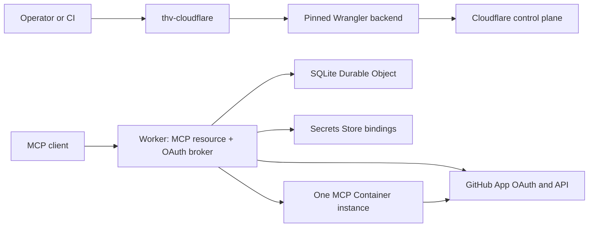
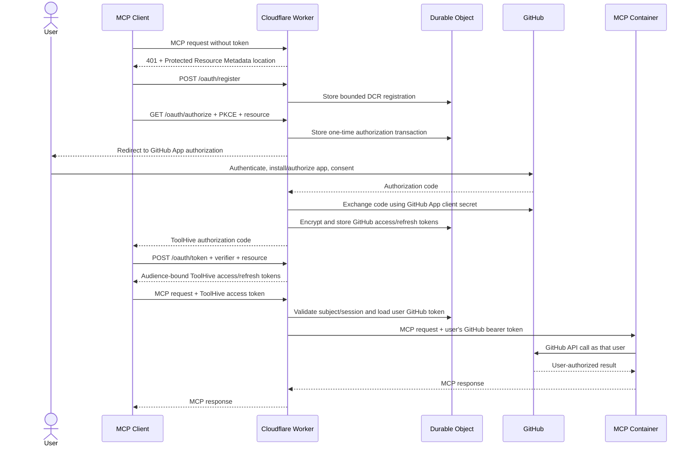

# RFC-0082: Cloudflare Deployment Artifact for ToolHive MCP Servers

- **Status**: Draft
- **Author(s)**: @samuv
- **Created**: 2026-07-20
- **Last Updated**: 2026-07-20
- **Target Repository**: toolhive
- **Related Issues**: [toolhive#5854](https://github.com/stacklok/toolhive/issues/5854)

## Summary

Introduce `thv-cloudflare`, a dedicated artifact that reconciles one declarative
`MCPServerDeployment` manifest into a Cloudflare Worker, a Cloudflare Container
application, and the state and secret bindings required to expose a secure
Streamable HTTP MCP endpoint. The first phase is a complete vertical slice: two
users can connect with standard MCP clients, register through Dynamic Client
Registration (DCR), authenticate through a GitHub App, and call a compatible
GitHub-backed MCP server using their own GitHub identity and permissions.

Phase 1 deliberately validates one server and one upstream provider rather than
a Git-managed fleet. The reconciliation and provider boundaries remain reusable
for later daemon, fleet, vMCP, registry, and native Cloudflare API work.

## Problem Statement

ToolHive can run and secure MCP servers locally and through the Kubernetes
operator, but it has no deployment mode for Cloudflare Workers and Containers.
Users who want Cloudflare's edge, scale-to-zero container runtime, and global
routing must currently assemble Worker code, container bindings, authentication,
OAuth state, secrets, and lifecycle automation themselves.

A thin container deployment alone is insufficient. A public MCP deployment also
needs:

- repeatable apply, update, readiness, status, and delete behavior;
- authentication compatible with MCP clients;
- per-user upstream credentials instead of one shared personal access token;
- protection against one user reusing another user's MCP session;
- secret references that keep values out of manifests and CLI state;
- explicit egress and unsafe-public-endpoint controls; and
- a documented compatibility boundary for arbitrary MCP server images.

The distinction between the two authorization planes is central to this RFC:

1. **MCP-facing authorization** determines which user and client may call the
   deployed MCP endpoint.
2. **Upstream authorization** determines which GitHub identity the backend uses
   when it calls GitHub APIs.

DCR solves client registration on the first plane. It does not authenticate the
user to GitHub or provide a GitHub token. Using one `GITHUB_TOKEN` environment
variable would make every caller act as the same GitHub identity, which is not a
multi-user deployment.

## Goals

- Ship Cloudflare support as a dedicated `thv-cloudflare` artifact, without
  adding Cloudflare dependencies to `thv`.
- Reconcile one Cloudflare-native manifest through validate, plan, apply,
  readiness, status, update, idempotent re-apply, and explicit delete.
- Deploy one Streamable HTTP MCP server behind a Worker with one deterministic
  Container instance.
- Be authenticated by default and require
  `--allow-insecure-public-endpoint` for an unauthenticated public deployment.
- Implement an MCP-compatible authorization broker at the Worker edge with DCR,
  Authorization Code with PKCE, Protected Resource Metadata, Authorization
  Server Metadata, JWKS, access tokens, and refresh tokens.
- Use a pre-registered GitHub App with expiring user access tokens as the single
  Phase 1 upstream provider.
- Swap the ToolHive access token for the authenticated user's GitHub token on
  each request to a compatible backend.
- Store OAuth and session state in SQLite-backed Durable Object storage, with
  application-layer encryption for upstream tokens.
- Reference pre-existing Cloudflare Secrets Store values without reading,
  uploading, hashing, or logging the secret values in `thv-cloudflare`.
- Preserve ToolHive's secure-default posture for public exposure and network
  egress.
- Track compatibility explicitly so later phases extend a known matrix rather
  than silently broadening assumptions.

## Non-Goals

Phase 1 does not include:

- Git repository watching, a long-running reconciliation daemon, or pruning
  resources absent from a directory;
- groups, vMCP aggregation, or multiple MCP servers in one deployment;
- more than one Container instance or per-user Container instances;
- custom domains; Phase 1 uses the deterministic `workers.dev` endpoint;
- stdio or legacy SSE transports;
- upstream providers other than GitHub;
- generic OIDC federation or multiple linked upstream identities;
- Client ID Metadata Documents (CIMD); DCR is the initial client-registration
  mechanism and CIMD compatibility is tracked separately;
- automatic registry resolution, GHCR mirroring, image signature verification,
  or garbage collection;
- hostname-level egress allowlists that depend on HTTPS interception and a
  Cloudflare CA being installed in arbitrary images;
- transparent multi-user support for servers that only read credentials from
  process environment variables or cache one credential globally;
- general tool-level authorization or Cedar policy evaluation at the Worker;
- Cloudflare Access as the MCP authorization protocol; or
- a native Go implementation of every Cloudflare API used by the deployer.

## Proposed Solution

### High-Level Design

`thv-cloudflare` is a Go command in `cmd/thv-cloudflare`. It validates the
manifest, renders a versioned Worker bundle and Wrangler configuration, and
invokes a pinned Wrangler version through a narrow deployment interface.
Cloudflare-specific Node.js tooling is therefore isolated from the main `thv`
artifact and can later be replaced by a native Go API backend.

The deployed Worker is both the public MCP gateway and an embedded OAuth
authorization broker. The Container is reachable only through its Worker
binding.



The auth flow follows the existing ToolHive embedded authorization-server and
`upstreamInject` model, implemented using Cloudflare-native runtime primitives:



### Phase 1 Success Criteria

The vertical slice is complete only when all of the following are demonstrated:

1. A manifest creates the Worker, Container application, Durable Object, routes,
   and Secrets Store bindings.
2. Reapplying an unchanged manifest is a no-op.
3. Updating the image or non-breaking runtime configuration converges without
   losing auth state.
4. A standard DCR-capable MCP client completes an interactive GitHub login.
5. Two different GitHub users initialize independent MCP sessions against the
   same deployment.
6. Each user observes only GitHub resources permitted to that user and the
   installed GitHub App.
7. Reusing user A's `Mcp-Session-Id` with user B's access token is rejected.
8. Neither the ToolHive token nor user A's GitHub token reaches user B's backend
   requests.
9. The endpoint is not publicly usable without authentication unless the
   exceptional insecure flag was supplied at apply time.
10. Status, readiness, update, and delete behavior work against a live
    Cloudflare account.

### Detailed Design

#### Dedicated Artifact and Package Boundaries

The implementation adds:

- `cmd/thv-cloudflare`: command parsing and user-facing output;
- `pkg/cloudflare/manifest`: schema, defaulting, canonicalization, and
  validation;
- `pkg/cloudflare/reconcile`: desired/actual comparison and ordered actions;
- `pkg/cloudflare/deploy`: control-plane interface;
- `pkg/cloudflare/deploy/wrangler`: pinned Wrangler implementation;
- `pkg/cloudflare/worker`: embedded, versioned Worker bundle and configuration;
  and
- Worker-side TypeScript modules for MCP routing, OAuth, GitHub, token swap,
  and Durable Object storage.

The deployer boundary is intentionally independent of command execution:

```go
type CloudflareDeployer interface {
    Inspect(ctx context.Context, desired *Deployment) (*ActualState, error)
    Plan(ctx context.Context, desired *Deployment, actual *ActualState) (*Plan, error)
    Apply(ctx context.Context, plan *Plan) (*ApplyResult, error)
    Delete(ctx context.Context, desired *Deployment, actual *ActualState) error
    WaitReady(ctx context.Context, desired *Deployment, timeout time.Duration) (*Status, error)
}
```

Wrangler is invoked with an argument array, never through a shell command
string. Generated files are written to a permission-restricted temporary
directory and removed after the operation. The required Wrangler version is
pinned by `thv-cloudflare`; version drift fails before mutation with a clear
installation command.

#### Commands

Phase 1 exposes one-manifest operations:

```text
thv-cloudflare validate -f deployment.yaml
thv-cloudflare plan     -f deployment.yaml
thv-cloudflare apply    -f deployment.yaml [--no-wait]
thv-cloudflare status   -f deployment.yaml [--wait]
thv-cloudflare delete   -f deployment.yaml
```

`apply` waits by default with bounded exponential backoff. Readiness includes:

1. the Container application is reported ready;
2. the deterministic Container instance starts and its configured port becomes
   ready;
3. the public Worker answers its health endpoint; and
4. when an MCP bearer token is supplied for verification, an authenticated MCP
   `initialize` succeeds.

`--no-wait` returns after accepted control-plane changes. `status --wait`
performs the same readiness sequence later.

If `spec.auth` is absent, `apply` and any mutating `plan` fail unless
`--allow-insecure-public-endpoint` is supplied. The flag affects only that
invocation; the resulting Worker carries an explicit insecure ownership marker,
and every subsequent plan and status call emits a high-severity warning.

#### Manifest API

Phase 1 uses a Cloudflare-native API rather than claiming that a Kubernetes
`MCPServer` can be applied unchanged. The shape remains familiar and leaves room
for a later conversion layer.

```yaml
apiVersion: cloudflare.toolhive.stacklok.dev/v1alpha1
kind: MCPServerDeployment
metadata:
  name: github-team
spec:
  server:
    # Phase 1 requires an image already readable by Cloudflare.
    image: registry.example.com/github-mcp-server@sha256:0123456789abcdef0123456789abcdef0123456789abcdef0123456789abcdef
    transport:
      type: streamable-http
      port: 8080
      path: /mcp
    command: []
    env:
      GITHUB_TOOLSETS: repos,issues,pull_requests

  runtime:
    instanceName: singleton
    maxInstances: 1

  permissions:
    egress:
      mode: unrestricted # disabled | unrestricted

  auth:
    type: github-app
    githubApp:
      clientId: Iv1.example
      clientSecretRef:
        storeId: 11111111-1111-1111-1111-111111111111
        secretName: github-app-client-secret
    clientRegistration:
      type: dcr
      maxRegistrations: 1000
      registrationTtl: 720h
    signingKeys:
      - keyId: 2026-07
        secretStoreRef:
          storeId: 11111111-1111-1111-1111-111111111111
          secretName: mcp-jwt-signing-key-2026-07
    tokenEncryptionKeys:
      - keyId: 2026-07
        secretStoreRef:
          storeId: 11111111-1111-1111-1111-111111111111
          secretName: mcp-token-encryption-key-2026-07

  secrets:
    - targetEnvName: OPTIONAL_STATIC_BACKEND_SECRET
      secretStoreRef:
        storeId: 11111111-1111-1111-1111-111111111111
        secretName: optional-static-backend-secret
```

Defaults and validation:

- `transport.type` must be `streamable-http`.
- `transport.path` defaults to `/mcp`.
- `runtime.instanceName` defaults to `singleton` and `maxInstances` must equal
  `1`.
- `permissions.egress.mode` defaults to `disabled`.
- `auth.type`, when present, must be `github-app`.
- DCR is enabled for authenticated Phase 1 deployments and cannot be combined
  with CIMD configuration.
- Secret references require store ID and secret name; secret values are never
  valid manifest fields.
- Environment names, commands, ports, paths, image references, Cloudflare names,
  durations, and URLs are length- and character-bounded.
- Mutable image tags are allowed for the walking skeleton but produce a warning;
  digest references are recommended. Phase 1 does not resolve or pin tags.
- Sensitive credential names such as `GITHUB_TOKEN` or `GITHUB_PAT` are rejected
  when specified as plaintext `env` values. A secret reference targeting one of
  those names is allowed but produces a multi-user compatibility warning because
  it overrides per-user semantics in many server images.

The GitHub App is created outside ToolHive. Its callback URL is derived from the
canonical Worker URL and printed by `validate` and `plan`, so an operator can
configure the exact value in GitHub before apply. The client ID is non-secret;
the client secret, JWT signing private keys, and token-encryption keys are
pre-existing Secrets Store references.

#### Reconciliation and Ownership

Phase 1 stores no local state file. Desired state comes from the manifest and
actual state comes from Cloudflare.

Resource names are deterministic from the manifest name and account. The Worker
configuration contains non-secret metadata:

```text
TOOLHIVE_MANAGED_BY=thv-cloudflare
TOOLHIVE_MANIFEST_NAME=github-team
TOOLHIVE_DESIRED_DIGEST=sha256:<canonical-manifest-and-bundle-digest>
TOOLHIVE_SCHEMA_VERSION=v1alpha1
```

The digest covers the canonical, defaulted manifest, the `thv-cloudflare`
version, and the embedded Worker bundle version. It includes secret reference
identifiers but never secret values.

Reconciliation rules:

- an absent resource is created;
- a resource with the matching ownership marker is compared and updated;
- a matching digest is a no-op;
- a deterministic-name collision without the marker is refused;
- Phase 1 never adopts an unowned resource;
- delete only targets resources whose marker and manifest identity match; and
- missing resources during delete are treated as already deleted.

Changes to the canonical issuer/hostname are replacement operations because
OAuth issuer, audience, callback, and persisted client bindings would change.
Image and compatible runtime changes preserve the Durable Object namespace and
auth state.

#### Worker and Container Routing

The public route terminates at the Worker. The Container application has no
separate public route. The Worker obtains the one deterministic Container
instance and proxies only the configured MCP path and methods required by
Streamable HTTP. Container SSH is disabled explicitly; Phase 1 neither creates
authorized keys nor relies on interactive Container access for lifecycle or
diagnostics.

The Worker owns the following routes:

```text
/.well-known/oauth-protected-resource[/...]
/.well-known/oauth-authorization-server[/...]
/oauth/register
/oauth/authorize
/oauth/callback/github
/oauth/token
/oauth/revoke
/oauth/jwks
/healthz
<configured MCP path>
```

Requests for undeclared paths are rejected. Host and forwarded-host values are
not trusted when constructing issuer, callback, audience, or resource values;
those values come from the reconciled canonical URL.

#### MCP-Facing Authorization Server

The Worker implements the subset of OAuth 2.1 required for the Phase 1 MCP
authorization flow:

- OAuth 2.0 Protected Resource Metadata (RFC 9728);
- OAuth Authorization Server Metadata (RFC 8414);
- DCR (RFC 7591);
- Authorization Code with mandatory PKCE `S256`;
- mandatory `resource` indicators bound to the canonical MCP URL;
- public MCP clients using `token_endpoint_auth_method=none`;
- one-time authorization codes;
- short-lived signed access tokens;
- rotating, hashed refresh tokens; and
- JWKS publication for current and verification-only signing keys.

Default lifetimes are:

| Artifact | Default |
|---|---:|
| Authorization transaction | 10 minutes |
| Authorization code | 5 minutes |
| ToolHive access token | 15 minutes |
| ToolHive refresh token/session | 7 days |
| Unused DCR registration | 30 days |

DCR is anonymous by protocol design, so it is bounded rather than trusted:

- rate limits apply per source and deployment;
- registration count and document sizes are capped;
- registrations expire when unused;
- redirect URIs must be exact HTTPS URIs or valid loopback redirect URIs;
- wildcard hosts and fragments are rejected;
- native clients must declare an appropriate application type;
- PKCE `S256` is mandatory regardless of registration metadata; and
- client, issuer, authorization transaction, resource, and redirect URI are
  bound and rechecked at the token endpoint.

CIMD is not silently treated as DCR. The Worker metadata advertises only the
mechanisms it implements. CIMD is tracked in the compatibility plan and aligns
with [RFC-0071](./THV-0071-cimd-support.md).

#### GitHub App Provider

Phase 1 has one provider adapter: GitHub App user authorization.

The GitHub App must use expiring user access tokens. GitHub currently issues
eight-hour user tokens and refresh tokens when expiration is enabled. ToolHive
rotates the upstream refresh token atomically; a failed or replayed refresh
causes that session to require interactive reauthorization.

After the callback, the Worker retrieves the stable numeric GitHub user ID and
constructs a provider-scoped subject such as `github:123456`. GitHub App access
is the intersection of:

- the user's GitHub permissions;
- the GitHub App's configured permissions; and
- the repositories or organizations where the app is installed.

The RFC does not attempt to encode GitHub App installation permissions in the
Cloudflare manifest. The reference guide defines a minimal read-oriented app
configuration and explains how additional GitHub MCP toolsets require additional
app permissions.

DCR remains between the MCP client and the ToolHive Worker. The GitHub App is
pre-registered with GitHub; this is required because GitHub does not offer DCR
for this integration.

#### Per-User Upstream Token Injection

The ToolHive access token contains a random token-session identifier (`tsid`) and
the provider-scoped subject. It never contains a GitHub access or refresh token.

For every authenticated MCP request, the Worker:

1. validates signature, issuer, audience, expiry, client, and resource;
2. loads the session identified by `tsid`;
3. verifies the session still belongs to the token subject and client;
4. refreshes the GitHub token under a storage lock when required;
5. removes the MCP-facing `Authorization` header;
6. sets `Authorization: Bearer <user GitHub token>` for the backend request; and
7. forwards the request to the deterministic Container instance.

No user-selectable header can override the injected credential.

This is not OAuth token passthrough at the public MCP resource boundary. The
Worker accepts and validates only ToolHive tokens issued for its own resource;
the GitHub token is retrieved server-side and injected on the private
Worker-to-backend hop, matching ToolHive's existing `upstreamInject` model.

This mode is supported only when the MCP server treats bearer credentials as
per-request state. A backend that reads one token from an environment variable,
stores the first caller's token globally, or binds credentials globally to the
process is not multi-user compatible. Such a backend may still use a referenced
static service credential, but every caller then acts as the same upstream
identity and status reports `SingleIdentity`.

#### MCP Session Identity Binding

One shared Container instance serves multiple users, so transport sessions must
not become an authorization channel.

When an initialize response creates an `Mcp-Session-Id`, the Worker records a
binding to deployment, authenticated subject, OAuth client, and `tsid`. Every
later request carrying that session ID must match the binding. Unknown,
cross-subject, and cross-client session IDs are rejected before reaching the
Container. The binding is deleted on the Streamable HTTP session-delete request
and expires with the auth session.

The `Mcp-Session-Id` remains untrusted opaque input and is length-bounded before
storage lookup or logging.

#### Durable Object State

Each deployment receives one SQLite-backed Durable Object. It stores:

- DCR client registrations and last-used timestamps;
- authorization transactions, state, PKCE bindings, and one-time codes;
- hashed ToolHive refresh tokens and their rotation families;
- encrypted GitHub access and refresh tokens with expiration metadata;
- provider subject and ToolHive `tsid` mappings;
- MCP transport-session identity bindings; and
- bounded security and cleanup metadata.

The schema is versioned and migrated transactionally. Records have explicit
expiration times and are removed opportunistically and by alarms. The single
Durable Object is an intentional Phase 1 simplification aligned with one
Container instance; performance tests establish when per-user token-vault
sharding becomes necessary.

GitHub tokens are encrypted with AES-256-GCM before being written. Ciphertexts
store a key ID and random nonce; associated data binds deployment, provider,
subject, client, record type, and schema version. `tokenEncryptionKeys[0]` is the
active encryption key and later entries are decrypt-only keys. Reads using an
old key are re-encrypted with the active key after successful decryption.

Cloudflare's own encryption at rest remains defense in depth rather than the only
token-storage control.

#### Secrets Store

The design follows the Kubernetes operator's reference-only pattern: the
deployer passes references into platform bindings and does not retrieve secret
values. This statement applies to application secrets; `thv-cloudflare` still
uses the operator-supplied Cloudflare API credential required to inspect and
mutate the deployment and must protect it from generated files and logs.

Phase 1 secret types are:

- GitHub App client secret;
- ToolHive JWT signing private key(s);
- upstream-token encryption key(s); and
- optional static backend environment secrets.

The Cloudflare deployment credential needs permission to attach an existing
secret binding. The exact least-privilege role and secret scopes are validated
before mutation. Secrets Store service limits and beta/stability status are
reported by `validate` and maintained in the compatibility matrix.

Private registry credentials must also be configured in Cloudflare before
apply. Phase 1 can reference an existing registry configuration but does not
prompt for, read from stdin, or upload registry credentials.

#### Egress

Phase 1 exposes two egress modes:

| Mode | Container internet access | Default | Intended use |
|---|---|---|---|
| `disabled` | No | Yes | Servers needing no upstream network |
| `unrestricted` | Yes | No | GitHub and other external APIs |

The GitHub reference deployment necessarily selects `unrestricted` so the MCP
server can call GitHub. This is explicit in the manifest and surfaced in plan.
The setting controls Container egress. The trusted Worker auth broker retains
outbound access to the fixed GitHub authorization, token, identity, and
revocation endpoints needed for the configured provider.

Hostname allowlists are deferred because Cloudflare's hostname-level enforcement
requires HTTPS interception. Arbitrary MCP images may not trust the Cloudflare
CA, may use certificate pinning, may use nonstandard TLS libraries, or may open
raw TCP connections. A future compatibility milestone must test CA installation,
language runtimes, certificate pinning, HTTP/2, WebSockets, raw TCP, and failure
modes before allowlists are represented as a reliable control.

#### Image Sources

Phase 1 requires an image already readable by Cloudflare, including a supported
Cloudflare registry path or a supported Docker Hub, ECR, or GAR configuration.
GHCR references fail validation with instructions to mirror the image manually.

The reference GitHub MCP server image is therefore mirrored manually into a
Cloudflare-readable registry and pinned by digest for the acceptance test.
Automated ToolHive registry resolution, OCI copying, signature verification,
digest pinning, and garbage collection form a later phase.

Every Phase 1 image must be `linux/amd64`, listen on `0.0.0.0` at the declared
port, serve Streamable HTTP at the declared path, and tolerate the lifecycle of
a scale-to-zero Container. Multi-user images must additionally consume bearer
credentials per request and must not cache the first caller's credential as
process-global state.

#### Delete Semantics

Delete is explicit; Phase 1 does not infer deletion from a missing manifest.

The ordered delete operation is:

1. disable the public MCP route;
2. stop accepting new OAuth and refresh operations;
3. purge Durable Object OAuth, upstream-token, and session state;
4. remove Worker, Container, route, and bindings owned by the manifest; and
5. report any resource that could not be removed.

Purging the stored refresh token prevents future GitHub token refresh. A GitHub
user token that was already issued can remain valid until its bounded expiry
(eight hours by default) unless it is explicitly revoked. The implementation
should attempt revocation before purge when the provider supports it; the final
choice between a mandatory revocation acknowledgement and bounded-expiry cleanup
remains an open review question.

Delete never removes the referenced account-level Secrets Store values or the
externally managed GitHub App.

### Status Model

Status is calculated rather than written into the input manifest. Human and JSON
output include:

- ownership and desired/actual digests;
- Worker and Container deployment identifiers;
- canonical MCP and OAuth URLs;
- readiness condition and last probe error;
- authentication mode and insecure-public warning;
- DCR registration count and capacity without client secrets;
- active signing/encryption key IDs;
- auth-storage schema version;
- egress mode;
- image source and mutable-tag warning; and
- `MultiUserPerRequest`, `SingleIdentity`, or `Unknown` backend-auth
  compatibility.

## Security Considerations

### Threat Model

Potential attackers include unauthenticated internet clients, malicious DCR
clients, authenticated users attempting cross-user access, a compromised MCP
container, malicious container images, an operator with a stolen Cloudflare API
token, and attackers able to read raw Durable Object storage or logs.

Primary threats are:

- public unauthenticated MCP access;
- OAuth redirect, authorization-code, CSRF, PKCE, issuer, or resource mix-up;
- anonymous DCR storage exhaustion;
- ToolHive token replay or acceptance for the wrong deployment;
- cross-user MCP session reuse;
- forwarding a ToolHive token to GitHub or a GitHub token to the wrong user;
- refresh-token replay and concurrent rotation races;
- token or secret disclosure in manifests, generated files, logs, status, or
  errors;
- command/config injection through manifest fields passed to Wrangler;
- supply-chain compromise through mutable or unverified images;
- data exfiltration when unrestricted egress is enabled; and
- accidental deletion or adoption of resources not owned by ToolHive.

### Authentication and Authorization

- Authenticated deployment is the default; insecure public exposure requires a
  command-line exception and remains visibly marked.
- Authorization Code uses one-time state and mandatory PKCE `S256`.
- Issuer, audience, resource, redirect URI, client, `tsid`, and subject are
  mutually bound and revalidated.
- Access tokens are short-lived and signed with an asymmetric key exposed only
  through JWKS.
- ToolHive refresh tokens are stored hashed, rotated on use, and protected by
  family replay detection.
- GitHub tokens are never returned to MCP clients.
- GitHub access is constrained by both user permissions and GitHub App
  installation permissions.
- MCP transport sessions are bound to the authenticated subject and client.
- The Container is reachable only through the authenticating Worker route.

### Data Security

Sensitive state consists of GitHub access/refresh tokens, ToolHive refresh
tokens, authorization codes, OAuth state, user identity mappings, and transport
session mappings.

- TLS protects all public and Cloudflare-internal traffic.
- Durable Object storage is encrypted by Cloudflare.
- GitHub token values receive application-layer AEAD encryption with key IDs and
  associated-data binding.
- ToolHive refresh tokens are hashed rather than reversibly encrypted.
- authorization codes and transactions are one-time and short-lived.
- expired rows are removed by alarms and opportunistic cleanup.
- explicit deletion purges deployment-owned auth and session state.
- identity values in logs are pseudonymized where the clear value is not needed.

### Input Validation

- The manifest is strictly decoded; unknown fields fail in `v1alpha1`.
- All strings, collections, documents, and HTTP bodies have size limits.
- Names and identifiers are canonicalized before resource-name generation.
- URLs are parsed and validated rather than concatenated.
- Canonical issuer and resource URLs never derive from untrusted Host headers.
- DCR redirect URI rules prevent open redirects and wildcard registrations.
- OAuth state, codes, session IDs, and nonces use cryptographic randomness.
- JSON error responses do not reflect untrusted values without safe encoding.
- Wrangler receives argument arrays and generated structured configuration, not
  shell-interpolated input.
- The Worker proxies only the configured Container binding and path, preventing
  user-controlled upstream SSRF.

### Secrets Management

- Manifests contain references, never secret values.
- `thv-cloudflare` does not retrieve, upload, hash, or log bound secret values.
- Generated Wrangler configuration contains binding metadata only.
- The Worker resolves secrets through runtime bindings.
- Signing and encryption keys carry IDs so rotation can overlap active and
  verification/decrypt-only keys.
- GitHub access and refresh tokens are revocable and time-bounded.
- Static backend secrets are explicitly classified as single-identity when they
  represent an upstream credential.

### Audit and Logging

Security events include DCR create/expire/reject, authorization success/failure,
token refresh/replay/revoke, cross-session denial, insecure deployment, ownership
collision, egress-mode change, key-set change, and delete/purge outcome.

Logs include correlation ID, deployment, pseudonymous subject, OAuth client ID,
event type, and result. They never include bearer tokens, refresh tokens,
authorization codes, PKCE verifiers, client secrets, signing material, raw
cookies, or full request bodies. OAuth errors returned to clients are bounded and
do not expose provider responses or internal storage keys.

### Mitigations

The design combines secure defaults, explicit unsafe opt-in, short-lived and
audience-bound credentials, strict OAuth binding, per-user token swap, transport
session binding, bounded DCR, strong-consistency storage, layered encryption,
reference-only secrets, private Container routing, deterministic ownership, and
fail-closed reconciliation.

Residual Phase 1 risks are explicitly visible:

- unrestricted egress permits a compromised server image to exfiltrate data;
- image provenance is not automatically verified;
- one Durable Object is a performance and availability concentration point;
- DCR remains supported for client compatibility even though current MCP
  guidance prefers CIMD; and
- an already-issued GitHub user token may remain valid for its bounded lifetime
  after deployment deletion if immediate revocation fails.

### Phase 1 Security Gate

Phase 1 is not shippable merely because its functional E2E test passes. Every
item below is a blocking release check and must link to reproducible evidence in
the implementation PR, a release-tracking issue, or CI. A failed check blocks
release. Any residual Medium-or-lower finding requires a named owner, documented
impact, mitigation, and target date; unresolved Critical or High findings block
release without exception.

- [ ] **SEC-01 — Threat-model review:** a ToolHive security reviewer confirms
  that the implemented data flows and trust boundaries still match this RFC,
  including the Worker, auth Durable Object, Container, GitHub, Secrets Store,
  Wrangler subprocess, and Cloudflare control plane.
- [ ] **SEC-02 — Secure deployment defaults:** automated tests prove that an
  omitted auth configuration cannot be applied without
  `--allow-insecure-public-endpoint`, insecure state remains visible in plan and
  status, Container SSH is disabled, and the Container has no direct public
  route.
- [ ] **SEC-03 — OAuth/MCP conformance:** positive and negative tests cover
  Protected Resource Metadata, Authorization Server Metadata, DCR, PKCE `S256`,
  exact redirect matching, `state`, issuer, resource, audience, code single use,
  refresh rotation, and token expiry.
- [ ] **SEC-04 — Two-user isolation:** the live E2E test proves that two GitHub
  users receive distinct upstream tokens and permissions, and that swapping
  access tokens, `tsid` values, OAuth clients, or `Mcp-Session-Id` values never
  crosses identities.
- [ ] **SEC-05 — Credential-boundary test:** the Worker rejects caller-supplied
  upstream credential headers, never forwards a ToolHive token to the backend,
  injects only the server-selected user's GitHub token, and never returns that
  token to the MCP client.
- [ ] **SEC-06 — Storage and rotation:** tests inspect stored rows to confirm
  that GitHub tokens are AEAD-encrypted, ToolHive refresh tokens are hashed,
  associated data prevents ciphertext relocation, refresh replay is detected,
  and active plus decrypt/verify-only key rotation works.
- [ ] **SEC-07 — Secrets and log hygiene:** repository secret scanning and
  golden log/status/error tests show that application secrets, Cloudflare
  credentials, bearer tokens, refresh tokens, authorization codes, PKCE
  verifiers, cookies, and private keys are absent.
- [ ] **SEC-08 — DCR and endpoint abuse:** rate, size, count, and expiry limits
  are verified under load; malformed registrations and redirect attacks fail
  closed without unbounded Durable Object growth.
- [ ] **SEC-09 — Network controls:** tests prove that `egress.mode: disabled`
  blocks Container internet traffic, `unrestricted` is surfaced as a risk, only
  declared Worker paths are routed, and user input cannot select an arbitrary
  upstream target.
- [ ] **SEC-10 — Reconciliation safety:** generated Wrangler arguments are
  injection-safe, unowned-name collisions are refused, secret values do not
  enter generated configuration, and delete cannot target resources without the
  matching ownership identity.
- [ ] **SEC-11 — Supply-chain check:** Go and Worker dependencies are locked and
  scanned using repository-standard tooling, Wrangler is version-pinned, the
  embedded Worker bundle digest is included in desired state, the reference MCP
  image is digest-pinned, and shipped artifacts have checksums and an SBOM.
- [ ] **SEC-12 — Deletion and incident recovery:** deletion disables the public
  route before state cleanup, purges stored tokens and sessions, exercises the
  chosen GitHub revocation behavior, and documents recovery for partial cleanup
  or a compromised signing/encryption key.
- [ ] **SEC-13 — Final security sign-off:** a security reviewer records an
  approve/block decision after reviewing the evidence above and all open
  security findings.

The release-tracking issue owns this checklist. Individual implementation PRs
may satisfy subsets, but the checklist is evaluated again against the assembled
release candidate so cross-component failures are not hidden by per-package
tests.

## Alternatives Considered

### Add `thv cloudflare`

This would provide one CLI, but it would add Node/Wrangler and Cloudflare release
concerns to every `thv` distribution. A dedicated artifact gives the deployment
mode an independent dependency and release boundary.

### Use the Kubernetes `MCPServer` CRD Unchanged

The CRD includes Kubernetes-specific scheduling, pod, namespace, volume, and
status semantics that do not map honestly to Workers and Containers. A
Cloudflare-native API is clearer in `v1alpha1`; a later conversion layer can
share portable fields.

### Implement Native Cloudflare APIs First

A native Go implementation removes Node.js, but the current public Go SDK does
not provide the complete Containers deployment surface needed by this RFC.
Pinning Wrangler behind `CloudflareDeployer` is the fastest replaceable path.

### Cloudflare Access or JWT Validation Only

Edge JWT validation can authenticate requests that already have tokens, but it
does not provide MCP client registration, interactive login, ToolHive
resource-bound tokens, or per-user upstream token storage and injection. It
would prove deployment mechanics without proving the multi-user product path.

### One Shared GitHub PAT

This is simple but every caller acts as one GitHub user or service account. It is
retained only as a clearly labelled single-identity compatibility mode.

### GitHub OAuth App

OAuth Apps are easier to prototype but use broader scopes and commonly
longer-lived credentials. GitHub Apps provide fine-grained installation
permissions and expiring user tokens with refresh rotation, making them the
safer target architecture.

### Generic OIDC/OAuth Provider in Phase 1

Starting generic would enlarge discovery, identity normalization, scope,
refresh, revocation, and compatibility work before one provider is validated.
The Worker uses an internal provider interface, but only the GitHub adapter is
implemented initially.

### One Container per User

Per-user instances isolate process-global credentials and make environment-only
servers multi-user capable. They also change routing, scaling, cost, startup,
token refresh, and lifecycle semantics. Phase 1 instead requires a backend that
accepts per-request bearer credentials.

## Compatibility

### Phase 1 Matrix

| Dimension | Phase 1 | Later compatibility work |
|---|---|---|
| Artifact | Dedicated `thv-cloudflare` | Optional shared libraries with other binaries |
| Desired state | One manifest, explicit commands | Git watcher, daemon, self-hosted reconciler |
| Manifest | Cloudflare-native `MCPServerDeployment` | Portable conversion from RunConfig/CRDs |
| Transport | Streamable HTTP | stdio, legacy SSE |
| Instances | One deterministic instance | Multiple instances, per-user instances |
| MCP client registration | DCR | CIMD, pre-registration policies |
| Upstream provider | GitHub App | Generic OIDC/OAuth, multiple providers |
| Multi-user backend auth | Per-request bearer token | Env-only adapters, sidecars, per-user instances |
| Static backend secrets | Secrets Store references | Additional secret providers |
| Image sources | Already Cloudflare-readable | GHCR mirroring, registry resolution, verification |
| Egress | Disabled or unrestricted | Host allowlists after CA compatibility validation |
| Tool authorization | GitHub/user/app permissions | Tool filtering and Cedar policies |
| Groups | None | vMCP and lazy backend discovery |

### Backward Compatibility

The proposal adds a new binary and API group, so it does not change existing
`thv`, ToolHive Studio, operator, CRDs, or RunConfig behavior. The manifest is
`v1alpha1`; breaking schema changes are allowed with explicit version conversion
before a stable API.

### Forward Compatibility

- `CloudflareDeployer` allows a native Go API backend to replace Wrangler.
- The provider adapter allows later OIDC/OAuth providers without changing the
  MCP-facing token model.
- Key IDs support signing and encryption rotation.
- Versioned Durable Object schemas support transactional migration.
- The manifest separates server, runtime, permissions, auth, and secrets so
  compatible fields can later map to ToolHive portable configuration.
- The explicit matrix makes unsupported combinations discoverable by
  `validate`, `plan`, and `status`.

## Implementation Plan

### Phase 1: One Secure Multi-User GitHub Deployment

Phase 1 is implemented as testable increments but ships only after the complete
success criteria pass.

#### Increment 1: Manifest and Reconciliation Skeleton

- Add the dedicated command and packages.
- Implement strict schema, defaults, canonical digest, ownership, validate,
  plan, status, and no-op detection.
- Add the pinned Wrangler backend and fake deployer for tests.

**Value/test:** validate and plan one declarative deployment against a real
Cloudflare account without mutation; create/delete a minimal owned Worker.

#### Increment 2: Worker and Container Lifecycle

- Render and deploy the versioned Worker bundle and Container binding.
- Implement one deterministic instance, Streamable HTTP proxying, egress mode,
  health checks, wait/no-wait, update, and collision refusal.
- Add pre-existing Secrets Store bindings and optional static backend secrets.
- Enforce authenticated-by-default apply behavior, initially with the endpoint
  closed until the auth broker is ready.

**Value/test:** idempotently deploy, update, probe, and delete one private
Streamable HTTP MCP Container.

#### Increment 3: Complete GitHub Auth Broker

- Implement Protected Resource and Authorization Server Metadata.
- Implement bounded DCR, Authorization Code with PKCE, token, revoke, and JWKS.
- Implement the SQLite Durable Object schema and alarms.
- Add GitHub App authorization, identity lookup, expiring user-token refresh,
  encryption, and ToolHive token issuance.
- Add per-request upstream injection and MCP session identity binding.

**Value/test:** two DCR-capable MCP clients/users authenticate interactively and
use the same deployment with distinct GitHub identities.

#### Increment 4: Hardening and Release

- Add live Cloudflare E2E tests, OAuth negative tests, concurrency tests, delete
  cleanup, audit events, and failure diagnostics.
- Test a digest-pinned, manually mirrored GitHub MCP server in read-oriented
  mode.
- Publish the compatibility matrix, GitHub App setup guide, secret/key rotation
  guide, incident cleanup guide, and cost/limits notes.

### Phase 1 Shipping Breakdown

The following units are intended to map to reviewable issues and PRs. A unit is
complete only when its code, tests, and relevant documentation land together;
"implementation complete, tests later" does not satisfy the exit criterion.


| ID | Shipping unit | Main deliverables | Depends on | Exit criterion |
|---|---|---|---|---|
| P1-00 | Contracts and risk-reduction spikes | Confirm Wrangler command surface, deterministic Container routing, GitHub MCP per-request bearer behavior, callback URL, and local/live test harness | None | Each spike has a recorded result; no unresolved feasibility blocker remains |
| P1-01 | Dedicated artifact scaffold | `cmd/thv-cloudflare`, version output, build/release targets, embedded Worker asset pipeline, repository ownership metadata | P1-00 | Binary builds in CI without changing the `thv` artifact or its dependencies |
| P1-02 | Manifest API | Go types, strict YAML/JSON decoding, defaults, validation, canonicalization, schema docs, fixtures | P1-00 | Valid examples round-trip; invalid, unknown, insecure, and unsupported combinations fail with actionable errors |
| P1-03 | Cloudflare deployer | `CloudflareDeployer`, fake backend, pinned Wrangler implementation, secure temporary files, structured argv, preflight permissions/version checks | P1-01 | Fake integration suite passes and a live smoke test can inspect/create/delete an owned Worker |
| P1-04 | Stateless reconciliation | Desired/actual model, ownership markers, digest, plan, no-op, update/replace rules, collision refusal | P1-02, P1-03 | Create, unchanged reapply, update, replacement warning, drift, and unowned collision tests pass |
| P1-05 | Worker and Container runtime | Versioned Worker, private Container binding, deterministic `singleton` instance, Streamable HTTP routing, port readiness, SSH disabled | P1-02, P1-03 | A test MCP Container is reachable through the Worker and not through a direct public Container route |
| P1-06 | Secrets and egress | Secrets Store reference bindings, static backend-secret injection, sensitive-env rejection, disabled/unrestricted egress, compatibility status | P1-02, P1-05 | No application secret value reaches the CLI/config/logs; both egress modes pass live tests |
| P1-07 | Auth Durable Object and cryptography | SQLite schema/migrations, expiry alarms, AEAD token vault, refresh-token hashing/families, key IDs and rotation | P1-05 | Persistence, eviction, migration, tamper, replay, concurrent refresh, expiry, and rotation tests pass |
| P1-08 | MCP-facing OAuth server | Resource/AS metadata, bounded DCR, authorize/callback state machine, PKCE, token, refresh, revoke, JWKS | P1-07 | OAuth positive/negative conformance suite passes with a real DCR-capable MCP client |
| P1-09 | GitHub App provider | Preflight configuration, authorization callback, stable user identity, encrypted access/refresh storage, refresh and revocation | P1-07 | Two test GitHub users authorize independently; expiry, revoke, denied consent, and provider errors are covered |
| P1-10 | Upstream injection and session binding | ToolHive token validation, `tsid` lookup, GitHub bearer replacement, prohibited-header stripping, MCP session identity binding | P1-08, P1-09 | Cross-user/client/session matrix fails closed and backend observes only the selected user's GitHub identity |
| P1-11 | Lifecycle, readiness, status, and delete | Apply wait/no-wait, status/wait, health reporting, compatible update, route-first shutdown, state purge, idempotent retry | P1-04, P1-06, P1-07 | Live create-to-delete lifecycle passes, including partial failure and retry without touching unowned resources |
| P1-12 | Compatibility and live E2E | Manually mirrored digest-pinned GitHub MCP image, read-oriented GitHub App profile, two-user test, client/image/egress matrix | P1-10, P1-11 | All Phase 1 success criteria pass in a clean Cloudflare account and produce retained test evidence |
| P1-13 | Security release gate | Execute SEC-01 through SEC-13, dependency/static scans, targeted manual review, residual-risk record | P1-12 | Security reviewer records approval and no unresolved Critical or High finding exists |
| P1-14 | Documentation, packaging, and experimental release | Install/schema/operations docs, GitHub App and secret setup, compatibility and cost limits, runbooks, checksums, SBOM, release notes | P1-13 | A new user can reproduce the E2E guide from released artifacts; rollback and delete runbooks are verified |

#### Ship Checklist

The Phase 1 release is ready only when:

- [ ] P1-00 through P1-14 are complete and linked from one release-tracking
  issue;
- [ ] all Phase 1 success criteria and the live two-user E2E test pass from a
  clean Cloudflare account;
- [ ] the Phase 1 security gate is approved;
- [ ] compatibility results identify the exact MCP clients, GitHub MCP image
  digest, Wrangler version, Node.js version, and Cloudflare features tested;
- [ ] upgrade, rollback, failed-apply retry, and delete/purge paths are exercised;
- [ ] the artifact, embedded Worker bundle, schema, example manifest, checksums,
  SBOM, and release notes are published together; and
- [ ] the release is labelled experimental with the known Phase 1 limitations
  and residual risks visible to operators.

### Phase 2 Candidates

Phase 2 is deliberately not a prerequisite for Phase 1 value:

- CIMD support aligned with RFC-0071;
- native Go Cloudflare deployment APIs;
- ToolHive registry resolution and automatic OCI mirroring;
- Git reconciliation and fleet pruning;
- generic and multiple upstream providers;
- vMCP and groups;
- per-user or multi-instance Containers;
- hostname egress policies after CA compatibility validation; and
- tool-level authorization and policy middleware.

### Dependencies

- A Cloudflare account and plan supporting Workers, Containers, Durable Objects,
  and required bindings.
- Node.js and the pinned Wrangler version for the initial deployment backend.
- Pre-existing Secrets Store values with Worker-compatible scopes.
- A pre-registered GitHub App with an exact callback URL, expiring user tokens,
  and permissions appropriate for the enabled GitHub MCP toolsets.
- A Cloudflare-readable, preferably digest-pinned Streamable HTTP MCP image.
- DCR-capable MCP clients for the initial interoperability test.

## Testing Strategy

### Unit Tests

- strict manifest decoding, defaulting, validation, canonicalization, and digest;
- resource naming, ownership, collision, diff, replacement, and no-op behavior;
- Wrangler argv/config generation without shell interpolation;
- OAuth metadata, DCR bounds, redirect validation, PKCE, resource, issuer,
  audience, code, refresh, and replay validation;
- GitHub provider callback, identity, expiry, refresh rotation, and errors;
- AEAD associated-data and key-rotation behavior;
- upstream header replacement and prohibited-header stripping;
- MCP session subject/client binding; and
- expiration and cleanup alarms.

### Integration Tests

- Worker modules and SQLite Durable Object storage in the Cloudflare local test
  runtime;
- fake GitHub authorization/token/user endpoints;
- a test Streamable HTTP MCP server that records the per-request upstream
  identity without exposing tokens;
- crash/restart persistence and schema migration;
- concurrent GitHub refresh and ToolHive refresh-token replay; and
- authenticated, insecure-exception, egress-disabled, and unrestricted modes.

### End-to-End Tests

Live, opt-in Cloudflare tests cover:

- create, readiness, no-op reapply, image update, status, and delete;
- unowned-name collision refusal;
- private Container reachability only through the Worker;
- standard-client DCR and interactive authorization;
- two distinct GitHub users and repository visibility;
- cross-user and cross-client `Mcp-Session-Id` rejection;
- token expiry and rotation;
- secret/key binding without value exposure;
- abrupt Worker restart with Durable Object recovery; and
- partial delete failure and retry.

The release gate uses a manually mirrored, digest-pinned GitHub MCP server image
whose HTTP mode consumes the `Authorization` bearer token on each request.

### Performance and Reliability Tests

- DCR and token-endpoint rate limits;
- concurrent MCP calls through the single Durable Object and Container;
- p50/p95/p99 auth lookup and proxy overhead;
- Durable Object eviction/restart recovery;
- bounded backoff and readiness timeout; and
- an explicit throughput threshold that triggers evaluation of per-user Durable
  Object sharding.

### Security Tests

- OAuth redirect and mix-up attacks;
- missing/wrong PKCE, state, issuer, resource, audience, and redirect URI;
- DCR body/storage exhaustion and registration flooding;
- authorization-code and refresh-token replay;
- JWT algorithm, key ID, expiry, and cross-deployment confusion;
- session fixation and cross-user session reuse;
- header smuggling and attempts to override the injected GitHub token;
- log/status snapshots checked for tokens and secrets;
- manifest-to-Wrangler command/config injection;
- deletion of unowned resources; and
- egress-disabled escape attempts from the test Container.

## Documentation

- Install and version requirements for `thv-cloudflare`, Node.js, and Wrangler.
- `MCPServerDeployment` schema and command reference.
- Cloudflare API token permissions and Secrets Store roles/scopes.
- GitHub App creation, callback, installation, minimal permissions, expiring user
  tokens, and revocation.
- Image compatibility and manual GHCR mirroring.
- Multi-user per-request versus single-identity backend authentication.
- DCR client compatibility and CIMD roadmap.
- Egress modes and the hostname-allowlist/CA compatibility matrix.
- Key rotation, token retention, delete, and incident-response runbooks.
- Live E2E test setup, Cloudflare limits, and expected costs.

## Open Questions

1. Should the final API group remain
   `cloudflare.toolhive.stacklok.dev/v1alpha1`, or use a provider-neutral group
   in anticipation of other managed runtimes?
2. Should `thv-cloudflare` require an externally installed exact Wrangler
   version, or distribute a managed Node/Wrangler companion bundle?
3. Which read-oriented GitHub MCP toolsets and GitHub App permissions form the
   normative two-user acceptance profile?
4. Must delete prove immediate GitHub user-token revocation before removing
   state, or is purge plus the maximum eight-hour access-token lifetime an
   acceptable bounded fallback when GitHub is unavailable?
5. What live-test concurrency threshold should trigger per-user Durable Object
   sharding before the deployment mode advances beyond experimental status?

## References

- [toolhive#5854: Cloudflare Containers proposal](https://github.com/stacklok/toolhive/issues/5854)
- [RFC-0019: ToolHive Authorization Server Overview](./THV-0019-auth-server-overview.md)
- [RFC-0031: Embedded Authorization Server Integration](./THV-0031-auth-server-integration.md)
- [RFC-0053: vMCP Embedded Authorization Server](./THV-0053-vmcp-embedded-authserver.md)
- [RFC-0054: vMCP Upstream Inject Strategy](./THV-0054-vmcp-upstream-inject-strategy.md)
- [RFC-0071: Client ID Metadata Document Support](./THV-0071-cimd-support.md)
- [MCP Authorization specification](https://modelcontextprotocol.io/specification/draft/basic/authorization)
- [RFC 7591: OAuth 2.0 Dynamic Client Registration](https://www.rfc-editor.org/rfc/rfc7591)
- [RFC 8414: OAuth 2.0 Authorization Server Metadata](https://www.rfc-editor.org/rfc/rfc8414)
- [RFC 8707: Resource Indicators for OAuth 2.0](https://www.rfc-editor.org/rfc/rfc8707)
- [RFC 9728: OAuth 2.0 Protected Resource Metadata](https://www.rfc-editor.org/rfc/rfc9728)
- [GitHub MCP server host integration](https://github.com/github/github-mcp-server/blob/main/docs/host-integration.md)
- [GitHub App user access tokens](https://docs.github.com/en/apps/creating-github-apps/authenticating-with-a-github-app/generating-a-user-access-token-for-a-github-app)
- [GitHub Apps versus OAuth Apps](https://docs.github.com/en/apps/oauth-apps/building-oauth-apps/differences-between-github-apps-and-oauth-apps)
- [Cloudflare Durable Object storage](https://developers.cloudflare.com/durable-objects/best-practices/access-durable-objects-storage/)
- [Cloudflare Durable Object data security](https://developers.cloudflare.com/durable-objects/reference/data-security/)
- [Cloudflare Secrets Store Worker integration](https://developers.cloudflare.com/secrets-store/integrations/workers/)
- [Cloudflare Container image management](https://developers.cloudflare.com/containers/platform-details/image-management/)
- [Cloudflare Container outbound traffic](https://developers.cloudflare.com/containers/platform-details/outbound-traffic/)

---

## RFC Lifecycle

<!-- This section is maintained by RFC reviewers -->

### Review History

| Date | Reviewer | Decision | Notes |
|------|----------|----------|-------|
| 2026-07-20 | @samuv | Draft | Initial draft based on toolhive#5854 design interview |

### Implementation Tracking

| Repository | PR | Status |
|------------|-----|--------|
| toolhive | TBD | Not started |
