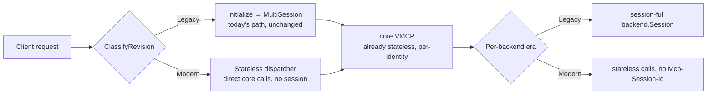

# RFC-0083: Stateless vMCP Support (MCP 2026-07-28)

- **Status**: Draft
- **Author(s)**: Jakub Hrozek (@jhrozek)
- **Created**: 2026-07-21
- **Last Updated**: 2026-07-21
- **Target Repository**: toolhive
- **Related Issues**: [toolhive#5756](https://github.com/stacklok/toolhive/issues/5756) (this),
  [toolhive#5743](https://github.com/stacklok/toolhive/issues/5743) (epic)

## Summary

The MCP 2026-07-28 revision removes protocol sessions, the `initialize` handshake, and all
server-initiated requests, replacing them with per-request `_meta`, a `server/discover` RPC, and
Multi Round-Trip Requests (MRTR). This RFC proposes making the Virtual MCP Server (vMCP) serve both
the current (2025-11-25, "Legacy") and the stateless (2026-07-28, "Modern") revision on the same
endpoint, discriminating **per request** — and, because vMCP is an aggregating gateway that
terminates the client connection and re-originates backend calls, acting as the **cross-generation
bridge** so a client on either revision can reach backends on either revision.

This is the decision-level counterpart to the vMCP stateless design work tracked in toolhive#5756,
which carries the implementation detail. It
is the vMCP sibling of [RFC-0081](THV-0081-stateless-transport-proxies.md) (transport proxies,
toolhive#5755), which explicitly **defers the era-mismatched bridge cells to vMCP**.

## Problem Statement

The 2026-07-28 revision removes the mechanisms vMCP's session layer is built around: the
`initialize` handshake, protocol sessions and `Mcp-Session-Id`, the standalone GET SSE stream and
resumability, server-initiated requests (→ MRTR), and `ping`/`logging/setLevel`. The ecosystem will
straddle both revisions for a long time — SDKs serve both on one endpoint and peers upgrade
independently — so vMCP cannot do a flag-day cutover.

Crucially, vMCP's stateful machinery — the two-phase `SessionIdManager`, per-session `MultiSession`
objects, the 1,000-entry per-pod session cache, Redis session metadata, identity binding, and
cross-pod tool rehydration — exists for **one reason**: to bridge vMCP's already-stateless core to a
*session-ful protocol*. `coreVMCP` re-derives its advertised, per-principal view on every
`List`/`Lookup`/`Call` from `(identity, backend registry, health)` and holds no MCP-session state.
When the protocol stops being session-ful, that bridge is no longer needed on the Modern path — the
design is mostly about **bypassing it on the Modern path**, not rebuilding it.

RFC-0081 established per-request revision classification for the transport proxies and, in its
compatibility matrix, marked the era-mismatched cells "Fails" for a pass-through proxy and deferred
them to vMCP. vMCP is the component that can bridge them precisely because it terminates and
re-originates on both edges.

## Goals

- Serve Legacy and Modern client traffic on the same vMCP endpoint, chosen per request.
- Handle each backend according to its own negotiated revision (per-backend dual protocol).
- Bridge all four client×backend era combinations, including the two RFC-0081 defers here.
- Zero behavior change for existing 2025-11-25 traffic.
- Add the minimum new machinery: reuse the existing `pkg/mcp` classifier; bypass the session bridge
  on the Modern path rather than reimplement it.
- Do **not** hard-gate the work on the go-sdk v1.7 bump.
- Preserve every security invariant (auth per request, admission, rate limiting, audit) across the
  Modern path, and relocate — not drop — the cross-request binding invariant onto workflow handles.

## Non-Goals

- go-sdk v1.7 adoption / `mcpcompat` stateless plumbing ([toolhive#5754]) — an optional later
  simplification of the Modern dispatcher, not a dependency (see Alternatives).
- MRTR-based elicitation/sampling passthrough ([toolhive#5759]); request-scoped streaming and
  `subscriptions/listen` delivery — designed but deferred.
- Caching metadata semantics beyond emitting schema-valid `ttlMs`/`cacheScope` ([toolhive#5761]).
- CIMD-first registration / RFC 9207 issuer validation ([toolhive#5760]).
- The transport proxies themselves ([toolhive#5755] / RFC-0081).

## Proposed Solution

### High-Level Design

Two independent classification edges. On the **client edge**, each request is classified Modern or
Legacy via the existing `mcp.ClassifyRevision` (`pkg/mcp/revision.go`, added in #5834, modified in
#5839). On the
**backend edge**, each backend is classified once by its negotiated revision and that era is cached
in the health/probe subsystem. vMCP translates between the two edges.

The Modern client path **bypasses the entire Serve session layer** and dispatches straight to the
core, which already performs per-principal projection and admission. The Legacy path is untouched.

### Detailed Design

Full implementation detail is tracked in toolhive#5756. The load-bearing decisions:

- **D1 — Bypass the bridge on the Modern path, don't rebuild it.** The core is already stateless; the Modern path
  invokes none of the two-phase session hook, `MultiSession`, the 1,000-session cap, Redis session metadata,
  identity binding, and cross-pod rehydration. This matches ToolHive's own `.claude/rules/security.md`
  ("Prefer Stateless Routing Over Stored Routing").
- **D2 — Hand-rolled Modern dispatcher at a known seam; don't hard-gate on go-sdk v1.7.** The Serve
  path already dispatches directly to the core, so a Modern handler that classifies and calls
  `core.CallTool`/`List*`/`ReadResource`/`GetPrompt` is low-friction. The seam is a single line
  (`server.go:607`, `var mcpHandler http.Handler = streamableServer`). Most of the dispatcher is
  *assembly of parts that already exist*: the classifier (`ClassifyRevision`), the authz call-gate
  (`authzCallGate()` is already a standalone context-reading closure — the dispatcher calls it and
  writes HTTP 403 on a `Denial` so audit records `outcome:"denied"` rather than a 200 tool-error),
  the domain→wire converters (`pkg/vmcp/conversion`), and header-forward application. Rate limiting
  and admission survive automatically because they decorate the *core*, not the SDK server. The **one
  genuinely new piece is the JSON-RPC response envelope** (the `resultType`-shaped result + error
  framing that `NewStreamableHTTPServer` produces today). That marshaling is **not liftable today**
  (a code investigation, tracked in #5756, settled the earlier "lift where possible" framing): go-sdk
  v1.6.1 (current dep) has no Modern wire shapes — its `Stateless` option is only a session-lifecycle
  knob (close-after-request), still 2025-11-25 format — and v1.7's `resultType` is an **unexported**
  type set only by the SDK's own `MarshalJSON`, so external code cannot hand-construct it. The
  envelope is therefore a **from-scratch implementation**, kept thin by (a) reusing `mcpcompat`'s
  existing `dispatch`/`successResponse`/`errorResponse` skeleton, error-code mapping, and
  `JSONRPCResponse`/`JSONRPCError` shells (already battle-tested against mcp-go), and (b) matching
  v1.7's wire shape byte-for-byte so the eventual v1.7 swap is a **delete-and-repoint**, validated
  against the `v1.7.0-pre.1` conformance testdata (`server/discover.txtar`). Retiring into v1.7 (see
  Alternative 2) is thus an **adoption/replacement**, not a migration of lifted code. This is the main
  new-code and correctness surface; keeping it thin is a deliberate goal, not an afterthought.
- **D3 — vMCP owns the off-diagonal bridge.** Legacy-client→Modern-backend is straightforward (vMCP
  owns the client session, the backend needs none). Modern-client→Legacy-backend is the one hard
  cell: vMCP synthesizes and holds a backend session, initialized with the **calling principal's**
  per-request outgoing auth — vMCP's *existing* backend-auth strategies (OBO / header injection /
  token exchange), not new to this design and orthogonal to statelessness — partitioned by
  `(principal, backend)` (never shared across principals). In the MVP that held session is
  **single-request-scoped on one pod** (composites
  run synchronously — see Alternative 3), so it needs no cross-request handle or durable state; the
  server-minted-handle keying below matters only once workflows suspend and resume (MRTR, #5759).
- **D4 — `server/discover` is an admission-filtered capability envelope.** Per the draft schema it
  carries capability *flags only* (no descriptor arrays), so the risk is a per-identity topology
  leak, not enumeration; the envelope MUST be computed from the post-admission projection, and its
  authz-map entry lands together with that filtered response (it is default-denied today). Cost
  caveat (tracked in #5756): computing flags post-admission means `server/discover` runs the same
  aggregation + admission fan-out as `tools/list`, yet the spec frames discover as a cheap, cacheable
  probe a client MAY call before every session — so on the Modern path (which already pays a
  per-request backend fan-out) discover risks becoming the *most frequent* expensive call. Caching
  metadata is deferred to #5761; the frequency/cost reconciliation is noted here, not solved in this RFC.
- **D5 — Workflow handles are server-minted, owner-bound capabilities (design now, enforce with
  MRTR).** The composer store is already keyed on `WorkflowID`, so nothing is re-keyed. The target
  design makes the handle a ≥128-bit opaque token with an owner field on `WorkflowStatus`, an
  `identity == owner` check on resume, a TTL, and audit redaction, backed by a Redis store injected on
  `core.Config`. The owner is the authenticated `(iss, sub)` pair (issuer + subject — `sub` is unique
  only within an issuer, so both are needed), stored **plaintext exactly as the existing identity
  binding does** (`pkg/vmcp/session/binding` `Format(iss, sub)` → `iss + "\x00" + sub`); no separate
  hashing, so the two owner-binding mechanisms stay consistent. (Handle owner-binding then inherits
  the same token-refresh caveat #5306 tracks for session binding — a refreshed token that changes
  `sub` breaks the bound identity; it becomes relevant only when the resume path lands with MRTR.)
  **None of that enforcement machinery has an MVP trigger:** `WorkflowID` is
  process-ephemeral today (minted per `ExecuteWorkflow`, deleted on return, never persisted or
  returned to the client), and there is no resume path until MRTR (#5759). So this RFC *documents* the
  handle-as-capability design (the tracking issue's stated direction for cross-call state) but
  **sequences its implementation — durable store, injection seam, owner check, redaction — with MRTR**,
  not the MVP. Corollary: **no handle migration is needed** — changing the `WorkflowID` format/entropy
  has no on-disk or cross-request compatibility surface, because nothing persists or exposes it today.
- **D6 — Backend connections: per-request first, shared pool next.** Correctness before
  optimization; the pooled object must hold zero credential state (auth applied per-call; any
  exchanged tokens cached by `(subject, backend, scope)`).

### API Changes

Internal only; no user-facing or CRD API changes for the MVP. New internal seams (MVP): a Modern
dispatcher at the `server.go` handler seam, and a negotiated-era field in the health/probe subsystem
keyed by backend ID. Deferred to MRTR (#5759): a `WorkflowStateStore` (or store factory) injected on
`core.Config`, and an owner field on `WorkflowStatus` (see D5).

### Configuration Changes

None required for classification (auto-detected from request content). Two additive knobs are
expected: a Redis wiring for the workflow-handle store (MRTR-era; see D5), and a **dedicated
Modern-path kill-switch flag** defaulting to Modern-off until the dispatcher is proven. The flag is
deliberately a real config knob rather than relying on the implicit "absence of Modern wiring": an
operator must be able to force every request down the Legacy path in production. For the MVP it is a
**startup-time config flag** — disabling the Modern path is a flag flip plus a rolling restart, not
a code change or image rebuild; a hot/runtime reload is a possible later refinement, not required
here. Because it ships Modern-off, activating the Modern path is a deliberate operator opt-in (the
feature ships dark by design — Phase 1 is already safe-by-construction, so nothing regresses while
it stays off). The kill switch is an asymmetry with
RFC-0081, which needs none: the proxies forward to an SDK-backed backend, whereas vMCP hand-rolls
security-relevant wire behavior on the Modern path (the JSON-RPC envelope, the re-homed authz
call-gate, header-forward), so a defect there is a wire-behavior/security risk rather than a
forwarding glitch. The switch is nearly free because "classify Legacy by default" is already the
routing baseline at the `server.go:607` seam.

### Data Model Changes

Negotiated-era cached per backend ID in the health subsystem (not on the immutable registry entry,
which has no writer). The owner field on `WorkflowStatus` is MRTR-era (see D5). No change to the
transport session manager, which is unused on the Modern path.

### Middleware and Observability

The external middleware chain (recovery, body-limit, header-validation, header-capture, auth,
audit, MCP parsing, telemetry, SSE write-deadline) wraps the handler seam and survives the bypass
by construction. New signals: classification outcome and per-era distribution, synthesized-session
counts/lifetime, workflow-handle resume outcomes (owner-mismatch is a security signal), and the
per-request aggregation/backend-fan-out latency. `mcp.session.id` is absent under Modern; W3C trace
context in `_meta` is the correlation mechanism.

## Security Considerations

### Threat Model

- **Attacker**: an authenticated vMCP client attempting to (a) resume or read another principal's
  workflow, (b) ride another principal's synthesized backend session, or (c) enumerate capabilities
  it is not admitted to.

### Authentication and Authorization

- Authentication is per-request in the middleware chain and is unaffected by removing sessions.
  Per-request `_meta` fields are client-controlled telemetry/labels, **never a security principal**;
  admission continues to key off the authenticated identity (`core.admission.FilterTools`).
- The identity-binding/hijack-prevention invariant does not disappear — it **relocates** from the
  session id to the workflow handle, which must be owner-bound.
- Rate limiting and admission survive the Modern path because they decorate the core, not the SDK
  server.

### Data Security

- Workflow handles are bearer capabilities: ≥128-bit opaque, owner-bound, TTL'd, revocable, and
  redacted from audit/telemetry (a build item — `pkg/audit` has no field-level redaction today).
  This is the *design*; its enforcement machinery is triggered by the resume path and sequenced with
  MRTR (#5759), since the MVP exposes no client-visible handle (see D5).
- The Redis workflow-handle store persists logical handle + workflow state only (never backend
  URLs/addresses), with keyspace separation from Legacy session metadata and TTL-at-write. (MRTR-era;
  the MVP uses the existing pod-local in-memory store.)

### Input Validation

- The Modern dispatcher owns raw JSON parsing (no SDK layer): it MUST reject JSON-RPC batch arrays
  with a defined error, treat notifications (no `id`) as `202`/drop, and return `404`/`-32601` for
  unimplemented methods. `Mcp-Method`/`Mcp-Name`/`MCP-Protocol-Version` are validated against the
  body (base64-sentinel-decoded where needed); the shipped classifier's `-3202x`/`-32602` code
  mapping is normative.

### Secrets Management

The shared backend connection pool must hold **zero** retained credential state; auth is applied per
call via vMCP's existing outgoing-auth strategies (OBO / header injection / token exchange) with no
client-level default, and any exchanged tokens are cached by `(subject, backend, scope)` — never by
backend alone — so no principal's credentials bleed onto another's pooled call.

### Audit and Logging

Denied Modern `tools/call`s must produce an audit `outcome:"denied"` — the dispatcher's re-invoked
call-gate must emit HTTP 403, not surface the denial as a 200 tool-error. Handles must be redacted.

### Mitigations

- Synthesized Legacy-backend sessions partitioned by `(principal, backend)`, initialized with the
  calling principal's outgoing auth; never shared unless the backend's session state is provably
  identity-independent.
- `server/discover` envelope computed post-admission; authz-map entry gated on that.
- Backend-era detection & misclassification: for a genuinely unclassified backend, **probe
  Modern-first** — the draft's own dual-era guidance is to attempt `server/discover` (or a
  modern-shaped request) and fall back to `initialize` only on a non-modern error, because
  Legacy→Modern is unconditionally "Fails" (a Modern-only backend has removed `initialize`/`ping`, so
  a Legacy handshake against it is a guaranteed reject, **not** a compatibility-safe superset). If a
  cached era goes stale mid-flight, any backend-edge `-32601`/`404`/handshake rejection is a
  **re-classification trigger** (re-probe and retry under the corrected era). The re-classification —
  not any default — is the correctness guarantee; the only cost is at most one wasted round-trip per
  newly-seen backend.

## Alternatives Considered

### Alternative 1: Reimplement the session layer statelessly

- Description: keep a session-like abstraction on the Modern path, minted per request.
- Why not: the core is already stateless and does per-principal projection per request; a stateless
  "session" would be a no-op wrapper. Bypassing the bridge on the Modern path is the smaller, safer change.

### Alternative 2: Gate the work on go-sdk v1.7's stateless server mode

- Description: rely on go-sdk v1.7 `StreamableHTTPOptions.Stateless` instead of a hand-rolled path.
- Why not (as a *gate*): unlike the transport proxies (which are SDK-independent — RFC-0081
  Alternative 2), vMCP's Serve path *is* built on `mcpcompat`. But because Serve already dispatches
  straight to the core, a hand-rolled Modern dispatcher unblocks the work now, without waiting on a
  prerelease SDK.
- But v1.7 IS the intended end state for the one hard part. The hand-rolled JSON-RPC/`resultType`
  envelope (D2) is explicitly a **bridge**, not a destination: it exists only to avoid gating the
  whole effort on the SDK bump. It is written from scratch — v1.6.1 has no Modern wire shapes and
  v1.7's are unexported (see D2) — but kept thin by reusing `mcpcompat`'s dispatch/error skeleton and
  by mirroring v1.7's wire shape byte-for-byte, so that once v1.7 lands the hand-rolled envelope is
  **deleted and repointed** at the SDK's stateless server mode. So the SDK is a **deferred dependency
  for the envelope specifically**, not a rejected alternative — we decline only to *block* on it.

### Alternative 3: Exclude composite tools from the Modern surface (or pull the store seam into Phase 2)

- Description: reject composite tool names on the Modern path until the durable handle store lands.
- Why not: composite workflows execute **synchronously within a single `tools/call`**, so the
  pod-local in-memory store is correct and "any pod can serve any request" holds. A durable
  cross-pod store is only required once workflows *suspend and resume* across requests (MRTR,
  #5759). Excluding composites removes working functionality for no benefit.

### Alternative 4: Shared backend connection pool from day one

- Description: build the pooled-transport backend layer immediately.
- Why not: correctness before optimization. Per-request open/close is correct and simplest; the pool
  (with its zero-credential-state invariant) is a measured follow-up.

### Alternative 5: Store negotiated backend era on the registry entry

- Description: add a `Revision` field to `vmcp.Backend`/`BackendTarget`.
- Why not: the immutable registry (static/CLI mode) is build-once and returns copies — no write
  path — and only the operator writes the dynamic registry. Era belongs in the health/probe
  subsystem that already re-probes backends and tracks out-of-band status keyed by backend ID.

## Compatibility

### Backward Compatibility

Fully backward compatible. All traffic classifies Legacy unless a request carries a Modern signal,
so 2025-11-25 clients, servers, and backends behave exactly as today. No CRD change is required, so
a rolling upgrade is safe: old and new pods share one Service, and Modern traffic adds no session
writes.

### Forward Compatibility

The binary Modern/Legacy classification suffices while there is a single Modern revision.
`ClassifyRevision` is the single extension point when a second ships (the `Revision` enum would grow
to carry a negotiated version string) — a signature-level change, not a rewrite.

## Implementation Plan

Scope mirrors RFC-0081: **unary + correctness first; streaming, subscriptions, and MRTR
designed-deferred.** Everything classifies Legacy by default, so each phase is safe to ship
incrementally.

- **Phase 1 — Classifier wiring + parser vocabulary (no routing change).** Wire `ClassifyRevision`
  at the client-edge decode seam (header + `Mcp-Method`/`Mcp-Name` validation, per-case error
  codes); label `server/discover` in the parser; source `clientInfo`/`protocolVersion` for
  telemetry. Do **not** allow-list `server/discover` in the authz map yet.
- **Phase 2 — Server-side Modern stateless path.** The dispatcher at the handler seam; hand-rolled
  `resultType:"complete"` envelope; re-homed call-gate and header-forward; `server/discover` served
  as a post-admission envelope with its authz-map entry. Composite tools work here with the
  in-memory store (single-request-scoped).
- **Phase 3 — Client-side per-backend dual protocol.** Detect/cache backend era in the health
  subsystem (probe Modern-first per the Mitigations bullet); give the backend `Session`
  (`pkg/vmcp/session/internal/backend`) a no-session mode for Modern backends; per-request
  connections first.
- **Phase 4 — Off-diagonal bridge cells.** Legacy-client→Modern-backend (terminate client session,
  re-originate stateless) and Modern-client→Legacy-backend (synthesize and hold a backend session for
  the duration of the single request — pod-local, since composites execute synchronously; ephemeral
  for a bare call). Depends on Phases 2–3. **No durable store required** — both sub-cases are
  single-request-scoped on one pod.
- **Deferred (designed, built separately):** request-scoped streaming; `subscriptions/listen`;
  `x-mcp-header`/`Mcp-Param-{Name}` (SEP-2243) on both edges; MRTR elicitation/sampling (#5759) —
  which is also when the durable workflow-handle store, its `core.Config` injection seam, and the
  handle owner-check/redaction first have a trigger; and go-sdk v1.7's stateless server mode, which
  **retires the hand-rolled JSON-RPC envelope** (D2) rather than merely simplifying it.

### Dependencies

None blocking. Independent of the go-sdk v1.7 bump ([toolhive#5754], see Alternative 2). The durable
workflow-handle store and its `core.Config` injection seam are required **only** for cross-request
workflow suspend/resume (MRTR, [toolhive#5759]), a Non-Goal here — the MVP bridge, including the
synthesized Legacy-backend session, uses the existing pod-local in-memory store.

## Testing Strategy

- **Unit**: `ClassifyRevision` truth table and the vMCP decode seam (`Mcp-Method`/`Mcp-Name`,
  base64-sentinel `Mcp-Name`, per-case error codes).
- **Dispatcher**: per-method dispatch, `resultType:"complete"` envelope, `404`/`-32601`,
  notification `202`/drop, batch rejection, and the re-homed call-gate (a denied `tools/call` yields
  HTTP 403 **and** audit `outcome:"denied"`, not a 200 tool-error).
- **Dual-era matrix**: e2e per cell, including the `(principal, backend)` partition and the
  calling-principal's outgoing auth on a synthesized Legacy-backend session.
- **Workflow handle (MRTR-era, #5759):** owner-binding enforcement (B cannot resume A's workflow),
  TTL expiry, and Redis-unavailable fail-closed behavior — tested when the resume path lands, not in
  the MVP (which has no client-visible handle).

## Documentation

- vMCP stateless design work (toolhive#5756) — this RFC is its decision-level counterpart.
- Update `docs/arch/10-virtual-mcp-architecture.md` and `13-vmcp-scalability.md` when the Modern
  path lands.

## Open Questions

None. The four questions raised in earlier drafts are resolved:

- **Modern-path kill switch** — a dedicated config flag (Modern-off default); see Configuration
  Changes.
- **Workflow-handle owner binding** — plaintext `(iss, sub)` reusing the existing
  `pkg/vmcp/session/binding` `Format` encoding (not a hash); see D5.
- **`server/discover` post-admission envelope** — the invariant (computed from the post-admission
  projection through the same seam as `core.List*`) is fixed by D4; the code location is an
  implementation detail tracked in #5756, not a decision-level tradeoff.
- **Implementation timing** — a scheduling matter, not an RFC decision; see the Implementation Plan
  (each phase is Legacy-by-default and independently shippable, so the work is not gated on the spec
  or go-sdk v1.7 going final).

## References

- vMCP stateless design work ([toolhive#5756]) — this RFC is its decision-level counterpart.
- [RFC-0081](THV-0081-stateless-transport-proxies.md) (transport proxies, [toolhive#5755]) — defers
  the bridge here.
- MCP draft specification: `basic/versioning`, `server/discover`, `basic/transports/streamable-http`,
  `basic/patterns/mrtr`, and the draft changelog.
- SEP-2322 (MRTR), SEP-2243 (HTTP header standardization), SEP-2549 (cacheable results).
- Prior art — agentgateway `stateless_send_and_initialize` (synthesize-handshake pattern for a
  Legacy backend behind a Modern/dual-era client).
- Related: [toolhive#5743] (epic), [toolhive#5754] (go-sdk v1.7), [toolhive#5759] (MRTR),
  [toolhive#5761] (caching), [toolhive#5760] (CIMD/RFC 9207).

---

## RFC Lifecycle

### Review History

| Date | Reviewer | Decision | Notes |
|------|----------|----------|-------|
| 2026-07-21 | — | Draft | Initial submission; counterpart to the arch doc (#5756), refined through multiple independent design reviews |

### Implementation Tracking

| Repository | PR | Status |
|------------|-----|--------|
| toolhive | — | Not started |
