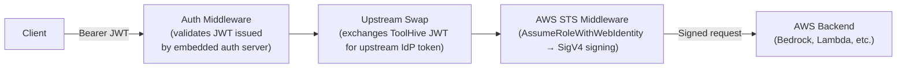

# RFC-00XX: Support Embedded Auth Server alongside AWS STS token exchange

- **Status**: Draft
- **Author(s)**: @tgrunnagle
- **Created**: 2026-03-06
- **Last Updated**: 2026-03-06
- **Target Repository**: toolhive
- **Related Issues**: https://github.com/stacklok/stacklok-epics/issues/256

## Summary

Add an `awsStsConfigRef` field to `MCPServerSpec` that references an `MCPExternalAuthConfig` of `type: awsSts`, independently of `externalAuthConfigRef`. This enables the embedded authorization server (`type: embeddedAuthServer`) to be used alongside AWS STS outgoing credential signing in the same proxy runner pipeline, which is not possible today.

## Problem Statement

The ToolHive proxy runner middleware pipeline already supports two complementary authentication layers operating in sequence:

1. **Incoming auth** (`EmbeddedAuthServerConfig`): an embedded OAuth 2.0/OIDC server that authenticates MCP clients and issues signed JWTs
2. **Outgoing auth** (`AWSStsConfig`): middleware that takes those JWTs, calls AWS `AssumeRoleWithWebIdentity`, and signs outgoing backend requests with SigV4

These layers are designed to work together: the embedded auth server produces the JWT that the AWS STS middleware consumes. However, the Kubernetes operator CRD model cannot express this combination today.

The `MCPServer` resource accepts a single `externalAuthConfigRef` pointing to an `MCPExternalAuthConfig` resource, whose `type` field is strictly mutually exclusive (enforced by CEL admission rules). As a result, a user who wants to:
- Use the embedded OAuth server to authenticate MCP clients, **and**
- Forward requests to an AWS-hosted MCP backend signed with role-specific AWS credentials

...cannot configure both in the operator. They must use one or the other.

This affects any team deploying an MCP server in front of an AWS-backed service (e.g., Amazon Bedrock, AWS Lambda, internal services secured with IAM) while also wanting a proper OAuth 2.0 client authentication flow for the MCP client side.

## Goals

- Enable `embeddedAuthServer` and AWS STS request signing to be configured simultaneously on an `MCPServer`
- Keep the change backwards-compatible: existing `MCPExternalAuthConfig` resources with `type: awsSts` continue to work unchanged when referenced via `externalAuthConfigRef`
- Remain consistent with the existing `MCPExternalAuthConfig` reference pattern used throughout the operator
- Reuse existing types and conversion logic rather than introducing duplication

## Non-Goals

- General support for arbitrary combinations of incoming and outgoing auth types (e.g., `embeddedAuthServer` + `tokenExchange`)
- Changes to the CLI-mode toolhive (`thv run`) or its configuration model
- Deprecating or removing `ExternalAuthTypeAWSSts` from `MCPExternalAuthConfig`
- Introducing webhooks or admission controllers (validation remains at reconcile time, consistent with existing operator patterns)

## Proposed Solution

### High-Level Design

Add a new optional `awsStsConfigRef` field to `MCPServerSpec` that references an `MCPExternalAuthConfig` of `type: awsSts`. When set alongside `externalAuthConfigRef`, the operator generates a `RunConfig` with both `EmbeddedAuthServerConfig` and `AWSStsConfig` populated, enabling the proxy runner's middleware pipeline to apply both layers in order:



The `awsStsConfigRef` uses the same `ExternalAuthConfigRef` type as the existing `externalAuthConfigRef`, keeping the API surface consistent. The operator validates at reconcile time that the referenced resource is `type: awsSts`.

### Detailed Design

#### API Changes

**`MCPServerSpec`** gains one new optional field:

```go
// AWSStsConfigRef optionally references an MCPExternalAuthConfig of type 'awsSts'
// to configure AWS STS token exchange and SigV4 request signing for outgoing
// requests to AWS backends. When set, the proxy runner will call
// AssumeRoleWithWebIdentity using the authenticated request's JWT, then sign
// the backend request with the resulting temporary credentials.
//
// This field can be combined with externalAuthConfigRef (e.g. type: embeddedAuthServer)
// to layer AWS credential exchange on top of incoming OAuth 2.0 authentication.
//
// The referenced MCPExternalAuthConfig must exist in the same namespace as this
// MCPServer and must have type 'awsSts'.
//
// Note: awsStsConfigRef and externalAuthConfigRef must not reference the same
// MCPExternalAuthConfig resource.
//
// +optional
AWSStsConfigRef *ExternalAuthConfigRef `json:"awsStsConfigRef,omitempty"`
```

**`MCPServerStatus`** gains one new field for change detection:

```go
// AWSStsConfigHash is the hash of the referenced awsStsConfigRef spec,
// used to detect configuration changes and trigger reconciliation.
// +optional
AWSStsConfigHash string `json:"awsStsConfigHash,omitempty"`
```

#### Component Changes

**`cmd/thv-operator/pkg/controllerutil/tokenexchange.go`**

Add a new exported function that resolves an `awsStsConfigRef` reference and appends the corresponding `RunConfigBuilderOption`:

```go
// AddAWSStsConfigRefOptions resolves an AWSStsConfigRef, validates that the
// referenced MCPExternalAuthConfig is type:awsSts, and appends the corresponding
// RunConfigBuilderOption. Returns an error if the referenced resource is not
// type:awsSts or cannot be fetched.
func AddAWSStsConfigRefOptions(
    ctx context.Context,
    c client.Client,
    namespace string,
    awsStsConfigRef *mcpv1alpha1.ExternalAuthConfigRef,
    options *[]runner.RunConfigBuilderOption,
) error {
    if awsStsConfigRef == nil {
        return nil
    }
    externalAuthConfig, err := GetExternalAuthConfigByName(ctx, c, namespace, awsStsConfigRef.Name)
    if err != nil {
        return fmt.Errorf("failed to get MCPExternalAuthConfig for awsStsConfigRef: %w", err)
    }
    if externalAuthConfig.Spec.Type != mcpv1alpha1.ExternalAuthTypeAWSSts {
        return fmt.Errorf(
            "awsStsConfigRef must reference an MCPExternalAuthConfig of type %q, got %q",
            mcpv1alpha1.ExternalAuthTypeAWSSts, externalAuthConfig.Spec.Type,
        )
    }
    return addAWSStsConfig(externalAuthConfig, options)
}
```

**`cmd/thv-operator/controllers/mcpserver_runconfig.go`**

After the existing `AddExternalAuthConfigOptions` call, add:

```go
// Validate: awsStsConfigRef and externalAuthConfigRef must not be the same resource
if m.Spec.AWSStsConfigRef != nil && m.Spec.ExternalAuthConfigRef != nil &&
    m.Spec.AWSStsConfigRef.Name == m.Spec.ExternalAuthConfigRef.Name {
    return nil, fmt.Errorf(
        "awsStsConfigRef and externalAuthConfigRef must not reference the same MCPExternalAuthConfig",
    )
}

// Add AWS STS config from reference if present
if err := ctrlutil.AddAWSStsConfigRefOptions(
    ctx, r.Client, m.Namespace, m.Spec.AWSStsConfigRef, &options,
); err != nil {
    return nil, fmt.Errorf("failed to process awsStsConfigRef: %w", err)
}
```

**`cmd/thv-operator/controllers/mcpexternalauthconfig_controller.go`**

Update the `ReferencingServers` listing logic to also include `MCPServer` resources that reference the config via `awsStsConfigRef` (in addition to the existing `externalAuthConfigRef` check). When the config hash changes, the controller already annotates all referencing servers to trigger reconciliation — extending that list to cover `awsStsConfigRef` ensures changes to the STS config propagate correctly.

#### Configuration Changes

Example `MCPServer` YAML combining embedded auth server with a referenced AWS STS config:

```yaml
apiVersion: toolhive.stacklok.com/v1alpha1
kind: MCPServer
metadata:
  name: my-aws-mcp-server
spec:
  image: ghcr.io/example/mcp-server:latest
  transport: streamable-http

  # Incoming auth: embedded OAuth 2.0 server authenticates MCP clients
  externalAuthConfigRef:
    name: my-embedded-auth-server

  # Outgoing auth: sign requests to the AWS backend with role-specific credentials
  awsStsConfigRef:
    name: my-aws-sts-config
---
apiVersion: toolhive.stacklok.com/v1alpha1
kind: MCPExternalAuthConfig
metadata:
  name: my-embedded-auth-server
spec:
  type: embeddedAuthServer
  embeddedAuthServer:
    issuer: https://auth.example.com
    upstreamProviders:
      - name: corporate-oidc
        type: oidc
        oidcConfig:
          issuerURL: https://idp.example.com
          clientID: my-client-id
---
apiVersion: toolhive.stacklok.com/v1alpha1
kind: MCPExternalAuthConfig
metadata:
  name: my-aws-sts-config
spec:
  type: awsSts
  awsSts:
    region: us-east-1
    fallbackRoleArn: arn:aws:iam::123456789012:role/mcp-default-role
    roleMappings:
      - claim: admins
        roleArn: arn:aws:iam::123456789012:role/mcp-admin-role
        priority: 0
    roleClaim: groups
    sessionNameClaim: sub
    sessionDuration: 3600
```

## Security Considerations

### Threat Model

The proposed change introduces no new attack surfaces beyond what `ExternalAuthTypeAWSSts` already exposes via `MCPExternalAuthConfig`. By keeping the STS configuration in a separate `MCPExternalAuthConfig` resource, existing RBAC policies that control who can read or modify auth configurations continue to apply without change.

Potential threats remain the same as the existing STS path:
- **Role escalation**: a misconfigured `roleMappings` could grant excessive AWS permissions. Mitigated by IAM policy controls on the role itself (independent of ToolHive).
- **JWT claim manipulation**: if an attacker can forge JWT claims (e.g., `groups`), they could influence role selection. Mitigated by the embedded auth server signing keys protecting JWT integrity.

### Authentication and Authorization

- The AWS STS middleware executes **after** the auth middleware has validated the incoming JWT. The authenticated identity is always established before role selection occurs.
- Kubernetes RBAC controls who can create/modify `MCPExternalAuthConfig` resources containing IAM role ARNs, separate from who can modify the `MCPServer` resource itself.

### Data Security

- `AWSStsConfig` contains no secrets — only region, service name, IAM role ARNs, and claim field names. These are stored in the `MCPExternalAuthConfig` spec (etcd), consistent with existing usage of `type: awsSts`.
- AWS temporary credentials produced by `AssumeRoleWithWebIdentity` are used in-memory to sign a single request and are never persisted.

### Input Validation

- **Role ARN**: the existing `awssts` package validates ARN format (`arn:aws:iam::<12-digit-account>:role/<name>`).
- **Session duration**: the existing CEL rules on `MCPExternalAuthConfig.spec.awsSts` already constrain to [900, 43200] seconds.
- **Type mismatch**: the controller validates at reconcile time that `awsStsConfigRef` points to `type: awsSts`. A misconfigured reference surfaces as a condition on `MCPServerStatus`.

### Secrets Management

No new secrets are introduced. The AWS SDK uses standard credential chain resolution (IRSA / pod identity) for the initial STS call; no static credentials are required.

### Audit and Logging

- The proxy runner already logs AWS STS middleware activity (role selection, session name) at DEBUG level.
- Reconciliation errors (e.g., type mismatch, same-resource conflict) surface as conditions on `MCPServer` status, visible via `kubectl describe`.

### Mitigations

- Reconcile-time type validation prevents `awsStsConfigRef` from silently pointing to a non-STS auth config.
- Same-resource conflict detection prevents `awsStsConfigRef` and `externalAuthConfigRef` from pointing to the same `MCPExternalAuthConfig`.
- Change propagation via the `MCPExternalAuthConfig` controller ensures STS config updates are picked up by all referencing `MCPServer` resources.

## Alternatives Considered

### Alternative 1: Inline `awsSts` Field on `MCPServerSpec`

Add `AWSSts *AWSStsConfig` directly to `MCPServerSpec`, inlining the STS configuration rather than referencing a separate resource.

- **Pros**: No cross-resource watch or `AWSStsConfigHash` tracking needed; CEL validates field constraints at admission time without API calls; atomic updates with the MCPServer spec.
- **Cons**: Inconsistent with the existing `externalAuthConfigRef` pattern; cannot share one STS config across multiple `MCPServer` resources; diverges from the RBAC separation model used for other auth types (even though `AWSStsConfig` has no secrets today, inline placement changes how access control can be scoped).
- **Why not chosen**: Consistency with the existing reference pattern and RBAC separation model outweighs the controller simplicity benefit.

### Alternative 2: Allow Multiple `ExternalAuthConfigRef` Entries

Replace the single `externalAuthConfigRef` with a list, allowing one ref per conceptual layer.

- **Pros**: General solution applicable to all auth type combinations.
- **Cons**: Breaking API change to the existing field; complex validation to prevent incompatible combinations; significant controller refactoring.
- **Why not chosen**: Disproportionate scope for the specific use case.

### Alternative 3: Composite Type in `MCPExternalAuthConfig`

Add a new `type: embeddedAuthServerWithAwsSts` or allow optional `awsStsConfig` alongside `embeddedAuthServerConfig` in the same `MCPExternalAuthConfig` resource.

- **Pros**: Single resource to manage for the combined configuration.
- **Cons**: Changes the fundamental type model of `MCPExternalAuthConfig` (breaking its "one type, one config" invariant); conflates incoming and outgoing auth concerns.
- **Why not chosen**: Violates the design invariant of `MCPExternalAuthConfig` and makes the resource semantics harder to reason about.

## Compatibility

### Backward Compatibility

This change is fully backwards-compatible:
- The new `awsStsConfigRef` field on `MCPServerSpec` is optional (`omitempty`). Existing `MCPServer` resources are unaffected.
- The new `awsStsConfigHash` field on `MCPServerStatus` is optional. No existing status consumers are broken.
- Existing `MCPExternalAuthConfig` resources with `type: awsSts` referenced via `externalAuthConfigRef` continue to work unchanged. No deprecation is introduced.
- No changes to the `MCPExternalAuthConfig` CRD or its CEL validation rules.

### Forward Compatibility

The separate-ref approach keeps `awsStsConfigRef` as a distinct named field. If other outgoing auth types need the same treatment in the future, the same pattern can be applied (e.g., a hypothetical `tokenExchangeConfigRef`).

## Implementation Plan

### Phase 1: CRD, Controller Changes, and Unit Tests

- Add `AWSStsConfigRef *ExternalAuthConfigRef` to `MCPServerSpec` in `cmd/thv-operator/api/v1alpha1/mcpserver_types.go`
- Add `AWSStsConfigHash string` to `MCPServerStatus` in the same file
- Add `AWSStsConfigRef *ExternalAuthConfigRef` to `MCPRemoteProxySpec` in `cmd/thv-operator/api/v1alpha1/mcpremoteproxy_types.go`
- Add `AWSStsConfigHash string` to `MCPRemoteProxyStatus` in the same file
- Add `AddAWSStsConfigRefOptions()` to `cmd/thv-operator/pkg/controllerutil/tokenexchange.go`
- Update `cmd/thv-operator/controllers/mcpserver_runconfig.go` to resolve `awsStsConfigRef`, add same-resource conflict validation, and update `AWSStsConfigHash` in status
- Update `cmd/thv-operator/controllers/mcpremoteproxy_runconfig.go` with the same `awsStsConfigRef` resolution logic
- Update `cmd/thv-operator/controllers/mcpexternalauthconfig_controller.go` to include `awsStsConfigRef` in `ReferencingServers` tracking and reconciliation-trigger annotations for both `MCPServer` and `MCPRemoteProxy`
- Run `task gen` to regenerate CRD YAML and deepcopy functions
- Unit tests for `AddAWSStsConfigRefOptions` (type validation, nil ref, error paths) in `cmd/thv-operator/pkg/controllerutil/`
- Unit tests for the same-resource conflict validation path in `mcpserver_runconfig.go` and `mcpremoteproxy_runconfig.go`
- Unit tests for the updated `ReferencingServers` listing logic in the MCPExternalAuthConfig controller

### Phase 2: E2E Testing

E2E tests following the patterns in `test/e2e/`:

- Deploy an `MCPServer` with both `externalAuthConfigRef` (type: embeddedAuthServer) and `awsStsConfigRef` (type: awsSts); verify the generated `runconfig.json` ConfigMap contains both `embedded_auth_server_config` and `aws_sts_config`
- Verify that updating the referenced `awsSts` MCPExternalAuthConfig triggers MCPServer reconciliation and the ConfigMap is updated
- Verify the conflict error condition is set on `MCPServerStatus` when `awsStsConfigRef` and `externalAuthConfigRef` point to the same resource
- Verify the type-mismatch error condition is set when `awsStsConfigRef` points to a non-`awsSts` MCPExternalAuthConfig

### Phase 3: Documentation

- Update `docs/arch/09-operator-architecture.md` to describe the new field and its relationship to `externalAuthConfigRef`
- Update operator CRD reference documentation
- Update the corresponding documentation in the `stacklok/docs-website` repository to reflect the new `awsStsConfigRef` field and the combined embedded auth server + AWS STS configuration pattern

### Dependencies

None. The proxy runner's `RunConfig` already supports both `EmbeddedAuthServerConfig` and `AWSStsConfig` simultaneously; no changes to `pkg/` are required.

## Testing Strategy

- **Unit tests**: `AddAWSStsConfigRefOptions`, same-resource conflict validation, `ReferencingServers` listing logic update (all in Phase 1)
- **E2E tests**: end-to-end verification of the combined configuration using the test patterns in `test/e2e/` (Phase 2)
- **Security tests**: type-mismatch and same-resource conflict error conditions on `MCPServerStatus`

## Documentation

- `docs/arch/09-operator-architecture.md`: describe the `spec.awsStsConfigRef` field and its role in the auth pipeline
- Operator CRD reference (auto-generated): regenerated via `task gen` + `task docs`
- `stacklok/docs-website`: update operator authentication documentation to cover the combined embedded auth server + AWS STS configuration pattern

## References

- [AWS STS AssumeRoleWithWebIdentity](https://docs.aws.amazon.com/STS/latest/APIReference/API_AssumeRoleWithWebIdentity.html)
- [AWS SigV4 Signing](https://docs.aws.amazon.com/general/latest/gr/signature-version-4.html)
- [RFC 7523 — JWT Profile for OAuth 2.0 Client Authentication](https://datatracker.ietf.org/doc/html/rfc7523)
- [ToolHive proxy runner middleware pipeline](../../pkg/runner/middleware.go)
- [MCPExternalAuthConfig type definitions](../../cmd/thv-operator/api/v1alpha1/mcpexternalauthconfig_types.go)

---

## RFC Lifecycle

<!-- This section is maintained by RFC reviewers -->

### Review History

| Date | Reviewer | Decision | Notes |
|------|----------|----------|-------|
| 2026-03-06 | TBD | Under Review | Initial submission |

### Implementation Tracking

| Repository | PR | Status |
|------------|-----|--------|
| toolhive | TBD | Pending |
