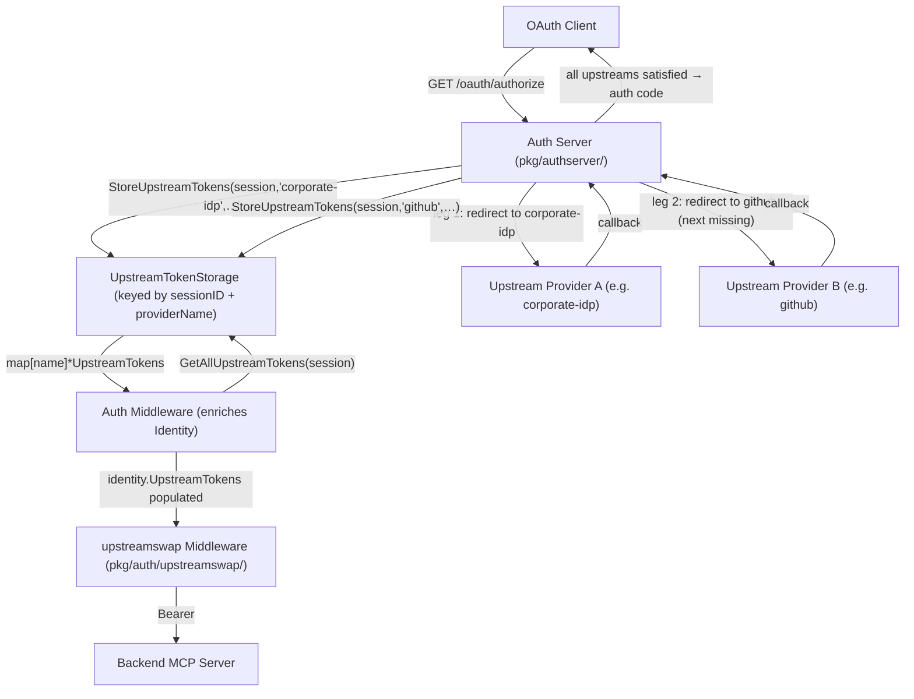

# RFC-00XX: Multi-Upstream IDP Support in the Embedded Auth Server

- **Status**: Draft
- **Author(s)**: tgrunnagle
- **Created**: 2026-03-09
- **Last Updated**: 2026-03-09
- **Target Repository**: toolhive
- **Related Issues**: https://github.com/stacklok/stacklok-epics/issues/251

## Summary

The embedded OAuth authorization server (`pkg/authserver/`) currently rejects configuration with more than one upstream Identity Provider (IDP). This RFC proposes lifting that restriction by adding a `providerName` dimension to the storage layer and introducing a sequential authorization chain: when a client initiates an authorization flow, the auth server drives the user through each configured upstream IDP in turn, accumulating tokens for all providers before issuing the final authorization code. The resulting tokens are eagerly loaded into the `Identity` struct at the auth middleware layer so downstream components receive them as explicit struct fields.

## Problem Statement

### Current Limitation

The auth server hard-rejects multiple upstream providers at both the config validation layer (`pkg/authserver/config.go`) and the CRD validation layer (`cmd/thv-operator/api/v1alpha1/mcpexternalauthconfig_types.go`):

```go
if len(c.Upstreams) > 1 {
    return fmt.Errorf("multiple upstreams not yet supported (found %d)", len(c.Upstreams))
}
```

The storage interface (`UpstreamTokenStorage`) stores tokens by session ID alone, with no provider dimension — so even if the guard were removed, two providers would overwrite each other's tokens:

```go
// Current interface — no provider name
StoreUpstreamTokens(ctx context.Context, sessionID string, tokens *UpstreamTokens) error
GetUpstreamTokens(ctx context.Context, sessionID string) (*UpstreamTokens, error)
```

The handler (`pkg/authserver/server/handlers/handler.go`) holds a single `upstream` field and has no routing logic to select between providers.

### Who Is Affected

- **vMCP deployments**: The Virtual MCP Server aggregates backends from multiple upstream sources. These backends may require different upstream credentials (e.g., a corporate SSO token for internal services and a GitHub token for public APIs). Without multi-upstream support, the auth server cannot acquire and store independent tokens per provider.
- **Proxy runner deployments**: The `UpstreamTokenStorage` interface change (adding `providerName`) affects proxy runner deployments, but multi-upstream support in the proxy runner is explicitly out of scope for this RFC. The proxy runner continues to enforce exactly one upstream provider per server instance; only the storage call sites need updating to pass the single configured provider name.

### Why Worth Solving

Multi-upstream IDP support is a prerequisite for the full vMCP auth story. Without it, backends requiring credentials from different IDPs cannot be served by a single auth server instance, forcing users to run multiple embedded auth servers — which is operationally complex and defeats the purpose of the embedded AS.

## Goals

- Enable a single auth server instance to be configured with multiple upstream OAuth2/OIDC providers simultaneously.
- Extend the `UpstreamTokenStorage` interface with a `providerName` parameter on `Store` and `Get`, and a new `GetAllUpstreamTokens` bulk-read method.
- Drive a sequential authorization chain through all configured upstreams during a single `/oauth/authorize` flow, so that all required upstream tokens are acquired before the final authorization code is issued to the client.
- Preserve full backward compatibility for single-upstream deployments (which continue to work unchanged; the chain has a single leg).
- Eagerly load all upstream tokens for a session into `Identity.UpstreamTokens` at the auth middleware layer so outgoing auth strategies and the `upstreamswap` middleware receive tokens as explicit struct fields — no interface indirection, no context extraction.
- Update both in-memory and Redis storage backends.

## Non-Goals

- Dynamic upstream IDP registration at runtime (all upstreams must be specified in static configuration at server startup).
- User account linking across providers (a user authenticating via `"github"` and `"corporate-idp"` may get separate `User` records; merging them is deferred).
- Distributed locking for concurrent token refresh operations (refresh races are acknowledged but deferred).
- Full migration tooling for Redis deployments that have existing tokens stored under the old key pattern.
- Step-up authentication signaling mechanics.
- Transparent token refresh or re-authorization during middleware enrichment. Expired tokens are included in `Identity.UpstreamTokens` as-is; backends that receive an expired token will fail with their own error. Token refresh and re-authorization flows are deferred to a separate RFC.
- **Multi-upstream IDP support in the proxy runner.** The CLI proxy runner (`thv proxy`) and the corresponding Kubernetes workload types (`MCPServer`, `MCPRemoteProxy`) each continue to support exactly one upstream provider per server instance. Extending those to multiple upstreams is a separate future effort.

## Proposed Solution

### High-Level Design



The auth server supports one or more named upstream providers configured in a fixed order. When a client initiates an authorization flow, the authorize endpoint generates a new `SessionID`, determines the first configured upstream, and redirects the user's browser there. Each upstream callback stores the tokens for that provider and then determines the **next missing upstream** by calling `GetAllUpstreamTokens` and comparing the stored provider keys against the configured `upstreamOrder`. If more upstreams remain, the callback immediately redirects the user to the next upstream — no client involvement. Once all upstreams are satisfied, the callback issues the fosite authorization code and redirects to the client's `redirect_uri`. The client makes exactly one `GET /oauth/authorize` request and receives exactly one authorization code; the intermediate upstream redirects are transparent.

On subsequent MCP requests, the auth middleware validates the TH-JWT, extracts the TSID, calls `GetAllUpstreamTokens` in a single bulk read, and populates `Identity.UpstreamTokens`. Downstream components (outgoing auth strategies, `upstreamswap` middleware) read from this map directly — no context extraction, no hidden storage calls, no interface indirection.

### Detailed Design

#### Component Changes

**Storage layer (`pkg/authserver/storage/`)**: The `UpstreamTokenStorage` interface gains a `providerName` parameter on `Store` and `Get`. A new `GetAllUpstreamTokens` method performs a bulk read of all provider tokens for a session. `Delete` remains session-scoped (wipes all providers). Both in-memory and Redis backends are updated.

**Handler layer (`pkg/authserver/server/handlers/`)**: The `Handler` struct replaces its single `upstream` field with `upstreams map[string]upstream.OAuth2Provider` (for lookup by name) plus `upstreamOrder []string` (the configured order, which determines chain sequence). The authorize handler starts the chain by redirecting to `upstreamOrder[0]`. Each callback leg determines the next missing upstream via `GetAllUpstreamTokens` and either redirects to it or issues the authorization code.

**`PendingAuthorization` (`pkg/authserver/storage/types.go`)**: Gains two new fields: `UpstreamProviderName` (which upstream is being handled in this leg) and `SessionID` (the TSID being accumulated across all legs, generated at the start of the chain and threaded through every subsequent `PendingAuthorization`). Both are preserved across all defensive copies in both memory and Redis storage.

**`Identity` struct**: Gains `UpstreamTokens map[string]string` (providerName → access token). The auth middleware populates this map after JWT validation using `GetAllUpstreamTokens`. Expired tokens are included; token refresh is deferred to a later RFC.

**Auth middleware**: After validating the TH-JWT and constructing the `Identity`, the middleware checks for a `tsid` claim. If present, it calls `GetAllUpstreamTokens(ctx, tsid)` and populates `identity.UpstreamTokens` with the access token for each provider entry, including expired ones.

**`upstreamswap` middleware (`pkg/auth/upstreamswap/middleware.go`)**: Gains a `ProviderName` config field. Removes the `StorageGetter` dependency entirely — instead of calling storage at request time, reads `identity.UpstreamTokens[cfg.ProviderName]` from the pre-enriched `Identity`.

**Server interface (`pkg/authserver/server.go`)**: No change. Tokens flow through `Identity`, not through an injected interface; no external caller needs access to the upstream provider map in this RFC.

**Config (`pkg/authserver/config.go`)**: Removes the core library's `len > 1` rejection so the authserver library itself supports multiple upstreams. Adds name uniqueness and explicit-name requirements for multi-upstream configs.

**Proxy runner config validation (`pkg/runner/`)**: Adds an explicit check that rejects more than one upstream provider when building a proxy runner, preserving the current single-upstream invariant at the consumer layer rather than the library layer.

**Operator admission webhooks (`MCPServer`, `MCPRemoteProxy`)**: Retain their `len > 1` upstream rejection. The restriction migrates from the `MCPExternalAuthConfig` CRD-level `validateUpstreamProviders` function to the workload-specific webhooks, so that `VirtualMCPServer` can reference an auth config with multiple upstreams while `MCPServer` and `MCPRemoteProxy` cannot.

#### API Changes

**`UpstreamTokenStorage` interface** — adds `providerName` to store and get; adds bulk-read method:

```go
// pkg/authserver/storage/types.go

type UpstreamTokenStorage interface {
    // StoreUpstreamTokens stores tokens for a specific session and provider.
    StoreUpstreamTokens(ctx context.Context, sessionID, providerName string, tokens *UpstreamTokens) error

    // GetUpstreamTokens retrieves tokens for a specific session and provider.
    // Returns ErrNotFound if either the session or the provider entry is absent.
    GetUpstreamTokens(ctx context.Context, sessionID, providerName string) (*UpstreamTokens, error)

    // GetAllUpstreamTokens retrieves all provider tokens for a session in a single
    // bulk read. Returns an empty map (not an error) if the session has no upstream tokens.
    // Used by the auth middleware to populate Identity.UpstreamTokens.
    GetAllUpstreamTokens(ctx context.Context, sessionID string) (map[string]*UpstreamTokens, error)

    // DeleteUpstreamTokens removes all upstream tokens for a session (all providers).
    DeleteUpstreamTokens(ctx context.Context, sessionID string) error
}
```

**`Identity` struct** — new field for eagerly-loaded upstream tokens:

```go
// pkg/auth/authtypes/identity.go (or equivalent)

type Identity struct {
    // ... existing fields unchanged ...

    // UpstreamTokens contains upstream access tokens for the session, keyed by
    // provider name. Populated by the auth middleware after JWT validation.
    // Expired tokens are included as-is; token refresh is deferred to a later RFC.
    // Empty for anonymous requests or when no upstream tokens have been acquired.
    UpstreamTokens map[string]string // providerName → access token
}
```

**`PendingAuthorization` struct** — two new fields:

```go
type PendingAuthorization struct {
    // ... existing fields unchanged ...

    // UpstreamProviderName identifies which upstream is being authenticated in this leg.
    UpstreamProviderName string

    // SessionID is the TSID for the authorization session being built across all legs
    // of the sequential chain. Generated by the authorize handler at the start of the
    // chain and copied into every subsequent PendingAuthorization until all upstreams
    // are satisfied and the auth code is issued.
    // This field is set entirely server-side and must never be accepted from client input.
    SessionID string
}
```

**Auth middleware enrichment** — enriches Identity after JWT validation:

```go
// After validating the TH-JWT and building the Identity from claims:
if tsid, ok := identity.Claims[session.TokenSessionIDClaimKey].(string); ok && tsid != "" {
    allTokens, err := stor.GetAllUpstreamTokens(ctx, tsid)
    if err != nil {
        // Log at WARN and continue — enrichment failure is non-fatal.
        // The request proceeds with an empty UpstreamTokens map; backends
        // that require an upstream token will fail with their own error.
        slog.WarnContext(ctx, "failed to load upstream tokens for session", "err", err)
    } else {
        identity.UpstreamTokens = make(map[string]string, len(allTokens))
        for providerName, tokens := range allTokens {
            // Include expired tokens as-is. Token refresh and re-authorization
            // are deferred to a separate RFC; for now, pass the token through
            // and let the backend report the expiry error.
            identity.UpstreamTokens[providerName] = tokens.AccessToken
        }
    }
}
```

**`Handler` struct and constructor** — replaces single `upstream` with map + ordered slice:

```go
// pkg/authserver/server/handlers/handler.go

type Handler struct {
    provider       fosite.OAuth2Provider
    config         *server.AuthorizationServerConfig
    storage        storage.Storage
    upstreams      map[string]upstream.OAuth2Provider // lookup by name
    upstreamOrder  []string                           // config order → chain sequence
    userResolver   *UserResolver
}

func NewHandler(
    provider fosite.OAuth2Provider,
    config *server.AuthorizationServerConfig,
    storage storage.Storage,
    upstreams map[string]upstream.OAuth2Provider,
    upstreamOrder []string,
    userResolver *UserResolver,
) *Handler
```

**`upstreamswap.Config`** — adds `ProviderName`; removes `StorageGetter`; the middleware reads from `Identity` instead of calling storage:

```go
// pkg/auth/upstreamswap/middleware.go

// Config no longer requires a StorageGetter injection — storage access moves to
// the auth middleware enrichment layer.
type Config struct {
    HeaderStrategy   string `json:"header_strategy,omitempty"`
    CustomHeaderName string `json:"custom_header_name,omitempty"`
    ProviderName     string `json:"provider_name" yaml:"provider_name"`
}

// Middleware handler — reads from pre-enriched Identity
identity := auth.IdentityFromContext(r.Context())
token, ok := identity.UpstreamTokens[cfg.ProviderName]
if !ok {
    // Token not present for this provider.
    http.Error(w, "upstream token unavailable", http.StatusUnauthorized)
    return
}
// inject token into outgoing request header
```

**`addUpstreamSwapMiddleware` (`pkg/runner/middleware.go`)** — derives `ProviderName` at construction time:

```go
// UpstreamRunConfig.Name may be empty when the user omits it in YAML.
// Apply the same defaulting that validateUpstreams uses.
providerName := config.EmbeddedAuthServerConfig.Upstreams[0].Name
if providerName == "" {
    providerName = "default"
}
upstreamSwapConfig.ProviderName = providerName
```

#### Configuration Changes

Multi-upstream YAML configuration example:

```yaml
# authserver RunConfig with multiple upstreams
issuer: "https://auth.example.com"
upstreams:
  - name: "corporate-idp"   # front-door provider (first = default)
    type: oidc
    issuer: "https://idp.example.com"
    client_id_env: "CORP_IDP_CLIENT_ID"
    client_secret_env: "CORP_IDP_CLIENT_SECRET"
  - name: "github"
    type: oauth2
    authorization_url: "https://github.com/login/oauth/authorize"
    token_url: "https://github.com/login/oauth/access_token"
    client_id_env: "GITHUB_CLIENT_ID"
    client_secret_env: "GITHUB_CLIENT_SECRET"
scopes_supported:
  - openid
  - profile
  - email
  - offline_access
```

Single-upstream configuration is unchanged; the provider name defaults to `"default"`:

```yaml
issuer: "https://auth.example.com"
upstreams:
  - name: "default"   # or omit name — defaults to "default"
    type: oauth2
    ...
```

Multi-upstream name rules enforced by `validateUpstreams`:

- All provider names must be unique within a config.
- When `len(upstreams) > 1`, each name must be explicitly set and must not be `"default"`.
- For `len(upstreams) == 1`, omitting the name is permitted (defaults to `"default"`).

#### Data Model Changes

**In-memory storage** — nested map replaces flat map:

```go
// Before: sessionID → entry
upstreamTokens map[string]*timedEntry[*UpstreamTokens]

// After: sessionID → providerName → entry
upstreamTokens map[string]map[string]*timedEntry[*UpstreamTokens]
```

The nested map supports O(1) session deletion (deleting the outer key removes all providers for that session). `GetAllUpstreamTokens` iterates the inner map for the given session ID and returns all entries as a `map[string]*UpstreamTokens`.

**Redis storage** — extended key pattern:

```
Before: {prefix}upstream:{sessionID}
After:  {prefix}upstream:{sessionID}:{providerName}
```

A new helper function:

```go
func redisUpstreamKey(prefix, sessionID, providerName string) string {
    return fmt.Sprintf("%s%s:%s:%s", prefix, KeyTypeUpstream, sessionID, providerName)
}
```

A session index SET at `{prefix}upstream:idx:{sessionID}` tracks which provider names exist for a session. This serves two purposes:

1. **`DeleteUpstreamTokens`**: SMEMBERS the index, deletes all referenced keys and the index itself in a single Lua script for atomicity.
2. **`GetAllUpstreamTokens`**: SMEMBERS the index to get all provider names for the session, then MGET all token keys in one round-trip.

```
SMEMBERS {prefix}upstream:idx:{sessionID}
→ ["corporate-idp", "github"]

MGET {prefix}upstream:{sessionID}:corporate-idp
     {prefix}upstream:{sessionID}:github
→ [<serialized UpstreamTokens>, <serialized UpstreamTokens>]
```

`StoreUpstreamTokens` adds the provider name to the session index (SADD) and writes the token key atomically via a Lua script to prevent partial writes (token stored but index not updated).

The user reverse index (`user:upstream` SET) stores `{sessionID}:{providerName}` pairs instead of bare `{sessionID}`.

#### Sequential Authorization Chain

All configured upstreams are authenticated in one uninterrupted chain during MCP session initialization. The client makes a single standard OAuth2 authorization request; the auth server drives all upstream redirects transparently.

**Authorize handler** (first leg only):

```go
func (h *Handler) handleAuthorize(w http.ResponseWriter, r *http.Request) {
    ar, err := h.provider.NewAuthorizeRequest(ctx, r)
    // ... validate client, PKCE, etc. ...

    sessionID := rand.Text() // new TSID for this chain
    firstUpstream := h.upstreamOrder[0]

    pending := &storage.PendingAuthorization{
        ClientID:             ar.GetClient().GetID(),
        RedirectURI:          ar.GetRedirectURI().String(),
        State:                ar.GetState(),
        PKCEChallenge:        /* from ar */,
        Scopes:               ar.GetRequestedScopes(),
        InternalState:        rand.Text(),
        UpstreamPKCEVerifier: generateVerifier(),
        UpstreamNonce:        generateNonce(),
        UpstreamProviderName: firstUpstream,
        SessionID:            sessionID,
    }
    h.storage.StorePendingAuthorization(ctx, pending.InternalState, pending)

    upstreamAuthURL := h.upstreams[firstUpstream].BuildAuthURL(pending)
    http.Redirect(w, r, upstreamAuthURL, http.StatusFound)
}
```

**Callback handler** (every leg):

```go
func (h *Handler) handleCallback(w http.ResponseWriter, r *http.Request) {
    pending, _ := h.storage.LoadPendingAuthorization(ctx, r.URL.Query().Get("state"))
    h.storage.DeletePendingAuthorization(ctx, pending.InternalState)

    provider := h.upstreams[pending.UpstreamProviderName]
    tokens, _ := provider.ExchangeCode(ctx, r.URL.Query().Get("code"), pending)
    h.storage.StoreUpstreamTokens(ctx, pending.SessionID, pending.UpstreamProviderName, tokens)

    // Resolve or create the user from this upstream's identity
    h.userResolver.ResolveUser(ctx, pending.UpstreamProviderName, tokens)

    // Determine the next missing upstream
    nextUpstream := h.nextMissingUpstream(ctx, pending.SessionID)

    if nextUpstream != "" {
        // More upstreams needed — create the next leg
        nextPending := &storage.PendingAuthorization{
            // Copy original client request fields
            ClientID:             pending.ClientID,
            RedirectURI:          pending.RedirectURI,
            State:                pending.State,
            PKCEChallenge:        pending.PKCEChallenge,
            Scopes:               pending.Scopes,
            // New per-leg fields
            InternalState:        rand.Text(),
            UpstreamPKCEVerifier: generateVerifier(),
            UpstreamNonce:        generateNonce(),
            UpstreamProviderName: nextUpstream,
            SessionID:            pending.SessionID, // same session throughout
        }
        h.storage.StorePendingAuthorization(ctx, nextPending.InternalState, nextPending)
        upstreamAuthURL := h.upstreams[nextUpstream].BuildAuthURL(nextPending)
        http.Redirect(w, r, upstreamAuthURL, http.StatusFound)
        return
    }

    // All upstreams satisfied — issue the authorization code
    // Reconstruct the fosite authorize request from stored pending data,
    // embed SessionID as the tsid claim, and write the auth code response.
    h.issueAuthorizationCode(ctx, w, r, pending)
}
```

**Next-upstream determination** uses `GetAllUpstreamTokens` to find the first configured upstream not yet represented in storage:

```go
func (h *Handler) nextMissingUpstream(ctx context.Context, sessionID string) string {
    stored, err := h.storage.GetAllUpstreamTokens(ctx, sessionID)
    if err != nil {
        return h.upstreamOrder[0] // on error, restart from the beginning
    }
    for _, name := range h.upstreamOrder {
        if _, exists := stored[name]; !exists {
            return name
        }
    }
    return "" // all satisfied
}
```

**No propagation delay in single-replica deployments**: `StoreUpstreamTokens` and `nextMissingUpstream` execute sequentially in the same goroutine within `handleCallback`. The write completes (including awaiting the Redis ACK) before the read begins, so the just-stored token is always visible to `GetAllUpstreamTokens`. In multi-replica Redis deployments where reads can be served from a replica, replication lag could cause `GetAllUpstreamTokens` to miss the token that was just written, causing the chain to restart that leg unnecessarily. The mitigation is to ensure the Redis client used in `handleCallback` routes reads to the primary — standard go-redis configurations do this by default unless `ReadOnly` routing is explicitly enabled. This constraint is consistent with the multi-replica limitation documented in the review concerns (RFC 47 compatibility).

**CSRF and state integrity**: Each leg generates a fresh `InternalState` for the upstream `state` parameter, providing independent CSRF protection per redirect. The original client's `State` parameter is preserved in every `PendingAuthorization` and returned to the client in the final redirect to `redirect_uri`.

**Single-upstream compatibility**: With one upstream in `upstreamOrder`, the authorize handler creates one `PendingAuthorization`, the callback stores one token set, `nextMissingUpstream` returns `""`, and the auth code is issued — identical to the current single-upstream flow.

## Security Considerations

### Threat Model

**SessionID forgery**: A malicious client could attempt to supply a `SessionID` to the callback, causing it to store tokens under an attacker-chosen TSID. Mitigation: `SessionID` is generated server-side by the authorize handler and stored only in the server-side `PendingAuthorization`. The client never sees or touches it; the only client-visible state parameter is the opaque `InternalState` used for CSRF. The `SessionID` is never accepted from any client-supplied request field.

**CSRF across legs**: Each leg of the chain uses a fresh `InternalState` as the upstream `state` parameter, preventing a malicious upstream from injecting a code for a different leg. After each callback, the used `PendingAuthorization` is deleted before any new one is created, so a replayed callback state cannot be reused.

**Cross-session token access**: Because upstream tokens are loaded into `Identity` by the auth middleware immediately after JWT validation, the TSID used for the `GetAllUpstreamTokens` call is always the one the server issued — a client cannot supply a different TSID.

**Token logging**: Upstream access and refresh tokens must not appear in logs. Mitigation: the auth middleware, storage implementations, and `upstreamswap` middleware are all prohibited from logging token values. Error messages and structured log fields are limited to provider names and generic status descriptions.

### Authentication and Authorization

The multi-upstream change does not alter the auth server's own authentication model — clients still authenticate using the same fosite-backed OAuth2/OIDC flows. The sequential chain is entirely server-driven; the client makes a single standard authorization request and the server handles all upstream redirects transparently. Clients have no ability to select, skip, or reorder upstreams.

### Data Security

Upstream tokens (access tokens, refresh tokens, ID tokens) are sensitive credentials. They are stored in-memory or in Redis (encrypted at rest in production deployments). Token values are never included in log output, error messages, or HTTP responses. The session index SET (`{prefix}upstream:idx:{sessionID}`) contains only provider names (not token values). Redis storage should be configured with TLS and authentication.

The `Identity.UpstreamTokens` map holds access token strings in memory for the duration of the request. This is the same scope as other sensitive Identity fields (e.g., the raw JWT string). No special handling beyond existing request lifecycle practices is required.

### Input Validation

- `providerName` in `StoreUpstreamTokens` and `GetUpstreamTokens` must be non-empty (validated at storage entry points).
- `UpstreamProviderName` in the callback is sourced from the server-stored `PendingAuthorization`, not from any client-supplied parameter.
- `SessionID` in `PendingAuthorization` is generated server-side and never accepted from client input.
- Config validation requires unique, non-empty provider names in multi-upstream configurations.

### Secrets Management

OAuth client credentials for upstream providers are referenced by environment variable name in `UpstreamRunConfig` (not embedded in config files), consistent with ToolHive's existing secrets model. No new secret storage mechanisms are introduced.

### Audit and Logging

- The provider name selected during authorization is recorded in `PendingAuthorization.UpstreamProviderName` and carried through to the callback, creating an audit trail of which upstream was used for each session.
- The callback records `providerName` (not the `Type()` string `"oauth2"`) in `ProviderIdentity` records, enabling per-provider audit queries.

### Mitigations Summary

| Threat | Mitigation |
|--------|-----------|
| SessionID forgery | SessionID generated server-side; never accepted from client input |
| CSRF across chain legs | Fresh InternalState per leg; used PendingAuthorization deleted before next leg created |
| Cross-session token access | TSID from validated JWT; client cannot supply a different TSID |
| Token value exposure | No token values in logs or error messages; structural slog calls only |
| Redis partial writes | Lua scripts for atomic key + index updates |

## Alternatives Considered

### Alternative 1: Lazy `UpstreamTokenSource` Adapter (Context-Coupled)

Rather than eagerly loading all upstream tokens at middleware time, provide an `UpstreamTokenSource` interface whose adapter extracts the TSID from the request context at call time and fetches only the requested provider's token from storage.

```go
type UpstreamTokenSource interface {
    GetToken(ctx context.Context, providerName string) (string, error)
}
```

- **Pros**: Lazy loading — only fetches tokens for providers that are actually needed by a given request. Avoids loading tokens for unused providers on every request.
- **Cons**: Reintroduces implicit context coupling into a layer that the v2 session management system has been intentionally designed to avoid. The TSID is extracted from context inside `GetToken`, making the dependency graph invisible to callers and harder to test (context setup required). Hidden storage calls deep in the call stack are a recurring source of production surprises. The design review (`docs/vmcp-authserver-design/review-concerns.md` §2) explicitly identified this pattern as a concern.
- **Why not chosen**: The number of upstream providers per deployment is small (typically 1–3). Loading all tokens in one bulk `GetAllUpstreamTokens` call at middleware time costs one extra Redis round-trip per request but removes the entire context-coupling problem. Explicit parameter passing through `Identity.UpstreamTokens` is consistent with the rest of the system and easier to reason about, test, and trace.

### Alternative 2: Scope-Based Provider Selection (Client-Driven)

Rather than a server-driven sequential chain, the authorize endpoint selects a single upstream per flow based on an `upstream:<name>` scope in the client's request. The client is responsible for initiating multiple authorization flows — one per provider — to build up a complete token set, typically in response to step-up signaling from the vMCP server.

```go
func (h *Handler) selectUpstream(scopes fosite.Arguments) string {
    for _, scope := range scopes {
        if name, ok := strings.CutPrefix(scope, "upstream:"); ok {
            return name
        }
    }
    return h.defaultUpstream
}
```

A custom `fosite.ScopeStrategy` would auto-allow `upstream:` prefixed scopes without per-client registration. The authorize handler validates the named provider exists in `h.upstreams` before proceeding.

- **Pros**: Fine-grained client control — a client can acquire only the specific provider's token it needs. Natural fit for step-up auth where a single backend signals that exactly one additional token is required. Simpler server-side handler (one upstream per flow, no state threading across callbacks).
- **Cons**: The client must be aware of which `upstream:<name>` scope to request and when. This information must come from application-layer signaling (the vMCP server), not from OIDC discovery. Requires the client to make multiple `/oauth/authorize` round-trips to satisfy all providers before the MCP session is usable, which is a poor initialization experience. Clients cannot be prevented from acquiring tokens in an arbitrary order (they may skip required providers).
- **Why not chosen**: The requirement is that all upstream tokens are acquired as a precondition for MCP session initialization. Client-driven selection cannot enforce this — a client can always omit one or more `upstream:` scopes. The server-driven sequential chain guarantees completeness regardless of client behavior.

## Compatibility

### Backward Compatibility

**Single-upstream deployments** are fully backward compatible. The provider name defaults to `"default"` at config validation time, and the `upstreamswap` middleware's `ProviderName` is populated from the auth server config transparently. No configuration changes are required for existing single-upstream deployments. The `GetAllUpstreamTokens` call in the auth middleware returns a single-entry map for single-upstream sessions, and `identity.UpstreamTokens["default"]` contains the access token as before.

**Multi-upstream Redis deployments** (if any exist before this change ships): tokens stored under the old key pattern (`{prefix}upstream:{sessionID}`) will not be found by lookups using the new pattern (`{prefix}upstream:{sessionID}:{providerName}`). Existing sessions will require re-authentication after upgrade. This is documented as a breaking change. See the Fallback Read alternative above for a migration path if needed.

**`ProviderIdentity` records** stored with `providerID = "oauth2"` (the previous default from `upstream.Type()`) will not match lookups for the configured provider name. Affected users will be treated as new users and get a fresh `User` record. For memory storage this is a non-issue (ephemeral). For Redis, the same re-authentication caveat applies.

### Forward Compatibility

When token refresh is added, the auth middleware enrichment function is the natural place to attempt it: iterate `GetAllUpstreamTokens`, call `upstream.RefreshTokens` for expired entries, update storage, and populate the access token. This does not require interface changes.

## Implementation Plan

### Phase 1: Storage Layer

- Add `providerName` parameter to `UpstreamTokenStorage` interface (`StoreUpstreamTokens`, `GetUpstreamTokens`).
- Add `GetAllUpstreamTokens(ctx, sessionID)` to `UpstreamTokenStorage`.
- Add `UpstreamProviderName` and `SessionID` to `PendingAuthorization` (replacing the previously discussed `ExistingTSID`).
- Update in-memory storage (`memory.go`) to use nested maps; implement `GetAllUpstreamTokens` as an inner map iteration.
- Update Redis storage (`redis.go`) with new key pattern, session index SET, and Lua scripts for atomic `Store` and `Delete`. Implement `GetAllUpstreamTokens` as SMEMBERS + MGET.
- Add `redisUpstreamKey` helper in `redis_keys.go`.
- Regenerate storage mocks.
- Update all existing callers of `StoreUpstreamTokens` / `GetUpstreamTokens` within `pkg/authserver/`.
- Update the memory storage cleanup loop to use `max(accessToken.ExpiresAt, refreshToken.ExpiresAt)` as the eviction time, preventing premature eviction of tokens that still have a valid refresh token.
- **Tests**: Update `memory_test.go` and `redis_test.go` for the new `providerName` parameter and multi-provider cases. Add `GetAllUpstreamTokens` unit tests (returns all providers including expired; empty map for unknown session). Add cleanup loop tests verifying that a token with an expired access token but a valid refresh token is not evicted. Update `redis_integration_test.go` for the new key pattern, session index management, and `GetAllUpstreamTokens` SMEMBERS+MGET behavior. Regenerate `mocks/mock_storage.go`.

### Phase 2: Handler and Server Layer

- Replace single `upstream` field with `upstreams map[string]upstream.OAuth2Provider` + `upstreamOrder []string` in `Handler`.
- Update `NewHandler` signature to accept the map and ordered slice.
- Implement the sequential authorization chain in the authorize handler: generate `SessionID`, create `PendingAuthorization` for `upstreamOrder[0]`, redirect to first upstream.
- Implement `nextMissingUpstream` in the callback handler using `GetAllUpstreamTokens`.
- Update the callback handler to either redirect to the next upstream or issue the authorization code.
- Update `server_impl.go` to build the upstream map and ordered slice from config.
- **Tests**: Update `handlers_test.go` for the new `NewHandler` signature. Add authorize handler tests for `SessionID` generation and first-leg redirect. Add callback handler tests for `nextMissingUpstream` correctness, all-satisfied auth code issuance, `SessionID` threading across legs, and fresh `InternalState` per leg. Update `server_test.go` for multi-upstream server creation. Update `integration_test.go` with a full sequential chain test: authorize → leg 1 callback → leg 2 callback → auth code issued → `GetAllUpstreamTokens` returns both tokens.

### Phase 3: Config and Operator

- Remove the `len > 1` rejection in `pkg/authserver/config.go` (`validateUpstreams`).
- Add explicit-name requirement for multi-upstream configs to `validateUpstreams`.
- Remove `Config.GetUpstream()` (internal callers only; no deprecation cycle needed).
- Add a `len > 1` upstream rejection in the proxy runner's config validation (`pkg/runner/`), enforcing single-upstream for the CLI proxy runner.
- Move the `len > 1` upstream restriction from the `MCPExternalAuthConfig` CRD-level `validateUpstreamProviders` in `cmd/thv-operator/api/v1alpha1/mcpexternalauthconfig_types.go` to the admission webhooks for `MCPServer` and `MCPRemoteProxy`, so that `VirtualMCPServer` is no longer subject to the restriction.
- **Tests**: Update `config_test.go` to verify that `len > 1` is no longer rejected by the auth server config, that name uniqueness is enforced, and that the explicit-name requirement is applied. Add proxy runner config tests verifying the `len > 1` rejection is enforced there.

### Phase 4: Identity Enrichment and `upstreamswap` Middleware

- Add `UpstreamTokens map[string]string` to the `Identity` struct.
- Update the auth middleware to call `GetAllUpstreamTokens` after JWT validation and populate `Identity.UpstreamTokens`.
- Add `ProviderName` to `upstreamswap.Config`.
- Update `upstreamswap` middleware to read from `identity.UpstreamTokens[cfg.ProviderName]` instead of calling storage directly.
- Update `pkg/runner/middleware.go` (`addUpstreamSwapMiddleware`) to populate `ProviderName` from `config.EmbeddedAuthServerConfig.Upstreams[0].Name`, falling back to `"default"` when the name is empty (matching the defaulting in `validateUpstreams`). The proxy runner's single-upstream enforcement guarantees `Upstreams[0]` always exists.
- Remove the `StorageGetter` / `storageGetter` from `CreateMiddleware` and `createMiddlewareFunc`. The middleware no longer calls storage directly; all upstream token lookups move to the auth middleware enrichment step. The `runner.GetUpstreamTokenStorage()` injection point is no longer needed for `upstreamswap`.
- **Tests**: Update `pkg/auth/middleware_test.go` to verify `GetAllUpstreamTokens` is called when a `tsid` claim is present, that expired tokens are included, and that the map is empty when no `tsid` is present. Update `pkg/auth/upstreamswap/middleware_test.go` for `ProviderName` config and reads from `identity.UpstreamTokens`. Update `pkg/runner/middleware_test.go` to verify `ProviderName` derivation from `Upstreams[0].Name`, the `"default"` fallback, and that `StorageGetter` is no longer injected.

### Dependencies

None. This RFC does not depend on UC-06 (step-up auth signaling), which is now a separate future effort.

## Testing Strategy

### Unit Tests

The following test files require updates:

| Test file | Change |
|-----------|--------|
| `pkg/authserver/storage/memory_test.go` | Add `providerName` arg; add multi-provider cases (store two providers per session, retrieve each, delete session wipes both); add `GetAllUpstreamTokens` cases |
| `pkg/authserver/storage/redis_test.go` | Same as memory; verify new key pattern, session index management, and `GetAllUpstreamTokens` via SMEMBERS+MGET |
| `pkg/authserver/storage/mocks/mock_storage.go` | Regenerate via `mockgen` (interface changed) |
| `pkg/authserver/config_test.go` | Test that `len > 1` is no longer rejected; test name uniqueness; test explicit name required for multi |
| `pkg/authserver/server/handlers/helpers_test.go` | Update `testStorageState.upstreamTokens` to nested map; update mock expectations for new signatures |
| `pkg/authserver/server/handlers/authorize_test.go` | Test SessionID generation; PendingAuthorization created with `upstreamOrder[0]`; redirect to first upstream |
| `pkg/authserver/server/handlers/callback_test.go` | Test `nextMissingUpstream` returns correct next upstream; test all-satisfied path issues auth code; test `SessionID` threaded correctly across legs; test fresh `InternalState` per leg |
| `pkg/authserver/server/handlers/handlers_test.go` | Update `NewHandler` call to pass map + ordered slice |
| `pkg/authserver/server_test.go` | Multi-upstream server creation |
| `pkg/auth/middleware_test.go` (auth middleware) | Test `GetAllUpstreamTokens` called when `tsid` claim present; expired tokens included; empty map when no tsid |
| `pkg/auth/upstreamswap/middleware_test.go` | Test `ProviderName` config; reads from `identity.UpstreamTokens`; returns 401 when token absent |
| `pkg/runner/middleware_test.go` | `addUpstreamSwapMiddleware` derives `ProviderName` from `Upstreams[0].Name`; defaults to `"default"` when name is empty; `StorageGetter` no longer injected |

New unit tests:

| Package | What to test |
|---------|-------------|
| `pkg/authserver/storage/` | `GetAllUpstreamTokens`: returns all providers for session (including expired); returns empty map for unknown session |

### Integration Tests

| Test file | Change |
|-----------|--------|
| `pkg/authserver/integration_test.go` | `setupTestServer` creates upstream providers in a map + ordered slice; `StoreUpstreamTokens` calls updated; add full sequential chain test: authorize → leg 1 (corporate-idp callback) → leg 2 (github callback) → auth code issued → `GetAllUpstreamTokens` returns both tokens → `Identity.UpstreamTokens` populated correctly |
| `pkg/authserver/storage/redis_integration_test.go` | Test multi-provider store/get/delete against real Redis; verify session index management; verify `GetAllUpstreamTokens` SMEMBERS+MGET behavior; verify atomic delete |

### End-to-End Tests

Full sequential authorization chain with two upstreams configured, verifying that:
- A client calls `GET /oauth/authorize`; the server redirects to `corporate-idp`.
- After the `corporate-idp` callback, the server redirects to `github` (not to the client).
- After the `github` callback, the server issues an authorization code and redirects to the client.
- The issued JWT contains the `tsid` claim equal to the `SessionID` generated at step 1.
- A subsequent MCP request with that JWT causes the auth middleware to populate `Identity.UpstreamTokens` with both provider tokens.
- The `upstreamswap` middleware injects the correct token for the backend.
- Session deletion (`DeleteUpstreamTokens`) removes both token sets.

### Security Tests

- Verify that a replayed `state` parameter from a previous leg is rejected (used `PendingAuthorization` is deleted).
- Verify that passing a `SessionID` as a query parameter to `/oauth/authorize` has no effect (it is not read from client input).

## Documentation

- **Architecture docs**: Update `docs/arch/` to reflect multi-upstream handler and storage design, and the Identity-enrichment token flow.
- **Config reference**: Update auth server configuration documentation to describe the `upstreams` array, naming rules, and sequential chain behavior.
- **Migration guide**: Document the Redis key pattern breaking change and re-authentication requirement for upgraded deployments.
- **API docs**: Update `Identity.UpstreamTokens` field documentation.
- **`upstreamswap` middleware docs**: Document that the middleware now reads from `Identity.UpstreamTokens` rather than calling storage directly, and that auth middleware enrichment must run before `upstreamswap`.

## Resolved Design Decisions

1. **`GetAllUpstreamTokens` expiry filtering**: Expired tokens are included as-is; the auth middleware passes them through to callers. The eviction/cleanup loop (memory TTL, Redis TTL) prevents indefinite storage growth. Token refresh and re-authorization are deferred to a separate RFC; the auth middleware is the natural integration point when that work begins.

2. **Chain failure handling**: Abort the chain immediately and return an OAuth 2.0 error response to the client. The client can retry. Skipping a failing upstream risks issuing a session with incomplete upstream coverage.

3. **Cleanup loop eviction TTL**: Use `max(accessToken.ExpiresAt, refreshToken.ExpiresAt)` as the eviction time in the memory storage cleanup loop. Prevents premature eviction of tokens that still have a valid refresh token. Implemented in Phase 1.

4. **`ProviderIdentity` migration for `providerID = "oauth2"`**: Treated as a documented breaking change. No fallback lookup for the legacy `"oauth2"` key is added. Users upgrading from a deployment that used the single unnamed upstream must re-authenticate after upgrade. Documented in the migration guide.

5. **`Config.GetUpstream()` removal**: Removed immediately in Phase 3. It has no external callers; no deprecation cycle is warranted.

## References

- [Fosite OAuth2 Framework](https://github.com/ory/fosite)
- [RFC 7636: Proof Key for Code Exchange (PKCE)](https://datatracker.ietf.org/doc/html/rfc7636)
- [RFC 8707: Resource Indicators for OAuth 2.0](https://datatracker.ietf.org/doc/html/rfc8707)
- [RFC 7591: OAuth 2.0 Dynamic Client Registration](https://datatracker.ietf.org/doc/html/rfc7591)
- [OAuth 2.0 Security Best Current Practice (BCP)](https://datatracker.ietf.org/doc/html/draft-ietf-oauth-security-topics)

---

## RFC Lifecycle

<!-- This section is maintained by RFC reviewers -->

### Review History

| Date | Reviewer | Decision | Notes |
|------|----------|----------|-------|
| 2026-03-09 | — | Draft | Initial submission |

### Implementation Tracking

| Repository | PR | Status |
|------------|-----|--------|
| toolhive | — | Not started |
