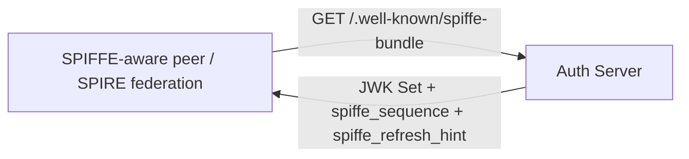

# RFC-00XX: SPIFFE Endpoints in the Embedded Authorization Server

- **Status**: Draft
- **Author(s)**: @tgrunnagle
- **Created**: 2026-04-20
- **Last Updated**: 2026-04-20
- **Target Repository**: toolhive
- **Related Issues**: N/A

## Summary

Add two SPIFFE-adjacent capabilities to the embedded authorization server: a SPIFFE Bundle Endpoint that serves the server's public JWK Set in SPIFFE federation format, and full RFC 8693 Token Exchange support with SPIFFE JWT-SVID validation via SPIRE JWKS federation. Together, these enable asynchronous agent workloads to obtain short-lived delegated bearer tokens that carry both user identity and workload identity, making it possible for vMCP Cedar policies to authorize against both simultaneously.

## Problem Statement

The current embedded authorization server only issues tokens via the authorization code flow, which requires an interactive human login. Asynchronous execution agents — processes that run scheduled or event-driven workflows without a human in the loop — have no supported path to obtain valid bearer tokens.

A shared machine-to-machine service identity is the common workaround, but it has significant security drawbacks:

- Every agent run uses the same identity regardless of which user initiated the workflow.
- A bug or prompt-injection in one workflow can reach any tool the service identity has access to, across all users' data.
- There is no cryptographic binding between the token and the workload that is using it.

The fix is a delegated token model: at workflow submission time a human user grants offline access, and at execution time the agent exchanges that grant plus its SPIFFE workload credential for a short-lived delegated JWT. The delegated JWT carries the user's identity in `sub` and the workload's SPIFFE ID in `act.sub`, giving downstream services everything needed to enforce per-user, per-workload authorization policies.

The ToolHive embedded auth server needs two new capabilities to support this:

1. The ability to act as a SPIFFE trust bundle issuer — serving its public keys at the SPIFFE-specified bundle endpoint so that external SPIFFE-aware tooling can discover and verify tokens.
2. Full RFC 8693 Token Exchange support — accepting a `subject_token` (user credential) plus an `actor_token` (SPIFFE JWT-SVID issued by SPIRE) and minting a delegated access token with the correct `act` claim structure.

## Goals

- Serve a SPIFFE-federation-compatible bundle endpoint so that SPIFFE-aware verifiers (including SPIRE-based tooling) can discover and cache the auth server's public keys.
- Support RFC 8693 Token Exchange on the existing `/oauth/token` endpoint, accepting both a `subject_token` (user context) and an `actor_token` (SPIFFE JWT-SVID) to produce a delegated token with `sub=user` and `act.sub=spiffe://...`.
- Validate `actor_token` JWT-SVIDs against a configurable SPIRE JWKS endpoint (SPIRE federation).
- Keep all changes additive and backward compatible — no existing token flows are modified.
- Enable asynchronous execution agents to authenticate to MCP servers without a shared M2M service identity.

## Non-Goals

- Implementing the SPIFFE Workload API (gRPC over Unix socket) — not applicable to an HTTP authorization server.
- X.509 SVID issuance — JWT-SVIDs only.
- The auth server acting as a SPIFFE verifier that fetches and validates peer trust bundles — we only serve our own bundle.
- Offline delegation grants and their issuance/revocation API — these are a dependency of the full delegated agent execution flow but are scoped to a separate RFC, as they represent a distinct storage and API surface.
- Tier B upstream token resolution (`UpstreamTokenResolver`) — also a separate RFC.
- Configurable delegated token lifespan — fixed at 5 minutes in this iteration.
- SPIFFE-aware changes to the MCP server token validation path — the issued JWTs are standard Bearer tokens and validate via existing JWKS verification without any consumer-side changes.

## Proposed Solution

### High-Level Design

The execution flow this enables:

```mermaid
sequenceDiagram
    participant CJ as Agent Workload
    participant SP as SPIRE Agent
    participant AS as Embedded Auth Server
    participant V as vMCP

    CJ->>SP: Fetch JWT-SVID (Workload API)
    SP-->>CJ: JWT-SVID (sub=spiffe://example.com/ns/agents/sa/my-agent)

    CJ->>AS: POST /oauth/token (Token Exchange)
    Note over CJ,AS: grant_type=token-exchange<br/>subject_token=&lt;offline grant or user access token&gt;<br/>subject_token_type=...refresh_token / ...access_token<br/>actor_token=&lt;JWT-SVID&gt;<br/>actor_token_type=...jwt<br/>resource=https://mcp-server.example.com/

    AS->>AS: Validate subject_token (user identity)
    AS->>AS: Validate actor_token via SPIRE JWKS
    AS->>AS: Mint delegated token: sub=user, act.sub=spiffe://...
    AS-->>CJ: Delegated access token (5 min)

    CJ->>V: tool call (Authorization: Bearer &lt;delegated token&gt;)
    V->>V: Validate JWT, enforce authorization policy
    V-->>CJ: Result
```

SPIFFE bundle discovery:



### Detailed Design

#### Component Changes

**`pkg/authserver/config.go`**

Add two new optional fields to both `RunConfig` and `Config`:

```go
// TrustDomain is this server's SPIFFE trust domain (e.g. "toolhive.example.com").
// When set, the SPIFFE bundle endpoint is enabled and token exchange with actor_token
// validation is supported. Optional.
TrustDomain string `json:"trust_domain,omitempty" yaml:"trust_domain,omitempty"`

// SpireJWKSURL is the URL of the SPIRE server's JWKS endpoint used to validate
// incoming JWT-SVID actor tokens during token exchange.
// Required when TrustDomain is set. Example: "https://spire.cluster.local/jwks".
SpireJWKSURL string `json:"spire_jwks_url,omitempty" yaml:"spire_jwks_url,omitempty"`
```

`Validate()` is updated to require `SpireJWKSURL` when `TrustDomain` is non-empty.

**`pkg/authserver/server/handlers/discovery.go`**

- Add `SPIFFEBundleHandler` (new exported method on `Handler`) — returns the existing public JWKS plus two SPIFFE federation fields:
  - `spiffe_sequence`: monotonically increasing integer (starts at `1`; incremented on each signing key rotation)
  - `spiffe_refresh_hint`: `3600` (seconds), matching the existing JWKS Cache-Control max-age
- Update `buildOAuthMetadata()` to conditionally include when `TrustDomain` is configured:
  - `spiffe_bundle_endpoint`: `"<issuer>/.well-known/spiffe-bundle"`
  - `urn:ietf:params:oauth:grant-type:token-exchange` added to `grant_types_supported`

**`pkg/authserver/server/handlers/handler.go`**

Register `GET /.well-known/spiffe-bundle` in `WellKnownRoutes()`.

**`pkg/authserver/server/handlers/token.go`**

Before invoking Fosite's `NewAccessRequest`, inspect the raw `grant_type` form field. When it equals `urn:ietf:params:oauth:grant-type:token-exchange`, delegate to `h.handleTokenExchange(w, req)` and return. All other grant types continue through Fosite unchanged.

**`pkg/authserver/server/handlers/tokenexchange.go`** (new file)

Implements the RFC 8693 token exchange flow:

- `handleTokenExchange(w, req)` — orchestrates: validate inputs → verify subject_token → verify actor_token → mint delegated JWT → write RFC 8693 response
- `SubjectTokenVerifier` interface (internal) — `Verify(tokenString string) (subject string, err error)`. MVP ships `jwtSubjectVerifier`, which validates user access tokens issued by this auth server via `config.PublicJWKS()`. The offline grants RFC will add `opaqueGrantVerifier` without modifying the handler.
- `verifyActorToken(tokenString string)` — validates the JWT-SVID actor token. Delegates to the SPIRE client for signature verification. Validates that `sub` is a valid SPIFFE URI. The `sub` becomes `act.sub` in the delegated token.
- `mintDelegatedToken(userSub, spiffeID, audience string)` — signs a short-lived JWT using the existing key provider:
  - `iss`: auth server issuer
  - `sub`: user subject from subject_token
  - `aud`: `[audience]` (from `resource` parameter, validated against `AllowedAudiences`)
  - `exp`: now + 5 minutes
  - `iat`: now
  - `jti`: UUID
  - `act`: `{"sub": "<spiffe-uri>"}` (RFC 8693 §4.1)
- `writeTokenExchangeResponse(w, jwt string)` — writes RFC 8693 JSON response

**`pkg/authserver/server/spire/` (new package)**

SPIRE JWKS client with caching:

- `Client` struct: URL, HTTP client, cached JWK set, TTL (aligned to `spiffe_refresh_hint`), mutex
- `FetchAndCache()` — fetches SPIRE JWKS if cache is stale; thread-safe
- `VerifyToken(tokenString string)` — verifies a JWT-SVID signature against cached keys

Isolating this in a separate package keeps the token exchange handler testable with a mock SPIRE client and avoids coupling `handlers/` to HTTP client configuration.

**`cmd/thv-operator/api/v1alpha1/mcpexternalauthconfig_types.go`**

Add two fields to `EmbeddedAuthServerConfig`:

```go
// SpiffeTrustDomain is this authorization server's SPIFFE trust domain.
// When set, the SPIFFE bundle endpoint is enabled and token exchange with
// SPIFFE JWT-SVID actor_token validation is supported.
// Must be a valid hostname (e.g. "toolhive.example.com"). Optional.
// +optional
// +kubebuilder:validation:Pattern=`^[a-z0-9]([a-z0-9\-\.]*[a-z0-9])?$`
SpiffeTrustDomain string `json:"spiffeTrustDomain,omitempty"`

// SpireJWKSURL is the URL of the SPIRE JWKS endpoint for validating JWT-SVID
// actor tokens. Required when SpiffeTrustDomain is set.
// +optional
SpireJWKSURL string `json:"spireJWKSURL,omitempty"`
```

**`cmd/thv-operator/pkg/controllerutil/authserver.go`**

Map `spec.embeddedAuthServer.spiffeTrustDomain` → `RunConfig.TrustDomain` and `spec.embeddedAuthServer.spireJWKSURL` → `RunConfig.SpireJWKSURL` in `BuildAuthServerRunConfig`.

#### API Changes

**New endpoint — SPIFFE Bundle:**

```
GET /.well-known/spiffe-bundle
Content-Type: application/json
Cache-Control: public, max-age=3600

{
  "spiffe_sequence": 1,
  "spiffe_refresh_hint": 3600,
  "keys": [ ... ]   // identical to /.well-known/jwks.json content
}
```

Returns 404 when `TrustDomain` is not configured.

**Modified endpoint — token exchange:**

```
POST /oauth/token
Content-Type: application/x-www-form-urlencoded

grant_type=urn:ietf:params:oauth:grant-type:token-exchange
&subject_token=<user-access-token>
&subject_token_type=urn:ietf:params:oauth:token-type:access_token
&actor_token=<jwt-svid>
&actor_token_type=urn:ietf:params:oauth:token-type:jwt
&resource=https://mcp-server.example.com/
```

When offline delegation grants are implemented in a future RFC, `subject_token_type` will also accept `urn:ietf:params:oauth:token-type:refresh_token` with an opaque grant string as the `subject_token`.

Successful response (RFC 8693 §2.2.1):

```json
{
  "access_token": "<delegated-jwt>",
  "issued_token_type": "urn:ietf:params:oauth:token-type:access_token",
  "token_type": "Bearer",
  "expires_in": 300
}
```

Issued delegated JWT claims:

```json
{
  "iss": "https://auth.example.com",
  "sub": "user@example.com",
  "aud": ["https://mcp-server.example.com/"],
  "iat": 1234567890,
  "exp": 1234568190,
  "jti": "<uuid>",
  "act": {
    "sub": "spiffe://example.com/ns/agents/sa/my-agent"
  }
}
```

Error responses follow RFC 6749 / RFC 8693 error format:

| Condition | `error` |
|---|---|
| Trust domain not configured | `unsupported_grant_type` |
| Missing `subject_token` or `actor_token` | `invalid_request` |
| `subject_token` signature invalid or expired | `invalid_grant` |
| `actor_token` signature invalid, expired, or not from trusted SPIRE | `invalid_grant` |
| `actor_token` `sub` is not a valid SPIFFE URI | `invalid_grant` |
| `resource` absent or not in `AllowedAudiences` | `invalid_target` |

**Modified discovery metadata (when `TrustDomain` is configured):**

```json
{
  "grant_types_supported": [
    "authorization_code",
    "refresh_token",
    "urn:ietf:params:oauth:grant-type:token-exchange"
  ],
  "spiffe_bundle_endpoint": "https://auth.example.com/.well-known/spiffe-bundle"
}
```

#### Configuration Changes

Operator CRD (`MCPExternalAuthConfig`):

```yaml
spec:
  embeddedAuthServer:
    spiffeTrustDomain: "toolhive.example.com"          # optional
    spireJWKSURL: "https://spire.cluster.local/jwks"   # required when spiffeTrustDomain is set
```

Auth server `RunConfig` (JSON/YAML):

```yaml
trust_domain: "toolhive.example.com"
spire_jwks_url: "https://spire.cluster.local/jwks"
```

#### Data Model Changes

No storage changes. Delegated tokens are self-contained short-lived JWTs. The `jti` claim provides a unique identifier for correlation but is not tracked server-side (stateless token model; acceptable for 5-minute TTL tokens in the MVP).

The SPIRE JWKS client maintains an in-memory cache only — no persistent state. Cache TTL is aligned to the SPIFFE `spiffe_refresh_hint` value (3600 seconds).

## Security Considerations

### Threat Model

**Attacker capabilities considered:**

- A compromised execution agent workload that has obtained its SPIFFE JWT-SVID and offline delegation grant.
- A network-adjacent attacker who can observe or replay HTTP requests to the auth server.
- An agent pod attempting to impersonate another workflow by presenting a mismatched `subject_token`.
- An external actor attempting to forge a JWT-SVID.

**Threats introduced:**

1. A compromised workload pod holding both its JWT-SVID and the offline grant can exchange them for delegated tokens scoped to its authorized scope. The blast radius is bounded by the grant's scope and expiry/revocation.
2. A stolen delegated token (5 min TTL) gives access to the specific MCP server audience for its remaining lifetime.
3. A forged JWT-SVID would allow a pod to impersonate another workload's SPIFFE identity — mitigated by SPIRE's signature validation.

### Authentication and Authorization

- `subject_token` (user context): for the MVP, validated as a JWT signed by the auth server itself using `config.PublicJWKS()`. `iss` must match the auth server's own issuer.
- `actor_token` (workload identity): validated as a JWT-SVID whose signature is verified against the SPIRE JWKS endpoint. The `sub` must be a valid SPIFFE URI (`spiffe://...`).
- Both tokens must pass their respective validations independently — a valid `actor_token` with an invalid `subject_token` is rejected, and vice versa.
- `resource` is required and validated against `AllowedAudiences` (reusing `server.ValidateAudienceURI` and `server.ValidateAudienceAllowed`).

### Data Security

- The auth server's private signing key is never exposed — the delegated JWT is signed internally using the existing key provider.
- The SPIRE JWKS cache is in-memory only; SPIRE's public keys are not sensitive.
- Delegated tokens are short-lived (5 min), audience-bound to a specific MCP server, and not persisted by any component.
- The `act.sub` claim carries only the workload's SPIFFE URI — no additional user secrets flow through the delegated token.

### Input Validation

- `subject_token`: parsed as JWT, signature verified, `iss` validated, `exp` checked.
- `actor_token`: parsed as JWT, signature verified against SPIRE JWKS, `sub` validated as a valid SPIFFE URI (`spiffe://` scheme, non-empty trust domain, non-empty path).
- `resource`: validated as a URI and checked against the allow-list.
- `spire_jwks_url` configuration: validated as a valid HTTPS URL at config load time. The SPIRE JWKS client enforces TLS; plaintext HTTP to SPIRE is not supported.

### Secrets Management

No new secrets are introduced. The SPIRE JWKS URL is not a secret. Delegated tokens are signed with the existing signing key already managed via Kubernetes Secrets and mounted file volumes.

### Audit and Logging

Per project convention (no INFO for successful operations), log at DEBUG level:

- Token exchange attempt: resource / audience requested (never the token content).
- Token exchange outcome: success or error type and reason.
- SPIRE JWKS cache miss / refresh.

The `jti` claim in the delegated token and the SPIFFE URI in `act.sub` provide identifiers for correlating auth server logs with vMCP Cedar decision logs.

### Mitigations

| Threat | Mitigation |
|---|---|
| Stolen delegated token | 5-minute TTL limits damage window |
| Compromised workload exfiltrates offline grant | Grant alone is insufficient — requires actor_token from SPIRE; grant revocation removes access at next exchange (offline grants RFC) |
| Forged JWT-SVID | Signature verified against SPIRE JWKS; unforgeable without SPIRE private key |
| Actor impersonating a different workload | SPIRE registration scopes JWT-SVIDs to specific workload identities; consumers can enforce SPIFFE subject allowlists in their authorization policies |
| Audience confusion across MCP servers | Required `resource` parameter, validated against allow-list |
| Insecure SPIRE JWKS fetch | HTTPS enforced; plaintext HTTP to SPIRE rejected at config validation time |

## Alternatives Considered

### Alternative 1: Auth Server Issues JWT-SVIDs (sub=spiffe://...)

The auth server issues tokens where `sub` is a SPIFFE URI rather than the user identifier, with the user identity in a separate claim.

- **Pros**: Simpler token structure; closer to "pure" SPIFFE JWT-SVID format.
- **Cons**: Breaks the claim contract that existing MCP server consumers depend on (`sub` = user); vMCP Cedar policies would need to look in a non-standard claim for user identity; user identity loses prominence in audit logs.
- **Why not chosen**: The RFC 8693 `act` claim structure is the correct mechanism for representing delegation — `sub` stays the user, `act.sub` is the actor. This also preserves the existing claim contract for downstream consumers.

### Alternative 2: Separate `/oauth/svid` Endpoint

Issue delegated tokens via a separate HTTP handler at a new path, without touching `/oauth/token`.

- **Pros**: No risk of disrupting Fosite token flows.
- **Cons**: Not RFC 8693 compliant; clients need a custom flow rather than standard token exchange; not discoverable via standard OAuth metadata.
- **Why not chosen**: RFC 8693 on the standard token endpoint maximizes interoperability with existing OAuth libraries and follows MCP's OAuth-centric model.

### Alternative 3: Client Credentials Grant (no actor_token)

Agents authenticate with a `client_id` + `client_secret` to get a delegated token, with no SPIFFE actor identity.

- **Pros**: Simpler; no SPIRE dependency in the auth server.
- **Cons**: Requires a client secret per workflow (secrets management burden); no cryptographic workload identity binding; shared service identity anti-pattern persists.
- **Why not chosen**: The combination of offline delegation grant (user context) + JWT-SVID (workload context) provides a much stronger security posture. SPIFFE workload identity is a core requirement for cryptographically binding tokens to specific workloads.

### Alternative 4: Dedicated External Authorization Server (Keycloak, Ory Hydra)

Deploy Keycloak or Hydra as the RFC 8693 issuer, leaving the embedded auth server unchanged.

- **Pros**: Supports token exchange today; no ToolHive-side blockers.
- **Cons**: Duplicates the embedded auth server's role; two JWKS endpoints; two audit streams; doesn't solve per-user upstream refresh token storage (Tier B); harder to deploy in customer environments.
- **Why not chosen**: Creates a second trust anchor and adds operational complexity without solving per-user upstream refresh token storage.

## Compatibility

### Backward Compatibility

Fully backward compatible. `TrustDomain` and `SpireJWKSURL` are optional fields. Omitting them preserves existing behavior exactly:

- The `/oauth/token` endpoint continues to process only Fosite-handled grant types.
- Discovery metadata is unchanged.
- The `/.well-known/spiffe-bundle` route returns 404.

No existing token flows, key providers, or storage backends are affected.

### Forward Compatibility

- When offline delegation grants are implemented (separate RFC), the token exchange handler will additionally accept `subject_token_type=urn:ietf:params:oauth:token-type:refresh_token` with an opaque grant string. The handler's input routing can accommodate this without breaking the existing `access_token` subject_token_type path.
- `spiffe_sequence` starts at `1` and can be incremented on signing key rotation events to signal peers to refresh their cached bundle. The infrastructure is in place even if rotation logic is deferred.
- Additional `act.claims` (workflow, owner, allowed_tools) can be forwarded from subject_token claims to the delegated token in a future iteration without breaking the RFC 8693 response structure.
- The SPIRE JWKS client package is isolated and can be extended to support multiple SPIRE trust domains if the deployment topology requires it.

## Implementation Plan

### Phase 1: SPIFFE Bundle Endpoint and Configuration

- Add `TrustDomain` and `SpireJWKSURL` to `RunConfig` and `Config` in `pkg/authserver/config.go`
- Implement `SPIFFEBundleHandler` in `pkg/authserver/server/handlers/discovery.go`
- Register `/.well-known/spiffe-bundle` route in `handler.go`
- Update discovery metadata to conditionally include SPIFFE fields
- Add operator CRD fields and `BuildAuthServerRunConfig` mapping
- Tests: bundle endpoint (with/without trust domain), discovery metadata variants, operator mapping

### Phase 2: SPIRE JWKS Client

- Implement `pkg/authserver/server/spire/` package: `Client`, `FetchAndCache()`, `VerifyToken()`
- Unit tests: cache TTL, concurrent access, JWKS fetch failure, invalid JWT-SVID

### Phase 3: Token Exchange Handler

- Implement `pkg/authserver/server/handlers/tokenexchange.go`
- Patch `token.go` to branch on grant type
- Wire `spire.Client` into `Handler` (new constructor parameter)
- Tests: happy path, expired subject token, invalid actor_token signature, invalid SPIFFE URI, missing resource, disallowed resource, unconfigured trust domain

### Dependencies

- `go-jose/v4` — already a dependency; used for JWT verification and signing.
- SPIRE deployment in the target cluster — assumed available; out of scope for this RFC.
- Offline delegation grants (separate RFC) — required for the full delegated agent execution flow but not for this RFC's implementation.
- No new external Go dependencies required.

## Testing Strategy

- **Unit tests** (`tokenexchange_test.go`, `spire/client_test.go`, `discovery_test.go` additions): cover all error paths and the happy path. Use a test HTTP server to mock SPIRE JWKS responses.
- **Existing tests**: `TestBuildAuthServerRunConfig` in `authserver_test.go` extended to cover `SpiffeTrustDomain` + `SpireJWKSURL` mapping.
- **Manual integration**: curl-based verification of the bundle endpoint and token exchange against a locally running auth server using `keys.NewGeneratingProvider` for signing and a local mock SPIRE JWKS endpoint.
- **E2E**: end-to-end coverage of the full delegated flow (including offline grants) is deferred until the offline delegation grants RFC is implemented.

## Documentation

- Update `docs/arch/` with a note on SPIFFE endpoints once the auth server architecture document is created.
- Add kubebuilder validation markers and field documentation on the new CRD fields.
- CLI docs regenerated via `task docs` (no CLI changes expected; operator CRD docs may need regeneration via `task gen`).
- Once implemented, add a ToolHive guide: "Delegated access for asynchronous agent workloads" covering the SPIRE + RFC 8693 flow end to end.

## Resolved Design Decisions

The following questions were raised during review and have been resolved:

1. **`spiffe_sequence` persistence** — **Static `1` for now.** The SPIFFE federation spec requires a monotonically increasing sequence, but a static value of `1` is safe and correct as long as the auth server is not federating with external SPIFFE infrastructure. Incrementing on key rotation is deferred until key rotation eventing is designed. Revisit if SPIFFE federation (publishing this bundle to peer trust domains) becomes a requirement.

2. **SPIRE JWKS URL** — **Always explicit.** `SpireJWKSURL` must always be provided by the operator when `TrustDomain` is set. Auto-deriving from the trust domain would break non-standard SPIRE deployments (Envoy frontends, multi-cluster, custom paths). Explicit configuration is more flexible and makes the dependency visible in the CRD.

3. **`act.claims` passthrough** — **Deferred to the offline grants RFC.** Delegated tokens issued by this RFC carry only `sub`, `aud`, and `act.sub`. Additional workload metadata (e.g. workflow name, allowed tools) will be injected server-side by the auth server once offline delegation grants are implemented — at that point the server has the metadata authoritatively and does not need to trust agent-supplied claims.

4. **`verifySubjectToken` extensibility** — **Interface abstraction now.** `tokenexchange.go` defines an internal `SubjectTokenVerifier` interface. The MVP ships a `jwtSubjectVerifier` implementation that validates user access tokens by JWT signature. When the offline grants RFC lands, an `opaqueGrantVerifier` implementation is added without modifying the token exchange handler. This is a compile-time–safe extension point with no runtime overhead.

## References

- [SPIFFE JWT-SVID specification](https://github.com/spiffe/spiffe/blob/main/standards/JWT-SVID.md)
- [SPIFFE Federation specification](https://github.com/spiffe/spiffe/blob/main/standards/SPIFFE_Federation.md)
- [RFC 8693 — OAuth 2.0 Token Exchange](https://www.rfc-editor.org/rfc/rfc8693)
- [RFC 8707 — Resource Indicators for OAuth 2.0](https://www.rfc-editor.org/rfc/rfc8707)
- [RFC 8414 — OAuth 2.0 Authorization Server Metadata](https://www.rfc-editor.org/rfc/rfc8414)
- [go-jose/v4](https://github.com/go-jose/go-jose)

---

## RFC Lifecycle

<!-- This section is maintained by RFC reviewers -->

### Review History

| Date | Reviewer | Decision | Notes |
|------|----------|----------|-------|
| 2026-04-20 | | Draft | Initial submission |

### Implementation Tracking

| Repository | PR | Status |
|------------|-----|--------|
| toolhive | | Pending |
