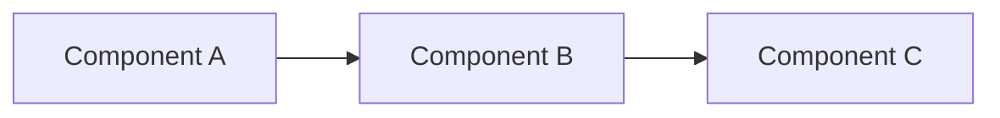

# RFC-XXXX: Title

- **Status**: Draft | Under Review | Accepted | Rejected | Implemented | Superseded
- **Author(s)**: Your Name (@github-handle)
- **Created**: YYYY-MM-DD
- **Last Updated**: YYYY-MM-DD
- **Target Repository**: toolhive | toolhive-studio | toolhive-registry | toolhive-registry-server | multiple
- **Related Issues**: [toolhive#1234](https://github.com/stacklok/toolhive/issues/1234) (if applicable)

## Summary

A brief (2-3 sentence) description of the proposed change. This should be clear enough that someone can understand the essence of the proposal without reading the full document.

## Problem Statement

Describe the problem this RFC is trying to solve. Include:

- What is the current behavior or limitation?
- Who is affected by this problem?
- Why is this problem worth solving?

## Goals

List the specific goals this RFC aims to achieve:

- Goal 1
- Goal 2
- Goal 3

## Non-Goals

Explicitly state what this RFC does NOT aim to address. This helps set scope and prevents scope creep:

- Non-goal 1
- Non-goal 2

## Proposed Solution

Describe your proposed solution in detail. This section should be comprehensive enough for someone to implement the solution.

### High-Level Design

Provide an overview of the design. Include diagrams where helpful (Mermaid diagrams are encouraged):



### Detailed Design

Break down the implementation details:

#### Component Changes

Describe changes to existing components or new components being introduced.

#### API Changes

Document any API changes, including:

- New endpoints or methods
- Modified signatures
- Deprecated functionality

```go
// Example API change
type NewInterface interface {
    Method(ctx context.Context, param string) (Result, error)
}
```

#### Configuration Changes

Document any new configuration options:

```yaml
# Example configuration
newFeature:
  enabled: true
  setting: value
```

#### Data Model Changes

Describe any changes to data models, schemas, or storage.

## Security Considerations

**This section is required.** Security is a core concern for ToolHive. Address the following:

### Threat Model

- What are the potential threats introduced by this change?
- Who are the potential attackers and what are their capabilities?

### Authentication and Authorization

- How does this change affect authentication?
- What authorization checks are required?
- Are there any changes to permission models?

### Data Security

- What sensitive data does this feature handle?
- How is data protected at rest and in transit?
- Are there any data retention or deletion considerations?

### Input Validation

- What user input does this feature accept?
- How is input validated and sanitized?
- What are the potential injection vectors?

### Secrets Management

- Does this feature require any secrets or credentials?
- How are secrets stored and accessed?
- Are secrets properly rotated and revocable?

### Audit and Logging

- What security-relevant events should be logged?
- Are there any compliance requirements?

### Mitigations

- What security controls are implemented?
- How do these mitigations address the identified threats?

## Alternatives Considered

Describe alternative approaches you considered and why you chose the proposed solution:

### Alternative 1: [Name]

- Description
- Pros
- Cons
- Why not chosen

### Alternative 2: [Name]

- Description
- Pros
- Cons
- Why not chosen

## Compatibility

### Backward Compatibility

- Is this change backward compatible?
- If not, what is the migration path?
- Are there any deprecation timelines?

### Forward Compatibility

- How does this design accommodate future changes?
- Are there extensibility points?

## Implementation Plan

Outline the implementation approach:

### Phase 1: [Description]

- Task 1
- Task 2

### Phase 2: [Description]

- Task 3
- Task 4

### Dependencies

List any dependencies on other work or external factors.

## Testing Strategy

Describe how this feature will be tested:

- Unit tests
- Integration tests
- End-to-end tests
- Performance tests
- Security tests

## Documentation

What documentation needs to be created or updated?

- User documentation
- API documentation
- Architecture documentation
- Runbooks or operational guides

## Open Questions

List any unresolved questions that need to be addressed during the review:

1. Question 1
2. Question 2

## References

- Link to relevant documentation
- Link to related RFCs or proposals
- Link to external specifications or standards

---

## RFC Lifecycle

<!-- This section is maintained by RFC reviewers -->

### Review History

| Date | Reviewer | Decision | Notes |
|------|----------|----------|-------|
| YYYY-MM-DD | @reviewer | Under Review | Initial submission |

### Implementation Tracking

| Repository | PR | Status |
|------------|-----|--------|
| toolhive | #XXXX | Merged |
