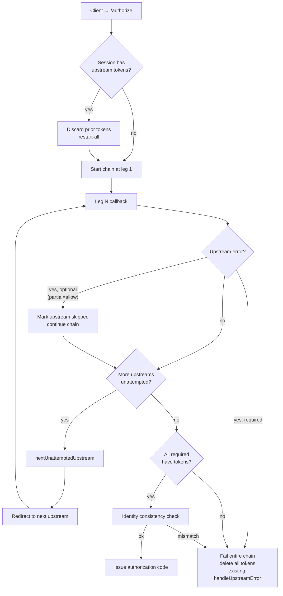

# RFC-XXXX: Graceful Degradation for Multi-Upstream OAuth in vMCP

- **Status**: Draft
- **Author(s)**: TBD (@github-handle)
- **Created**: 2026-05-13
- **Last Updated**: 2026-05-13
- **Target Repository**: toolhive
- **Related Issues**: [toolhive#5162](https://github.com/stacklok/toolhive/issues/5162)

## Summary

When a VirtualMCPServer's embedded authorization server fronts multiple upstream
Identity Providers, today's chain is all-or-nothing: any one failure invalidates
every collected upstream token and locks the user out of every backend, even
backends that depend only on the upstreams that already succeeded. This RFC
introduces opt-in partial-completion semantics, controlled by a new
`partialUpstreamAuth` knob on the embedded auth server and a `required` flag
on each upstream provider. Backends whose required upstream is missing are
filtered out of the vMCP's exposed catalog and refused at request time;
re-authentication is restart-all, with full identity-consistency checks
preserved.

## Problem Statement

The embedded auth server walks `EmbeddedAuthServerConfig.UpstreamProviders` in
order. After each upstream callback, the handler calls `nextMissingUpstream`
(pkg/authserver/server/handlers/handler.go:118-133)
to redirect to the next provider without a stored token, and only issues an
authorization code when every upstream has one
(pkg/authserver/server/handlers/callback.go:368-478).
If any upstream returns an error or the user declines a consent screen,
`handleUpstreamError`
(pkg/authserver/server/handlers/callback.go:325-362)
calls `DeleteUpstreamTokens` and the client receives a generic
`access_denied` with the hint `"upstream authentication failed"`.

- **Current behavior**: one upstream IdP outage or one declined consent screen
  blocks every backend on a vMCP — even backends with no dependency on the
  failed upstream.
- **Affected users**: operators running vMCPs that aggregate backends across
  multiple SaaS IdPs (e.g. `github` + `slack` + `google`). End users see "the
  whole thing is down" when only one provider has a problem.
- **Worth solving**: vMCP's value proposition is composition across
  heterogeneous backends; the auth layer should fail in proportion to what is
  actually broken, not collapse the whole surface.

The system already knows which backends bind to which upstream — the strategy
configs name them directly via `UpstreamInjectConfig.ProviderName`,
`TokenExchangeConfig.SubjectProviderName`, and
`AwsStsConfig.SubjectProviderName`
(pkg/vmcp/auth/types/types.go). That
information is just not consulted when deciding how to fail.

## Goals

- Let the chain complete when only a subset of upstreams succeed, when the
  operator opts in.
- Preserve today's all-or-nothing semantics as the default so existing
  deployments are unaffected.
- Keep the cross-leg identity-consistency invariant
  (pkg/authserver/server/handlers/callback.go:387-410)
  intact under partial completion and under re-authentication.
- Filter backends whose required upstream is missing out of the vMCP's
  exposed tool/resource/prompt catalog, with a defense-in-depth refusal at
  dispatch time.
- Define a single, well-specified path for recovering filtered backends:
  client-driven `/authorize` restart-all.
- Handle RFC 6749 §4.1.2.1 upstream errors (`access_denied`,
  `invalid_request`, `server_error`, `temporarily_unavailable`, …) cleanly:
  optional upstreams are skipped, required upstreams fail the chain.

## Non-Goals

- **Per-upstream retry.** This RFC does not add a "retry just provider X"
  path. Recovery is restart-all. See *Alternatives Considered*.
- **MCP-protocol-level signaling of filtered state.** The vMCP server does
  not advertise to clients that *additional* tools would exist if more
  upstreams were authorized; capability listings simply omit them. The
  protocol has no field for "tool exists but is unauthorized" and we will
  not add one.
- **Silent backend dropping on refresh-token expiry.** When a previously
  satisfied upstream's refresh token expires, the affected backend's next
  call surfaces an auth error that the client converts into a fresh
  `/authorize` flow. We do not quietly remove the backend mid-session.
- **Dynamic addition of upstreams at runtime.** `UpstreamProviders` is still
  reconciled from the CRD.
- **Changing the chain-walk order or making it parallel.** Sequential
  walk is preserved; only the completion predicate and the failure path
  change.

## Proposed Solution

### High-Level Design

Three concrete changes, gated on a new `partialUpstreamAuth: allow` knob:

1. **Required vs. optional upstreams.** `UpstreamProviderConfig` gains a
   `required` bool (default `false`). The provider named by
   `authzConfig.inline.primaryUpstreamProvider` (explicit or auto-selected)
   is *always* required — admission and runtime treat it that way regardless
   of the field. Operators can configure `partialUpstreamAuth: requireAll`
   (default — equivalent to today) or `partialUpstreamAuth: allow`, in which
   case per-provider `required` is honored.
2. **Skip-and-continue on optional-upstream failure.** When an optional
   upstream returns an RFC 6749 §4.1.2.1 error (including user-declined
   `access_denied`), the chain records the upstream as *skipped for this
   session* and advances to the next missing upstream instead of tearing the
   whole flow down. The auth code is issued when every upstream has been
   attempted and every *required* upstream has a token.
3. **Backend filtering, fail-closed.** The vMCP request pipeline reads the
   per-session set of available upstream tokens off the bearer-token claim
   and filters the aggregated `tools/list`, `resources/list`, and
   `prompts/list` results to exclude backends whose required upstream is
   missing. The dispatcher refuses `tools/call`, `resources/read`, and
   `prompts/get` invocations against unavailable backends with a structured
   `unauthorized_backend` error — a stale or misbehaving client cannot
   bypass the filter.

Restart-all recovery is handled by the existing client-driven `/authorize`
flow: when an incoming `/authorize` is observed for a session that already
holds upstream tokens, the auth server discards them and walks the chain
again from leg one. The identity-consistency check on leg one then enforces
that the same user is binding the session — a different user starts a fresh
session.



### Detailed Design

#### Component Changes

##### Operator: CRD additions

Two new fields on existing types in
cmd/thv-operator/api/v1beta1/mcpexternalauthconfig_types.go:

```go
// EmbeddedAuthServerConfig gains a top-level mode toggle.
type EmbeddedAuthServerConfig struct {
    // ... existing fields ...

    // PartialUpstreamAuth controls whether the embedded auth server may
    // complete authorization with a subset of upstream providers satisfied.
    //
    //   requireAll (default): every configured upstream must succeed before
    //     an authorization code is issued. Matches the historical behavior.
    //   allow: per-provider Required flags are honored. The chain completes
    //     when every required upstream is satisfied; optional upstreams that
    //     fail are recorded as skipped for the session and the dependent
    //     backends are filtered from the vMCP catalog.
    //
    // +kubebuilder:validation:Enum=requireAll;allow
    // +kubebuilder:default=requireAll
    // +optional
    PartialUpstreamAuth string `json:"partialUpstreamAuth,omitempty"`
}

// UpstreamProviderConfig gains a Required flag.
type UpstreamProviderConfig struct {
    // ... existing fields (Name, Type, OIDCConfig, OAuth2Config) ...

    // Required marks this upstream as mandatory for chain completion.
    // Only consulted when the parent EmbeddedAuthServerConfig sets
    // PartialUpstreamAuth: allow — in requireAll mode every upstream is
    // implicitly required.
    //
    // The provider named by spec.incomingAuth.authzConfig.inline.primaryUpstreamProvider
    // (or, when unset, the first upstream) is always required regardless of
    // this field; the admission webhook rejects a configuration that
    // explicitly sets the primary upstream's Required to false.
    //
    // +kubebuilder:default=false
    // +optional
    Required bool `json:"required,omitempty"`
}
```

Validation extensions to `MCPExternalAuthConfig` and `VirtualMCPServer`
admission webhooks:

- When `partialUpstreamAuth: allow`, reject configurations where the
  primary upstream (resolved via
  `AuthzConfigRef.ExplicitPrimaryUpstreamProvider()` —
  cmd/thv-operator/api/v1beta1/mcpserver_types.go:657-668,
  falling back to `upstreamProviders[0].Name`) has `Required: false`.
- New advisory status condition
  `ConditionTypeAuthzPartialUpstreamAuthOptionalPrimary` is unnecessary —
  rejection at admission is the right level; degrading silently here would
  let a misconfigured policy authorize against missing claims.

A new validation rule on `MCPExternalAuthConfig.validateUpstreamProvider`
(cmd/thv-operator/api/v1beta1/mcpexternalauthconfig_types.go:1124)
is not required — `Required` is a leaf bool with no cross-field semantics
at the per-provider level. Cross-field validation lives on the parent.

##### Auth server: chain completion logic

Three changes in
pkg/authserver/server/handlers/:

1. **`nextMissingUpstream` → `nextUnattemptedUpstream`**
   (pkg/authserver/server/handlers/handler.go:118-133).
   Return the first upstream (required or optional) that has neither a
   stored token nor a skipped tombstone for the session. Chain completion
   is now a two-part predicate evaluated after each successful leg:
   `nextUnattemptedUpstream` returns empty *and* every required upstream
   has a stored token. Optional upstreams are still walked so the user has
   a chance to authorize them; only after they have been attempted (and
   either succeeded or been recorded as skipped) does the chain consider
   itself complete.

2. **Skipped-upstream tombstone in storage.** Add a
   `MarkUpstreamSkipped(sessionID, providerName, reason)` method to
   `UpstreamTokenStorage`
   (pkg/authserver/storage/types.go:496-516).
   Implementations record a sentinel record (or a separate skipped-set, at
   the backend's discretion — the interface hides the choice) so
   `nextUnattemptedUpstream` can distinguish "never attempted" from
   "attempted, optional, declined/errored". The tombstone carries no token
   material; it is cleared on restart-all alongside `DeleteUpstreamTokens`.

3. **`handleUpstreamError` partial-mode branch**
   (pkg/authserver/server/handlers/callback.go:325-362).
   Look up the current upstream (carried on the pending authorization via
   `PendingAuthorization.UpstreamProviderName` —
   pkg/authserver/storage/types.go:397-453)
   and decide:

   - If the upstream is required (including the primary): preserve today's
     behavior — `DeleteUpstreamTokens`, write generic `access_denied` to
     the client.
   - If the upstream is optional *and* `partialUpstreamAuth: allow`: call
     `MarkUpstreamSkipped` with the upstream's RFC 6749 error code (or
     `chain_failed` for transport-level failures), then invoke
     `continueChainOrComplete` exactly as the success path does. The user
     is redirected onward to the next required upstream or, if none
     remains, sees a successful authorization at the client.

   The handler is the single place that classifies §4.1.2.1 error codes;
   we do not propagate distinct codes to the downstream client (the
   existing generic `access_denied` posture is preserved for the
   non-partial path).

4. **Identity consistency on completion**
   (pkg/authserver/server/handlers/callback.go:387-410)
   is unchanged in shape. It still walks every stored upstream token and
   verifies the resolved subject matches; skipped upstreams have no token,
   so they contribute no record to walk. The required-upstream subset is
   exactly the set under consistency check.

##### Auth server: restart-all on re-authorization

A new path in the `/authorize` handler: if the incoming flow correlates to
a session ID that already holds any upstream tokens (or skipped
tombstones), the auth server first calls `DeleteUpstreamTokens` and clears
the skipped set for that session before redirecting to the first
upstream. The identity-consistency check at the new leg one then enforces
that the same user binds the session — if a different user comes back, the
existing session-binding fields
(`UpstreamTokens.UserID`, `.UpstreamSubject`,
pkg/authserver/storage/types.go:55-97)
force a fresh session ID instead of letting the new identity adopt the
old session.

Session correlation: the client's `/authorize` request supplies its
client ID and (in PKCE flows) a fresh code challenge. Session reuse is
keyed off the existing pending-authorization correlation — no new client
fields. If a client legitimately holds an unrelated session, the
restart-all check is a no-op (the session has no tokens yet).

##### vMCP: backend → upstream binding

Add a helper in
pkg/vmcp/auth/types/types.go:

```go
// RequiredUpstreamProvider returns the upstream provider that this backend
// auth strategy requires a valid token from, or empty if the strategy is
// independent of the embedded auth server's upstream chain (e.g. service
// account, anonymous).
func (s *BackendAuthStrategy) RequiredUpstreamProvider() string {
    switch {
    case s.UpstreamInject != nil:
        return s.UpstreamInject.ProviderName
    case s.TokenExchange != nil:
        return s.TokenExchange.SubjectProviderName
    case s.AwsSts != nil:
        return s.AwsSts.SubjectProviderName
    default:
        return ""
    }
}
```

Backends whose strategy returns empty are always available — they have no
upstream dependency.

##### vMCP: backend filtering middleware

A per-session filter applied at two points in the vMCP request path:

1. **Capability listings.** Wrap the aggregator's response to
   `tools/list`, `resources/list`, `resources/templates/list`, and
   `prompts/list` with a filter that drops any item whose owning backend
   reports a non-empty `RequiredUpstreamProvider()` not present in the
   session's `IdentityFromContext(ctx).UpstreamTokens` map
   (pkg/vmcp/auth/strategies/upstream_inject.go:44-87).
   Listings are computed per-request, not once at server start, so the
   filter naturally tracks per-session state. The filter never mutates
   the backend registry; only the per-request view is altered.

2. **Dispatch refusal.** Before the dispatcher routes `tools/call`,
   `resources/read`, `resources/subscribe`, or `prompts/get` to a
   backend, it re-checks `RequiredUpstreamProvider()` against the
   session's upstream-token map. A miss produces a structured JSON-RPC
   error with `code: -32001` (server-defined) and a message naming the
   missing upstream — this matters because a stale client may have
   cached an earlier listing.

Filtering is structurally invisible to the MCP protocol: the client just
sees a smaller capability set, exactly as if those backends were never
configured. We do not extend the protocol to signal degraded state. End
users discover what they cannot do by trying to use it; the failing
tool/resource error includes the missing upstream's name for self-service
re-auth.

##### Refresh-token expiry and out-of-band revocation

The same recovery flow covers two distinct events: an upstream refresh
token expires, or an operator revokes a stored upstream token
out-of-band (e.g. via the IdP admin UI). In both cases the auth server
detects the problem *reactively*, on the next backend call that needs
the token — there is no server-side introspection poller. The flow:

1. The dependent backend's strategy fails to mint or use a fresh access
   token (the IdP rejects refresh or returns an unauthorized response).
2. The vMCP returns a structured auth error to the client (existing
   path).
3. The client re-runs `/authorize`. This trips the restart-all branch,
   wipes the session's upstream tokens and skipped tombstones, and
   walks every upstream again — the user re-consents across the chain.
   Identity consistency is re-verified.

This is intentionally heavier than per-upstream refresh because we do not
want a single upstream RT expiry or revocation to silently degrade the
user's capability surface mid-conversation, and because partial re-walks
re-introduce the identity-binding hazards that we deliberately avoid
elsewhere in this RFC. Operators with stricter freshness requirements
(e.g. compliance-driven sub-minute revocation detection) are out of
scope for this RFC and would be addressed by a follow-up proposal for
proactive introspection.

#### API Changes

No external HTTP API or MCP protocol changes. The only new internal
storage method is `MarkUpstreamSkipped` on `UpstreamTokenStorage`:

```go
// UpstreamTokenStorage interface gains:
type UpstreamTokenStorage interface {
    // ... existing methods ...

    // MarkUpstreamSkipped records that an optional upstream was attempted
    // for the given session and either returned an error or was declined
    // by the user. Subsequent calls to GetAllUpstreamTokens return the
    // unchanged token set; the chain handler queries skipped state
    // separately when deciding whether to advance.
    //
    // Skipped tombstones are cleared by DeleteUpstreamTokens.
    MarkUpstreamSkipped(ctx context.Context, sessionID, providerName, reason string) error

    // IsUpstreamSkipped reports whether MarkUpstreamSkipped has been
    // called for (sessionID, providerName) in the current session.
    IsUpstreamSkipped(ctx context.Context, sessionID, providerName string) (bool, error)
}
```

Both methods need implementations in the in-memory and Redis-backed
stores.

#### Configuration Changes

Example `MCPExternalAuthConfig` for a vMCP fronting github, slack, and
google backends, where github carries primary identity and slack and
google are best-effort:

```yaml
apiVersion: toolhive.stacklok.dev/v1beta1
kind: MCPExternalAuthConfig
metadata:
  name: vmcp-multi-idp
spec:
  type: embedded
  embeddedAuthServer:
    issuer: https://vmcp.example.com
    partialUpstreamAuth: allow
    upstreamProviders:
      - name: github
        type: oidc
        required: true      # primary identity, must always succeed
        oidcConfig: { ... }
      - name: slack
        type: oauth2
        # required: false (default) — slack outage filters slack-mcp only
        oauth2Config: { ... }
      - name: google
        type: oidc
        # required: false (default) — declined google consent filters gdrive-mcp only
        oidcConfig: { ... }
```

And on the `VirtualMCPServer`:

```yaml
spec:
  incomingAuth:
    authzConfig:
      inline:
        primaryUpstreamProvider: github     # webhook enforces github.required==true
        policies: [ ... ]
```

#### Data Model Changes

Storage gains a per-session "skipped upstreams" set, addressable by
`(sessionID, providerName)`. In-memory implementation is a `map[string]
map[string]string` (session → provider → reason) guarded by the existing
mutex. Redis implementation uses a hash keyed by sessionID with provider
names as fields. The set is wiped by `DeleteUpstreamTokens` in the
existing restart-all path.

Tombstones have no independent TTL: they live for the lifetime of the
session and are cleared only by restart-all. Retrying a previously
declined upstream requires the client to re-run `/authorize`, which
trips restart-all and walks the full chain again — consistent with the
restart-all-only recovery model used elsewhere in this RFC.

No changes to `PendingAuthorization`
(pkg/authserver/storage/types.go:397-453).
The chain-leg correlation still uses `UpstreamProviderName` on the
pending record.

## Security Considerations

### Threat Model

- **Threat A — Cross-identity token binding.** A malicious or compromised
  upstream could try to bind tokens for *its* identity into a session
  established under a different identity. Mitigation: the existing
  identity-consistency check
  (pkg/authserver/server/handlers/callback.go:387-410)
  walks every stored upstream token and compares
  `UpstreamTokens.UserID`/`UpstreamSubject` against the resolved subject;
  this check is unchanged. Skipped upstreams contribute no token and so
  cannot inject a divergent identity.
- **Threat B — Restart-all session takeover.** A second user holding the
  same session ID (e.g. via a stolen client artifact) could attempt to
  restart-all and adopt the session. Mitigation: identity-consistency
  re-evaluates at the *new* leg one — if the resolved subject differs from
  any historic binding the auth server still has visibility into, the
  flow fails. With partial-auth this is no weaker than today; without
  restart-all the same threat exists.
- **Threat C — Operator misconfiguration: optional primary.** An operator
  could mark the authz-policy primary upstream as optional, in which case
  Cedar policies would evaluate against an absent or wrong identity.
  Mitigation: admission webhook rejects configurations where
  `primaryUpstreamProvider`'s `required` is `false` under
  `partialUpstreamAuth: allow`. Defense-in-depth: at runtime, the chain
  treats the primary as required even if the field is somehow false on a
  stored object.
- **Threat D — Stale-client backend invocation.** A client that listed
  tools before an upstream expired could still issue calls against a
  filtered backend. Mitigation: dispatcher re-checks
  `RequiredUpstreamProvider()` per request and returns a structured
  error; the filter is not list-time-only.
- **Threat E — Information disclosure via filtered listings.** Filtered
  listings reveal which providers a session has not authorized (by
  absence). This is the same disclosure as a session that simply hasn't
  authorized those providers yet — not a new leak.

### Authentication and Authorization

- No change to who can call `/authorize` or how tokens are validated.
- Authz policy evaluation is unchanged: Cedar still binds to claims from
  the primary upstream, which is guaranteed present by the new admission
  rule.
- Backend dispatch is the new authorization gate: a session without the
  required upstream token for a given backend cannot reach that backend.
  This is *stricter* than today — today the session would already have
  failed authorization entirely.

### Data Security

- The new skipped-upstream tombstones carry only the provider name and an
  error reason string. No tokens, claims, or PII. They expire with the
  session.
- Existing token storage is unchanged.

### Input Validation

- `partialUpstreamAuth` is enum-validated (`requireAll`|`allow`) at the
  CRD layer.
- `Required` is a leaf bool.
- Cross-field rule: at admission, verify
  `upstreamProviders[primary].Required == true` when
  `partialUpstreamAuth == "allow"`. Implemented in the existing
  `MCPExternalAuthConfig` and `VirtualMCPServer` admission paths, with a
  Go-level guard in the reconciler for defense-in-depth.
- Skipped tombstone reasons are sourced from RFC 6749 §4.1.2.1 error
  codes and a small allowlist of internal reasons (`chain_failed`,
  `network_error`); we do not echo arbitrary upstream
  `error_description` text into stored state.

### Secrets Management

- No new secrets. Existing client secrets and signing keys remain
  governed by `SigningKeySecretRefs`/`HMACSecretRefs`.

### Audit and Logging

Emit structured logs for:

- `upstream_skipped` — `{session_id, provider, reason}` at INFO. This is
  load-bearing for debugging — when a user reports a missing backend, the
  log explains which provider was skipped and why.
- `chain_completed_partial` — `{session_id, required_count, skipped_count}`
  at INFO once per chain completion in partial mode.
- `chain_restart_all` — `{session_id}` at INFO when a re-`/authorize`
  wipes prior tokens.
- `backend_filtered_for_session` — `{session_id, backend_id, missing_provider}`
  at DEBUG when the filter strips a listing entry. INFO would be too
  noisy: every `tools/list` would emit one per filtered backend.

Metrics (counters, OTEL):

- `authserver_chain_completions_total{mode="full|partial"}`
- `authserver_upstream_skipped_total{provider,reason}`
- `vmcp_backend_filtered_total{backend,missing_provider}`

Cardinality note: `vmcp_backend_filtered_total` carries both `backend`
and `missing_provider` labels. `missing_provider` is bounded by the
upstream count (handful) but `backend` is bounded only by the size of
the vMCP — a deployment aggregating hundreds of backends will produce a
proportionally large series count. Operators running large vMCPs should
drop the `backend` label at scrape time via Prometheus metric_relabel
rules; we document this in the operator runbook rather than enforcing
it server-side, so small-vMCP operators retain the per-backend
breakdown by default.

### Mitigations Summary

| Threat | Mitigation |
|--------|------------|
| Cross-identity token binding | Existing identity-consistency check, unchanged scope |
| Restart-all session takeover | Identity check re-runs at fresh leg one |
| Optional primary misconfig | Admission webhook rejection + runtime guard |
| Stale-client invocation | Dispatcher re-check (defense in depth) |
| Information disclosure | No new leak vs. status quo |

## Alternatives Considered

### Alternative 1: Retry-failed-only

The issue described a retry-failed-only mode where the user re-authorizes
only the provider that previously failed, keeping existing tokens.

- **Pros**: Less re-consent for the user; cheaper.
- **Cons**: Introduces a window where the session's stored tokens reflect
  one identity for some legs and a freshly-bound identity for others
  before the consistency check fires. Even with the check, the storage
  schema must explicitly tolerate a transient mixed state, which expands
  the surface for mistakes. Also requires a new endpoint and a way for
  the client to discover *which* provider failed.
- **Why not chosen**: Restart-all only avoids the transient mixed-state
  hazard entirely. The user-visible cost (one extra round-trip through
  already-authorized providers) is small for the IdP counts we expect,
  and the storage and endpoint complexity saved is meaningful.

### Alternative 2: MCP-protocol-level signaling of filtered state

Add a `_meta.unavailable_backends` field to `tools/list` responses, or
publish an MCP notification when backends become unavailable.

- **Pros**: Clients could prompt the user to re-authorize specifically
  for missing upstreams.
- **Cons**: Requires MCP spec extension, client cooperation, and a
  protocol surface for something inherently transient. The current MCP
  spec offers no extensibility point that's both server-pushable and
  client-aware.
- **Why not chosen**: vMCP does not need to communicate filtered state
  via MCP. Self-service re-auth via the client's normal `/authorize`
  flow is sufficient.

### Alternative 3: Implicit primary via "first upstream wins"

Rather than reading
`authzConfig.inline.primaryUpstreamProvider`, treat
`upstreamProviders[0]` as primary unconditionally.

- **Pros**: Less config.
- **Cons**: Reorders sensitive to operator mistakes (someone shuffles the
  YAML list, silently switches the primary). The
  `primaryUpstreamProvider` field already exists for exactly this
  resolution and the operator has already chosen to make it explicit
  (cmd/thv-operator/api/v1beta1/mcpserver_types.go:752-767).
- **Why not chosen**: Reuse the established mechanism. When
  `primaryUpstreamProvider` is unset, *then* fall back to first-listed
  (today's auto-selection — already covered by
  `ConditionReasonAuthzUpstreamAutoSelected`).

### Alternative 4: Implicitly-promote optional primaries instead of rejecting

Instead of admission rejection when
`upstreamProviders[primary].Required == false`, silently treat the
primary as required at runtime.

- **Pros**: Configs always reconcile.
- **Cons**: Hides operator intent. Operator might have meant to demote
  the primary; either they get an admission error and reconsider, or
  they ship a config that silently behaves differently than written.
- **Why not chosen**: Loud failure at admission is the right level. The
  runtime guard remains as defense-in-depth but is not the primary
  signal.

## Compatibility

### Backward Compatibility

- `partialUpstreamAuth` defaults to `requireAll`, exactly matching
  today's behavior.
- `Required` defaults to `false`; in `requireAll` mode it is ignored, so
  existing configs that never set it work unchanged.
- The new `MarkUpstreamSkipped`/`IsUpstreamSkipped` storage methods are
  additive; existing tests and callers continue to compile.
- Existing single-upstream deployments (MCPServer, MCPRemoteProxy) are
  unaffected — the new logic only fires when `len(upstreams) > 1` and
  `partialUpstreamAuth == "allow"`.

### Forward Compatibility

- The `partialUpstreamAuth` enum can grow values (e.g. `quorum`, where N
  of M required upstreams must succeed) without breaking existing
  manifests.
- The skipped-upstream tombstone schema is internal; storage backends can
  evolve it freely.
- The vMCP filter is per-request and operates on aggregator output —
  future protocol versions or new capability lists slot in without
  reworking the filter.

## Implementation Plan

The runtime layer is built first and exercised end-to-end via programmatic
configuration; the CRD schema is then bolted on as a translation layer in a
later phase. This lets the chain-logic and filtering work land and be
tested without churning the CRD surface while the design settles.

### Phase 1: Auth server chain logic

- Extend the auth server runtime config (`Handler` constructor and
  `NamedUpstream` struct in `pkg/authserver/server/handlers/`) with a
  `PartialUpstreamAuth` mode toggle and a per-upstream `Required` flag.
  Fields are populated programmatically for now; CRD wiring lands in
  Phase 4.
- Add `MarkUpstreamSkipped` / `IsUpstreamSkipped` to the storage
  interface, in-memory implementation, and Redis implementation.
- Implement `nextUnattemptedUpstream`, retiring `nextMissingUpstream`
  (or wrap it; either way the original is gone after this phase).
- Extend `handleUpstreamError` to branch on partial mode.
- Tests: golden cases for partial-success, all-required-fail,
  optional-fail, identity-consistency under partial completion.

### Phase 2: Restart-all on `/authorize`

- Add the prior-token check at `/authorize` entry; wipe on hit.
- Tests: same-user restart works; different-user restart starts a fresh
  session; identity-consistency catches a forged restart.

### Phase 3: vMCP backend filtering

- Add `RequiredUpstreamProvider()` helper on `BackendAuthStrategy`.
- Add the per-session filter to the aggregator wrapper for `tools/list`,
  `resources/list`, `resources/templates/list`, `prompts/list`.
- Add the dispatch-time refusal for `tools/call`, `resources/read`,
  `resources/subscribe`, `prompts/get`.
- Tests: filtered listings omit unauthorized backends; stale-client
  invocations refused with structured error.

### Phase 4: CRD schema and admission

- Add `PartialUpstreamAuth` and `Required` fields to
  `EmbeddedAuthServerConfig` and `UpstreamProviderConfig` with
  kubebuilder markers and defaults.
- Wire the operator reconciler to translate the new fields into the
  auth server runtime config plumbed in Phase 1.
- Extend admission validation for the optional-primary rule.
- Regenerate manifests, deepcopy, and API docs
  (`task operator-generate`, `task operator-manifests`,
  `task crdref-gen`).
- Tests: webhook accepts default, rejects optional-primary, accepts
  optional non-primary; reconciler end-to-end test confirms field
  propagation into the running auth server.

### Phase 5: Documentation and observability

- New section in operator docs covering the partial-auth model, required
  vs. optional providers, and the re-auth UX.
- Add OTEL metric instrumentation per the audit/logging plan.
- Update `docs/arch/` if any auth-architecture document is impacted.

### Dependencies

- None on other teams; the work is contained in
  `pkg/authserver/`, `pkg/vmcp/`, and `cmd/thv-operator/api/v1beta1/`.
- Documentation regeneration depends on existing `task docs`,
  `task crdref-gen` tooling.

## Testing Strategy

- **Unit tests** (Go, `task test`):
  - Chain completion predicates with mixed required/optional upstreams
    (handler package).
  - `handleUpstreamError` branching: required-fail vs. optional-skip
    against each RFC 6749 §4.1.2.1 error code.
  - Identity-consistency check under partial completion (skipped
    upstream contributes no record; required ones do).
  - vMCP filter middleware against synthesized capability sets.
  - `RequiredUpstreamProvider()` over each strategy type and the
    no-binding case.
- **Integration tests**:
  - End-to-end chain walk against fake OIDC/OAuth2 upstreams with one
    declining consent under `partialUpstreamAuth: allow` vs.
    `requireAll`.
  - Restart-all against an existing session: same-user wipes-and-rebinds
    succeeds; different-user starts fresh.
  - Refresh-token expiry of one provider triggers backend auth error,
    client `/authorize` triggers restart-all, full chain re-walks.
- **Admission webhook tests**: optional-primary rejected;
  optional-non-primary accepted under `allow`; `Required` field ignored
  in `requireAll` mode.
- **Manual / E2E**:
  - User declines consent on slack while github + google succeed; vMCP
    is reachable, slack backends omitted from `tools/list`.
  - Same session re-runs `/authorize` after slack outage recovers;
    backend re-appears in subsequent listing.

## Documentation

- New operator-facing guide section: "Partial upstream authorization for
  multi-IdP vMCPs" (motivation, config keys, admission rules,
  troubleshooting).
- CRD reference updates (auto-regenerated): `partialUpstreamAuth` and
  `required` field descriptions.
- Runbook update: how to identify which upstream caused a skipped
  backend (log fields, metrics).
- `docs/arch/` update if the embedded auth server has an existing
  architecture doc; otherwise no new arch doc is warranted.

## Open Questions

None.

## References

- [toolhive#5162](https://github.com/stacklok/toolhive/issues/5162) — source issue
- [RFC 6749 §4.1.2.1](https://datatracker.ietf.org/doc/html/rfc6749#section-4.1.2.1) — Authorization Code Grant Error Response
- pkg/authserver/server/handlers/callback.go — chain orchestration
- pkg/authserver/server/handlers/handler.go — `nextMissingUpstream`
- pkg/authserver/storage/types.go — `UpstreamTokens`, `UpstreamTokenStorage`
- pkg/vmcp/auth/types/types.go — backend strategy → upstream binding
- pkg/vmcp/auth/strategies/upstream_inject.go — upstream token consumption
- cmd/thv-operator/api/v1beta1/mcpexternalauthconfig_types.go — `EmbeddedAuthServerConfig`, `UpstreamProviderConfig`
- cmd/thv-operator/api/v1beta1/mcpserver_types.go — `AuthzConfigRef.ExplicitPrimaryUpstreamProvider()`

---

## RFC Lifecycle

<!-- This section is maintained by RFC reviewers -->

### Review History

| Date | Reviewer | Decision | Notes |
|------|----------|----------|-------|
| 2026-05-13 | — | Draft | Initial submission |

### Implementation Tracking

| Repository | PR | Status |
|------------|-----|--------|
| toolhive | — | Not started |
