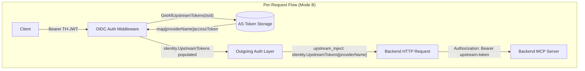

# RFC-00XX: vMCP Upstream Inject Outgoing Auth Strategy

- **Status**: Draft
- **Author(s)**: tgrunnagle
- **Created**: 2026-03-10
- **Last Updated**: 2026-03-10
- **Target Repository**: toolhive
- **Related Issues**: https://github.com/stacklok/stacklok-epics/issues/251
- **Depends On**: RFC-0052 (multi-upstream IDP support), RFC-0053 (embedded AS in vMCP)

## Summary

RFC-0053 wired the embedded authorization server into vMCP and established that `identity.UpstreamTokens` would be populated at auth middleware time — but deferred the outgoing strategy that consumes those tokens. This RFC implements the `upstream_inject` outgoing auth strategy: it reads a named upstream provider's access token from `identity.UpstreamTokens` (a `map[string]string` keyed by provider name) and injects it as an `Authorization: Bearer` header on outgoing backend requests. It also adds an optional `subjectProviderName` enhancement to `token_exchange` for RFC 8693 subject resolution from upstream tokens.

## Problem Statement

### Upstream Tokens Are Stranded

RFC-0052 extended the auth middleware to eagerly populate `identity.UpstreamTokens map[string]string` after TH-JWT validation. RFC-0053 wired the embedded AS into vMCP so those tokens get acquired during the OAuth flow. But no outgoing auth strategy currently reads from `identity.UpstreamTokens`. The tokens are present in the identity at request time and then discarded — backends requiring upstream provider credentials (e.g., a GitHub MCP server needing a GitHub access token, or an Atlassian MCP server needing an Atlassian token) cannot use them.

### token_exchange Subject Ambiguity in Mode B

When vMCP operates in Mode B (embedded AS as the incoming auth provider), `identity.Token` carries a TH-JWT — not an upstream IDP token. The existing `token_exchange` strategy passes `identity.Token` as the RFC 8693 subject. For backends whose STS trusts the TH-AS issuer, this is correct. For backends whose STS trusts the upstream IDP directly (e.g., a corporate STS that validates GitHub tokens), the subject must be the upstream access token from `identity.UpstreamTokens`, not the TH-JWT. There is no mechanism to express this today.

### Who Is Affected

- Platform operators who configure vMCP backends requiring upstream IDP tokens (GitHub, Atlassian, corporate SSO providers).
- Operators using `token_exchange` where the backend STS trusts an upstream IDP rather than the TH-AS issuer.

## Goals

- Implement `UpstreamInjectStrategy` that reads `identity.UpstreamTokens[providerName]` and injects the token as `Authorization: Bearer`.
- Define `ErrUpstreamTokenNotFound` as a sentinel error for future step-up auth signaling (UC-06).
- Add `StrategyTypeUpstreamInject` constant and `UpstreamInjectConfig` struct to the types package.
- Register `upstream_inject` in the outgoing auth factory unconditionally.
- Add Kubernetes CRD support: `ExternalAuthTypeUpstreamInject`, `UpstreamInjectSpec`, and `UpstreamInjectConverter`.
- Implement startup validation rules V-01 and V-02 (declared in RFC-0053, deferred pending this RFC).
- Extend `TokenExchangeConfig` with an optional `SubjectProviderName` field to support RFC 8693 subject resolution from `identity.UpstreamTokens`.

## Non-Goals

- **Step-up auth signaling mechanics**: Intercept `ErrUpstreamTokenNotFound` and redirects the client through a step-up auth flow. That mechanism is a separate RFC; this RFC only defines the sentinel.
- **Actor token (delegation) in token exchange**: Sending the TH-JWT as `actor_token` alongside an upstream `subject_token` is deferred. See Known Limitations §9.1.
- **Token refresh / re-authorization**: Expired tokens in `identity.UpstreamTokens` are included as-is per RFC-0052's design. Transparent refresh is deferred.
- **Step-up flow for `token_exchange`**: `ErrUpstreamTokenNotFound` from a `token_exchange` with `SubjectProviderName` means the front-door token is missing from storage (data loss or eviction). This is a different scenario from a step-up trigger, and is deferred to another RFC.

## Proposed Solution

### High-Level Design



The design is intentionally simple: `UpstreamInjectStrategy` is a **stateless** struct. All state (the upstream token) lives in `identity.UpstreamTokens`, which is populated before the strategy runs. The strategy is a pure function of the identity and the per-backend config — no interface injection, no storage calls at request time.

### Detailed Design

#### Type Changes (`pkg/vmcp/auth/types/types.go`)

Add the `upstream_inject` strategy type constant:

```go
const (
    // ... existing constants ...

    // StrategyTypeUpstreamInject identifies the upstream inject strategy.
    // This strategy reads an upstream IDP access token from identity.UpstreamTokens
    // and injects it as Authorization: Bearer in outgoing backend requests.
    StrategyTypeUpstreamInject = "upstream_inject"
)
```

Add the config struct:

```go
// UpstreamInjectConfig configures the upstream inject auth strategy.
// +kubebuilder:object:generate=true
// +gendoc
type UpstreamInjectConfig struct {
    // ProviderName identifies which upstream provider's token to inject.
    // Must match a provider name configured in the embedded auth server's upstreams list
    // and present in identity.UpstreamTokens at request time.
    ProviderName string `json:"providerName" yaml:"providerName"`
}
```

Add the `ErrUpstreamTokenNotFound` sentinel:

```go
// ErrUpstreamTokenNotFound indicates that no upstream token exists for the requested
// provider in identity.UpstreamTokens. This typically means the user has not yet
// authenticated with that upstream provider and step-up authentication is required.
// Callers should check for this error using errors.Is().
var ErrUpstreamTokenNotFound = errors.New("upstream token not found")
```

Extend `BackendAuthStrategy` with the new variant:

```go
type BackendAuthStrategy struct {
    // Type is the auth strategy: "unauthenticated", "header_injection",
    // "token_exchange", "upstream_inject"
    Type string `json:"type" yaml:"type"`

    // HeaderInjection contains configuration for header injection auth strategy.
    HeaderInjection *HeaderInjectionConfig `json:"headerInjection,omitempty" yaml:"headerInjection,omitempty"`

    // TokenExchange contains configuration for token exchange auth strategy.
    TokenExchange *TokenExchangeConfig `json:"tokenExchange,omitempty" yaml:"tokenExchange,omitempty"`

    // UpstreamInject contains configuration for the upstream inject auth strategy.
    // Required when Type = "upstream_inject".
    UpstreamInject *UpstreamInjectConfig `json:"upstreamInject,omitempty" yaml:"upstreamInject,omitempty"`
}
```

#### token_exchange Enhancement: SubjectProviderName (`pkg/vmcp/auth/types/types.go`)

Add an optional field to `TokenExchangeConfig`:

```go
type TokenExchangeConfig struct {
    // ... existing fields unchanged ...

    // SubjectProviderName, when set, causes the strategy to use
    // identity.UpstreamTokens[SubjectProviderName] as the RFC 8693 subject token
    // instead of identity.Token. Use this when the backend STS trusts an upstream IDP
    // directly rather than the TH-AS issuer.
    // +optional
    SubjectProviderName string `json:"subjectProviderName,omitempty" yaml:"subjectProviderName,omitempty"`
}
```

This is a backward-compatible additive change. Existing `token_exchange` configs without `SubjectProviderName` behave exactly as today.

#### New Strategy: UpstreamInjectStrategy (`pkg/vmcp/auth/strategies/upstream_inject.go`)

```go
// UpstreamInjectStrategy injects an upstream IDP access token as Authorization: Bearer.
//
// The token is read from identity.UpstreamTokens (populated by the auth middleware
// after TH-JWT validation). This strategy is stateless — all state comes from the
// pre-enriched identity in the request context.
//
// Returns ErrUpstreamTokenNotFound when the requested provider's token is absent
// from identity.UpstreamTokens, which is the signal for step-up authentication (UC-06).
type UpstreamInjectStrategy struct{}

func NewUpstreamInjectStrategy() *UpstreamInjectStrategy {
    return &UpstreamInjectStrategy{}
}

func (*UpstreamInjectStrategy) Name() string {
    return authtypes.StrategyTypeUpstreamInject
}

func (s *UpstreamInjectStrategy) Authenticate(
    ctx context.Context, req *http.Request, strategy *authtypes.BackendAuthStrategy,
) error {
    if health.IsHealthCheck(ctx) {
        return nil
    }

    if strategy == nil || strategy.UpstreamInject == nil {
        return fmt.Errorf("upstream_inject configuration is required")
    }

    identity, ok := auth.IdentityFromContext(ctx)
    if !ok {
        return fmt.Errorf("no identity found in context")
    }

    providerName := strategy.UpstreamInject.ProviderName
    token, ok := identity.UpstreamTokens[providerName]
    if !ok || token == "" {
        return fmt.Errorf("upstream_inject provider %q: %w", providerName, authtypes.ErrUpstreamTokenNotFound)
    }

    req.Header.Set("Authorization", "Bearer "+token)
    return nil
}

func (*UpstreamInjectStrategy) Validate(strategy *authtypes.BackendAuthStrategy) error {
    if strategy == nil || strategy.UpstreamInject == nil {
        return fmt.Errorf("UpstreamInject configuration is required")
    }
    if strategy.UpstreamInject.ProviderName == "" {
        return fmt.Errorf("ProviderName is required in upstream_inject configuration")
    }
    return nil
}
```

Key properties:
- **Stateless**: No fields, no mutexes, no caches. Token comes from the context.
- **Bearer-only**: Always injects as `Authorization: Bearer`. Non-Bearer formats use `header_injection`.
- **No token logging**: Error messages include the provider name but never the token value.
- **`ErrUpstreamTokenNotFound` propagation**: Wrapped with `%w` so `errors.Is()` matching works for UC-06.
- **Health check bypass**: Consistent with all other strategies.

#### Enhanced TokenExchangeStrategy (`pkg/vmcp/auth/strategies/tokenexchange.go`)

When `SubjectProviderName` is set, resolve the subject token from `identity.UpstreamTokens` instead of `identity.Token`. The change is a targeted addition to `Authenticate()`, immediately before `createUserConfig`:

```go
func (s *TokenExchangeStrategy) Authenticate(
    ctx context.Context, req *http.Request, strategy *authtypes.BackendAuthStrategy,
) error {
    if health.IsHealthCheck(ctx) {
        return nil
    }

    identity, ok := auth.IdentityFromContext(ctx)
    if !ok {
        return fmt.Errorf("no identity found in context")
    }

    if identity.Token == "" {
        return fmt.Errorf("identity has no token")
    }

    config, err := s.parseTokenExchangeConfig(strategy)
    if err != nil {
        return fmt.Errorf("invalid strategy configuration: %w", err)
    }

    // Resolve subject token: upstream provider token or identity.Token (default)
    subjectToken := identity.Token
    if config.SubjectProviderName != "" {
        upstream, ok := identity.UpstreamTokens[config.SubjectProviderName]
        if !ok || upstream == "" {
            return fmt.Errorf("token_exchange subjectProvider %q: %w",
                config.SubjectProviderName, authtypes.ErrUpstreamTokenNotFound)
        }
        subjectToken = upstream
    }

    exchangeConfig := s.createUserConfig(config, subjectToken)
    tokenSource := exchangeConfig.TokenSource(ctx)

    token, err := tokenSource.Token()
    if err != nil {
        return fmt.Errorf("token exchange failed: %w", err)
    }

    req.Header.Set("Authorization", fmt.Sprintf("Bearer %s", token.AccessToken))
    return nil
}
```

The internal `tokenExchangeConfig` struct gains a corresponding `SubjectProviderName` field so `parseTokenExchangeConfig` can thread it through. `buildCacheKey` does **not** include `SubjectProviderName` — the per-server `ExchangeConfig` template is independent of which user subject token is used. The subject token is set per-user in `createUserConfig`, which is unchanged.

#### Factory Changes (`pkg/vmcp/auth/factory/outgoing.go`)

No signature changes. Register `upstream_inject` unconditionally alongside the other strategies:

```go
func NewOutgoingAuthRegistry(
    _ context.Context,
    envReader env.Reader,
) (auth.OutgoingAuthRegistry, error) {
    registry := auth.NewDefaultOutgoingAuthRegistry()

    if err := registry.RegisterStrategy(
        authtypes.StrategyTypeUnauthenticated,
        strategies.NewUnauthenticatedStrategy(),
    ); err != nil {
        return nil, err
    }
    if err := registry.RegisterStrategy(
        authtypes.StrategyTypeHeaderInjection,
        strategies.NewHeaderInjectionStrategy(),
    ); err != nil {
        return nil, err
    }
    if err := registry.RegisterStrategy(
        authtypes.StrategyTypeTokenExchange,
        strategies.NewTokenExchangeStrategy(envReader),
    ); err != nil {
        return nil, err
    }
    if err := registry.RegisterStrategy(
        authtypes.StrategyTypeUpstreamInject,
        strategies.NewUpstreamInjectStrategy(),
    ); err != nil {
        return nil, err
    }

    return registry, nil
}
```

`upstream_inject` is stateless and cheap to register. Startup validation (V-01/V-02 below) prevents misconfiguration from reaching the strategy; the strategy itself fails gracefully with `ErrUpstreamTokenNotFound` if `identity.UpstreamTokens` is empty (Mode A with no AS).

#### Startup Validation Rules (V-01 and V-02) (`pkg/vmcp/config/validator.go`)

RFC-0053 declared validation rules V-01 through V-07 and scaffolded `validateAuthServerIntegration`. This RFC implements the `upstream_inject`-specific rules that were deferred because they depend on `UpstreamInjectConfig` being defined:

| ID | Rule | Severity | When |
|----|------|----------|------|
| V-01 | `upstream_inject` configured but no AS present | Error | Startup (YAML), Operator reconciler (K8s) |
| V-02 | `upstream_inject` `providerName` not in AS upstream list | Error | Startup (YAML), Operator reconciler (K8s) |
| V-06 | `upstream_inject` `providerName` is empty | Error | Startup (YAML), Operator reconciler (K8s) |

These are added to the `upstream_inject` case in `validateAuthServerIntegration`:

```go
case authtypes.StrategyTypeUpstreamInject:
    // V-01
    if !asConfigured {
        return fmt.Errorf(
            "outgoingAuth backend %q uses upstream_inject but no authServer is configured; "+
                "upstream_inject requires identity.UpstreamTokens which is only populated "+
                "when the embedded auth server is active",
            backendName)
    }
    // V-06
    if strategy.UpstreamInject == nil || strategy.UpstreamInject.ProviderName == "" {
        return fmt.Errorf(
            "outgoingAuth backend %q upstream_inject requires a non-empty providerName",
            backendName)
    }
    // V-02
    if !hasUpstreamProvider(cfg.AuthServer.RunConfig, strategy.UpstreamInject.ProviderName) {
        return fmt.Errorf(
            "outgoingAuth backend %q references upstream provider %q which is not "+
                "configured in authServer.runConfig.upstreams",
            backendName, strategy.UpstreamInject.ProviderName)
    }
```

#### CRD Changes (`cmd/thv-operator/api/v1alpha1/mcpexternalauthconfig_types.go`)

Add the `upstreamInject` auth type constant:

```go
const (
    // ... existing constants ...

    // ExternalAuthTypeUpstreamInject is the type for upstream token injection.
    // Uses the embedded auth server's upstream token storage to inject provider
    // tokens as Bearer tokens in outgoing requests.
    ExternalAuthTypeUpstreamInject ExternalAuthType = "upstreamInject"
)
```

Add spec fields:

```go
type MCPExternalAuthConfigSpec struct {
    // ... existing fields ...

    // UpstreamInject specifies configuration for the upstream inject auth type.
    // Required when type is "upstreamInject".
    UpstreamInject *UpstreamInjectSpec `json:"upstreamInject,omitempty"`
}

// UpstreamInjectSpec configures upstream token injection for a backend.
type UpstreamInjectSpec struct {
    // ProviderName identifies which upstream provider's token to inject.
    // Must match a provider name configured in the embedded auth server.
    // +kubebuilder:validation:MinLength=1
    ProviderName string `json:"providerName"`
}
```

Add validation using the existing equivalence check pattern:

```go
// spec/type equivalence check
if (r.Spec.UpstreamInject == nil) == (r.Spec.Type == ExternalAuthTypeUpstreamInject) {
    return fmt.Errorf("upstreamInject must be set when and only when type is upstreamInject")
}

// per-type validation
case ExternalAuthTypeUpstreamInject:
    if r.Spec.UpstreamInject.ProviderName == "" {
        return fmt.Errorf("upstreamInject.providerName is required")
    }
```

#### New Converter (`pkg/vmcp/auth/converters/upstream_inject.go`)

```go
type UpstreamInjectConverter struct{}

func (*UpstreamInjectConverter) StrategyType() string {
    return authtypes.StrategyTypeUpstreamInject
}

func (*UpstreamInjectConverter) ConvertToStrategy(
    externalAuth *mcpv1alpha1.MCPExternalAuthConfig,
) (*authtypes.BackendAuthStrategy, error) {
    if externalAuth.Spec.UpstreamInject == nil {
        return nil, fmt.Errorf("upstreamInject spec is required for type upstreamInject")
    }
    return &authtypes.BackendAuthStrategy{
        Type: authtypes.StrategyTypeUpstreamInject,
        UpstreamInject: &authtypes.UpstreamInjectConfig{
            ProviderName: externalAuth.Spec.UpstreamInject.ProviderName,
        },
    }, nil
}

func (*UpstreamInjectConverter) ResolveSecrets(
    _ context.Context,
    _ *mcpv1alpha1.MCPExternalAuthConfig,
    _ client.Client,
    _ string,
    strategy *authtypes.BackendAuthStrategy,
) (*authtypes.BackendAuthStrategy, error) {
    // No secrets to resolve — upstream tokens are fetched from the auth server at
    // runtime, not from static configuration.
    return strategy, nil
}
```

Register in `NewRegistry()`:

```go
r.Register(mcpv1alpha1.ExternalAuthTypeUpstreamInject, &UpstreamInjectConverter{})
```

#### TokenExchangeConfig CRD Changes (`cmd/thv-operator/api/v1alpha1/mcpexternalauthconfig_types.go`)

Add `subjectProviderName` to the existing `TokenExchangeConfig` CRD struct so Kubernetes operators can configure upstream-subject token exchange without needing the YAML path:

```go
type TokenExchangeConfig struct {
    // ... existing fields unchanged ...

    // SubjectProviderName, when set, causes the strategy to use
    // identity.UpstreamTokens[SubjectProviderName] as the RFC 8693 subject token
    // instead of identity.Token. Use this when the backend STS trusts an upstream IDP
    // directly rather than the TH-AS issuer.
    // The named provider must be configured in the VirtualMCPServer's embedded auth server.
    // +optional
    SubjectProviderName string `json:"subjectProviderName,omitempty"`
}
```

Update `TokenExchangeConverter.ConvertToStrategy()` to populate the new field:

```go
tokenExchangeConfig := &authtypes.TokenExchangeConfig{
    TokenURL:            tokenExchange.TokenURL,
    ClientID:            tokenExchange.ClientID,
    Audience:            tokenExchange.Audience,
    Scopes:              tokenExchange.Scopes,
    SubjectTokenType:    subjectTokenType,
    SubjectProviderName: tokenExchange.SubjectProviderName, // NEW
}
```

No new CRD validation rule is required for `SubjectProviderName` in the CRD type itself — the cross-cutting check that the named provider exists in the AS upstream list is handled by the V-02 rule in the operator reconciler (which also covers `upstream_inject`). The field is optional and may be empty.

#### Configuration Examples

YAML (Mode B — two backends use different upstream providers):

```yaml
authServer:
  runConfig:
    issuer: "http://vmcp-service.my-namespace.svc.cluster.local:4483"
    upstreams:
      - name: github
        type: oauth
        # ... GitHub OAuth app config ...
      - name: atlassian
        type: oidc
        oidc_config:
          issuer_url: "https://atlassian.example.com"
          # ...
    allowed_audiences:
      - "http://vmcp-service.my-namespace.svc.cluster.local:4483"

outgoingAuth:
  source: inline
  backends:
    github-tools:
      type: upstream_inject
      upstreamInject:
        providerName: github
    atlassian-tools:
      type: upstream_inject
      upstreamInject:
        providerName: atlassian
    corporate-api:
      # STS trusts upstream corporate IDP directly, not the TH-AS
      type: token_exchange
      tokenExchange:
        tokenUrl: https://corp-sts.example.com/token
        audience: https://corp-api.example.com
        subjectProviderName: corporate-idp   # NEW: use upstream token as subject
    internal-api:
      type: header_injection
      headerInjection:
        headerName: X-API-Key
        headerValueEnv: INTERNAL_API_KEY
```

Kubernetes CRD (MCPExternalAuthConfig for upstream inject):

```yaml
apiVersion: toolhive.stacklok.io/v1alpha1
kind: MCPExternalAuthConfig
metadata:
  name: github-tools-auth
  namespace: my-namespace
spec:
  type: upstreamInject
  upstreamInject:
    providerName: github
```

## Security Considerations

### Threat Model

**Threat 1: Provider name injection**. If `providerName` were populated from user input, an attacker could specify any provider name to obtain any upstream token. Mitigation: `providerName` comes entirely from the operator-controlled `BackendAuthStrategy` config (YAML or CRD), never from the client request. No user input flows into provider name selection.

**Threat 2: Token theft via error messages**. An error message containing the token value would expose credentials in logs. Mitigation: `UpstreamInjectStrategy.Authenticate()` never logs or formats the token value. Error messages include only the provider name (e.g., `"upstream_inject provider \"github\": upstream token not found"`).

**Threat 3: Token scope creep**. A backend could receive a token for the wrong provider if the config is misconfigured (e.g., wrong `providerName`). Mitigation: V-02 validates at startup that every `providerName` referenced in an `upstream_inject` config matches a provider in the AS's upstream list. Runtime mismatches return `ErrUpstreamTokenNotFound` (no token is injected).

**Threat 4: Expired token injection**. Upstream tokens in `identity.UpstreamTokens` may be expired per RFC-0052's current design (expired tokens are included as-is). An expired token injected into a backend request will fail at the backend with a 401. Mitigation: Backends surface their own expiry errors. Token refresh is deferred to a separate RFC; no silent injection of expired tokens into requests that might succeed.

**Threat 5: Token leakage from `identity.UpstreamTokens` in Mode A**. In Mode A (no embedded AS), `identity.UpstreamTokens` is nil or empty. If `upstream_inject` is configured in Mode A, the strategy returns `ErrUpstreamTokenNotFound` rather than injecting anything. V-01 prevents this configuration from reaching production (startup error). Defense in depth: the strategy fails safely even if V-01 is somehow bypassed.

### Authentication and Authorization

The `upstream_inject` strategy operates at the outgoing auth boundary (Boundary 2). It does not participate in incoming auth (Boundary 1). The identity's `sub` and `claims` (from the TH-JWT) remain the basis for authorization decisions (Cedar policies); the upstream tokens are credentials for backend calls only.

`identity.UpstreamTokens` is populated per-request from the auth server's session storage, keyed by the `tsid` claim in the validated TH-JWT. Each request only receives tokens for its own session, enforced by the auth middleware. The strategy cannot access another user's tokens.

### Data Security

- `identity.UpstreamTokens` is a request-scoped map stored in the Go context. It is not persisted beyond the request lifetime.
- Upstream tokens are not logged by the strategy. All error messages reference provider names only.
- The `ErrUpstreamTokenNotFound` error carries the provider name but not the token value.
- Upstream tokens are not included in MCP protocol responses or error bodies.

### Input Validation

- `providerName` is validated at two layers: CRD admission (non-empty, correct type equivalence) and startup validation V-02 (name exists in AS config). The strategy validates structural completeness in `Validate()`.
- The strategy itself checks that `identity.UpstreamTokens[providerName]` is both present and non-empty before injecting. An empty string is treated equivalently to a missing key.

### Secrets Management

The `upstream_inject` strategy has no secrets in its configuration: there are no static credentials, API keys, or client secrets. The upstream token itself is a runtime value from the AS session storage, not a config secret. All secrets for obtaining the upstream token (upstream IDP `clientSecret`, signing keys) are managed by the AS configuration (see RFC-0053).

### Audit and Logging

Security-relevant events to log:
- `ErrUpstreamTokenNotFound` returned by `upstream_inject`: WARN level, include provider name and backend name. This is the signal that a step-up auth flow may be needed.
- Startup validation failures V-01, V-02: ERROR level (hard startup failure), include backend name and provider name.

No token values, access tokens, or credential material should appear in log output at any level.

### Mitigations

| Threat | Mitigation |
|--------|-----------|
| Provider name injection | `providerName` is operator-controlled config, never from client input |
| Token in error messages | Errors include provider name only, never token value |
| Token scope creep | V-02 startup validation; runtime `ErrUpstreamTokenNotFound` on mismatch |
| Expired token injection | Backend surfaces its own expiry errors; token refresh deferred to future RFC |
| Mode A misconfig | V-01 startup error; strategy returns `ErrUpstreamTokenNotFound` as defense in depth |

## Alternatives Considered

### Alternative 1: UpstreamTokenSource Interface

An `UpstreamTokenSource` interface that strategies call at request time: `tokenSource.GetToken(ctx, providerName)`. The factory would receive this interface as a parameter (nil when no AS), and `upstream_inject` would only be registered when it was non-nil.

**Pros**: Lazy token lookup (only fetches when needed); testable via mock interface; clearly gates registration.

**Cons**: Adds an interface dependency to the factory and strategy. Requires mock generation for `UpstreamTokenSource`. Inconsistent with RFC-0052's eager-load pattern. Registration gating via nil check is equivalent to startup validation V-01 but less explicit.

**Why not chosen**: RFC-0052 established the pattern of eagerly loading upstream tokens into `identity.UpstreamTokens` at auth middleware time. Using this map directly in strategies is consistent, simpler, and removes an interface layer. Unit tests populate `identity.UpstreamTokens` directly — no mock interface needed. Startup validation V-01/V-02 provides equivalent protection against misconfiguration with clearer error messages.

### Alternative 2: Auto-Detect Front-Door Provider in token_exchange

Instead of a `subjectProviderName` field, `token_exchange` could automatically switch to using an upstream token when `identity.UpstreamTokens` is non-empty, using the "first" provider.

**Pros**: No config change required.

**Cons**: Map iteration order is non-deterministic in Go. "First" is not well-defined. Silent behavior change for existing `token_exchange` deployments that happen to have `identity.UpstreamTokens` populated. Very hard to debug when the wrong provider's token is used as the subject.

**Why not chosen**: Explicit is better than implicit. The `subjectProviderName` field makes the operator's intent clear and avoids non-deterministic behavior. The RFC-0053 V-03 warning about "subject token semantics change" is exactly the kind of scenario that benefits from explicit operator configuration.

### Alternative 3: New Strategy Type for token_exchange with Upstream Subject

Rather than adding `subjectProviderName` to `TokenExchangeConfig`, define a new strategy type (e.g., `upstream_token_exchange`) that is exclusively for the upstream-subject use case.

**Pros**: Clean separation of the two `token_exchange` variants. No ambiguity about when `subjectProviderName` applies.

**Cons**: Doubles the number of strategy types and converters for what is a minor behavioral variation. Operators would need to migrate existing `token_exchange` backends if they want to add upstream subject behavior.

**Why not chosen**: `SubjectProviderName` is optional and backward-compatible. The behavioral change (using upstream token as subject vs. TH-JWT) is a natural extension of the existing `token_exchange` parameters that already configure the subject token type. A new strategy type adds complexity without proportional benefit.

## Compatibility

### Backward Compatibility

All changes are additive:

- `StrategyTypeUpstreamInject`, `UpstreamInjectConfig`, `UpstreamInject` field, `ErrUpstreamTokenNotFound`, and `SubjectProviderName` are new additions to types. Existing callers are unaffected.
- `NewOutgoingAuthRegistry` signature is unchanged. Registering `upstream_inject` unconditionally is safe — it adds no overhead for Mode A deployments since the strategy is only invoked for backends that configure `type: upstream_inject`.
- `TokenExchangeStrategy.Authenticate()` is unchanged for configs without `SubjectProviderName`. The new code path only runs when `config.SubjectProviderName != ""`.
- `ExternalAuthTypeUpstreamInject`, `UpstreamInjectSpec`, and `UpstreamInjectConverter` are new additions. Existing `MCPExternalAuthConfig` resources of other types are unaffected.
- `zz_generated.deepcopy.go` is regenerated — this is always backward-compatible since generated code follows the same type structure.

### Forward Compatibility

- `ErrUpstreamTokenNotFound` is defined as a sentinel for UC-06 (step-up auth signaling). UC-06 uses `errors.Is()` to intercept it, which works across wrapping chains. If UC-06 later needs to extract the provider name, it can promote to a typed error without breaking existing `errors.Is()` checks (since the typed error can still implement `Is(target error) bool`).
- `upstream_inject` is Bearer-only by design. If a future use case requires non-Bearer upstream token injection, `header_injection` already covers that case. If a future use case requires injecting the upstream token in a different format (e.g., URL parameter, cookie), a new strategy type should be added.
- The `SubjectProviderName` field in `TokenExchangeConfig` can be extended to support the actor token (delegation) use case by adding `ActorProviderName` as a parallel field when that use case materializes.

## Implementation Plan

### Phase 1: Core types and sentinel (no behavior change)

- Add `StrategyTypeUpstreamInject`, `UpstreamInjectConfig`, `UpstreamInject` field to `BackendAuthStrategy`, and `ErrUpstreamTokenNotFound` to `pkg/vmcp/auth/types/types.go`.
- Add `SubjectProviderName` to `TokenExchangeConfig`.
- Regenerate `zz_generated.deepcopy.go`.
- No runtime change — new fields are optional and unused.

### Phase 2: Strategy implementations

- Implement `UpstreamInjectStrategy` in `pkg/vmcp/auth/strategies/upstream_inject.go`.
- Update `TokenExchangeStrategy.Authenticate()` and its internal `tokenExchangeConfig` for `SubjectProviderName`.
- Register `upstream_inject` in `pkg/vmcp/auth/factory/outgoing.go`.
- Unit tests for both strategies.

### Phase 3: Startup validation

- Implement V-01, V-02, V-06 cases in `validateAuthServerIntegration` in `pkg/vmcp/config/validator.go`.
- Unit tests for all three rules (both positive and negative cases).

### Phase 4: CRD and converter

- Add `ExternalAuthTypeUpstreamInject`, `UpstreamInjectSpec`, and CRD validation to `cmd/thv-operator/api/v1alpha1/mcpexternalauthconfig_types.go`.
- Add `SubjectProviderName` to the CRD's `TokenExchangeConfig` struct.
- Implement `UpstreamInjectConverter` in `pkg/vmcp/auth/converters/upstream_inject.go`.
- Update `TokenExchangeConverter.ConvertToStrategy()` to populate `SubjectProviderName`.
- Register `UpstreamInjectConverter` in `NewRegistry()`.
- Unit tests for `UpstreamInjectConverter` and updated `TokenExchangeConverter`.

### Dependencies

- **RFC-0052** (multi-upstream IDP): Required for `identity.UpstreamTokens` to be defined and populated. This RFC's strategy reads from that map; without RFC-0052, the map is always nil.
- **RFC-0053** (embedded AS in vMCP): Required for the AS to be wired into vMCP so that `identity.UpstreamTokens` gets populated at request time. The startup validation rules (V-01/V-02) also reference `cfg.AuthServer.RunConfig`, which is the field introduced by RFC-0053.

## Testing Strategy

### Unit Tests

**`pkg/vmcp/auth/strategies/upstream_inject_test.go`** — table-driven:

| Test Case | Input | Expected Output |
|-----------|-------|-----------------|
| Happy path | `UpstreamTokens["github"] = "tok-abc"`, strategy `providerName: github` | `Authorization: Bearer tok-abc` set |
| Token not found | `UpstreamTokens` empty, strategy `providerName: github` | `errors.Is(err, ErrUpstreamTokenNotFound) == true` |
| Empty token value | `UpstreamTokens["github"] = ""` | Same as token not found |
| Health check | `IsHealthCheck(ctx) == true` | `nil` returned, no header set |
| Nil strategy | `strategy == nil` | Error (not `ErrUpstreamTokenNotFound`) |
| Nil UpstreamInject | `strategy.UpstreamInject == nil` | Error (not `ErrUpstreamTokenNotFound`) |
| `Validate`: valid | `providerName: "github"` | `nil` |
| `Validate`: empty provider | `providerName: ""` | Error |
| `Validate`: nil config | `strategy == nil` | Error |

**`pkg/vmcp/auth/strategies/tokenexchange_test.go`** — additions:

- `SubjectProviderName` set: verify upstream token used as subject instead of `identity.Token`.
- `SubjectProviderName` set but provider absent: verify `ErrUpstreamTokenNotFound` returned.
- `SubjectProviderName` absent (existing behavior): verify `identity.Token` used as subject (regression test).

**`pkg/vmcp/config/validator_test.go`** — additions (table-driven entries for V-01, V-02, V-06):

- V-01: `upstream_inject` backend, `AuthServer == nil` → Error containing "no authServer configured".
- V-02: `upstream_inject` backend, `providerName: "unknown"`, AS has `["github"]` → Error containing "unknown".
- V-06: `upstream_inject` backend, `providerName: ""` → Error containing "non-empty providerName".
- Positive: `upstream_inject` backend, valid AS with matching provider → `nil`.

**`pkg/vmcp/auth/converters/upstream_inject_test.go`**:

- `ConvertToStrategy`: valid spec → `BackendAuthStrategy` with `Type == "upstream_inject"` and `UpstreamInject.ProviderName` set.
- `ConvertToStrategy`: nil `UpstreamInject` spec → Error.
- `ResolveSecrets`: pass-through — output equals input.

### Integration Tests

No new integration tests required. The full flow (AS auth → token storage → middleware enrichment → strategy injection) is covered by the e2e tests specified in RFC-0053.

### End-to-End Tests

**`test/e2e/vmcp_upstream_inject_test.go`** — additions to the vMCP auth server test suite:

- Start vMCP in Mode B with a mock upstream IDP. Perform the full auth flow (authorize → callback → TH-JWT). Make an MCP request to a backend configured with `upstream_inject`. Verify the backend receives the expected upstream token as the `Authorization: Bearer` header.
- V-01 negative: Start vMCP with `upstream_inject` backend but no `authServer` configured → process exits with the V-01 error message.

## Documentation

- **`docs/arch/02-core-concepts.md`**: Document the outgoing auth strategies including `upstream_inject` and when to use it vs `header_injection` vs `token_exchange`.
- **vMCP auth guide** (`docs/vmcp-auth.md` or similar): Configuration walkthrough for `upstream_inject` with example YAML. Explain that `identity.UpstreamTokens` is populated only in Mode B and why V-01 prevents Mode A misconfiguration.
- **Generated CRD documentation**: Run `task docs` to regenerate CLI and CRD documentation after type additions.

## Decisions

The following design questions were resolved during RFC review:

1. **`ErrUpstreamTokenNotFound` stays a sentinel.** `var ErrUpstreamTokenNotFound = errors.New("...")` is sufficient. UC-06 uses `errors.Is()` for the binary "trigger step-up / don't trigger" decision. The provider name is available in the wrapping error message if needed. Promoting to a typed struct would add complexity without benefit for the current use case; if UC-06 requires structured provider extraction, it can be promoted at that point.

2. **`SubjectProviderName` is exposed in the CRD.** `TokenExchangeConfig` in `MCPExternalAuthConfig` gains a `subjectProviderName` field so Kubernetes operators can configure upstream-subject token exchange without the YAML path. `TokenExchangeConverter.ConvertToStrategy()` is updated to populate it. See the "TokenExchangeConfig CRD Changes" section above.

3. **Expired upstream tokens are injected as-is.** `upstream_inject` does not check `ExpiresAt`. The backend 401 surfaces the expiry problem. Expiry-aware behavior (checking `ExpiresAt` and returning `ErrUpstreamTokenNotFound` to trigger step-up) is deferred to the token-refresh RFC, which will also change `identity.UpstreamTokens` from `map[string]string` to a richer struct carrying expiry metadata.

## References

- [RFC 8693: OAuth 2.0 Token Exchange](https://datatracker.ietf.org/doc/html/rfc8693)

---

## RFC Lifecycle

<!-- This section is maintained by RFC reviewers -->

### Review History

| Date | Reviewer | Decision | Notes |
|------|----------|----------|-------|
| 2026-03-10 | | Under Review | Initial submission |

### Implementation Tracking

| Repository | PR | Status |
|------------|-----|--------|
| toolhive | | Pending |
