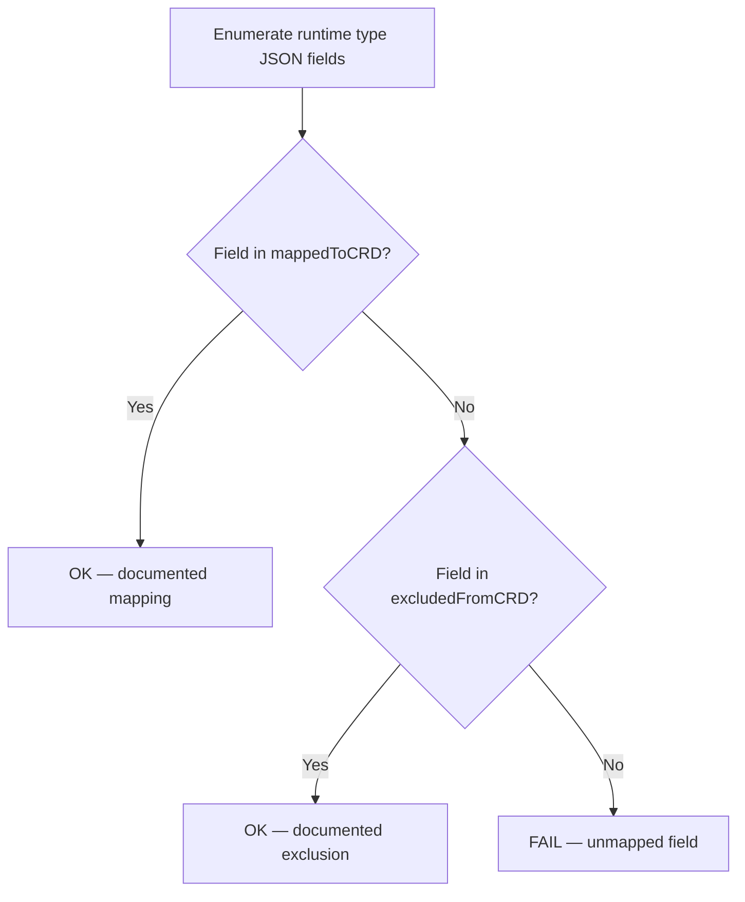

# RFC-XXXX: Drift Detection Tests for CRD-to-Runtime Type Mappings

- **Status**: Draft
- **Author(s)**: Chris Burns (@chrisburns)
- **Created**: 2026-04-02
- **Last Updated**: 2026-04-02
- **Target Repository**: toolhive
- **Related Issues**: [toolhive#3118](https://github.com/stacklok/toolhive/pull/3118), [toolhive#3125](https://github.com/stacklok/toolhive/issues/3125)

## Summary

Add reflection-based drift detection tests alongside each CRD-to-runtime conversion function in the operator. These tests enumerate fields on both sides of a conversion boundary and fail when a field is neither mapped nor explicitly excluded, turning silent configuration drift into an immediate test failure.

## Problem Statement

ToolHive's operator defines CRD types (e.g., `MCPTelemetryOTelConfig`, `OpenTelemetryConfig`) that are structurally distinct from their runtime counterparts (e.g., `telemetry.Config`). This is by design — the CRD types use a nested structure for better UX, exclude CLI-only fields, and add K8s-specific fields like `sensitiveHeaders`. A thin conversion layer in `cmd/thv-operator/pkg/spectoconfig/` maps between them.

This separation provides important benefits:

- **No field leakage** — CLI-only fields like `environmentVariables` and per-server fields like `serviceName` don't appear in the CRD schema
- **Independent evolution** — adding a CLI flag doesn't change the CRD's API surface
- **Clean CRD UX** — nested `openTelemetry`/`prometheus` structure vs flat config

However, it introduces a maintenance risk: when a field is added to either the CRD type or the runtime config type, the conversion layer and the other type may not be updated. This has historically caused silent bugs (PR #3118, issue #3125) where configuration appeared to work in tests but failed through the CRD path.

Today, the only way to catch a missed field mapping is:

1. **Manual code review** — unreliable for large PRs
2. **An integration or e2e test** that exercises the specific field end-to-end — expensive to write, easy to miss

Neither approach scales. A developer adding a field to `telemetry.Config` for a CLI feature has no signal that the CRD conversion layer needs attention — the code compiles, unit tests pass, and the drift is invisible until a user hits it.

## Goals

- **Catch field drift at test time** — any new, renamed, or removed field on either side of a CRD-to-runtime conversion boundary must be explicitly accounted for.
- **Produce clear, actionable error messages** — test failures should name the exact field and the action required (add to mapping or exclusion list).
- **Serve as living documentation** — the exclusion and mapping lists explain the relationship between CRD and runtime types, reviewable in PRs.
- **Be lightweight and self-contained** — no new dependencies, no code generation, ~50 lines per conversion boundary.

## Non-Goals

- **Automated conversion code generation** — the tests detect drift, they do not generate or fix conversion code.
- **Runtime validation** — this is a developer-time safety net, not an admission webhook or runtime check.
- **Replacing integration tests** — drift detection tests verify field coverage, not correctness of the conversion logic itself. Existing tests in `spectoconfig/telemetry_test.go` and `vmcpconfig/converter_test.go` continue to validate behavior.
- **Covering types that directly embed runtime types** — CRDs like `VirtualMCPServer` that embed `config.Config` (which contains `telemetry.Config` directly) have no conversion layer to drift.

## Proposed Solution

### High-Level Design

Each CRD conversion function gets a companion drift detection test. The test uses Go reflection to enumerate the JSON-tagged fields on both the runtime type and the CRD type, then asserts that every field is present in one of two maps:



### Detailed Design

#### The `jsonFieldNames` Helper

A shared test utility extracts JSON field names from a struct type via reflection:

```go
// jsonFieldNames returns the JSON field names for all exported fields
// of the given struct type. It uses the json struct tag if present,
// falling back to the Go field name.
func jsonFieldNames(t reflect.Type) []string {
    var names []string
    for i := 0; i < t.NumField(); i++ {
        field := t.Field(i)
        if !field.IsExported() {
            continue
        }
        name := field.Name
        if tag, ok := field.Tag.Lookup("json"); ok {
            parts := strings.Split(tag, ",")
            if parts[0] != "" && parts[0] != "-" {
                name = parts[0]
            }
        }
        names = append(names, name)
    }
    return names
}
```

This helper lives in a shared test utilities package (e.g., `cmd/thv-operator/internal/testutil/`) so it can be reused across all conversion boundary tests.

#### Example: Telemetry Config Field Coverage Test

```go
func TestTelemetryConfigFieldCoverage(t *testing.T) {
    t.Parallel()

    // Fields in telemetry.Config intentionally NOT in the CRD.
    // Adding a field here requires a justification comment.
    excludedFromCRD := map[string]string{
        "serviceName":          "per-server field, set via MCPTelemetryConfigReference",
        "serviceVersion":       "resolved at runtime from binary version",
        "environmentVariables": "CLI-only, not applicable to CRD-managed telemetry",
        "customAttributes":     "replaced by resourceAttributes in the CRD",
    }

    // Mapping from telemetry.Config JSON field → CRD location.
    // Documents the conversion performed by NormalizeMCPTelemetryConfig.
    mappedToCRD := map[string]string{
        "endpoint":                    "MCPTelemetryOTelConfig.Endpoint",
        "tracingEnabled":              "OpenTelemetryTracingConfig.Enabled",
        "metricsEnabled":              "OpenTelemetryMetricsConfig.Enabled",
        "samplingRate":                "OpenTelemetryTracingConfig.SamplingRate",
        "headers":                     "MCPTelemetryOTelConfig.Headers",
        "insecure":                    "MCPTelemetryOTelConfig.Insecure",
        "enablePrometheusMetricsPath": "PrometheusConfig.Enabled",
        "useLegacyAttributes":         "MCPTelemetryOTelConfig.UseLegacyAttributes",
    }

    configFields := jsonFieldNames(reflect.TypeOf(telemetry.Config{}))

    for _, field := range configFields {
        if _, excluded := excludedFromCRD[field]; excluded {
            continue
        }
        if _, mapped := mappedToCRD[field]; mapped {
            continue
        }
        t.Errorf("telemetry.Config field %q is not mapped in "+
            "NormalizeMCPTelemetryConfig and not in the exclusion list.\n"+
            "Add it to mappedToCRD (if it should be converted) or "+
            "excludedFromCRD (with justification) in this test.", field)
    }
}
```

#### What This Catches

| Scenario | Without drift test | With drift test |
|---|---|---|
| New field added to `telemetry.Config` for CLI | Silent — field missing from CRD conversion, users never see it | Test fails — developer must add to mapping or exclusion list |
| New field added to CRD type | Works, but no validation it maps to runtime correctly | Test fails — developer must document the mapping |
| Field renamed in `telemetry.Config` | Conversion breaks silently — old name mapped, new name ignored | Test fails — old mapping name no longer matches |
| Field removed from `telemetry.Config` | Conversion references non-existent field — compile error (already caught) | Same — compile error |

#### The Exclusion List as Documentation

The `excludedFromCRD` map serves double duty:

1. **Test assertion** — the test passes only if every field is accounted for
2. **Living documentation** — explains *why* each field is excluded, reviewable in PRs

```go
excludedFromCRD := map[string]string{
    "serviceName":          "per-server field, set via MCPTelemetryConfigReference",
    "environmentVariables": "CLI-only, not applicable to CRD-managed telemetry",
}
```

Adding a field to this map requires a justification string. This forces the conversation during code review: "Why is this field excluded from the CRD?"

#### Scope of Application

This pattern applies to any CRD type that has a conversion layer to a runtime config type:

| CRD Type | Runtime Type | Conversion Function | Location |
|---|---|---|---|
| `TelemetryConfig` / `OpenTelemetryConfig` | `telemetry.Config` | `ConvertTelemetryConfig` | `cmd/thv-operator/pkg/spectoconfig/telemetry.go` |
| `TelemetryConfig` (normalize) | `telemetry.Config` | `NormalizeTelemetryConfig` | `cmd/thv-operator/pkg/spectoconfig/telemetry.go` |
| Future CRDs with separate runtime types | — | — | — |

CRDs that directly embed their runtime type (e.g., `VirtualMCPServer` embedding `config.Config` which contains `*telemetry.Config`) don't need this pattern — they have no conversion layer to drift. Existing field-preservation tests in `vmcpconfig/converter_test.go` (e.g., `TestConverter_TelemetryConfigPreserved`) already cover those paths.

### Component Changes

No changes to production code. All changes are test-only:

- **New file**: `cmd/thv-operator/internal/testutil/reflect.go` — shared `jsonFieldNames` helper
- **New test**: `cmd/thv-operator/pkg/spectoconfig/telemetry_drift_test.go` — field coverage test for telemetry conversion
- **Documentation update**: `.claude/rules/testing.md` — document the pattern for future CRD authors

## Security Considerations

This RFC introduces test-only code. No production code, APIs, configurations, or data flows are changed.

### Threat Model

No new threats are introduced. The drift detection tests run only in CI and development environments. They have no runtime component and do not execute in production.

### Authentication and Authorization

No changes to authentication or authorization. The tests do not interact with the Kubernetes API server or any external services.

### Data Security

No sensitive data is handled. The tests operate on Go type metadata via reflection, not on actual configuration values.

### Input Validation

Not applicable. The tests take no user input — they operate on compile-time type information.

### Secrets Management

No secrets are involved. The test code does not access, store, or transmit any credentials.

### Audit and Logging

Not applicable. Test failures surface through standard Go test output and CI reporting.

### Mitigations

No mitigations needed — this change reduces risk by catching configuration drift earlier in the development lifecycle.

## Alternatives Considered

### Alternative 1: Inline Embedding with CEL Guards

Embed `telemetry.Config` directly into the CRD type and use CEL validation rules to block unwanted fields at admission time.

- **Pros**: No conversion layer needed; single source of truth for field definitions
- **Cons**:
  - Go cannot override embedded struct tags — CLI-only fields leak into the CRD schema and appear in `kubectl explain`
  - CEL blocks at admission but fields remain visible in the schema, confusing users
  - Coupling means CLI changes silently change the CRD's API surface
- **Why not chosen**: Violates the design goal of independent CRD and CLI evolution

### Alternative 2: `conversion-gen` from k8s Code-Generator

Use the Kubernetes `conversion-gen` tool to auto-generate conversion functions between types.

- **Pros**: Battle-tested tooling from the Kubernetes ecosystem
- **Cons**:
  - Designed for API version conversion (v1alpha1 ↔ v1beta1), not CRD-to-runtime mapping
  - Requires matching field names and structure — ToolHive's types are structurally different (nested CRD vs flat runtime)
  - Heavyweight infrastructure (scheme registration, hub/spoke pattern)
- **Why not chosen**: Not applicable to the CRD-to-runtime mapping problem

### Alternative 3: Shared Canonical Type with CLI Split

Restructure `telemetry.Config` into shared + CLI-only structs, enabling embedding in the CRD type without field leakage.

- **Pros**: Eliminates the conversion layer entirely for shared fields
- **Cons**:
  - Epic-sized refactor touching CLI, VirtualMCPServer, and all telemetry consumers
  - Doesn't eliminate the need for drift tests — fields can still be added to the wrong struct
- **Why not chosen**: Valid long-term approach but out of scope; drift detection tests are needed regardless

## Compatibility

### Backward Compatibility

Fully backward compatible. This RFC adds tests only — no production code, APIs, CRD schemas, or configuration formats change.

### Forward Compatibility

The pattern is designed to accommodate future CRD types. When a new CRD with a conversion layer is introduced, the developer adds a corresponding drift detection test following the established pattern. The `jsonFieldNames` helper is reusable across all conversion boundaries.

## Implementation Plan

### Phase 1: Core Infrastructure

- Add `jsonFieldNames` helper to `cmd/thv-operator/internal/testutil/reflect.go`
- Add unit tests for the helper itself (edge cases: unexported fields, missing json tags, `-` tags)

### Phase 2: Telemetry Drift Detection

- Add `TestTelemetryConfigFieldCoverage` in `cmd/thv-operator/pkg/spectoconfig/telemetry_drift_test.go`
- Populate `mappedToCRD` and `excludedFromCRD` maps based on current field inventory
- Verify the test passes against the current codebase

### Phase 3: Documentation

- Document the drift detection pattern in `.claude/rules/testing.md`
- Add inline comments in the test file explaining the pattern for future contributors

### Dependencies

None. The implementation uses only the Go standard library (`reflect`, `strings`, `testing`).

## Testing Strategy

- **Unit tests**: Test the `jsonFieldNames` helper with various struct types (nested, embedded, tagged, untagged, unexported fields)
- **Integration validation**: Run the drift detection test against the current codebase to confirm all fields are accounted for — this validates the initial `mappedToCRD` and `excludedFromCRD` inventories are correct
- **Regression validation**: Intentionally add a field to `telemetry.Config` in a branch and verify the drift test fails with a clear error message

## Documentation

- **Developer guide**: Add pattern documentation to `.claude/rules/testing.md` so future CRD authors follow the pattern
- **Test inline documentation**: The `excludedFromCRD` and `mappedToCRD` maps serve as living documentation of the CRD-to-runtime relationship, with justification strings explaining each exclusion

## Open Questions

1. **Should we also enumerate CRD-side fields?** The current proposal checks that every runtime field is accounted for. Should we also check the reverse direction — that every CRD field maps to something in the runtime type? This would catch CRD fields that are defined but never read during conversion.
2. **Should the helper handle nested/embedded structs recursively?** The initial implementation handles flat structs only. If CRD types use embedding (e.g., via `metav1.ObjectMeta`), the helper may need to recurse or explicitly skip embedded types.

## References

- [toolhive#3118](https://github.com/stacklok/toolhive/pull/3118) — PR where a missed field mapping caused a silent bug
- [toolhive#3125](https://github.com/stacklok/toolhive/issues/3125) — Issue tracking the configuration drift problem
- [Operator Architecture](https://github.com/stacklok/toolhive/blob/main/docs/arch/09-operator-architecture.md) — ToolHive operator design and CRD hierarchy
- [`cmd/thv-operator/pkg/spectoconfig/telemetry.go`](https://github.com/stacklok/toolhive/blob/main/cmd/thv-operator/pkg/spectoconfig/telemetry.go) — Current conversion functions
- [`pkg/telemetry/config.go`](https://github.com/stacklok/toolhive/blob/main/pkg/telemetry/config.go) — Runtime telemetry config type

---

## RFC Lifecycle

<!-- This section is maintained by RFC reviewers -->

### Review History

| Date | Reviewer | Decision | Notes |
|------|----------|----------|-------|
| 2026-04-02 | — | Draft | Initial submission |

### Implementation Tracking

| Repository | PR | Status |
|------------|-----|--------|
| toolhive | #XXXX | Pending |
