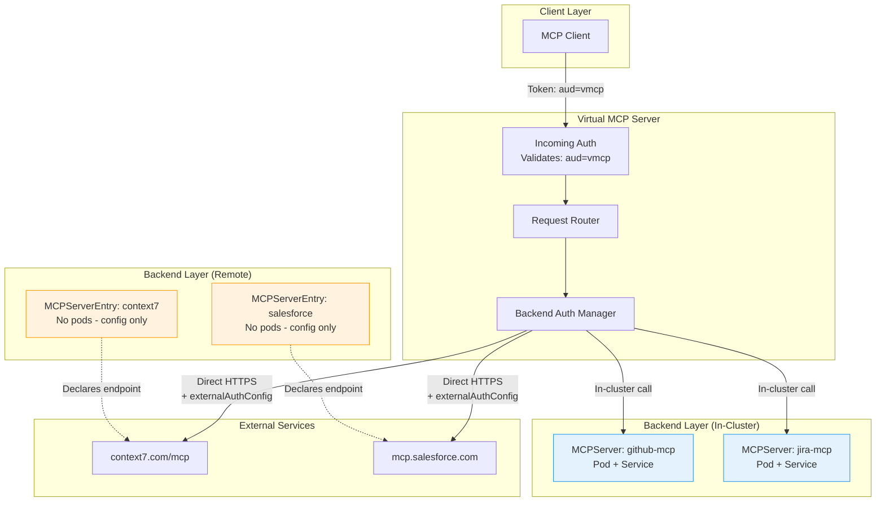
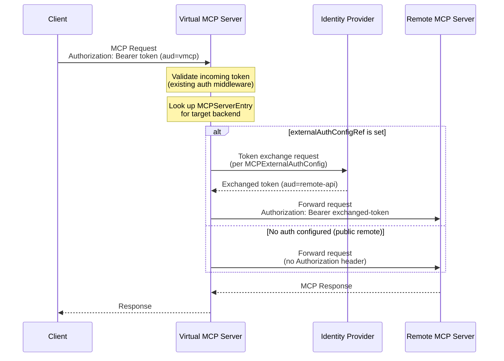

# RFC-XXXX: MCPServerEntry CRD for Direct Remote MCP Server Backends

- **Status**: Draft
- **Author(s)**: Juan Antonio Osorio (@jaosorior)
- **Created**: 2026-03-12
- **Last Updated**: 2026-03-12
- **Target Repository**: toolhive
- **Related Issues**: [toolhive#3104](https://github.com/stacklok/toolhive/issues/3104), [toolhive#4109](https://github.com/stacklok/toolhive/issues/4109)

## Summary

Introduce a new `MCPServerEntry` CRD (short name: `mcpentry`) that allows
VirtualMCPServer to connect directly to remote MCP servers without deploying
MCPRemoteProxy infrastructure. MCPServerEntry is a lightweight, pod-less
configuration resource that declares a remote MCP endpoint and belongs to an
MCPGroup, enabling vMCP to reach remote servers with a single auth boundary
and zero additional pods.

## Problem Statement

vMCP currently relies on MCPRemoteProxy (which spawns `thv-proxyrunner` pods)
to reach remote MCP servers. This architecture creates three concrete problems:

### 1. Forced Authentication on Public Remotes (Issue #3104)

MCPRemoteProxy requires OIDC authentication configuration even when vMCP
already handles client authentication at its own boundary. This blocks
unauthenticated public remote MCP servers (e.g., context7, public API
gateways) from being placed behind vMCP without configuring unnecessary
auth on the proxy layer.

### 2. Dual Auth Boundary Confusion (Issue #4109)

MCPRemoteProxy's single `externalAuthConfigRef` field is used for both the
vMCP-to-proxy boundary AND the proxy-to-remote boundary. When vMCP needs
to authenticate to the remote server through the proxy, token exchange
becomes circular or broken because the same auth config serves two
conflicting purposes:

```
Client -> vMCP [boundary 1: client auth]
    -> MCPRemoteProxy [boundary 2: vMCP auth + remote auth on SAME config]
        -> Remote Server
```

The operator cannot express "use auth X for the proxy and auth Y for the
remote" because there is only one `externalAuthConfigRef`.

### 3. Resource Waste

Every remote MCP server behind vMCP requires a full Deployment + Service +
Pod just to make an HTTP call that vMCP could make directly. For
organizations with many remote MCP backends, this creates unnecessary
infrastructure cost and operational overhead.

### Who Is Affected

- **Platform teams** deploying vMCP with remote MCP backends in Kubernetes
- **Product teams** wanting to register external MCP services behind vMCP
- **Organizations** running public or unauthenticated remote MCP servers
  behind vMCP for aggregation

## Goals

- Enable vMCP to connect directly to remote MCP servers without
  MCPRemoteProxy in the path
- Eliminate the dual auth boundary confusion by providing a single,
  unambiguous auth config for the vMCP-to-remote boundary
- Allow unauthenticated remote MCP servers behind vMCP without workarounds
- Deploy zero additional infrastructure (no pods, services, or deployments)
  for remote backend declarations
- Follow existing Kubernetes patterns (groupRef, externalAuthConfigRef)
  consistent with MCPServer

## Non-Goals

- **Deprecating MCPRemoteProxy**: MCPRemoteProxy remains valuable for
  standalone proxy use cases with its own auth middleware, audit logging,
  and observability. MCPServerEntry is specifically for "behind vMCP" use
  cases.
- **Adding health probing from the operator**: The operator controller
  should NOT probe remote URLs. Reachability from the operator pod does not
  imply reachability from the vMCP pod, and probing expands the operator's
  attack surface. Health checking belongs in vMCP's existing runtime
  infrastructure (`healthCheckInterval`, circuit breaker).
- **Cross-namespace references**: MCPServerEntry follows the same
  namespace-scoped patterns as other ToolHive CRDs.
- **Supporting stdio or container-based transports**: MCPServerEntry is
  exclusively for remote HTTP-based MCP servers.
- **CLI mode support**: MCPServerEntry is a Kubernetes-only CRD. CLI mode
  already supports remote backends via direct configuration.

## Proposed Solution

### High-Level Design

Introduce a new `MCPServerEntry` CRD that acts as a catalog entry for a
remote MCP endpoint. The naming follows the Istio `ServiceEntry` pattern,
communicating "this is a catalog entry, not an active workload."



The key insight is that MCPServerEntry deploys **no infrastructure**. It is
pure configuration that tells vMCP "there is a remote MCP server at this
URL, use this auth to reach it." VirtualMCPServer discovers MCPServerEntry
resources the same way it discovers MCPServer resources: via `groupRef`.

### Auth Flow Comparison

**Current (with MCPRemoteProxy) - Two boundaries, one config:**

```
Client -> (token: aud=vmcp) -> vMCP [incoming auth boundary]
    -> MCPRemoteProxy [deploys pod]
        externalAuthConfigRef used for BOTH:
          - vMCP-to-proxy auth (boundary 2a)
          - proxy-to-remote auth (boundary 2b)
        -> Remote Server
```

**Proposed (with MCPServerEntry) - One clean boundary:**

```
Client -> (token: aud=vmcp) -> vMCP [incoming auth boundary]
    -> MCPServerEntry: vMCP applies externalAuthConfigRef directly
        -> Remote Server
       (ONE boundary, ONE auth config, no confusion)
```



### Detailed Design

#### MCPServerEntry CRD

```yaml
apiVersion: toolhive.stacklok.dev/v1alpha1
kind: MCPServerEntry
metadata:
  name: context7
  namespace: default
spec:
  # REQUIRED: URL of the remote MCP server
  remoteURL: https://mcp.context7.com/mcp

  # REQUIRED: Transport protocol
  # +kubebuilder:validation:Enum=streamable-http;sse
  transport: streamable-http

  # REQUIRED: Group membership (unlike MCPServer where it's optional)
  # An MCPServerEntry without a group is dead config - it cannot be
  # discovered by any VirtualMCPServer.
  groupRef: engineering-team

  # OPTIONAL: Auth configuration for reaching the remote server.
  # Omit entirely for unauthenticated public remotes (resolves #3104).
  # Single unambiguous purpose: auth to the remote (resolves #4109).
  externalAuthConfigRef:
    name: salesforce-auth

  # OPTIONAL: Header forwarding configuration.
  # Reuses existing pattern from MCPRemoteProxy (THV-0026).
  headerForward:
    addPlaintextHeaders:
      X-Tenant-ID: "tenant-123"
    addHeadersFromSecrets:
      - headerName: X-API-Key
        valueSecretRef:
          name: remote-api-credentials
          key: api-key

  # OPTIONAL: Custom CA bundle for private remote servers using
  # internal/self-signed certificates.
  caBundleRef:
    name: internal-ca-bundle
    key: ca.crt
```

**Example: Unauthenticated public remote (resolves #3104):**

```yaml
apiVersion: toolhive.stacklok.dev/v1alpha1
kind: MCPServerEntry
metadata:
  name: context7
spec:
  remoteURL: https://mcp.context7.com/mcp
  transport: streamable-http
  groupRef: engineering-team
  # No externalAuthConfigRef - public endpoint, no auth needed
```

**Example: Authenticated remote with token exchange:**

```yaml
apiVersion: toolhive.stacklok.dev/v1alpha1
kind: MCPServerEntry
metadata:
  name: salesforce-mcp
spec:
  remoteURL: https://mcp.salesforce.com
  transport: streamable-http
  groupRef: engineering-team
  externalAuthConfigRef:
    name: salesforce-token-exchange
---
apiVersion: toolhive.stacklok.dev/v1alpha1
kind: MCPExternalAuthConfig
metadata:
  name: salesforce-token-exchange
spec:
  type: tokenExchange
  tokenExchange:
    tokenUrl: https://keycloak.company.com/realms/myrealm/protocol/openid-connect/token
    clientId: salesforce-exchange
    clientSecretRef:
      name: salesforce-oauth
      key: client-secret
    audience: mcp.salesforce.com
    scopes: ["mcp:read", "mcp:write"]
```

**Example: Remote with static header auth:**

```yaml
apiVersion: toolhive.stacklok.dev/v1alpha1
kind: MCPServerEntry
metadata:
  name: internal-api-mcp
spec:
  remoteURL: https://internal-mcp.corp.example.com/mcp
  transport: sse
  groupRef: engineering-team
  headerForward:
    addHeadersFromSecrets:
      - headerName: Authorization
        valueSecretRef:
          name: internal-api-token
          key: bearer-token
  caBundleRef:
    name: corp-ca-bundle
    key: ca.crt
```

#### CRD Type Definitions

```go
// MCPServerEntry declares a remote MCP server endpoint as a backend for
// VirtualMCPServer. Unlike MCPServer (which deploys container workloads)
// or MCPRemoteProxy (which deploys proxy pods), MCPServerEntry is a
// pure configuration resource that deploys no infrastructure.
//
// +kubebuilder:object:root=true
// +kubebuilder:subresource:status
// +kubebuilder:resource:shortName=mcpentry
// +kubebuilder:printcolumn:name="URL",type=string,JSONPath=`.spec.remoteURL`
// +kubebuilder:printcolumn:name="Transport",type=string,JSONPath=`.spec.transport`
// +kubebuilder:printcolumn:name="Group",type=string,JSONPath=`.spec.groupRef`
// +kubebuilder:printcolumn:name="Ready",type=string,JSONPath=`.status.conditions[?(@.type=="Ready")].status`
// +kubebuilder:printcolumn:name="Age",type=date,JSONPath=`.metadata.creationTimestamp`
type MCPServerEntry struct {
    metav1.TypeMeta   `json:",inline"`
    metav1.ObjectMeta `json:"metadata,omitempty"`

    Spec   MCPServerEntrySpec   `json:"spec,omitempty"`
    Status MCPServerEntryStatus `json:"status,omitempty"`
}

type MCPServerEntrySpec struct {
    // RemoteURL is the URL of the remote MCP server.
    // Must use HTTPS unless the toolhive.stacklok.dev/allow-insecure
    // annotation is set to "true" (for development only).
    // +kubebuilder:validation:Required
    // +kubebuilder:validation:Pattern=`^https?://`
    RemoteURL string `json:"remoteURL"`

    // Transport specifies the MCP transport protocol.
    // +kubebuilder:validation:Required
    // +kubebuilder:validation:Enum=streamable-http;sse
    Transport string `json:"transport"`

    // GroupRef is the name of the MCPGroup this entry belongs to.
    // Required because an MCPServerEntry without a group cannot be
    // discovered by any VirtualMCPServer.
    // +kubebuilder:validation:Required
    // +kubebuilder:validation:MinLength=1
    GroupRef string `json:"groupRef"`

    // ExternalAuthConfigRef references an MCPExternalAuthConfig in the
    // same namespace for authenticating to the remote server.
    // Omit for unauthenticated public endpoints.
    // +optional
    ExternalAuthConfigRef *ExternalAuthConfigRef `json:"externalAuthConfigRef,omitempty"`

    // HeaderForward configures additional headers to inject into
    // requests forwarded to the remote server.
    // +optional
    HeaderForward *HeaderForwardConfig `json:"headerForward,omitempty"`

    // CABundleRef references a ConfigMap or Secret containing a custom
    // CA certificate bundle for TLS verification of the remote server.
    // Useful for remote servers with private/internal CA certificates.
    // +optional
    CABundleRef *SecretKeyRef `json:"caBundleRef,omitempty"`
}

type MCPServerEntryStatus struct {
    // Conditions represent the latest available observations of the
    // MCPServerEntry's state.
    // +optional
    Conditions []metav1.Condition `json:"conditions,omitempty"`

    // ObservedGeneration is the most recent generation observed.
    // +optional
    ObservedGeneration int64 `json:"observedGeneration,omitempty"`
}
```

**Condition types:**

| Type | Purpose | When Set |
|------|---------|----------|
| `Ready` | Overall readiness | Always |
| `GroupRefValid` | Referenced MCPGroup exists | Always |
| `AuthConfigValid` | Referenced MCPExternalAuthConfig exists | Only when `externalAuthConfigRef` is set |
| `CABundleValid` | Referenced CA bundle exists | Only when `caBundleRef` is set |

There is intentionally **no `RemoteReachable` condition**. The controller
should NOT probe remote URLs because:

1. Reachability from the operator pod does not imply reachability from the
   vMCP pod (different network policies, egress rules, DNS resolution).
2. Probing external URLs from the operator expands its attack surface and
   requires egress network access it may not have.
3. It gives false confidence: a probe succeeding now doesn't mean it will
   succeed when vMCP makes the actual request.
4. vMCP already has health checking infrastructure (`healthCheckInterval`,
   circuit breaker) that operates at the right layer.

#### Status Example

```yaml
status:
  conditions:
    - type: Ready
      status: "True"
      reason: ValidationSucceeded
      message: "MCPServerEntry is valid and ready for discovery"
      lastTransitionTime: "2026-03-12T10:00:00Z"
    - type: GroupRefValid
      status: "True"
      reason: GroupExists
      message: "MCPGroup 'engineering-team' exists"
      lastTransitionTime: "2026-03-12T10:00:00Z"
    - type: AuthConfigValid
      status: "True"
      reason: AuthConfigExists
      message: "MCPExternalAuthConfig 'salesforce-auth' exists"
      lastTransitionTime: "2026-03-12T10:00:00Z"
  observedGeneration: 1
```

#### Component Changes

##### Operator: New CRD and Controller

**New files:**
- `cmd/thv-operator/api/v1alpha1/mcpserverentry_types.go` - CRD type
  definitions
- `cmd/thv-operator/controllers/mcpserverentry_controller.go` -
  Validation-only controller

The MCPServerEntry controller is intentionally simple. It performs
**validation only** and creates **no infrastructure**:

```go
func (r *MCPServerEntryReconciler) Reconcile(
    ctx context.Context, req ctrl.Request,
) (ctrl.Result, error) {
    var entry mcpv1alpha1.MCPServerEntry
    if err := r.Get(ctx, req.NamespacedName, &entry); err != nil {
        return ctrl.Result{}, client.IgnoreNotFound(err)
    }

    statusManager := NewStatusManager(&entry)

    // Validate groupRef exists
    var group mcpv1alpha1.MCPGroup
    if err := r.Get(ctx, client.ObjectKey{
        Namespace: entry.Namespace,
        Name:      entry.Spec.GroupRef,
    }, &group); err != nil {
        if apierrors.IsNotFound(err) {
            statusManager.SetCondition("GroupRefValid", "GroupNotFound",
                fmt.Sprintf("MCPGroup %q not found", entry.Spec.GroupRef),
                metav1.ConditionFalse)
            statusManager.SetCondition("Ready", "ValidationFailed",
                "Referenced MCPGroup does not exist", metav1.ConditionFalse)
            return r.updateStatus(ctx, &entry, statusManager)
        }
        return ctrl.Result{}, err
    }
    statusManager.SetCondition("GroupRefValid", "GroupExists",
        fmt.Sprintf("MCPGroup %q exists", entry.Spec.GroupRef),
        metav1.ConditionTrue)

    // Validate externalAuthConfigRef if set
    if entry.Spec.ExternalAuthConfigRef != nil {
        var authConfig mcpv1alpha1.MCPExternalAuthConfig
        if err := r.Get(ctx, client.ObjectKey{
            Namespace: entry.Namespace,
            Name:      entry.Spec.ExternalAuthConfigRef.Name,
        }, &authConfig); err != nil {
            if apierrors.IsNotFound(err) {
                statusManager.SetCondition("AuthConfigValid",
                    "AuthConfigNotFound",
                    fmt.Sprintf("MCPExternalAuthConfig %q not found",
                        entry.Spec.ExternalAuthConfigRef.Name),
                    metav1.ConditionFalse)
                statusManager.SetCondition("Ready", "ValidationFailed",
                    "Referenced auth config does not exist",
                    metav1.ConditionFalse)
                return r.updateStatus(ctx, &entry, statusManager)
            }
            return ctrl.Result{}, err
        }
        statusManager.SetCondition("AuthConfigValid", "AuthConfigExists",
            fmt.Sprintf("MCPExternalAuthConfig %q exists",
                entry.Spec.ExternalAuthConfigRef.Name),
            metav1.ConditionTrue)
    }

    // Validate HTTPS requirement
    if !strings.HasPrefix(entry.Spec.RemoteURL, "https://") {
        if entry.Annotations["toolhive.stacklok.dev/allow-insecure"] != "true" {
            statusManager.SetCondition("Ready", "InsecureURL",
                "remoteURL must use HTTPS (set annotation "+
                    "toolhive.stacklok.dev/allow-insecure=true to override)",
                metav1.ConditionFalse)
            return r.updateStatus(ctx, &entry, statusManager)
        }
    }

    statusManager.SetCondition("Ready", "ValidationSucceeded",
        "MCPServerEntry is valid and ready for discovery",
        metav1.ConditionTrue)

    return r.updateStatus(ctx, &entry, statusManager)
}

func (r *MCPServerEntryReconciler) SetupWithManager(
    mgr ctrl.Manager,
) error {
    return ctrl.NewControllerManagedBy(mgr).
        For(&mcpv1alpha1.MCPServerEntry{}).
        Watches(&mcpv1alpha1.MCPGroup{},
            handler.EnqueueRequestsFromMapFunc(
                r.findEntriesForGroup,
            )).
        Watches(&mcpv1alpha1.MCPExternalAuthConfig{},
            handler.EnqueueRequestsFromMapFunc(
                r.findEntriesForAuthConfig,
            )).
        Complete(r)
}
```

No finalizers are needed because MCPServerEntry creates no infrastructure
to clean up.

##### Operator: MCPGroup Controller Update

The MCPGroup controller must be updated to watch MCPServerEntry resources
in addition to MCPServer resources, so that `status.servers` and
`status.serverCount` reflect both types of backends in the group.

**Files to modify:**
- `cmd/thv-operator/controllers/mcpgroup_controller.go` - Add watch for
  MCPServerEntry, update status aggregation

##### Operator: VirtualMCPServer Controller Update

**Static mode (`outgoingAuth.source: inline`):** The operator generates
the ConfigMap that vMCP reads at startup. This ConfigMap must now include
MCPServerEntry backends alongside MCPServer backends.

The controller discovers MCPServerEntry resources in the group and
serializes them as remote backend entries in the ConfigMap:

```yaml
# Generated ConfigMap content
backends:
  # From MCPServer resources (existing)
  - name: github-mcp
    url: http://github-mcp.default.svc:8080
    transport: sse
    type: container
    auth:
      type: token_exchange
      # ...

  # From MCPServerEntry resources (new)
  - name: context7
    url: https://mcp.context7.com/mcp
    transport: streamable-http
    type: entry   # New backend type
    # No auth - public endpoint

  - name: salesforce-mcp
    url: https://mcp.salesforce.com
    transport: streamable-http
    type: entry
    auth:
      type: token_exchange
      # ...
```

**Files to modify:**
- `cmd/thv-operator/controllers/virtualmcpserver_controller.go` - Discover
  MCPServerEntry resources in group
- `cmd/thv-operator/controllers/virtualmcpserver_vmcpconfig.go` - Include
  entry backends in ConfigMap generation

##### vMCP: Backend Type and Discovery

**New backend type:**

```go
// In pkg/vmcp/types.go
const (
    BackendTypeContainer BackendType = "container"
    BackendTypeProxy     BackendType = "proxy"
    BackendTypeEntry     BackendType = "entry"  // New
)
```

**Discovery updates:**

```go
// In pkg/vmcp/workloads/k8s.go
func (m *K8sWorkloadManager) ListWorkloadsInGroup(
    ctx context.Context, groupName string,
) ([]Backend, error) {
    var backends []Backend

    // Existing: discover MCPServer resources
    mcpServers, err := m.discoverMCPServers(ctx, groupName)
    if err != nil {
        return nil, fmt.Errorf("discovering MCPServers: %w", err)
    }
    backends = append(backends, mcpServers...)

    // New: discover MCPServerEntry resources
    entries, err := m.discoverMCPServerEntries(ctx, groupName)
    if err != nil {
        return nil, fmt.Errorf("discovering MCPServerEntries: %w", err)
    }
    backends = append(backends, entries...)

    return backends, nil
}

func (m *K8sWorkloadManager) discoverMCPServerEntries(
    ctx context.Context, groupName string,
) ([]Backend, error) {
    var entryList mcpv1alpha1.MCPServerEntryList
    if err := m.client.List(ctx, &entryList,
        client.InNamespace(m.namespace),
        client.MatchingFields{"spec.groupRef": groupName},
    ); err != nil {
        return nil, err
    }

    var backends []Backend
    for _, entry := range entryList.Items {
        backend := Backend{
            ID:        fmt.Sprintf("%s/%s", entry.Namespace, entry.Name),
            Name:      entry.Name,
            BaseURL:   entry.Spec.RemoteURL,
            Transport: entry.Spec.Transport,
            Type:      BackendTypeEntry,
        }

        // Resolve auth if configured
        if entry.Spec.ExternalAuthConfigRef != nil {
            authConfig, err := m.resolveAuthConfig(ctx,
                entry.Namespace,
                entry.Spec.ExternalAuthConfigRef.Name,
            )
            if err != nil {
                return nil, fmt.Errorf(
                    "resolving auth for entry %s: %w",
                    entry.Name, err,
                )
            }
            backend.AuthConfig = authConfig
        }

        // Resolve header forward config if set
        if entry.Spec.HeaderForward != nil {
            backend.HeaderForward = m.resolveHeaderForward(
                ctx, entry.Namespace, entry.Spec.HeaderForward,
            )
        }

        // Resolve CA bundle if set
        if entry.Spec.CABundleRef != nil {
            caBundle, err := m.resolveCABundle(ctx,
                entry.Namespace, entry.Spec.CABundleRef,
            )
            if err != nil {
                return nil, fmt.Errorf(
                    "resolving CA bundle for entry %s: %w",
                    entry.Name, err,
                )
            }
            backend.CABundle = caBundle
        }

        backends = append(backends, backend)
    }

    return backends, nil
}
```

##### vMCP: HTTP Client for External TLS

Backends of type `entry` connect to external URLs over HTTPS. The vMCP
HTTP client must be updated to:

1. Use the system CA certificate pool by default (for public CAs).
2. Optionally append a custom CA bundle from `caBundleRef` (for private
   CAs).
3. Apply the resolved `externalAuthConfigRef` credentials directly to
   outgoing requests.

```go
// In pkg/vmcp/client/client.go
func (c *Client) createTransportForEntry(
    backend *Backend,
) (*http.Transport, error) {
    tlsConfig := &tls.Config{
        MinVersion: tls.VersionTLS12,
    }

    if backend.CABundle != nil {
        pool, err := x509.SystemCertPool()
        if err != nil {
            pool = x509.NewCertPool()
        }
        if !pool.AppendCertsFromPEM(backend.CABundle) {
            return nil, fmt.Errorf("failed to parse CA bundle")
        }
        tlsConfig.RootCAs = pool
    }

    return &http.Transport{
        TLSClientConfig: tlsConfig,
    }, nil
}
```

##### vMCP: Dynamic Mode Reconciler Update

For dynamic mode (`outgoingAuth.source: discovered`), the reconciler
infrastructure from THV-0014 must be extended to watch MCPServerEntry
resources.

**Files to modify:**
- `pkg/vmcp/k8s/manager.go` - Register MCPServerEntry watcher
- `pkg/vmcp/k8s/mcpserverentry_watcher.go` (new) - MCPServerEntry
  reconciler

```go
type MCPServerEntryWatcher struct {
    client   client.Client
    registry vmcp.DynamicRegistry
    groupRef string
}

func (w *MCPServerEntryWatcher) Reconcile(
    ctx context.Context, req ctrl.Request,
) (ctrl.Result, error) {
    backendID := req.NamespacedName.String()

    var entry mcpv1alpha1.MCPServerEntry
    if err := w.client.Get(ctx, req.NamespacedName, &entry); err != nil {
        if apierrors.IsNotFound(err) {
            w.registry.Remove(backendID)
            return ctrl.Result{}, nil
        }
        return ctrl.Result{}, err
    }

    if entry.Spec.GroupRef != w.groupRef {
        // Not in our group, remove if previously tracked
        w.registry.Remove(backendID)
        return ctrl.Result{}, nil
    }

    backend, err := w.convertToBackend(ctx, &entry)
    if err != nil {
        return ctrl.Result{}, err
    }
    backend.ID = backendID

    if err := w.registry.Upsert(backend); err != nil {
        return ctrl.Result{}, err
    }

    return ctrl.Result{}, nil
}

func (w *MCPServerEntryWatcher) SetupWithManager(
    mgr ctrl.Manager,
) error {
    return ctrl.NewControllerManagedBy(mgr).
        For(&mcpv1alpha1.MCPServerEntry{}).
        Watches(&mcpv1alpha1.MCPExternalAuthConfig{},
            handler.EnqueueRequestsFromMapFunc(
                w.findEntriesForAuthConfig,
            )).
        Watches(&corev1.Secret{},
            handler.EnqueueRequestsFromMapFunc(
                w.findEntriesForSecret,
            )).
        Complete(w)
}
```

##### vMCP: Static Config Parser Update

The static config parser must be updated to deserialize `type: entry`
backends from the ConfigMap and create appropriate HTTP clients with
external TLS support.

**Files to modify:**
- `pkg/vmcp/config/` - Parse entry-type backends from static config

## Security Considerations

### Threat Model

| Threat | Description | Mitigation |
|--------|-------------|------------|
| Man-in-the-middle on remote connection | Attacker intercepts vMCP-to-remote traffic | HTTPS required by default; custom CA bundles for private CAs |
| Credential exposure in CRD spec | Auth secrets visible in CRD manifest | Credentials stored in K8s Secrets, referenced via `externalAuthConfigRef` and `headerForward.addHeadersFromSecrets`; never inline in CRD spec |
| SSRF via remoteURL | Operator configures URL pointing to internal services | Mitigated by RBAC (only authorized users create MCPServerEntry); annotation required for non-HTTPS; NetworkPolicy should restrict vMCP egress |
| Auth config confusion (existing issue) | Dual-boundary auth leading to wrong tokens sent to wrong endpoints | Eliminated: MCPServerEntry has exactly one auth boundary with one purpose |
| Operator probing external URLs | Controller making network requests to untrusted URLs | Eliminated: controller performs validation only, no network probing |

### Authentication and Authorization

- **No new auth primitives**: MCPServerEntry reuses the existing
  `MCPExternalAuthConfig` CRD and `externalAuthConfigRef` pattern.
- **Single boundary**: vMCP's incoming auth validates client tokens.
  MCPServerEntry's `externalAuthConfigRef` handles outgoing auth to
  the remote. These are cleanly separated.
- **RBAC**: Standard Kubernetes RBAC controls who can create/modify
  MCPServerEntry resources. This enables fine-grained access: platform
  teams manage VirtualMCPServer, product teams register MCPServerEntry
  backends.
- **No privilege escalation**: MCPServerEntry grants no additional
  permissions beyond what the referenced MCPExternalAuthConfig already
  provides.

### Data Security

- **In transit**: HTTPS required for remote connections (with annotation
  escape hatch for development).
- **At rest**: No sensitive data stored in MCPServerEntry spec. Auth
  credentials are in K8s Secrets, referenced indirectly.
- **CA bundles**: Custom CA certificates referenced via `caBundleRef`,
  stored in K8s Secrets/ConfigMaps with standard K8s encryption at rest.

### Input Validation

- **remoteURL**: Must match `^https?://` pattern. HTTPS enforced unless
  annotation override. Validated by both CRD CEL rules and controller
  reconciliation.
- **transport**: Enum validation (`streamable-http` or `sse`).
- **groupRef**: Required, validated to reference an existing MCPGroup.
- **externalAuthConfigRef**: When set, validated to reference an existing
  MCPExternalAuthConfig.
- **headerForward**: Uses the same restricted header blocklist and
  validation as MCPRemoteProxy (THV-0026).

### Secrets Management

- MCPServerEntry follows the same secret access patterns as MCPServer:
  - **Dynamic mode**: vMCP reads secrets at runtime via K8s API
    (namespace-scoped RBAC).
  - **Static mode**: Operator mounts secrets as environment variables.
- Secret rotation follows existing patterns:
  - **Dynamic mode**: Watch-based propagation, no pod restart needed.
  - **Static mode**: Requires pod restart (Deployment rollout).

### Audit and Logging

- vMCP's existing audit middleware logs all requests routed to
  MCPServerEntry backends, including user identity and target tool.
- The operator controller logs validation results (group existence,
  auth config existence) at standard log levels.
- No sensitive data (URLs with credentials, auth tokens) is logged.

### Mitigations

1. **HTTPS enforcement**: Default requires HTTPS; annotation override
   requires explicit operator action.
2. **No network probing**: Controller never connects to remote URLs.
3. **Single auth boundary**: Eliminates dual-boundary confusion.
4. **Existing patterns**: Reuses battle-tested secret access, RBAC,
   and auth patterns from MCPServer.
5. **NetworkPolicy recommendation**: Documentation recommends restricting
   vMCP pod egress to known remote endpoints.
6. **No new attack surface**: Zero additional pods deployed.

## Alternatives Considered

### Alternative 1: Add `remoteServerRefs` to VirtualMCPServer Spec

Embed remote server configuration directly in the VirtualMCPServer CRD.

```yaml
kind: VirtualMCPServer
spec:
  groupRef:
    name: engineering-team
  remoteServerRefs:
    - name: context7
      remoteURL: https://mcp.context7.com/mcp
      transport: streamable-http
    - name: salesforce
      remoteURL: https://mcp.salesforce.com
      transport: streamable-http
      externalAuthConfigRef:
        name: salesforce-auth
```

**Pros:**
- No new CRD needed
- Simple for small deployments

**Cons:**
- Violates separation of concerns: VirtualMCPServer manages aggregation,
  not backend declaration
- Breaks the `groupRef` discovery pattern: some backends discovered via
  group, others embedded inline
- Bloats VirtualMCPServer spec
- Prevents independent lifecycle management: adding/removing a remote
  backend requires editing the VirtualMCPServer, which may trigger
  reconciliation of unrelated configuration
- Prevents fine-grained RBAC: only VirtualMCPServer editors can manage
  remote backends

**Why not chosen:** Inconsistent with existing patterns and prevents the
RBAC separation that makes MCPServerEntry valuable (platform teams manage
vMCP, product teams register backends).

### Alternative 2: Extend MCPServer with Remote Mode

Add a `mode: remote` field to the existing MCPServer CRD.

```yaml
kind: MCPServer
spec:
  mode: remote
  remoteURL: https://mcp.context7.com/mcp
  transport: streamable-http
  groupRef: engineering-team
```

**Pros:**
- No new CRD
- Reuses existing MCPServer controller infrastructure

**Cons:**
- MCPServer is fundamentally a container workload resource. Adding a
  "don't deploy anything" mode creates confusing semantics: `spec.image`
  becomes optional, `spec.resources` is meaningless, status conditions
  designed for pod lifecycle don't apply.
- Controller logic becomes complex with conditional paths for
  container vs remote modes.
- Existing MCPServer watchers (MCPGroup controller, VirtualMCPServer
  controller) would need to handle both modes, adding complexity.
- The controller currently creates Deployments, Services, and ConfigMaps.
  Adding a mode that creates none of these is a significant semantic
  change.

**Why not chosen:** Overloading MCPServer with remote-mode semantics
increases complexity and confusion. A separate CRD with clear "this is
configuration only" semantics is cleaner.

### Alternative 3: Configure Remote Backends Only in vMCP Config

Handle remote backends entirely in vMCP's configuration (ConfigMap or
runtime discovery) without a CRD.

**Pros:**
- No CRD changes needed
- Simpler operator

**Cons:**
- No Kubernetes-native resource to represent remote backends
- No status reporting, no `kubectl get` visibility
- No RBAC for who can manage remote backends
- Breaks the pattern where all backends are discoverable via `groupRef`
- MCPGroup status cannot reflect remote backends

**Why not chosen:** Loses Kubernetes-native management, visibility, and
access control.

## Compatibility

### Backward Compatibility

MCPServerEntry is a purely additive change:

- **No changes to existing CRDs**: MCPServer, MCPRemoteProxy,
  VirtualMCPServer, MCPGroup, and MCPExternalAuthConfig are unchanged.
- **No changes to existing behavior**: VirtualMCPServer continues to
  discover MCPServer resources via `groupRef`. MCPServerEntry adds a
  new discovery source alongside the existing one.
- **MCPRemoteProxy still works**: Organizations using MCPRemoteProxy
  can continue to do so. MCPServerEntry is an alternative, not a
  replacement.
- **No migration required**: Existing deployments work without
  modification after the upgrade.

### Forward Compatibility

- **Extensibility**: The `MCPServerEntrySpec` can be extended with
  additional fields (e.g., rate limiting, tool filtering) without
  breaking changes.
- **API versioning**: Starts at `v1alpha1`, consistent with all other
  ToolHive CRDs.
- **Future deprecation path**: If MCPRemoteProxy use cases are eventually
  subsumed, MCPServerEntry provides a clean migration target.

## Implementation Plan

### Phase 1: CRD and Controller

1. Define `MCPServerEntry` types in
   `cmd/thv-operator/api/v1alpha1/mcpserverentry_types.go`
2. Implement validation-only controller in
   `cmd/thv-operator/controllers/mcpserverentry_controller.go`
3. Generate CRD manifests (`task operator-generate`,
   `task operator-manifests`)
4. Update MCPGroup controller to watch MCPServerEntry resources
5. Add unit tests for controller validation logic

### Phase 2: Static Mode Integration

1. Update VirtualMCPServer controller to discover MCPServerEntry resources
   in the group
2. Update ConfigMap generation to include entry-type backends
3. Update vMCP static config parser to deserialize entry backends
4. Add `BackendTypeEntry` to vMCP types
5. Implement external TLS transport creation for entry backends
6. Integration tests with envtest

### Phase 3: Dynamic Mode Integration

1. Create `MCPServerEntryWatcher` reconciler in `pkg/vmcp/k8s/`
2. Register watcher in the K8s manager alongside MCPServerWatcher
3. Update `ListWorkloadsInGroup()` to include MCPServerEntry
4. Resolve auth configs for entry backends at runtime
5. Integration tests for dynamic discovery of entry backends

### Phase 4: Documentation and E2E

1. CRD reference documentation
2. User guide with examples (public remote, authenticated remote,
   private CA)
3. MCPRemoteProxy vs MCPServerEntry comparison guide
4. E2E Chainsaw tests for full lifecycle
5. E2E tests for mixed MCPServer + MCPServerEntry groups

### Dependencies

- THV-0014 (K8s-Aware vMCP) for dynamic mode support
- THV-0026 (Header Passthrough) for `headerForward` field reuse
- Existing MCPExternalAuthConfig CRD for auth configuration

## Testing Strategy

### Unit Tests

- Controller validation: groupRef exists, authConfigRef exists, HTTPS
  enforcement, annotation override
- CRD type serialization/deserialization
- Backend conversion from MCPServerEntry to internal Backend struct
- External TLS transport creation with and without custom CA bundles
- Static config parsing with entry-type backends

### Integration Tests (envtest)

- MCPServerEntry controller reconciliation with real API server
- VirtualMCPServer ConfigMap generation including entry backends
- MCPGroup status update with mixed MCPServer + MCPServerEntry members
- Dynamic mode: MCPServerEntry watcher reconciliation
- Auth config resolution for entry backends
- Secret change propagation to entry backends

### End-to-End Tests (Chainsaw)

- Full lifecycle: create MCPGroup, create MCPServerEntry, create
  VirtualMCPServer, verify vMCP routes to remote backend
- Mixed group: MCPServer (container) + MCPServerEntry (remote) in same
  group
- Unauthenticated public remote behind vMCP
- Authenticated remote with token exchange
- MCPServerEntry deletion removes backend from vMCP
- CA bundle configuration for private remotes

### Security Tests

- Verify HTTPS enforcement (HTTP URL without annotation is rejected)
- Verify RBAC separation (entry creation requires correct permissions)
- Verify no network probing from controller
- Verify secret values are not logged

## Documentation

- **CRD Reference**: Auto-generated CRD documentation for MCPServerEntry
  fields, validation rules, and status conditions
- **User Guide**: How to add remote MCP backends to vMCP using
  MCPServerEntry, with examples for common scenarios
- **Comparison Guide**: When to use MCPRemoteProxy vs MCPServerEntry:

  | Feature | MCPRemoteProxy | MCPServerEntry |
  |---------|---------------|----------------|
  | Deploys pods | Yes (proxy pod) | No |
  | Own auth middleware | Yes (oidcConfig, authzConfig) | No |
  | Own audit logging | Yes | No (uses vMCP's) |
  | Standalone use | Yes | No (only via VirtualMCPServer) |
  | GroupRef support | Yes (optional) | Yes (required) |
  | Primary use case | Standalone proxy with full observability | Backend declaration for vMCP |

- **Architecture Documentation**: Update `docs/arch/10-virtual-mcp-architecture.md`
  to describe MCPServerEntry as a backend type

## Open Questions

1. **Should `remoteURL` strictly require HTTPS?**
   Recommendation: Yes, with annotation override
   (`toolhive.stacklok.dev/allow-insecure: "true"`) for development.
   This prevents accidental plaintext credential transmission while
   allowing local development workflows.

2. **Should the CRD support custom CA bundles for private remote servers?**
   Recommendation: Yes, via `caBundleRef` field referencing a Secret or
   ConfigMap. This is essential for enterprises with internal CAs. The
   current design includes this field.

3. **Should there be a `disabled` field for temporarily removing an entry
   from discovery without deleting it?**
   This could be useful for maintenance windows or incident response.
   However, it adds complexity and can be achieved by removing the
   `groupRef` temporarily. Defer to post-implementation feedback.

4. **Should MCPServerEntry support `toolConfigRef` for tool filtering?**
   MCPRemoteProxy supports tool filtering via `toolConfigRef`.
   VirtualMCPServer also has its own tool filtering/override configuration
   in `spec.aggregation.tools`. For MCPServerEntry, tool filtering should
   be configured at the VirtualMCPServer level (where it already exists)
   rather than duplicating it on the entry. Defer unless there is a clear
   use case for entry-level filtering.

## References

- [THV-0008: Virtual MCP Server](./THV-0008-virtual-mcp-server.md) -
  VirtualMCPServer design, auth boundaries, capability aggregation
- [THV-0009: Remote MCP Server Proxy](./THV-0009-remote-mcp-proxy.md) -
  MCPRemoteProxy CRD design
- [THV-0010: MCPGroup CRD](./THV-0010-kubernetes-mcpgroup-crd.md) -
  Group-based backend discovery pattern
- [THV-0014: K8s-Aware vMCP](./THV-0014-vmcp-k8s-aware-refactor.md) -
  Dynamic vs static discovery modes, reconciler infrastructure
- [THV-0026: Header Passthrough](./THV-0026-header-passthrough.md) -
  `headerForward` configuration pattern
- [Istio ServiceEntry](https://istio.io/latest/docs/reference/config/networking/service-entry/) -
  Naming pattern inspiration
- [toolhive#3104](https://github.com/stacklok/toolhive/issues/3104) -
  MCPRemoteProxy forces OIDC auth on public remotes behind vMCP
- [toolhive#4109](https://github.com/stacklok/toolhive/issues/4109) -
  Dual auth boundary confusion with externalAuthConfigRef

---

## RFC Lifecycle

<!-- This section is maintained by RFC reviewers -->

### Review History

| Date | Reviewer | Decision | Notes |
|------|----------|----------|-------|
| 2026-03-12 | @jaosorior | Draft | Initial submission |

### Implementation Tracking

| Repository | PR | Status |
|------------|-----|--------|
| toolhive | TBD | Not started |
