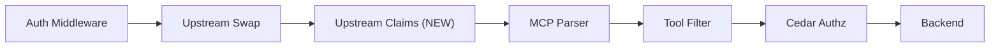

# RFC-XXXX: Multi-Upstream Authorization for MCPServer/MCPRemoteProxy

- **Status**: Draft
- **Author(s)**: jhrozek (@jhrozek)
- **Created**: 2026-03-25
- **Last Updated**: 2026-03-25
- **Target Repository**: toolhive
- **Depends On**: RFC-0052 (multi-upstream IDP support), RFC-0054 (upstream inject strategy)

## Summary

Enable MCPServer and MCPRemoteProxy to use two upstream providers: one for identity/authorization (whose JWT claims merge into the Cedar evaluation context) and one for backend token injection. Policy authors write natural Cedar policies against upstream IdP claims (e.g., `claim_groups`) without prefixes, enabling RBAC-style authorization for enterprise deployments.

## Problem Statement

### Cedar Only Sees ToolHive JWT Claims

Cedar authorization currently evaluates against claims from the ToolHive-issued JWT: `sub`, `name`, `email`, and `tsid`. The upstream IdP's richer claims -- groups, roles, department, custom attributes -- are not available for authorization decisions. This blocks enterprise-grade RBAC policies such as "only members of `platform-admins` can call destructive tools."

### Multi-Upstream Is Blocked

MCPServer and MCPRemoteProxy controllers reject configurations with more than one upstream provider (`MultiUpstreamNotSupported`). The embedded auth server already handles multi-upstream sequential auth chains, but the controllers prevent this capability from being used. Enterprise deployments that need a corporate IdP for identity and a service-specific IdP (e.g., GitHub) for backend tokens cannot be configured today.

### Who Is Affected

- Platform operators deploying enterprise MCP servers behind corporate IdPs (Okta, Entra ID, Keycloak) who need group-based or role-based access control.
- Security teams that require Cedar policies referencing upstream IdP attributes for compliance.

## Goals

- Add a `role` field to `UpstreamProviderConfig` with values `identity` or `backend` (default: `backend`) to declare each upstream's purpose.
- Implement a new `upstreamclaims` middleware that merges upstream JWT claims into the identity using a protected-allowlist strategy.
- Lift the `MultiUpstreamNotSupported` guards on MCPServer and MCPRemoteProxy controllers.
- Enable Cedar policies to reference upstream claims naturally (`claim_groups`, `claim_roles`) without additional upstream-specific prefixes (the standard `claim_` prefix applied by the Cedar authorizer is preserved).

## Non-Goals

- **N>2 upstreams for MCPServer/MCPRemoteProxy**: MVP limits to one backend and one optional identity upstream.
- **VirtualMCPServer changes**: vMCP should be handled using a similar mechanism, but in a separate RFC building atop this one.
- **ID token support**: Only access tokens are used for claims extraction in this RFC.
- **UserInfo endpoint fallback**: Opaque tokens are silently skipped rather than triggering a UserInfo call.
- **Selective claim extraction**: All non-protected claims merge; filtering to specific claims is deferred.

## Proposed Solution

### High-Level Design

The `upstreamclaims` middleware slots into the existing middleware chain between upstream swap and the MCP parser. It reads the identity upstream's access token, parses it as a JWT, and merges non-protected claims into the identity that Cedar evaluates.



In a two-upstream configuration (e.g., Okta for identity, GitHub for backend):

1. **Auth Middleware** validates the ToolHive JWT and loads `UpstreamTokens` from storage.
2. **Upstream Swap** reads the backend provider's token (`role: backend`) and prepares it for injection.
3. **Upstream Claims** reads the identity provider's token (`role: identity`), parses the JWT, and merges claims using the protected-allowlist strategy.
4. **Cedar Authz** evaluates policies against the enriched identity, which now includes `claim_groups`, `claim_roles`, etc. from the upstream IdP.

### Detailed Design

#### CRD Changes: `role` Field on `UpstreamProviderConfig`

A new `Role` field on `UpstreamProviderConfig` declares whether each upstream is used for identity enrichment or backend token injection:

```go
// UpstreamProviderRole defines the purpose of an upstream provider.
// +kubebuilder:validation:Enum=identity;backend
type UpstreamProviderRole string

const (
    // UpstreamProviderRoleIdentity marks the provider as the source of
    // authorization claims for Cedar policy evaluation.
    UpstreamProviderRoleIdentity UpstreamProviderRole = "identity"

    // UpstreamProviderRoleBackend marks the provider as the source of
    // tokens injected into backend requests.
    UpstreamProviderRoleBackend UpstreamProviderRole = "backend"
)

type UpstreamProviderConfig struct {
    // ... existing fields ...

    // Role declares the purpose of this upstream provider.
    // "identity" means its JWT claims are merged into the Cedar evaluation context.
    // "backend" means its token is injected into backend requests.
    // +kubebuilder:default=backend
    Role UpstreamProviderRole `json:"role,omitempty"`
}
```

CRD YAML example with two upstreams (scopes are IdP-specific; consult your provider's documentation for claim availability):

```yaml
upstreamProviders:
  - name: okta
    role: identity
    type: oidc
    oidcConfig:
      issuerUrl: "https://dev-123456.okta.com"
      clientId: "0oa1234567"
      clientSecretRef:
        name: okta-secret
        key: client-secret
      scopes: ["openid", "profile", "groups"]
  - name: github
    # role: backend (default, can be omitted)
    type: oauth2
    oauth2Config:
      clientId: "Iv1.abc123"
      clientSecretRef:
        name: github-secret
        key: client-secret
      scopes: ["repo", "read:org"]
```

Webhook validation ensures:
- At most one upstream has `role: identity`.
- At least one upstream has `role: backend`.

#### Protected-Claims Allowlist

Twelve infrastructure claims are protected from overwrite. These are claims where either (a) the ToolHive JWT and upstream JWT carry different values and overwriting would create a security or correctness problem, or (b) the values are expected to be identical but protecting them is a zero-cost defense-in-depth measure against divergence:

```go
var protectedClaims = map[string]bool{
    "iss": true, "aud": true, "exp": true, "iat": true,
    "nbf": true, "jti": true, "tsid": true, "client_id": true,
    "sub": true, "name": true, "email": true,
    "acr": true, "amr": true,
}
```

The merge rule is simple: for each claim in the upstream JWT, skip it if it appears in `protectedClaims`, otherwise overwrite the corresponding claim in the identity. See the Security Considerations section for the rationale behind each protected claim.

#### Upstream Claims Middleware (`pkg/auth/upstreamclaims/`)

The new middleware follows the same factory pattern as the existing `upstreamswap` middleware:

```go
// Config configures the upstream claims enrichment middleware.
type Config struct {
    // ProviderName identifies which upstream provider's token to parse for claims.
    ProviderName string `json:"provider_name"`
}
```

`CreateMiddleware` is the factory function matching the `types.MiddlewareFactory` signature. The middleware logic:

1. Reads the `Identity` from the request context (skips if absent).
2. Reads the token from `identity.UpstreamTokens[cfg.ProviderName]` (skips if absent or empty).
3. Parses the token as a JWT using `jwt.NewParser().ParseUnverified()` (skips with a DEBUG log if parsing fails, which handles opaque tokens).
4. Builds a merged claims map: copies all original claims, then for each upstream claim, skips if the key is in `protectedClaims`, otherwise overwrites. When an upstream claim overwrites an existing identity claim with a different value, emits a DEBUG log (aids policy debugging).
5. Creates a new `Identity` with the merged claims, preserving all other fields (Token, TokenType, UpstreamTokens, Metadata, Subject, Name, Email).
6. Puts the new `Identity` in the context via `auth.WithIdentity`.

The silent skip for non-JWT tokens is intentional: when the identity upstream issues opaque access tokens, Cedar sees only the ToolHive JWT claims. This is a graceful degradation, not an error.

#### Wiring: Roles to Middleware Config

The `role` field determines which middleware receives each upstream's provider name:

- `role: backend` --> `UpstreamSwapConfig.ProviderName` (existing behavior, token injection)
- `role: identity` --> `UpstreamClaimsConfig.ProviderName` (new, claims enrichment)

In `pkg/runner/middleware.go`, the `addUpstreamClaimsMiddleware` function is registered after upstream swap and before the MCP parser. It is only activated when `config.UpstreamClaimsConfig != nil`.

In the controller (`cmd/thv-operator/pkg/controllerutil/authserver.go`), `AddEmbeddedAuthServerConfigOptions` scans upstreams by role:
- An upstream with `role: identity` produces a `WithUpstreamClaimsConfig(...)` option.
- An upstream with `role: backend` produces a `WithUpstreamSwapConfig(...)` option.

#### Controller Guard Removal

The `MultiUpstreamNotSupported` condition and its associated guards are removed from:
- `cmd/thv-operator/controllers/mcpserver_controller.go`
- `cmd/thv-operator/controllers/mcpremoteproxy_controller.go`

The corresponding condition reason constants (`ConditionReasonExternalAuthConfigMultiUpstream` and `ConditionReasonMCPRemoteProxyExternalAuthConfigMultiUpstream`) are also removed.

#### Cedar Policy Examples

With the enriched identity, Cedar policies can reference upstream IdP claims naturally:

```cedar
// RBAC: only platform-admins can call destructive tools
forbid(principal, action == Action::"call_tool", resource)
when { resource has destructiveHint && resource.destructiveHint == true }
unless {
    principal has claim_groups &&
    principal.claim_groups.contains("platform-admins")
};
```

```cedar
// Client binding combined with group check
permit(principal, action == Action::"call_tool", resource == Tool::"deploy")
when {
    context.claim_client_id == "vscode-ext" &&
    principal has claim_groups &&
    principal.claim_groups.contains("developers")
};
```

```cedar
// Department-based access to sensitive tools
forbid(principal, action == Action::"call_tool", resource == Tool::"billing-query")
unless {
    principal has claim_department &&
    principal.claim_department == "finance"
};
```

Note that `claim_client_id` comes from the protected ToolHive JWT (enabling defense-in-depth client binding) while `claim_groups` and `claim_department` come from the upstream Okta token. Policy authors do not need to know which token provided which claim.

## Security Considerations

This section is the most critical part of the RFC. The protected-allowlist merge strategy was designed through two rounds of multi-expert security analysis.

### Threat Model

**Threat 1: Redis compromise (upstream token tampering)**. An attacker who gains access to the Redis instance storing upstream tokens can modify the upstream access token for a session. Under the protected-allowlist strategy, the attacker can control non-protected claims (groups, roles, department) but cannot overwrite `sub`, `name`, `email`, `aud`, `client_id`, `iss`, `tsid`, `exp`, `iat`, `nbf`, or `jti` -- these remain from the cryptographically verified ToolHive JWT.

Impact: An attacker could escalate group membership but cannot impersonate a different user (`sub` protected), change the display identity (`name`, `email` protected), redirect tokens to a different audience (`aud` protected), or forge a different client identity (`client_id` protected). Redis compromise is already a high-severity event that compromises session integrity; this change does not widen the blast radius beyond what group claims control.

**Threat 2: Opaque token handling**. When the identity upstream issues opaque access tokens (not JWTs), the middleware silently skips enrichment. Cedar sees only ToolHive JWT claims. There is no identity instability because the principal entity ID stays the ToolHive `sub` value, which equals the upstream `sub` by construction (copied during the OAuth callback).

**Threat 3: Confused deputy via audience bypass**. If `aud` were overwritten with the upstream token's audience, a token intended for one MCPServer could be accepted by another. Mitigation: `aud` is protected and always carries the ToolHive-issued value.

### Protected Claims Rationale

Each of the twelve protected claims falls into one of two categories: (a) the ToolHive JWT and upstream JWT carry different values and overwriting would create a security or correctness problem, or (b) the values are expected to be identical but protecting them is a zero-cost defense-in-depth measure:

| Claim | Why Protected | Security Impact if Overwritten |
|-------|---------------|-------------------------------|
| `iss` | ToolHive AS vs upstream IdP | Token provenance integrity lost; middleware could accept tokens from unexpected issuers |
| `aud` | Per-MCPServer audience vs upstream audience | Confused deputy: token for MCPServer A accepted by MCPServer B |
| `exp` | Different lifetimes | Token validity window manipulation |
| `iat` | Different issuance times | Replay window manipulation |
| `nbf` | Different not-before times | Token validity window manipulation; bypasses not-before checks |
| `jti` | Different token identifiers | Token revocation tracking broken |
| `tsid` | ToolHive-only (session ID) | Upstream token lookup broken; wrong session's tokens loaded |
| `client_id` | MCP client vs upstream client | **Only unique authz claim**: enables defense-in-depth policies like `claim_client_id == "vscode-ext"` |
| `sub` | TH JWT carries internal UUID; upstream carries raw IdP subject | Cedar principal entity ID (`Client::<sub>`) changes to raw upstream value; user impersonation in authorization layer. The TH JWT `sub` is a ToolHive-internal UUID derived from the first upstream's subject via `ResolveUser()`, not the raw upstream `sub` string. |
| `name` | Defense-in-depth (expected identical) | Audit trail identity changes; display name mismatch between logs and actual principal |
| `email` | Defense-in-depth (expected identical) | Audit trail identity changes; email-based policies reference wrong address |
| `acr` | Authentication context integrity | Step-up authentication bypass; attacker could claim higher auth assurance level than actually achieved (e.g., MFA when only password was used) |
| `amr` | Authentication methods integrity | MFA enforcement bypass; attacker could inject `"mfa"` into authentication methods, making policies believe multi-factor auth was performed |

Claims NOT protected (and why):
- `groups`, `roles`, `department`, `scp`, custom claims: Only exist in the upstream token. These are the claims this RFC exists to surface.

**Known limitation**: Because `sub` is protected, `claim_sub` in Cedar policies always reflects the ToolHive-internal UUID, not the upstream IdP's raw subject identifier. Policy authors should use `claim_email`, `claim_groups`, or `claim_roles` for identity matching. Exposing the upstream IdP's subject under a namespaced key (e.g., `identity_provider_sub`) could be addressed in a future enhancement.

### Unverified JWT Parsing

The upstream access token is parsed without signature verification (`jwt.ParseUnverified`). This is safe because:

1. The token was obtained directly from the upstream IdP during the OAuth callback by the embedded auth server.
2. The token is stored in server-controlled storage (Redis with ACL).
3. No external party can modify the token in transit -- it travels from the auth server to Redis to the middleware within the server's trust boundary.

This is analogous to trusting server-side session data. Re-verifying the signature would require fetching the upstream IdP's JWKS at request time, adding latency and a runtime dependency on upstream IdP availability.

### Mitigations Summary

| Threat | Mitigation |
|--------|-----------|
| Redis compromise (claim tampering) | 12 infrastructure claims protected; attacker cannot change sub, name, email, aud, client_id |
| Opaque token (no enrichment) | Silent skip; principal identity stable; Cedar sees ToolHive claims only |
| Audience bypass | `aud` protected; per-MCPServer audience preserved |
| Identity instability | `sub` protected; Cedar principal entity ID (`Client::<sub>`) cannot change via upstream claims |
| `client_id` loss | `client_id` protected; defense-in-depth policies remain functional |
| Audit trail manipulation | `name`, `email` protected; display identity cannot diverge from authenticated principal |

## Alternatives Considered

### Alternative 1: Full Claims Replacement

Replace `Identity.Claims` entirely with the upstream token's claims.

- **Pros**: Simplest implementation. Cedar sees exactly what the upstream IdP issued.
- **Cons**: HIGH security risk -- audience bypass (upstream `aud` replaces per-MCPServer audience), identity instability (opaque token fallback means no claims at all), loss of `client_id` (the only ToolHive-unique authz claim). Defense-in-depth policies become impossible.
- **Why not chosen**: The security analysis identified three HIGH-severity risks. The blast radius of a Redis compromise expands from "group escalation" to "full identity takeover."

### Alternative 2: Prefix Enrichment

Merge upstream claims with an `upstream_` prefix (e.g., `upstream_groups` instead of `groups`).

- **Pros**: Zero collision risk between ToolHive and upstream claims. Clear provenance in Cedar policies.
- **Cons**: Poor ergonomics. Policy authors must write `claim_upstream_groups` instead of `claim_groups`. Cedar policies become verbose and unnatural. The prefix is arbitrary and adds cognitive load.
- **Why not chosen**: The protected-allowlist strategy achieves collision safety for the twelve infrastructure claims that must be preserved, while keeping natural names for all authorization-relevant claims. The ergonomic cost of prefixing outweighs the marginal safety benefit.

### Alternative 3: `tokenInjectionProvider` Field

A single `tokenInjectionProvider` field on `EmbeddedAuthServerConfig` that names the backend provider, with all other providers implicitly used for identity.

- **Pros**: Minimal CRD surface area (one field).
- **Cons**: Implicit rather than explicit. The relationship between provider name and purpose is not self-documenting. Harder to extend to N>2 upstreams in the future.
- **Why not chosen**: The per-upstream `role` field is more explicit and self-documenting. Each provider's purpose is declared at the point of definition.

### Alternative 4: Convention-Based Ordering

First upstream in the array is identity, second is backend (or vice versa).

- **Pros**: No new fields needed.
- **Cons**: Implicit, fragile, relies on array ordering. Easy to misconfigure silently. JSON/YAML array ordering is not always preserved by tools.
- **Why not chosen**: Explicit role declaration prevents ordering-dependent bugs.

## Compatibility

### Backward Compatibility

All changes are fully backward compatible:

- The `role` field defaults to `backend`. Existing single-upstream configurations are unchanged -- the sole upstream is implicitly `role: backend`, which matches current behavior.
- The `upstreamclaims` middleware is only activated when an `identity` upstream is configured. Single-upstream deployments never invoke it.
- Removing the `MultiUpstreamNotSupported` guard is a relaxation of validation, not a tightening. Existing valid configurations remain valid.
- No existing Cedar policies are affected. The enriched claims are additive -- new attributes appear on entities, but policies that do not reference them are unaffected.

### Forward Compatibility

- The `role` enum can be extended with additional values (e.g., `both` for a single provider used for both identity and backend) without breaking existing configurations.
- The protected-claims allowlist can be extended with additional claims if needed.
- Selective claim extraction (filtering to specific upstream claims) can be added as an optional `claims` list on the `identity` role configuration.

## Implementation Plan

### Phase 1: `role` Field and Validation

- Add `UpstreamProviderRole` type, constants, and `Role` field to `UpstreamProviderConfig`.
- Add `Role` field to `UpstreamRunConfig` in `pkg/authserver/config.go`.
- Add webhook validation (at most 1 identity, at least 1 backend).
- Wire role through in `buildUpstreamRunConfig`.
- Regenerate CRDs with `task gen`.

### Phase 2: Upstream Claims Middleware

- Implement `pkg/auth/upstreamclaims/middleware.go` with `Config`, `CreateMiddleware`, `protectedClaims`, and merge logic.
- Unit tests: JWT enrichment, protected claims preserved, opaque token skip, missing provider skip, missing identity passthrough.

### Phase 3: Wire Roles into Middleware Config

- Add `UpstreamClaimsConfig` to `RunConfig` and `RunConfigBuilderOption`.
- Register `upstreamclaims.CreateMiddleware` in `GetSupportedMiddlewareFactories`.
- Add `addUpstreamClaimsMiddleware` to `populateMiddlewareConfigs` (after upstream swap, before MCP parser).
- Update `AddEmbeddedAuthServerConfigOptions` to scan upstreams by role and produce the correct middleware configs.
- Wire the `role` field through `buildUpstreamRunConfig` (note: `buildEmbeddedAuthServerRunnerConfig` already iterates all providers; the single-upstream limitation is in `addUpstreamSwapMiddleware` which derives `ProviderName` from `cfg.Upstreams[0].Name`).
- Update `GenerateAuthServerEnvVars` to generate per-provider client secret env vars (e.g., `TOOLHIVE_UPSTREAM_CLIENT_SECRET_<NAME>`) since two upstreams may require independent client secrets.

### Phase 4: Lift Controller Guards

- Remove `MultiUpstreamNotSupported` guards from MCPServer and MCPRemoteProxy controllers.
- Remove associated condition reason constants.
- Update existing "multi-upstream rejected" tests to "multi-upstream accepted" tests.

### Dependencies

- **RFC-0052**: Provides `identity.UpstreamTokens` population at auth middleware time.
- **RFC-0054**: Provides the `upstream_inject` strategy that the `role: backend` upstream uses.

## Testing Strategy

### Unit Tests (per phase)

- **Phase 1**: Webhook validation rejects >1 identity upstream, accepts valid configs, defaults role to backend.
- **Phase 2**: Middleware merges JWT claims correctly, protects all 12 infrastructure claims, skips opaque tokens silently, skips missing providers, passes through when no identity is in context.
- **Phase 3**: Middleware config builder produces correct configs from role scanning. Upstream swap uses the backend provider, upstream claims uses the identity provider.
- **Phase 4**: Controllers accept 2-upstream configurations that were previously rejected.

### Integration Test

Deploy a 2-upstream `MCPExternalAuthConfig` with a mock Okta (identity) and mock GitHub (backend):
- Verify Cedar policies reference `claim_groups` from Okta without prefixes.
- Verify protected claims (`claim_sub`, `claim_aud`, `claim_client_id`, `claim_iss`) remain from the ToolHive JWT.
- Verify GitHub token is injected into backend requests.
- Verify single-upstream configs continue working unchanged.
- Verify opaque identity upstream token results in enrichment being skipped (Cedar sees only ToolHive claims).

## Documentation

- Add Cedar policy examples demonstrating upstream claim usage to the authorization documentation.
- Run `task docs` after CRD type additions to regenerate CLI and CRD documentation.

## Open Questions

None. All design decisions were resolved during the multi-expert security analysis.

## References

- [RFC 9068: JSON Web Token (JWT) Profile for OAuth 2.0 Access Tokens](https://datatracker.ietf.org/doc/html/rfc9068)
- [RFC 8707: Resource Indicators for OAuth 2.0](https://datatracker.ietf.org/doc/html/rfc8707)
- [RFC 6750: The OAuth 2.0 Authorization Framework: Bearer Token Usage](https://datatracker.ietf.org/doc/html/rfc6750)
- [Cedar Policy Language Documentation](https://docs.cedarpolicy.com/)
- [RFC-0052: Multi-Upstream IDP Support](./THV-0052-multi-upstream-idp-authserver.md)
- [RFC-0054: vMCP Upstream Inject Strategy](./THV-0054-vmcp-upstream-inject-strategy.md)

---

## RFC Lifecycle

<!-- This section is maintained by RFC reviewers -->

### Review History

| Date | Reviewer | Decision | Notes |
|------|----------|----------|-------|
| 2026-03-25 | | Under Review | Initial submission |

### Implementation Tracking

| Repository | PR | Status |
|------------|-----|--------|
| toolhive | | Pending |
