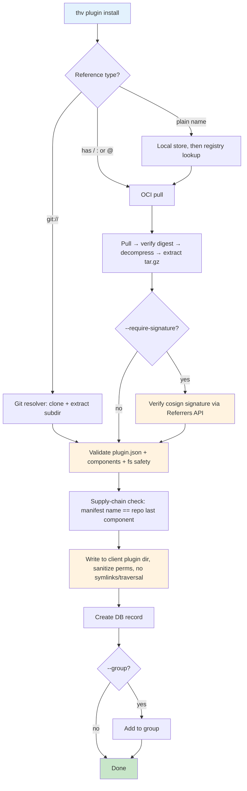

# RFC-XXXX: Plugin Lifecycle Management in ToolHive

- **Status**: Draft
- **Author(s)**: Juan Antonio Osorio (@JAORMX)
- **Created**: 2026-06-15
- **Last Updated**: 2026-06-15
- **Target Repository**: toolhive (with supporting changes in toolhive-core and toolhive-registry-server)
- **Related Issues**: N/A

## Summary

This RFC proposes adding **plugin** lifecycle management to ToolHive, mirroring the existing skills system. A *plugin* is the cross-vendor "bundle of primitives" unit pioneered by Claude Code — a directory declared by a `.claude-plugin/plugin.json` manifest that bundles any combination of slash commands, subagents, Agent Skills, hooks, MCP server configurations, and LSP servers. ToolHive will let users **build** a plugin directory into a reproducible OCI artifact, **push** it to any OCI registry, **install** it to one or more AI clients (from a registry name, OCI reference, or `git://` URL), and **list/info/uninstall** it — using the same registry, OCI, groups, and storage infrastructure that already serves skills and MCP servers. As a bridge to native client tooling, ToolHive can also generate a `marketplace.json` from a set of OCI-distributed plugins.

## Problem Statement

ToolHive already manages two of the three artifact classes an AI coding workflow consumes: **MCP servers** (as containers) and **skills** (as OCI artifacts, see [RFC-0030](./THV-0030-skills-lifecycle-management.md) and `docs/arch/12-skills-system.md`). The third class — **plugins** — is now the de-facto packaging unit across the ecosystem, and ToolHive has no story for it.

- **Plugins are the industry-convergent bundle unit.** Within ~6 months of Claude Code's October 2025 launch, near-identical bundle systems shipped in Cursor (`.cursor-plugin/plugin.json`), OpenAI Codex CLI (`.codex-plugin/plugin.json` — which even falls back to reading `.claude-plugin/plugin.json`), GitHub Copilot (`.github/plugin.json`), Gemini CLI (`gemini-extension.json`), and AWS Kiro ("Powers"). The component vocabulary (`skills`, `commands`, `agents`, `hooks`, `mcpServers`) has converged even though the manifests are not interoperable.
- **There is no OCI-based distribution for multi-primitive plugin bundles anywhere.** Plugins are distributed exclusively through Git/GitHub marketplaces (`marketplace.json`). Docker `cagent` packages single agents as OCI; ToolHive packages single skills as OCI; the official MCP Registry stays a metadata layer over container images. **No one packages a full multi-primitive plugin bundle as an immutable, content-addressable, signable OCI artifact.** This is an open niche ToolHive is uniquely positioned to fill.
- **Teams cannot govern or distribute plugins.** Without ToolHive, plugin distribution means hand-curated GitHub repos with no digest pinning, no signing, no central catalog, no scoped install, and no inventory of what is installed across a fleet of developer machines.
- **Plugins carry executable code, which raises the stakes.** Unlike skills (pure Markdown instructions), a plugin bundles **hooks** (shell commands fired on lifecycle events) and **MCP server configs** (executable processes). Installing a plugin is a code-trust decision today made with zero supply-chain tooling. ToolHive's content-addressable + signed-artifact model is exactly the missing control plane.

Skills proved the pattern. Plugins are the natural next artifact class, and the skills system was deliberately built on a generic foundation (`entries` table with an `entry_type` discriminator, `x/dev.toolhive/<type>` registry namespace, shared OCI primitives) that anticipates exactly this extension.

## Goals

- Enable lifecycle management of plugins through dedicated `thv plugin` commands: `build`, `push`, `install`, `uninstall`, `list`, `info`, `validate`, and `builds`.
- Package a plugin directory tree (manifest + all component directories) into a **reproducible, content-addressable OCI artifact**, distributable through any OCI-compliant registry.
- Support installation from three sources, exactly as skills do: registry name (registry lookup), OCI reference, and `git://` URL (including `@ref` and `#subdir`).
- Reuse — not duplicate — the skills foundation: shared OCI primitives in `toolhive-core`, the SQLite `entries` table, the registry provider seam, the groups system, the git resolver, scopes, and multi-client `PathResolver` abstraction.
- Validate a plugin bundle before packaging or installing: `plugin.json` schema, each bundled component (reusing the skills validator for bundled skills), and filesystem safety.
- Surface the **executable surface** of a plugin (hooks, MCP server commands) to the user before install, and support digest pinning and signature verification.
- Bridge OCI distribution to native client tooling by generating a `marketplace.json` from a set of OCI-distributed plugins.

## Non-Goals

- **Authoring plugins.** ToolHive packages and distributes plugins; it does not scaffold or generate plugin content. `claude plugin init` and equivalents own authoring.
- **Running a plugin's runtime behavior.** ToolHive does not execute hooks, dispatch slash commands, or interpret the manifest at the client's runtime — the AI client does that. ToolHive's job ends at placing a validated bundle in the right location (and, optionally, managing the lifecycle of bundled MCP servers — see "Managed MCP servers from plugins" as a *forward-looking* extension, explicitly out of scope for v1 core).
- **A cross-client plugin format.** ToolHive distributes the existing `plugin.json` bundle format; it does not define a new manifest schema. Multi-manifest fan-out (emitting `.cursor-plugin/`, `.codex-plugin/`, etc.) is a packaging-time concern that can be layered on later.
- **Auto-updates / daemon-driven reconciliation.** Same posture as skills; post-MVP.
- **Kubernetes operator integration.** Plugins are client-side developer artifacts; CLI/API first. A `MCPPlugin` CRD, if ever warranted, is a separate RFC.
- **Hosting a marketplace.** ToolHive *generates* `marketplace.json` and serves plugin metadata via its registry API; it does not run a hosted public marketplace service.

## Proposed Solution

### High-Level Design

The design is intentionally isomorphic to the skills system. Where skills have `pkg/skills` + `pkg/skills/skillsvc` + `toolhive-core/oci/skills`, plugins gain `pkg/plugins` + `pkg/plugins/pluginsvc` + `toolhive-core/oci/plugins`, sharing the same lower-level tar/gzip/extraction primitives, the same `entries` storage parent, the same registry provider seam, and the same git resolver.

```mermaid
graph TB
    subgraph Sources["Plugin Sources"]
        OCI[OCI Registry<br/>ghcr.io, ECR, ...]
        Git[Git Repository<br/>git://github.com/org/repo#subdir]
        Local[Local Directory<br/>.claude-plugin/plugin.json + components]
        RegAPI[Registry API<br/>Plugin Catalog]
    end

    subgraph Service["ToolHive Plugin Service (pkg/plugins/pluginsvc)"]
        SVC[PluginService]
        Lookup[PluginLookup<br/>registry name resolution]
        GitRes[GitResolver<br/>shared with skills]
        OCIClient[OCI RegistryClient]
        Packager[PluginPackager]
        Installer[Installer<br/>extract + validate]
        Store[(SQLite<br/>entries + installed_plugins)]
        MKT[Marketplace Generator]
    end

    subgraph FS["Client Filesystem"]
        UserPlug["user scope<br/>(per-client plugin dir)"]
        ProjPlug["project scope<br/>(per-client plugin dir)"]
    end

    subgraph Access["Access Layer"]
        CLI[thv plugin CLI]
        API[REST API<br/>/api/v1beta/plugins]
        HTTP[Plugins HTTP Client]
    end

    OCI --> OCIClient
    Git --> GitRes
    RegAPI --> Lookup
    Local --> Packager

    CLI --> SVC
    API --> SVC
    HTTP --> API

    SVC --> Lookup & GitRes & OCIClient & Packager & Installer & Store & MKT
    Installer --> UserPlug & ProjPlug
    MKT -.generates marketplace.json.-> OCI

    style SVC fill:#90caf9,stroke:#1565c0,stroke-width:2px
    style Store fill:#e3f2fd
    style UserPlug fill:#c8e6c9,stroke:#2e7d32,stroke-width:2px
    style ProjPlug fill:#c8e6c9,stroke:#2e7d32,stroke-width:2px
    style CLI fill:#fff9c4
    style API fill:#fff9c4
```

### Core Concepts

#### What a plugin is, in ToolHive's model

A plugin is a directory whose **only required file** is `.claude-plugin/plugin.json` (the manifest), with component directories living at the *plugin root* (not inside `.claude-plugin/`):

```
my-plugin/
├── .claude-plugin/
│   └── plugin.json          # the manifest — the ONLY file in this dir
├── commands/*.md            # slash commands
├── agents/*.md              # subagents
├── skills/<name>/SKILL.md   # bundled Agent Skills
├── hooks/hooks.json         # lifecycle hooks (EXECUTABLE surface)
├── .mcp.json                # MCP server configs (EXECUTABLE surface)
├── scripts/ bin/            # supporting executables referenced by hooks
└── LICENSE, CHANGELOG.md
```

The manifest fields ToolHive reads for packaging/cataloging (all optional except `name`):

| Field | Used for |
|-------|----------|
| `name` (required, kebab-case) | identity, OCI tag default, command namespacing (`name:command`) |
| `version` | semver; OCI tag, upgrade detection (falls back to git SHA if absent) |
| `description` | catalog display, OCI annotation |
| `author` (object `{name,email,url}`) | catalog display, `org.opencontainers.image.authors` |
| `homepage`, `repository` (string), `license`, `keywords` | catalog metadata, `org.opencontainers.image.*` |
| `commands`, `agents`, `skills`, `hooks`, `mcpServers`, `lspServers` | component discovery / executable-surface inventory |

ToolHive treats the manifest as **opaque-but-validated**: it parses the fields it understands, validates structural safety, records a metadata summary, and packages the whole tree verbatim. Unknown top-level fields are preserved (the manifest may double as a Cursor/Codex/npm manifest).

#### Installation scopes and clients

Identical model to skills:

- **User scope** (default): available across all of the user's projects.
- **Project scope** (`--scope project --project-root .` or auto-detected git root): available only within a project.

A `PathResolver` maps `(client, plugin-name, scope, project-root)` → install path per client, reusing the skills `PathResolver` pattern. When no `--clients` flag is passed, all plugin-supporting clients detected on the host are targeted (matching skills behavior).

#### The install-target decision (the one genuinely new problem)

Skills have a trivial install target: drop `<name>/SKILL.md` into `~/.claude/skills/`. Plugins are harder, because Claude Code's *native* plugin install path involves a marketplace cache (`~/.claude/plugins/cache/`) plus an `enabledPlugins` entry in `settings.json` keyed `name@marketplace` — state ToolHive would have to mutate and own.

There is, however, a much cleaner mechanism that Claude Code already supports: a **skills-directory plugin**. *Any* folder under a skills directory that contains `.claude-plugin/plugin.json` is loaded in-place as a plugin (reported as `<name>@skills-dir`) with **no marketplace registration and no settings mutation** — this is exactly what `claude plugin init` produces. This is the install target ToolHive should use for v1:

- **v1 (recommended): in-place skills-directory plugin.** ToolHive extracts the plugin tree to `<client-skills-dir>/<name>/` (e.g. `~/.claude/skills/<name>/` for user scope). Claude Code auto-loads it. No `settings.json` mutation, the install/uninstall lifecycle is pure filesystem (mirroring skills exactly), and `${CLAUDE_PLUGIN_ROOT}` resolves correctly because the client computes it from the load location.
- **Alternative / future: marketplace-cache install.** Extract to `~/.claude/plugins/cache/<marketplace>/<name>/<version>/` and add an `enabledPlugins` entry. More faithful to native plugins (versioned cache, enable/disable scoping) but requires owning `settings.json` state and the `name@marketplace` keying. Deferred.

The `PathResolver` abstracts this per client, so a client whose only viable target is a marketplace cache can opt into the second strategy without changing the service layer. **This is flagged as an open question** — see Open Questions #1.

### OCI Artifact Format

Plugins reuse the skills OCI machinery with a distinct artifact type. A new `toolhive-core/oci/plugins` package mirrors its sibling `oci/skills`, and the **shared, artifact-agnostic primitives are lifted into a common subpackage** (see Component Changes) rather than copied.

**Structure** (identical shape to skills — image index → per-platform manifests → image config + one shared tar.gz layer):

```
OCI Image Index  (application/vnd.oci.image.index.v1+json, artifactType: dev.toolhive.plugins.v1)
└── Image Manifest (per platform; artifactType: dev.toolhive.plugins.v1)
    ├── Image Config (application/vnd.oci.image.config.v1+json — metadata in labels)
    └── Content Layer (application/vnd.oci.image.layer.v1.tar+gzip, title "plugin.tar.gz")
        └── <entire plugin directory tree>
```

**Media / artifact types:**

| Element | Value |
|---------|-------|
| Artifact type (index + manifest) | `dev.toolhive.plugins.v1` |
| Manifest | `application/vnd.oci.image.manifest.v1+json` |
| Config | `application/vnd.oci.image.config.v1+json` |
| Layer | `application/vnd.oci.image.layer.v1.tar+gzip` |
| Index | `application/vnd.oci.image.index.v1+json` |

**Config labels** (read at install) and **manifest annotations** (read by registry UIs), using the `dev.toolhive.plugins.*` namespace, mirroring `dev.toolhive.skills.*`:

- `dev.toolhive.plugins.name`, `.description`, `.version`, `.license`
- `dev.toolhive.plugins.files` — JSON array of all packaged file paths
- `dev.toolhive.plugins.components` — JSON object summarizing the bundle, e.g. `{"commands":3,"agents":1,"skills":2,"hooks":4,"mcpServers":1}` — the *executable-surface inventory* surfaced by `thv plugin info` before install
- `org.opencontainers.image.created`, `.authors`, `.source`, `.licenses`, `.version`

> **Design decision — single tar.gz layer vs. one layer per primitive.** ToolHive's skills use a single tar.gz layer; precedents split both ways (Helm/OPA: single tarball; Tekton/ORAS/Conftest: one typed layer per item with `org.opencontainers.image.title`). For v1 we choose the **single tar.gz layer** for consistency with skills, simplicity, and reproducibility. Per-primitive layers (enabling dedup and per-component addressability/signing) are a forward-compatible evolution — the artifact type can gain a `dev.toolhive.plugins.v2` with multi-layer semantics without breaking v1 consumers. See Alternatives Considered.

**Reproducible packaging** (identical discipline to skills): deterministic tar (sorted entries, normalized mode/`ModTime` via `SOURCE_DATE_EPOCH`, UID/GID 0), deterministic gzip (`BestCompression`, OS byte 255, empty name/comment), so identical content always yields an identical digest — the precondition for digest pinning and signature verification.

**Dependencies.** Plugins may declare dependencies (the manifest has a `dependencies` array). These are recorded as a `dev.toolhive.plugins.requires` annotation (JSON array of OCI references), mirroring `dev.toolhive.skills.requires`. Resolution of transitive plugin dependencies is **post-MVP** (Non-Goal-adjacent); v1 records but does not auto-install them.

### Detailed Design

#### Component Changes

**New: `toolhive-core/oci/plugins`** — `PluginPackager`, `RegistryClient`, `Store` (rooted at `toolhive/plugins` under `xdg.DataHome`), `ArtifactTypePlugin`, labels/annotations. Built on ORAS, Docker credential store auth — same as `oci/skills`.

**Refactor: extract shared OCI primitives.** The tar/gzip/extraction/validation helpers in `oci/skills` (`CreateTar`, `Compress`, `DecompressWithLimit`, `ExtractTarWithLimit`, the `validatingTarget` pull-hardening, the local-build marker `dev.stacklok.toolhive.local-build`) are already skill-agnostic and were explicitly designed to generalize. Lift them into a shared `toolhive-core/oci/internal` (or `oci/artifact`) package consumed by both `oci/skills` and `oci/plugins`. This is convergence, not duplication.

**New: `pkg/plugins`** — types (`PluginManifest`, `Scope`, `PathResolver`, `InstalledPlugin`), `PluginService` interface, parser (`plugin.json`), validator, installer (extraction), options/DTOs.

**New: `pkg/plugins/pluginsvc`** — the service implementation, structurally mirroring `pkg/skills/skillsvc`: `build.go`, `push` (in build.go), `install.go`, `install_oci.go`, `install_git.go`, `install_registry`, `uninstall.go`, `list.go`, `info`, `content.go`, `oci.go`, `local_build_marker.go`, `marketplace.go` (new — generator).

**Reuse as-is:** `pkg/skills/gitresolver` (git `git://` resolution, SSRF + host-scoped auth) — generalize its name to `pkg/vcs/gitresolver` or consume it directly; `pkg/groups` (add a `Plugins []string` field + `AddPluginToGroup`/`RemovePluginFromAllGroups`, mirroring skills); `pkg/client` (extend the client metadata with plugin-path fields and a `SupportsPlugins` flag).

#### CLI Commands

All under the `thv plugin` namespace, mirroring `thv skill`. (Plugin commands require `thv serve`, like skills.)

```
thv plugin
├── install [name|oci-ref|git-url]   Install from registry, OCI, or git
├── uninstall [name]                 Remove an installed plugin
├── list                             List installed plugins (table/json/yaml)
├── info [name]                      Show details incl. executable-surface inventory
├── validate [path]                  Validate a plugin directory
├── build [path]                     Build plugin dir into a local OCI artifact
├── push [reference]                 Push a built artifact to an OCI registry
├── builds                           List local builds
│   └── remove [tag]                 Delete a local build
└── marketplace
    └── generate [refs...]           Generate a marketplace.json from OCI refs
```

Selected flags (consistent with `thv skill`):

```
thv plugin install <source> [flags]
  --clients strings      Target client(s) (default: all plugin-supporting clients)
  --scope string         user | project (default "user")
  --project-root string  Project root for project scope
  --group string         Add plugin to a group
  --version string       Version/tag to resolve for a plain name
  --force                Overwrite an existing unmanaged plugin
  --require-signature    Refuse to install unless a valid signature is present
  --format string        table | json | yaml

thv plugin build <path> [flags]
  --tag string           OCI tag/reference (default: name[:version] from plugin.json)
  --platform strings     default linux/amd64,linux/arm64

thv plugin info <name|ref> [flags]   # prints components incl. hooks & MCP commands
thv plugin marketplace generate <ref> [<ref>...] --name <mkt> --owner <owner> [-o marketplace.json]
```

**`thv plugin info` output** deliberately foregrounds the executable surface:

```
NAME            my-plugin
VERSION         v1.2.0
SOURCE          ghcr.io/org/plugins/my-plugin:v1.2.0
DIGEST          sha256:abc123…
SIGNATURE       verified (cosign, ghcr.io/org/.github)   # or: none
COMPONENTS      commands=3  agents=1  skills=2  hooks=4  mcpServers=1
HOOKS           PreToolUse → scripts/scan.sh
                PostToolUse → scripts/log.sh
MCP SERVERS     my-server → node ./mcp/index.js
```

#### API Changes

REST surface mirrors skills, mounted at `/api/v1beta/plugins`:

| Method | Path | Description |
|--------|------|-------------|
| `GET` | `/` | List installed plugins (filter scope, client, project_root, group) |
| `POST` | `/` | Install a plugin |
| `GET` | `/{name}` | Get plugin info (incl. component inventory) |
| `DELETE` | `/{name}` | Uninstall a plugin |
| `POST` | `/validate` | Validate a plugin directory/manifest |
| `POST` | `/build` | Build plugin to OCI artifact |
| `POST` | `/push` | Push a built plugin |
| `GET` | `/builds` | List local builds |
| `DELETE` | `/builds/{tag}` | Delete a local build |
| `GET` | `/content` | Get manifest + file listing for a reference (preview without install) |
| `POST` | `/marketplace` | Generate a marketplace.json for a set of references |

Browsing (registry catalog), mirroring `registry_v01_skills.go`, under the proprietary extension namespace:

| Method | Path |
|--------|------|
| `GET` | `/registry/{name}/v0.1/x/dev.toolhive/plugins` |
| `GET` | `/registry/{name}/v0.1/x/dev.toolhive/plugins/{namespace}/{pluginName}` |

The Go service interface:

```go
// pkg/plugins/service.go
type PluginService interface {
    List(ctx context.Context, opts ListOptions) ([]InstalledPlugin, error)
    Install(ctx context.Context, opts InstallOptions) (*InstallResult, error)
    Uninstall(ctx context.Context, opts UninstallOptions) error
    Info(ctx context.Context, opts InfoOptions) (*PluginInfo, error)
    Validate(ctx context.Context, path string) (*ValidationResult, error)
    Build(ctx context.Context, opts BuildOptions) (*BuildResult, error)
    Push(ctx context.Context, opts PushOptions) error
    ListBuilds(ctx context.Context) ([]LocalBuild, error)
    DeleteBuild(ctx context.Context, tag string) error
    GetContent(ctx context.Context, opts ContentOptions) (*PluginContent, error)
    GenerateMarketplace(ctx context.Context, opts MarketplaceOptions) (*Marketplace, error)
}
```

Registry provider seam (`pkg/registry/provider.go`) gains plugin methods with **no-op defaults on `BaseProvider`** (the exact extension pattern skills used):

```go
type Provider interface {
    // ... existing server + skill methods ...
    ListAvailablePlugins() ([]types.Plugin, error)
    GetPlugin(namespace, name string) (*types.Plugin, error)
    SearchPlugins(query string) ([]types.Plugin, error)
}
```

#### Configuration Changes

A bundled MCP server config inside a plugin (`.mcp.json`) is packaged verbatim; ToolHive does not rewrite it in v1. Example of what travels inside the artifact (unchanged Claude Code format):

```json
{
  "mcpServers": {
    "my-server": { "command": "node", "args": ["${CLAUDE_PLUGIN_ROOT}/mcp/index.js"] }
  }
}
```

The `marketplace generate` output (bridging OCI → native client tooling):

```json
{
  "name": "acme-internal",
  "owner": { "name": "Acme Platform", "url": "https://acme.example" },
  "plugins": [
    {
      "name": "my-plugin",
      "source": { "source": "github", "repo": "acme/my-plugin", "ref": "v1.2.0", "sha": "<40-hex>" },
      "description": "…",
      "version": "v1.2.0"
    }
  ]
}
```

> Note: native `marketplace.json` `source` types are git-based (`github`/`url`/`git-subdir`/`npm`/relative path) — they do **not** include OCI references. The generator therefore emits git sources derived from the plugin's `repository`/source metadata, with `sha` pinning when known. ToolHive's *own* registry/CLI consumes the OCI artifact directly; the generated marketplace is the interoperability shim for clients that only speak the native format.

#### Data Model Changes

Reuse the generic `entries` parent table (the `entry_type` discriminator was designed for exactly this — see `docs/arch/12-skills-system.md` storage section). Add a new migration creating `installed_plugins` (and a satellite for the component inventory), referencing `entries(id)`; `oci_tags` is reused unchanged.

```sql
-- migrations/00X_create_plugins.sql
-- entries (existing): id, entry_type ('plugin'), name, created_at, updated_at, UNIQUE(entry_type, name)

CREATE TABLE installed_plugins (
    id            INTEGER PRIMARY KEY,
    entry_id      INTEGER NOT NULL REFERENCES entries(id) ON DELETE CASCADE,
    scope         TEXT NOT NULL,           -- user | project
    project_root  TEXT NOT NULL DEFAULT '',
    reference     TEXT NOT NULL,           -- OCI ref or git URL
    tag           TEXT,
    digest        TEXT,                    -- for upgrade detection + pinning
    version       TEXT,
    description   TEXT,
    author        TEXT,
    signature     TEXT,                    -- verification status/issuer, nullable
    client_apps   BLOB,                    -- JSONB []string
    components    BLOB,                    -- JSONB component inventory
    status        TEXT NOT NULL,           -- installed | pending | failed
    installed_at  TEXT NOT NULL,
    UNIQUE (entry_id, scope, project_root)
);

CREATE TABLE plugin_dependencies (
    installed_plugin_id INTEGER NOT NULL REFERENCES installed_plugins(id) ON DELETE CASCADE,
    dep_name      TEXT NOT NULL,
    dep_reference TEXT NOT NULL,
    dep_digest    TEXT,
    PRIMARY KEY (installed_plugin_id, dep_reference)
);
```

A natural hardening step (called out in the skills doc as a TODO): introduce a typed `EntryType` constant set in `pkg/storage` (`"skill"`, `"plugin"`) instead of the current stringly-typed literal.

### Install / Build / Push flows

These are the skills flows with a plugin manifest in place of `SKILL.md`. The install dispatch is identical:



- **Per-plugin locking** keyed `(scope, name, projectRoot)`, as skills do.
- **Supply-chain check**: the manifest `name` must equal the last path component of the OCI repository (mirrors the skills check).
- **Extraction safety** is inherited wholesale from the shared primitives (no symlinks/hardlinks, no `..`/absolute paths, perms masked to 0644, size/file-count caps, pre- and post-extraction filesystem verification).

## Security Considerations

**This is the section where plugins genuinely differ from skills.** A skill is inert Markdown read by the model. A plugin bundles **hooks** (shell commands executed deterministically by the client on lifecycle events) and **MCP server configs** (executable processes). **Installing a plugin is granting code-execution trust.** The whole point of putting plugins on ToolHive's content-addressable + signed OCI rail is to bring supply-chain controls to a decision currently made with none.

### Threat Model

| Threat | Description | Likelihood | Impact |
|--------|-------------|------------|--------|
| Malicious hook | Plugin ships a `hooks.json` whose command exfiltrates data or runs on `PreToolUse`/`SessionStart` | Medium | **Critical** |
| Malicious bundled MCP server | `.mcp.json` points at a server that does anything | Medium | **Critical** |
| Trojaned update | A new tag for a trusted plugin adds a hook | Medium | High |
| Registry compromise / tag mutation | Attacker overwrites a tag with a malicious bundle | Low | High |
| Path traversal / symlink in archive | Bundle writes outside the install dir or overwrites sensitive files | Medium | High |
| Typosquatting | `my-plugin` vs `my-plugln` in a catalog | Medium | High |
| Prompt-injection via bundled instructions | Commands/agents/skills carry adversarial instructions | Medium | Medium |
| Inventory blind spot | Fleet has plugins with hooks nobody audited | High | Medium |

### Authentication and Authorization

- Registry auth delegates to Docker credential helpers (`~/.docker/config.json`); no new credential store, identical to skills.
- No privilege escalation by ToolHive: extracted files are written with sanitized, non-executable-by-default perms (0644) under the user's own directories. Hooks become executable only because the *client* runs them — ToolHive never executes plugin code during install.

### Data Security

- Plugin artifacts and metadata are public content; no secrets are stored by the plugin manager.
- `userConfig`-style secrets (a plugin manifest can declare config options, some `sensitive`) are **not** populated by ToolHive at install; they remain the client's keychain concern. ToolHive must never persist values for `sensitive` config options. (Open Question #3.)

### Input Validation

| Input | Validation | Rejection |
|-------|------------|-----------|
| Plugin name | `^[a-z0-9][a-z0-9-]{0,62}[a-z0-9]$`, no consecutive hyphens | invalid chars/length |
| `plugin.json` | well-formed JSON; correct field *types* (e.g. `keywords` must be array — a string is a hard error, matching client behavior); `name` present | malformed / wrong types |
| Component paths in manifest | must be relative, must start with `./`, no `../` | traversal |
| Archive entries | no `..`, no absolute paths, no symlinks/hardlinks, non-regular files rejected | traversal / link attacks |
| OCI reference | standard parse + name-matches-repo supply-chain check | malformed / mismatch |
| git ref | shell-injection char rejection; SSRF host checks | injection / SSRF |
| Bundled SKILL.md | reuse the skills validator | invalid frontmatter |

### Secrets Management

- No secrets stored by the plugin manager; registry credentials via Docker helpers, accessed on demand, never passed into plugins or recorded in metadata.

### Audit and Logging

Like skills, plugins are client-side constructs that bypass ToolHive's proxy middleware, so they are not captured by the existing HTTP audit path. **Plugins raise the audit stakes** (executable surface), so:

- v1 logs structured events from the CLI/API service layer: `plugin_installed`, `plugin_uninstalled`, `plugin_upgraded`, `plugin_built`, `plugin_pushed`, each with name, digest, source, signature status, and the component inventory (notably hook count). This gives a fleet a queryable inventory of *what executable plugin surface is installed where*.
- A full audit-architecture for client-side artifacts remains the same separate-RFC concern flagged in RFC-0030, but the install-time event log is in scope here because the executable surface makes "who installed what hook" a real security need.

### Mitigations

| Threat | Mitigation (v1) | Future |
|--------|-----------------|--------|
| Malicious hook / MCP server | `thv plugin info` surfaces the **executable-surface inventory** (hooks + MCP commands) before install; install-time event logging | policy: refuse hooks not on an allowlist; org policy profiles |
| Trojaned update | digest recorded; upgrades show digest change; component-inventory diff on upgrade | require re-approval when hook set changes |
| Registry compromise / tag mutation | content-addressable digests; `--require-signature` verifies cosign signatures via the **OCI Referrers API** (`subject` + `GET /v2/<name>/referrers/<digest>`) | signature required by default; org trust roots |
| Path traversal / symlink | shared extraction hardening (reused from skills) | — |
| Typosquatting | registry catalog is curated; supply-chain name==repo check | namespace ownership verification |
| Managed MCP isolation | (forward-looking) running bundled MCP servers *via thv* gains network isolation + permission profiles instead of the client spawning them unsandboxed | first-class "managed MCP from plugin" |
| Inventory blind spot | SQLite inventory + `thv plugin list --format json` across fleet | dashboards / cloud UI |

## Alternatives Considered

### Alternative 1: Treat a plugin as "just another skill"

- **Description**: Reuse the skills artifact type and pipeline unchanged; a plugin is a skill whose directory happens to contain `plugin.json`.
- **Pros**: Zero new code.
- **Cons**: Conflates two artifact classes with different validation, different metadata, and critically different *risk* (executable vs inert). The catalog could not distinguish them; the executable-surface inventory and signature-required-by-policy story would have no home.
- **Why not chosen**: Skills and servers were deliberately kept as separate systems sharing infrastructure; plugins follow that precedent. Distinct `artifactType` + table + CLI namespace, shared primitives.

### Alternative 2: One OCI layer per primitive (Tekton/ORAS model)

- **Description**: Each command/agent/skill/hook/MCP-config becomes its own typed layer with `org.opencontainers.image.title`.
- **Pros**: Per-component addressability, dedup across plugins, per-component signing.
- **Cons**: More complex packaging/extraction, diverges from the skills single-layer model, marginal benefit at current scale.
- **Why not chosen for v1**: Single tar.gz layer matches skills and is simpler; the artifact type is versioned so a future `dev.toolhive.plugins.v2` can adopt multi-layer without breaking v1.

### Alternative 3: Don't use OCI; mirror native Git marketplaces only

- **Description**: ToolHive just adds/install-from `marketplace.json` Git repos.
- **Pros**: Native, zero packaging.
- **Cons**: No digest pinning, no signing, no immutable artifacts, no unified catalog with servers/skills, no content-addressable supply chain — i.e. abandons ToolHive's entire value proposition.
- **Why not chosen**: OCI is the differentiator. We *generate* marketplace.json as a bridge (best of both).

### Alternative 4: Marketplace-cache install with settings.json mutation (v1)

- **Description**: Install exactly as native plugins do (cache dir + `enabledPlugins`).
- **Pros**: Faithful to native lifecycle (versioned cache, enable/disable).
- **Cons**: ToolHive must own and mutate client `settings.json` across scopes and the `name@marketplace` keying; brittle and client-specific.
- **Why not chosen for v1**: The in-place skills-directory-plugin mechanism gives a pure-filesystem lifecycle identical to skills. Marketplace-cache install is kept as a per-client `PathResolver` strategy for later.

### Alternative 5: JSON-file state instead of SQLite

- **Description**: Per-plugin metadata + index files (as RFC-0030 originally proposed for skills).
- **Pros**: Human-inspectable.
- **Cons**: The ecosystem has since standardized on SQLite (RFC-0041, the `entries` table). Diverging would fragment storage.
- **Why not chosen**: Reuse the `entries`/`entry_type` foundation that was built for this.

## Compatibility

### Backward Compatibility

- **Additive only.** New `thv plugin` namespace; existing `thv`, `thv skill`, and MCP server commands are untouched.
- **Storage**: new tables off the existing `entries` parent via a new migration; no change to existing skills/server tables.
- **toolhive-core**: new `oci/plugins` package; the shared-primitive extraction is an internal refactor that preserves `oci/skills`'s public behavior (covered by existing tests).
- **Manifest fidelity**: plugins are packaged verbatim, so a plugin installed via ToolHive is byte-identical to one installed natively (same `plugin.json`, same component layout) — a plugin remains usable without ToolHive.

### Forward Compatibility

- **Versioned artifact type** (`dev.toolhive.plugins.v1`) leaves room for multi-layer v2.
- **`entry_type` discriminator** already accommodates further artifact classes.
- **`PathResolver` per client** lets the marketplace-cache install strategy land later without service changes.
- **Provider no-op defaults** let registries adopt plugin catalogs incrementally.
- **Referrers-based signing** composes with future SBOM/provenance attachments on the same digest.
- **Managed-MCP-from-plugin** can be added as an opt-in install behavior (run bundled `.mcp.json` servers through `thv` with isolation) without changing the artifact format.

## Implementation Plan

### Phase 1: Shared foundation (toolhive-core)
- Extract artifact-agnostic tar/gzip/extraction/`validatingTarget`/local-build-marker primitives from `oci/skills` into a shared subpackage; keep `oci/skills` behavior intact.
- Add `oci/plugins`: `ArtifactTypePlugin`, labels/annotations, `Packager`, `RegistryClient`, `Store`.

### Phase 2: Core service + validation (toolhive)
- `pkg/plugins` types, `plugin.json` parser, validator (reusing skills validator for bundled skills), installer (extraction).
- `pkg/plugins/pluginsvc` with `Build`, `Push`, `Validate`, local `Store`, local-build marker.
- New SQLite migration + `PluginStore`; introduce typed `EntryType`.

### Phase 3: Install / list / info / uninstall
- OCI install (`install_oci.go`), git install (reuse resolver), registry-name install.
- `List`, `Info` (with executable-surface inventory), `Uninstall`; groups integration (`Plugins []string` + helpers).
- Multi-client `PathResolver`: implement the in-place skills-directory-plugin strategy.

### Phase 4: API + CLI + content preview
- REST endpoints under `/api/v1beta/plugins`; HTTP client (`pkg/plugins/client`).
- `thv plugin` cobra commands; `GetContent` preview.

### Phase 5: Registry catalog + marketplace bridge + signing
- `Plugin` type in toolhive-core registry types; provider methods + no-op defaults; `/v0.1/x/dev.toolhive/plugins` routes; `PluginsClient`; toolhive-registry-server support.
- `marketplace generate`.
- `--require-signature` via cosign + Referrers API.

### Dependencies
- ORAS (`oras.land/oras-go/v2`), already used by skills.
- Existing `pkg/skills/gitresolver`, `pkg/groups`, `pkg/client`, `pkg/storage/sqlite`.
- cosign/sigstore libraries for Phase 5 signature verification.

## Testing Strategy

- **Unit**: `plugin.json` parser/validator (incl. wrong-type rejection), packager determinism (identical digest for identical input), extraction safety, component-inventory extraction, marketplace generator.
- **Integration**: each CLI command against a mock OCI registry; build→push→install→list→uninstall round-trip; git install with subdir/ref; group membership.
- **E2E**: full workflow against a real registry (GHCR) and verification that an installed plugin loads in Claude Code (skills-directory-plugin path).
- **Compatibility**: byte-identical round-trip (native plugin → build → install → compare tree).
- **Security**: path-traversal/symlink/oversized-archive fixtures; supply-chain name-mismatch rejection; signature-required failure paths; injection/SSRF in git refs.
- **Performance**: large-bundle packaging within size caps; reproducibility under `SOURCE_DATE_EPOCH`.

## Documentation

- New `docs/arch/14-plugins-system.md` mirroring `12-skills-system.md`.
- `thv plugin` CLI reference; user guide "Managing Plugins with ToolHive"; "Distributing plugins via OCI and generating a marketplace".
- Security guide: "Understanding a plugin's executable surface" + signature workflow.
- Client support matrix (which clients support plugins and via which install strategy).
- Update the `toolhive-cli-user` skill to cover `thv plugin`.

## Open Questions

1. **Install target per client.** v1 recommends the in-place skills-directory-plugin strategy (no `settings.json` mutation). Should any v1 client instead use the marketplace-cache + `enabledPlugins` strategy, and do we need a dedicated plugins directory distinct from the skills directory to avoid `thv skill list` / `thv plugin list` overlap?
2. **Component-inventory diff on upgrade.** Should an upgrade that *adds* a hook or MCP server require explicit re-approval (`--accept-new-executables`) by default?
3. **`userConfig` / sensitive options.** Plugins can declare config (some `sensitive`). Does ToolHive stay entirely hands-off (client keychain owns it), or offer to wire values from ToolHive's secrets manager at install time?
4. **Managed MCP servers from plugins.** Out of scope for v1 core, but is it the headline v2 feature — running a plugin's bundled MCP servers through `thv` (network isolation, permission profiles, audit) instead of the client spawning them unsandboxed?
5. **Dependency resolution.** v1 records `requires`; when do we auto-install transitive plugin/skill dependencies, and how do we avoid cycles?
6. **Multi-manifest packaging.** Do we ever emit sibling `.cursor-plugin/` / `.codex-plugin/` manifests at build time for cross-client install, or leave that to authors?

## References

- [RFC-0030: Skills Lifecycle Management in ToolHive CLI](./THV-0030-skills-lifecycle-management.md)
- [RFC-0029: Skills Support in Registry Server](./THV-0029-skills-support-registry-server.md)
- [RFC-0041: SQLite State Management](./THV-0041-sqlite-state-management.md)
- [RFC-0032: toolhive-core Shared Library](./THV-0032-toolhive-core-shared-library.md)
- `toolhive/docs/arch/12-skills-system.md` — the architecture this RFC mirrors
- `toolhive-core/oci/skills` — the OCI packaging this RFC parallels
- [Claude Code plugins reference](https://code.claude.com/docs/en/plugins-reference) and [marketplaces](https://code.claude.com/docs/en/plugin-marketplaces)
- [Claude Code hooks reference](https://code.claude.com/docs/en/hooks)
- [MCPB bundle spec](https://github.com/modelcontextprotocol/mcpb) — single-server packaging contrast
- [OCI image-spec 1.1 `artifactType` + `subject`](https://github.com/opencontainers/image-spec/blob/main/manifest.md) and [Referrers API (distribution-spec)](https://github.com/opencontainers/distribution-spec/blob/main/spec.md)
- [ORAS — OCI Registry As Storage](https://oras.land/docs/) — multi-file artifact packaging
- [Helm OCI media types](https://helm.sh/blog/helm-oci-mediatypes/) — single-tarball-layer precedent
- [Agent Skills specification](https://agentskills.io/specification) — the cross-vendor `SKILL.md` standard
- Cross-client bundle manifests (convergent, non-interoperable): [Cursor plugins](https://cursor.com/docs/reference/plugins), [Gemini CLI extensions](https://github.com/google-gemini/gemini-cli/blob/main/docs/extensions/index.md), [AGENTS.md convention](https://agents.md)

---

## RFC Lifecycle

### Review History

| Date | Reviewer | Decision | Notes |
|------|----------|----------|-------|
| 2026-06-15 | - | Draft | Initial submission |

### Implementation Tracking

| Repository | PR | Status |
|------------|-----|--------|
| toolhive | - | Pending |
| toolhive-core | - | Pending |
| toolhive-registry-server | - | Pending |
