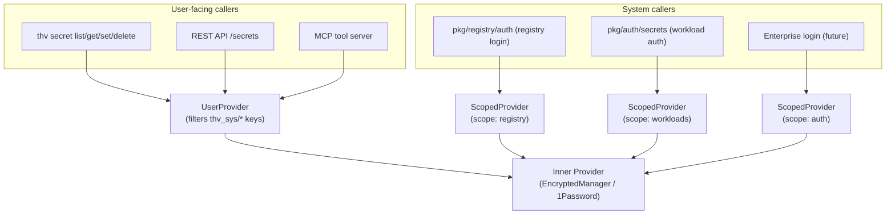

# RFC-XXXX: Scoped Secret Store for System-Managed Tokens

- **Status**: Draft
- **Author(s)**: @amirejaz
- **Created**: 2026-03-17
- **Last Updated**: 2026-03-17
- **Target Repository**: toolhive
- **Related Issues**: [toolhive#4192](https://github.com/stacklok/toolhive/issues/4192)

## Summary

Introduce a `ScopedProvider` and `UserProvider` wrapper layer in `pkg/secrets/` that
isolates system-managed authentication tokens (registry OAuth tokens, workload auth
tokens, future enterprise login tokens) from user-managed secrets. System tokens are
stored under a reserved `thv_sys/<scope>/` key prefix and are invisible to user-facing
commands. This is a prerequisite for enterprise CLI/Desktop login (where OAuth session
tokens must be stored securely and in isolation from user workload secrets).

## Problem Statement

ToolHive's secret management uses a flat keyspace — all secrets share the same
namespace in the backing store. The following system-managed tokens are currently
stored alongside user-managed secrets and are visible via `thv secret list`:

| Key pattern | Source |
|---|---|
| `REGISTRY_OAUTH_<hex>` | `thv registry login` refresh tokens |
| `OAUTH_CLIENT_SECRET_<workload>` | Remote workload OAuth client secrets |
| `BEARER_TOKEN_<workload>` | Remote workload bearer tokens |
| `OAUTH_REFRESH_TOKEN_<workload>` | Remote workload OAuth refresh tokens |

This creates several problems:

- **Confusing UX**: Users see internal system tokens when listing their secrets,
  making it hard to identify their own workload secrets.
- **Accidental breakage**: A user can delete or overwrite a token that an active
  workload depends on, causing it to silently fail.
- **No isolation between concerns**: Registry login tokens and workload auth tokens
  share the same namespace with no logical separation.
- **Prerequisite for enterprise login**: The upcoming enterprise CLI/Desktop login
  feature (OAuth session tokens) cannot safely store tokens in the current flat
  store without exposing them to users.

All users of ToolHive with registry login or remote workload authentication configured
are affected today. Enterprise users will additionally be affected once CLI/Desktop
login is implemented.

## Goals

- Introduce a `ScopedProvider` wrapper that transparently namespaces system-managed
  keys under a reserved prefix, invisible to user-facing commands.
- Introduce a `UserProvider` wrapper that filters system keys from user-facing
  operations and rejects attempts to read or write reserved keys with a clear error.
- Define named scopes for each system concern: `registry`, `workloads`, `auth`.
- Add factory helpers so callers use the correct provider type without knowing the
  internal prefix format.
- Migrate existing system-managed keys to the scoped namespace on first startup to
  avoid breaking existing installations.
- Reserve the `auth` scope for future enterprise CLI/Desktop login tokens.

## Non-Goals

- Multi-tenancy or per-workload secret ACLs (isolation is at the system vs. user
  boundary only, not between individual workloads).
- Encryption-at-rest improvements (the backing store is unchanged).
- Supporting scoped providers on top of the `EnvironmentType` provider (system tokens
  must never come from environment variables).
- The enterprise CLI/Desktop login implementation itself (tracked separately).
- Any changes to how user-managed secrets are stored or structured.

## Proposed Solution

### High-Level Design

Two new wrapper types are introduced in `pkg/secrets/scoped.go`:



All wrappers delegate to the same underlying `Provider` (e.g. `EncryptedManager`).
The key transformation is transparent to callers.

### Detailed Design

#### Key Prefix Format

```
thv_sys/<scope>/<name>

Examples:
  thv_sys/registry/REGISTRY_OAUTH_a1b2c3d4
  thv_sys/workloads/BEARER_TOKEN_github-app
  thv_sys/workloads/OAUTH_CLIENT_SECRET_my-server
  thv_sys/auth/access_token          (future)
  thv_sys/auth/refresh_token         (future)
```

The `thv_sys/` prefix is chosen because:
- The `/` separator makes collision with user keys structurally impossible (the
  `ParseSecretParameter` regex `^([^,]+),target=(.+)$` does not restrict slashes,
  but no existing user keys use this prefix).
- It is human-readable when inspecting the backing store directly.
- It is consistent with the `TOOLHIVE_SECRET_` convention for environment vars.

#### Scope Constants

```go
const (
    // SystemKeyPrefix is the top-level prefix for all system-managed keys.
    SystemKeyPrefix = "thv_sys"

    // ScopeRegistry is for registry OAuth refresh tokens (thv registry login).
    ScopeRegistry = "registry"

    // ScopeWorkloads is for remote workload auth tokens (OAuth client secrets,
    // bearer tokens, OAuth refresh tokens managed by pkg/auth/secrets).
    ScopeWorkloads = "workloads"

    // ScopeAuth is reserved for enterprise CLI/Desktop login tokens.
    ScopeAuth = "auth"
)
```

#### Component Changes

**New file: `pkg/secrets/scoped.go`**

`ScopedProvider` — for system callers:
- `GetSecret/SetSecret/DeleteSecret` transparently prefix the key: `thv_sys/<scope>/<name>`.
- `ListSecrets` returns only entries in the scope, with prefix stripped (bare names to callers).
- `Cleanup` performs a prefix-filtered delete — only keys in this scope are removed,
  leaving all other secrets untouched.
- `Capabilities` delegates to inner.

`UserProvider` — for user-facing callers:
- `GetSecret/SetSecret/DeleteSecret` reject any name starting with `thv_sys/` and
  return `ErrReservedKeyName` without calling the inner provider.
- `ListSecrets` silently filters out entries whose `Key` starts with `thv_sys/`.
- `Cleanup` delegates to inner (full user-secret wipe; system secrets cleaned via their own `ScopedProvider`).
- `Capabilities` delegates to inner.

**New factory helpers in `pkg/secrets/factory.go`**

```go
// CreateScopedSecretProvider returns a provider for system-managed tokens in the
// given scope. Does NOT apply the FallbackProvider wrapper — system tokens must
// not fall back to environment variables.
// Returns an error if managerType is EnvironmentType.
func CreateScopedSecretProvider(managerType ProviderType, scope string) (Provider, error)

// CreateUserSecretProvider returns a provider for user-managed secrets.
// Wraps with UserProvider to filter out system-reserved keys.
func CreateUserSecretProvider(managerType ProviderType) (Provider, error)
```

**New migration helper: `pkg/secrets/migration.go`**

On first startup after upgrade, scan the backing store for keys matching legacy
system patterns and rename them to the scoped equivalents. The migration is guarded
by a config flag to run exactly once.

```go
// MigrateSystemKeys scans for legacy unscoped system keys and renames them to
// their scoped equivalents. Safe to call on every startup — exits early if
// migration has already run.
func MigrateSystemKeys(ctx context.Context, provider Provider, configProvider config.Provider) error
```

Legacy key patterns and their target scopes:

| Legacy key pattern | Target scope | Example |
|---|---|---|
| `REGISTRY_OAUTH_*` | `registry` | `thv_sys/registry/REGISTRY_OAUTH_a1b2c3` |
| `OAUTH_CLIENT_SECRET_*` | `workloads` | `thv_sys/workloads/OAUTH_CLIENT_SECRET_foo` |
| `BEARER_TOKEN_*` | `workloads` | `thv_sys/workloads/BEARER_TOKEN_foo` |
| `OAUTH_REFRESH_TOKEN_*` | `workloads` | `thv_sys/workloads/OAUTH_REFRESH_TOKEN_foo` |

#### Caller Changes

| Caller | Change |
|---|---|
| `cmd/thv/app/secret.go` `getSecretsManager()` | → `CreateUserSecretProvider` |
| `pkg/api/v1/secrets.go` `getSecretsManager()` | → `CreateUserSecretProvider` |
| `pkg/mcp/server/list_secrets.go`, `set_secret.go` | → `CreateUserSecretProvider` |
| `pkg/runner/runner.go` (workload secret resolution) | → `CreateUserSecretProvider` |
| `pkg/workloads/manager.go` `validateSecretParameters` | → `CreateUserSecretProvider` |
| `cmd/thv/app/config_buildenv.go`, `pkg/runner/env.go` | → `CreateUserSecretProvider` |
| `pkg/auth/secrets/secrets.go` `GetSecretsManager()` | → `CreateScopedSecretProvider(..., ScopeWorkloads)` |
| `pkg/registry/factory.go` `resolveTokenSource()` | → `CreateScopedSecretProvider(..., ScopeRegistry)` |
| `pkg/runner/protocol.go` (auth file resolution) | → `CreateScopedSecretProvider(..., ScopeWorkloads)` |

#### FallbackProvider Interaction

`CreateScopedSecretProvider` explicitly skips the `FallbackProvider` wrapper.
The rationale: system tokens are written and read by ToolHive internally; they
should never be sourced from environment variables. The env-fallback prefix
`TOOLHIVE_SECRET_thv_sys/...` would be unusable and confusing.

`CreateUserSecretProvider` continues to apply `FallbackProvider` as today.

## Security Considerations

### Threat Model

- **Accidental exposure**: System tokens (OAuth refresh tokens, client secrets)
  are currently visible to any user who runs `thv secret list`. This RFC removes
  that visibility.
- **Accidental deletion**: A user can currently delete a workload's OAuth token by
  name. `UserProvider` blocks this via `ErrReservedKeyName`.
- **Prefix collision attack**: A user could manually craft a key like
  `thv_sys/registry/foo` via `thv secret set`. `UserProvider.SetSecret` rejects
  this at the CLI/API layer.

### Data Security

- No new data is transmitted or stored outside the existing backing store.
- The scope prefix is stored in plaintext as part of the key name (same as today —
  the encrypted provider encrypts values, not key names).
- The migration reads existing keys and writes scoped replacements, then deletes
  the originals. The migration is not atomic across both operations — a crash
  between write and delete leaves the key in both locations, which is safe (the
  scoped read wins; the legacy key is orphaned and cleaned up on next startup).

### Secrets Management

- This RFC does not change how secret values are stored or encrypted.
- The `ScopeAuth` constant is reserved but not used in this RFC. The enterprise
  login implementation will use it.

### Audit and Logging

- The migration logs each key rename at DEBUG level (key name only, never value).
- `ErrReservedKeyName` errors are surfaced to the user via the normal error path —
  no special audit logging required.

### Mitigations

- `UserProvider` guard in `Get/Set/Delete` ensures no user-facing surface can
  reach system keys, even if a future API endpoint accidentally uses the wrong
  provider instance.
- Factory functions (`CreateScopedSecretProvider`, `CreateUserSecretProvider`)
  make it structurally difficult to use the wrong provider type — callers do not
  construct providers directly.

## Alternatives Considered

### Alternative 1: Separate storage file for system tokens

Use a second encrypted file (`secrets_auth_encrypted`) exclusively for system
tokens, leaving the user secrets file unchanged.

- **Pro**: True file-level isolation; even raw file inspection shows no mixing.
- **Con**: Two files to manage, two keyring passwords, more complex setup wizard.
- **Con**: Requires duplicating the entire provider lifecycle (password prompt,
  keyring storage, file path management) for the second file.
- **Why not chosen**: The key-prefix approach achieves the same user-visible
  isolation with far less complexity, and the encrypted provider already encrypts
  values — key names in plaintext is acceptable.

### Alternative 2: Single `SystemProvider` with no named scopes

Use a single `thv_sys/` namespace for all system tokens (no `registry/`,
`workloads/`, `auth/` sub-scopes).

- **Pro**: Simpler — one scope constant, one factory function.
- **Con**: Registry tokens and workload tokens are co-mingled; a bug in workload
  token cleanup could affect registry tokens.
- **Con**: No extensibility for future token types without redesigning the prefix.
- **Why not chosen**: Named scopes cost one string constant each and provide
  meaningful isolation and debuggability at negligible implementation cost.

### Alternative 3: CLI-layer filtering only

Filter system keys in `cmd/thv/app/secret.go` without a `UserProvider` wrapper.

- **Pro**: Minimal change — no new types, no interface changes.
- **Con**: The filter must be duplicated in the API layer, the MCP tool server,
  and any future surface that exposes secrets.
- **Con**: A new caller that forgets the filter accidentally exposes system keys.
- **Why not chosen**: Putting the filter in the `UserProvider` wrapper means it
  is enforced by construction for any caller that uses `CreateUserSecretProvider`.

## Compatibility

### Backward Compatibility

This change is **not backward compatible** for existing installations with
system-managed tokens in the store. Without migration, `thv registry login`
tokens and workload auth tokens stored under legacy keys would become
unreachable after upgrade.

The migration helper in `pkg/secrets/migration.go` addresses this by renaming
legacy keys on first startup. The migration must ship simultaneously with the
caller changes (Steps 3 and 4 of the implementation plan).

### Forward Compatibility

- New system token types can be introduced by adding a new scope constant and
  using `CreateScopedSecretProvider` with that scope — no changes to `ScopedProvider`
  or `UserProvider` are needed.
- The enterprise login implementation uses `ScopeAuth` out of the box.
- The `UserProvider` filter (`strings.HasPrefix(key, "thv_sys/")`) automatically
  covers any new scope without code changes.

## Implementation Plan

### Phase 1: Core types (no behavior change)

- Add `pkg/secrets/scoped.go` — `ScopedProvider`, `UserProvider`, scope constants, `ErrReservedKeyName`
- Add `pkg/secrets/scoped_test.go` — unit tests for both types
- No wiring changes; safe to merge independently

### Phase 2: Factory helpers

- Add `CreateScopedSecretProvider` and `CreateUserSecretProvider` to `pkg/secrets/factory.go`
- Update `pkg/secrets/factory_test.go`
- No callers changed yet; safe to merge independently

### Phase 3: System callers (simultaneous with Phase 4 and 5)

- `pkg/auth/secrets/secrets.go` → `GetSecretsManager()` uses `ScopeWorkloads`
- `pkg/registry/factory.go` → `resolveTokenSource()` uses `ScopeRegistry`
- `pkg/runner/protocol.go` → auth file resolution uses `ScopeWorkloads`

### Phase 4: User callers (simultaneous with Phase 3 and 5)

- `cmd/thv/app/secret.go`, `pkg/api/v1/secrets.go`
- `pkg/mcp/server/list_secrets.go`, `set_secret.go`
- `pkg/runner/runner.go`, `pkg/workloads/manager.go`
- `cmd/thv/app/config_buildenv.go`, `pkg/runner/env.go`, `cmd/thv/app/header_flags.go`

### Phase 5: Key migration (simultaneous with Phases 3 and 4)

- Add `pkg/secrets/migration.go` with `MigrateSystemKeys`
- Call migration at startup before any provider is used for reads
- Guard with config flag to run exactly once

### Dependencies

- Phases 3, 4, and 5 must ship in the same PR to avoid a window where existing
  system keys are unreachable.
- The enterprise login implementation (separate RFC/issue) depends on `ScopeAuth`
  being available — satisfied after Phase 1.

## Testing Strategy

- **Unit tests**: Table-driven tests for `ScopedProvider` and `UserProvider` covering
  all methods, edge cases (empty results, error propagation, scope filtering).
- **Unit tests**: `MigrateSystemKeys` with a mock provider — verify each legacy
  pattern is renamed correctly, migration is idempotent, config flag is set.
- **Integration tests**: Existing `pkg/secrets/integration_test.go` extended to
  verify that a `UserProvider`-wrapped `EncryptedManager` does not list scoped keys.
- **E2E tests**: `thv secret list` after `thv registry login` does not show
  `REGISTRY_OAUTH_*` keys.

## Documentation

- Update `docs/arch/` with a note on the two-tier secret model (user vs. system).
- Update CLI help text for `thv secret list` to clarify it shows user-managed
  secrets only.
- Add a note to the `thv secret setup` wizard output explaining that system tokens
  (registry auth, workload auth) are stored separately and not shown in secret listings.

## Open Questions

1. Should `MigrateSystemKeys` be called unconditionally on every startup (with an
   early-exit if already migrated) or only when the relevant commands are first used?
   The unconditional approach is simpler and less error-prone.
2. Should `ScopedProvider.Cleanup` be a no-op (leaving cleanup to explicit deletion)
   or a prefix-filtered sweep? The current proposal uses a prefix-filtered sweep —
   this is more correct for the `thv secret reset` flow but slightly more complex.

## References

- [toolhive#4192](https://github.com/stacklok/toolhive/issues/4192) — Implementation tracking issue
- [stacklok-enterprise-platform#103](https://github.com/stacklok/stacklok-enterprise-platform/issues/103) — Enterprise secret isolation issue  
- [stacklok-enterprise-platform#69](https://github.com/stacklok/stacklok-enterprise-platform/issues/69) — Enterprise CLI/Desktop login (consumer of ScopeAuth)
- `pkg/secrets/fallback.go` — Pattern reference for provider wrapper implementation

---

## RFC Lifecycle

<!-- This section is maintained by RFC reviewers -->

### Review History

| Date | Reviewer | Decision | Notes |
|------|----------|----------|-------|
| 2026-03-17 | @amirejaz | Draft | Initial submission |

### Implementation Tracking

| Repository | PR | Status |
|------------|-----|--------|
| toolhive | TBD | In Progress |
