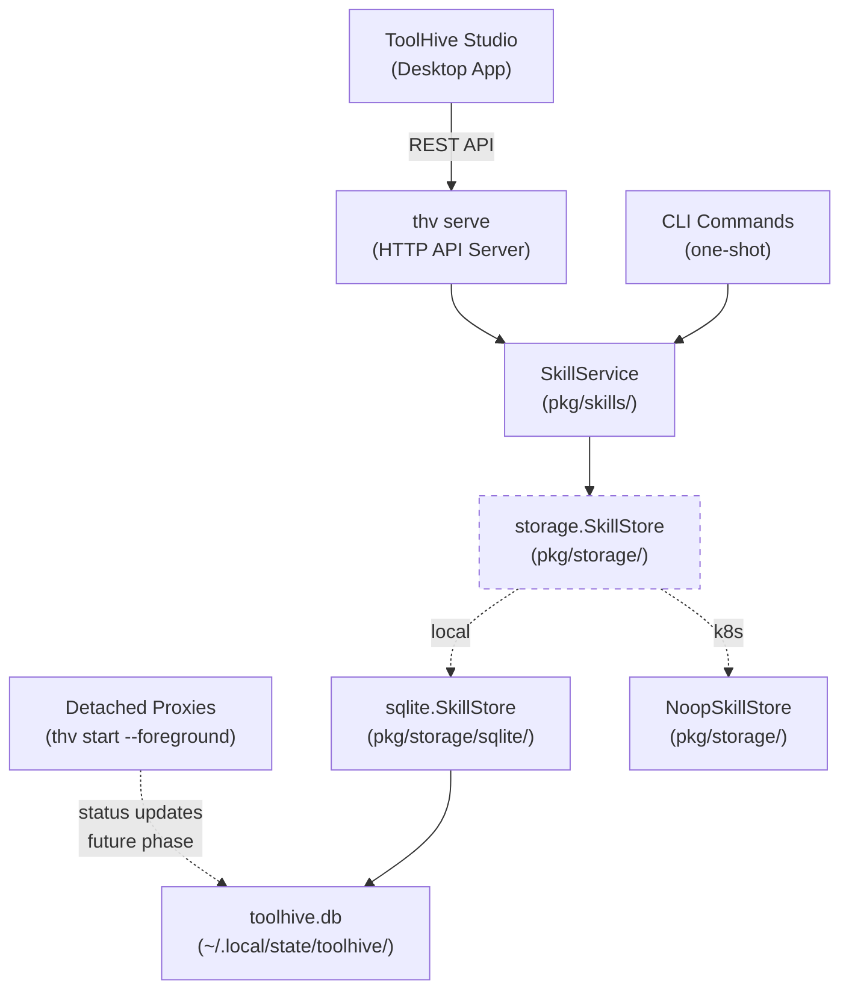

# RFC-XXXX: SQLite-Based State Management

- **Status**: Draft
- **Author(s)**: Juan Antonio Osorio (@JAORMX)
- **Created**: 2026-02-09
- **Last Updated**: 2026-02-09
- **Target Repository**: toolhive
- **Related Issues**: [toolhive#3648](https://github.com/stacklok/toolhive/issues/3648)

## Summary

Replace ToolHive's file-based local state management with a single SQLite
database (`toolhive.db`). Phase 1 targets the skills subsystem to unblock
skills lifecycle management. Later phases will migrate workload statuses and
groups. RunConfigs and application configuration remain file-based.

## Problem Statement

ToolHive manages local state across multiple JSON files scattered across XDG
directories. Multiple processes access this state concurrently:

- **`thv serve`** is a long-running HTTP API server that handles concurrent
  requests. It is the backend for ToolHive Studio (the desktop experience).
- **Detached proxy processes** (`thv start --foreground`) run alongside the
  API server and write status/PID updates.
- **CLI commands** (`thv list`, `thv stop`, etc.) access the same state files
  independently of the API server.

This multi-process access pattern exposes several problems:

- **Inconsistent concurrency safety.** The core `state.LocalStore` (used by
  RunConfigs and groups) has no file locking and no atomic writes. The status
  file manager implements its own `flock`-based locking and atomic writes.
  The config system uses `flock` for updates but not for reads. Each subsystem
  reimplements safety differently -- or not at all.

- **API server + CLI races.** When ToolHive Studio (via `thv serve`) and CLI
  commands run simultaneously, they access the same state files. Status files
  have per-workload file locks, but RunConfig writes are completely
  unprotected. Two concurrent `POST /workloads` requests can race on RunConfig
  writes.

- **No transactional operations.** Multi-step operations (e.g., stopping a
  workload requires deleting permissions, client configs, and run config state)
  cannot be rolled back if a step fails, leading to inconsistent state.

- **Read-modify-write races.** Group client registration (`RegisterClients`)
  performs get-mutate-save without locking. Concurrent operations from the API
  server can lose data.

- **No query capability.** `ListWorkloads` globs `*.json` in the statuses
  directory and opens/parses each file individually with a lock per file. This
  is O(n) filesystem operations. Answering "which workloads are in group X?"
  requires reading every file.

- **Corruption recovery complexity.** The `fileStatusManager` includes 50+
  lines of JSON corruption recovery logic (`attemptJSONRecovery`) to handle
  interrupted writes. SQLite's WAL mode provides stronger crash recovery
  guarantees structurally.

The upcoming skills system (issue #3648) needs reliable state management for
tracking installed skills, their client associations, and installation status.
Building another bespoke file-locking scheme would compound the existing
problems.

## Goals

- Introduce SQLite as the unified local state store, starting with skills
- Provide ACID transactions, built-in locking, and query capability
- Define a clean storage interface layer that is mockable and testable
- Maintain the existing factory pattern (local SQLite vs Kubernetes no-op)
- Design the schema and package structure to accommodate future migration of
  workload statuses and groups without major refactoring
- Unblock skills lifecycle management (issue #3648)

## Non-Goals

- **Migrating RunConfigs to SQLite.** RunConfigs are write-once, read-many
  configuration artifacts that form part of ToolHive's API contract (importable
  and exportable as JSON). They do not have read-modify-write concurrency
  issues and are better served as files. Queryable metadata (group, remote
  status, transport) will be denormalized into the workload statuses table in a
  future phase.
- **Migrating `config.yaml` to SQLite.** Application configuration is
  user-facing and human-editable. It belongs in `$XDG_CONFIG_HOME` as YAML.
- **Introducing a long-running database server.** SQLite is embedded and
  requires no daemon.
- **Supporting distributed or multi-node state.** Kubernetes environments use
  CRDs; SQLite is strictly for local environments.

## Proposed Solution

### High-Level Design



Multiple processes (API server, CLI commands, detached proxies) access the
same SQLite database concurrently. WAL mode allows concurrent readers with a
single writer, which matches the access pattern: the API server and CLI
commands primarily read, with occasional writes.

A new `pkg/storage/` package defines domain-specific interfaces. The SQLite
implementation lives in `pkg/storage/sqlite/`. Business logic in `pkg/skills/`
depends on the interface, not the implementation. A factory function selects
the appropriate backend based on the runtime environment.

### Detailed Design

#### Package Structure

```
pkg/storage/
    interfaces.go       -- SkillStore interface + go:generate
    errors.go           -- ErrNotFound, ErrAlreadyExists
    noop.go             -- NoopSkillStore for Kubernetes
    factory.go          -- NewSkillStore() with runtime detection
    mocks/
        mock_skill_store.go  -- Generated by mockgen

pkg/storage/sqlite/
    db.go               -- DB handle, Open/Close, PRAGMA configuration
    migrations.go       -- Embedded SQL migration runner
    migrations/
        001_create_skills.sql
    skill_store.go      -- SQLite SkillStore implementation
```

**Why a new package instead of extending `pkg/state/`:** The existing
`pkg/state/` is a stream-oriented abstraction (`io.ReadCloser`/
`io.WriteCloser`). Grafting SQLite onto it would either force the stream
interface on top of SQL (losing transactional benefits) or widen the interface
in ways that break existing consumers. A clean `pkg/storage/` package lets us
define typed, domain-specific interfaces while leaving `pkg/state/` untouched
for RunConfigs.

**Extensibility:** Future phases add `sqlite/status_store.go`,
`sqlite/group_store.go`, and new migration SQL files -- the package structure
does not need to change.

#### Storage Interfaces

Domain-specific interfaces rather than one generic store. Each domain has
different query and filter semantics (skills filter by scope; statuses filter
by labels and running state; groups have client registration operations). The
`SkillStore` interface maps directly to the CRUD operations the `SkillService`
needs:

- `Create`, `Get`, `List` (with optional scope filter), `Update`, `Delete`
- Returns `ErrNotFound` or `ErrAlreadyExists` sentinel errors
- Accepts and returns existing `skills.InstalledSkill` types

When future phases arrive, `StatusStore` and `GroupStore` interfaces are added
to the same `interfaces.go` file, each with their own domain-specific methods.

The factory follows ToolHive's existing pattern: Kubernetes returns a no-op
implementation; local returns the SQLite-backed implementation.

#### SQLite Driver Choice

ToolHive builds with `CGO_ENABLED=0` (see `.goreleaser.yaml`) and
cross-compiles to 6 targets. Container images are built with `ko`, a Go-native
builder with no CGo support. There are no existing CGo dependencies.

**`modernc.org/sqlite` (pure Go) is the only viable option.** `mattn/go-sqlite3`
requires CGo and would break the build pipeline. The ~10-20% performance
difference vs native C SQLite is irrelevant for this use case.

#### Database Location

Following the existing XDG convention from `pkg/state/local.go`:

```
$XDG_STATE_HOME/toolhive/toolhive.db
```

Typically `~/.local/state/toolhive/toolhive.db`. This is the same directory
where RunConfig files already live (`runconfigs/` subdirectory).

WAL mode creates two sidecar files (`toolhive.db-wal` and `toolhive.db-shm`)
alongside the database. These are normal and must not be deleted while any
process has the database open.

#### Connection Lifecycle

The database connection is opened once per process via a `sync.Once` singleton
(matching the `pkg/config/singleton.go` pattern) and closed on exit. This
works for both one-shot CLI commands and the long-running `thv serve` process.

`MaxOpenConns` is set to 1 per process. SQLite allows only one writer at a
time; a single Go connection serializes all intra-process access through
`database/sql`'s internal mutex, avoiding `SQLITE_BUSY` errors within the same
process. WAL mode handles inter-process concurrency (API server vs CLI vs
detached proxies).

A separate `OpenWithPath` function (not using the singleton) enables tests to
create isolated databases in temporary directories.

#### PRAGMA Configuration

Applied on every connection open:

| PRAGMA | Value | Rationale |
|--------|-------|-----------|
| `journal_mode = WAL` | Write-Ahead Logging | Concurrent readers + single writer across processes. Critical for `thv serve` + CLI coexistence. |
| `busy_timeout = 5000` | 5 seconds | Wait before returning `SQLITE_BUSY` when another process holds the write lock. |
| `synchronous = NORMAL` | Reduced fsync | In WAL mode, provides adequate crash safety while being faster than `FULL`. |
| `foreign_keys = ON` | Enable FK enforcement | Required for `ON DELETE CASCADE`. SQLite disables this by default. |
| `cache_size = -2000` | 2MB page cache | Sufficient for ToolHive's small DB. |

The DSN includes `_txlock=immediate` to ensure write transactions acquire a
lock immediately, preventing deadlocks when two processes try to upgrade from
SHARED to RESERVED simultaneously.

#### Multi-Process Concurrency Model

ToolHive has multiple processes accessing state concurrently: the `thv serve`
HTTP server (backend for ToolHive Studio), one-shot CLI commands, and detached
proxy processes. SQLite with WAL mode is well-suited for this pattern.

**How it works in practice:**

| Process | Typical operation | Lock type | Contention |
|---------|-------------------|-----------|------------|
| `thv serve` (read request) | List/get skills | SHARED | Never blocks, never blocked |
| `thv serve` (write request) | Install skill | RESERVED | Held for microseconds |
| CLI `thv skill list` | Query skills | SHARED | Never blocks, never blocked |
| CLI `thv skill install` | Insert skill | RESERVED | Waits if `thv serve` is mid-write |
| Detached proxies | No skills access in Phase 1 | N/A | N/A |

**Key properties:**
- **Readers never block.** Any number of processes can read concurrently,
  regardless of whether a write is in progress. This is the common case.
- **Writers queue.** If two processes write at the same instant, one waits.
  With skill CRUD operations taking microseconds and `busy_timeout` at 5
  seconds, this is invisible to users.
- **`thv serve` internal serialization.** With `MaxOpenConns(1)`, concurrent
  HTTP requests within the API server serialize at the DB connection pool.
  This is fine because DB operations are tiny -- the real latency in API
  requests comes from Docker API calls and network I/O.

**Critical practice: keep write transactions short.** Slow work (OCI pulls,
validation, network I/O) must happen outside transactions. The transaction
should only wrap the final INSERT/UPDATE -- holding the write lock for
microseconds, not seconds.

**Compared to today:** This is strictly safer than the current file-based
approach, where `state.LocalStore` has no locking at all and concurrent writes
can corrupt data. SQLite replaces "hope for the best" with "serialized safely
with sub-millisecond wait times."

#### Schema Migrations

Migrations use embedded SQL files (`//go:embed migrations/*.sql`) with a
version tracking table. Each file is named `NNN_description.sql` and runs
inside a transaction that also records the version number.

```sql
-- Bootstrap table (created outside the migration system)
CREATE TABLE IF NOT EXISTS schema_version (
    version    INTEGER PRIMARY KEY,
    applied_at TEXT NOT NULL DEFAULT (strftime('%Y-%m-%dT%H:%M:%fZ', 'now'))
);
```

**Migration rules:**
- Never modify an existing migration once released
- Always append new migrations with the next integer version
- Each migration runs in a single transaction (DDL + version record)
- No down migrations -- fix-forward with new migrations
- Idempotent on startup: already-applied versions are skipped

**Concurrent migration safety:** If two processes start simultaneously and both
try to migrate, the first acquires the write lock; the second blocks on
`busy_timeout`, then sees the migration is already applied and skips it.

#### Data Model: Skills Schema

```sql
-- migrations/001_create_skills.sql

CREATE TABLE installed_skills (
    name         TEXT NOT NULL,
    scope        TEXT NOT NULL DEFAULT 'user'
                      CHECK (scope IN ('user', 'system')),
    version      TEXT NOT NULL DEFAULT '',
    description  TEXT NOT NULL DEFAULT '',
    author       TEXT NOT NULL DEFAULT '',
    tags         TEXT NOT NULL DEFAULT '[]',   -- JSON array of strings
    status       TEXT NOT NULL DEFAULT 'pending'
                      CHECK (status IN ('installed', 'pending', 'failed')),
    installed_at TEXT NOT NULL
                      DEFAULT (strftime('%Y-%m-%dT%H:%M:%fZ', 'now')),
    clients      TEXT NOT NULL DEFAULT '[]',   -- JSON array of client names
    PRIMARY KEY (name, scope)
);

CREATE INDEX idx_installed_skills_status ON installed_skills (status);
```

**Design decisions:**

| Decision | Choice | Rationale |
|----------|--------|-----------|
| Primary key | `(name, scope)` | Same skill can exist independently at user and system scope. |
| Clients storage | JSON array | Matches the existing `InstalledSkill.Clients []string` type. Can normalize later if needed. |
| Tags storage | JSON array | Read-only metadata. Never queried independently. |
| Timestamps | RFC 3339 TEXT | Human-readable, consistent with existing JSON files. |
| CHECK constraints | On `scope` and `status` | Defense-in-depth validation at the DB level. |

#### Future Phase 2+ Tables (Design Reference)

These validate that the schema foundation supports future needs. Not
implemented in Phase 1.

```sql
-- migrations/002_create_workload_statuses.sql (future)
CREATE TABLE workload_statuses (
    name           TEXT PRIMARY KEY,
    status         TEXT NOT NULL,
    status_context TEXT NOT NULL DEFAULT '',
    process_id     INTEGER NOT NULL DEFAULT 0,
    group_name     TEXT NOT NULL DEFAULT '',
    is_remote      INTEGER NOT NULL DEFAULT 0,
    transport      TEXT NOT NULL DEFAULT '',
    port           INTEGER NOT NULL DEFAULT 0,
    created_at     TEXT NOT NULL
                        DEFAULT (strftime('%Y-%m-%dT%H:%M:%fZ', 'now')),
    updated_at     TEXT NOT NULL
                        DEFAULT (strftime('%Y-%m-%dT%H:%M:%fZ', 'now'))
);
```

Note: `workload_statuses` includes denormalized fields (`group_name`,
`is_remote`, `transport`, `port`) from RunConfigs. This eliminates the current
`isRemoteWorkload` hack in `file_status.go` where the status manager reaches
into the RunConfig store to check the `remote_url` field.

```sql
-- migrations/003_create_groups.sql (future)
CREATE TABLE groups (
    name TEXT PRIMARY KEY
);

CREATE TABLE group_clients (
    group_name  TEXT NOT NULL,
    client_name TEXT NOT NULL,
    PRIMARY KEY (group_name, client_name),
    FOREIGN KEY (group_name) REFERENCES groups (name) ON DELETE CASCADE
);
```

#### Dependency Graph

```
cmd/thv/app/skill.go
    -> pkg/storage       (NewSkillStore factory)
    -> pkg/skills        (NewService, types)

pkg/skills/service_impl.go
    -> pkg/storage       (SkillStore interface)

pkg/storage/factory.go
    -> pkg/storage/sqlite     (Open, NewSkillStore)
    -> pkg/container/runtime  (IsKubernetesRuntime)

pkg/storage/sqlite/skill_store.go
    -> pkg/skills        (types: InstalledSkill, Scope)
    -> pkg/storage       (errors: ErrNotFound, ErrAlreadyExists)
```

No circular imports. `pkg/storage/interfaces.go` imports `pkg/skills` for type
definitions, and `pkg/skills/service_impl.go` imports `pkg/storage` for the
`SkillStore` interface -- these go in different directions.

## Security Considerations

### Threat Model

| Threat | Description | Likelihood | Impact |
|--------|-------------|------------|--------|
| SQL injection | User input used in queries | Low | High |
| File access | Unauthorized access to DB file | Low | Medium |
| Malicious skill names | Names used in SQL | Medium | Low |

### Authentication and Authorization

No change. SQLite is a local embedded database with no network access. Access
control is filesystem permissions on `toolhive.db`.

### Data Security

- No sensitive data in the skills table (metadata only, not secrets).
- Database file permissions inherit from the directory's `0750` mode.

### Input Validation

- All queries use parameterized statements (`?` placeholders). No string
  interpolation of user input into SQL.
- Skill names validated by `SkillService` before reaching the store.
- `CHECK` constraints provide defense-in-depth.

### Secrets Management

No change. Skills do not involve secrets.

### Audit and Logging

Database operations logged at DEBUG level, consistent with existing patterns.

### Mitigations

| Threat | Mitigation |
|--------|------------|
| SQL injection | Parameterized queries exclusively |
| File access | XDG directory permissions (0750); filesystem ACLs |
| Malicious skill names | Stored as data, never as SQL identifiers; validated before storage |

## Alternatives Considered

### Alternative 1: Extend `pkg/state/` with SQLite

- **Description**: Add a `SQLiteStore` implementation of the existing
  `state.Store` interface.
- **Pros**: Reuses existing interface; no new package.
- **Cons**: `state.Store` is stream-oriented (`io.ReadCloser`/
  `io.WriteCloser`), poor fit for SQL. Loses transactional benefits.
- **Why not chosen**: Clean separation is worth the new package.

### Alternative 2: File-Based State with Better Locking

- **Description**: Keep JSON files but add `flock` + `AtomicWriteFile` to
  `LocalStore`.
- **Pros**: No new dependency. Familiar pattern.
- **Cons**: Still no transactions, no queries, no read-modify-write protection.
  The `fileStatusManager`'s 700+ lines of locking, recovery, and corruption
  handling demonstrate the complexity ceiling. Doesn't solve `thv serve`
  concurrent request handling.
- **Why not chosen**: SQLite solves these problems structurally.

### Alternative 3: BoltDB / bbolt

- **Description**: Use bbolt (pure Go key-value store).
- **Pros**: Pure Go, simple API.
- **Cons**: No SQL queries, no schema, no relational constraints. Single-writer
  with no concurrent reads (unlike SQLite WAL). Less ecosystem tooling.
- **Why not chosen**: SQLite provides more capability for similar complexity.

### Alternative 4: Separate `skills.db`

- **Description**: Per-subsystem database files.
- **Pros**: Subsystem isolation.
- **Cons**: No cross-subsystem transactions. Multiple migration systems.
- **Why not chosen**: Single `toolhive.db` is simpler and enables cross-table
  transactions when needed.

### Alternative 5: Normalized `skill_clients` Junction Table

- **Description**: Separate `skill_clients` table instead of JSON array.
- **Pros**: Efficient "list skills for client X" queries. Atomic per-client
  operations.
- **Cons**: More complex schema. Current `SkillService` interface doesn't
  expose client-level queries.
- **Why not chosen for Phase 1**: JSON array matches existing type directly.
  Can normalize later if needed.

## Compatibility

### Backward Compatibility

Phase 1 targets skills, which has no existing file-based state to migrate (the
hybrid storage approach from RFC-0030 was never implemented).

For future phases (statuses, groups), the migration strategy is:
1. On first database open after upgrade, check for existing JSON files
2. Import into SQLite idempotently (skip if already exists)
3. Write a marker file to prevent re-scanning
4. Leave original files in place for safety

### Forward Compatibility

- Migration system supports indefinite schema evolution via numbered SQL files
- Store interfaces can be extended with new methods
- New tables follow the same pattern established here

## Implementation Plan

### Phase 1: Foundation + Skills (This RFC)

- Add `modernc.org/sqlite` dependency to `go.mod`
- Create `pkg/storage/` package: interfaces, errors, noop, factory
- Create `pkg/storage/sqlite/` package: db, migrations, skill_store
- Create `migrations/001_create_skills.sql`
- Wire `SkillService` to accept `storage.SkillStore` via constructor injection
- Add `sqlite.Close()` to CLI and `thv serve` shutdown paths
- Generate mocks with `mockgen`

### Phase 2: Workload Statuses (Future)

- Add `StatusStore` interface to `pkg/storage/interfaces.go`
- Create `migrations/002_create_workload_statuses.sql` with denormalized
  RunConfig fields
- Migrate `fileStatusManager` to use SQLite (eliminates flock/recovery code)
- File-to-SQLite migration for existing status files

### Phase 3: Groups (Future)

- Add `GroupStore` interface
- Create `migrations/003_create_groups.sql`
- Migrate `cliManager` to SQLite (fixes `RegisterClients` race)
- File-to-SQLite migration for existing group files

### Dependencies

- `modernc.org/sqlite` -- pure Go SQLite driver (no CGo)

## Testing Strategy

- **SQLite store tests**: `OpenWithPath(t.TempDir())` for isolated databases.
  Real SQLite, not mocked.
- **SkillService tests**: Generated `MockSkillStore` for business logic.
- **Concurrent access tests**: Two connections to same file, verify no
  deadlocks. Validates the `thv serve` + CLI coexistence model.
- **Migration tests**: Clean apply + idempotent re-run.
- **E2E tests**: Skill CLI commands via compiled binary.

## Documentation

- Update `docs/arch/02-core-concepts.md` with storage layer
- Add storage architecture section to `docs/arch/`
- Update `CLAUDE.md` with `pkg/storage/` guidance

## Open Questions

1. **Client normalization**: JSON array for now. Normalize to junction table if
   client-level queries become a requirement.

2. **Database file permissions**: Explicitly `chmod 0600` after creation, or
   rely on directory permissions and umask?

3. **WAL checkpoint on close**: Explicitly `PRAGMA wal_checkpoint(TRUNCATE)` on
   clean shutdown to minimize sidecar files?

## References

- [SQLite WAL mode](https://www.sqlite.org/wal.html)
- [modernc.org/sqlite](https://pkg.go.dev/modernc.org/sqlite)
- [RFC-0030: Skills Lifecycle Management](./THV-0030-skills-lifecycle-management.md)
- [Issue #3648: Skill state management](https://github.com/stacklok/toolhive/issues/3648)
- [Issue #3645: Skills domain types](https://github.com/stacklok/toolhive/issues/3645)

---

## RFC Lifecycle

### Review History

| Date | Reviewer | Decision | Notes |
|------|----------|----------|-------|
| 2026-02-09 | @JAORMX | Draft | Initial submission |

### Implementation Tracking

| Repository | PR | Status |
|------------|-----|--------|
| toolhive | TBD | Pending |
