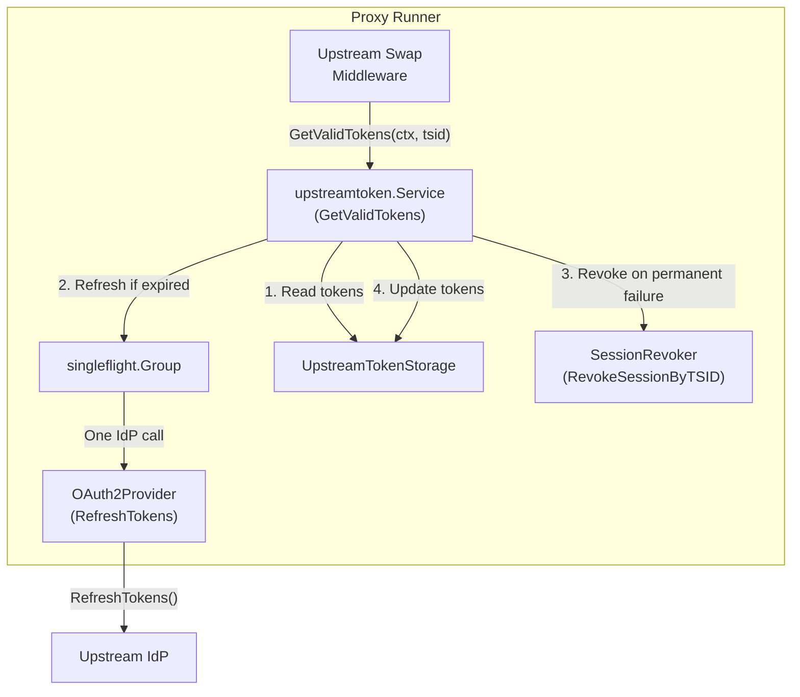
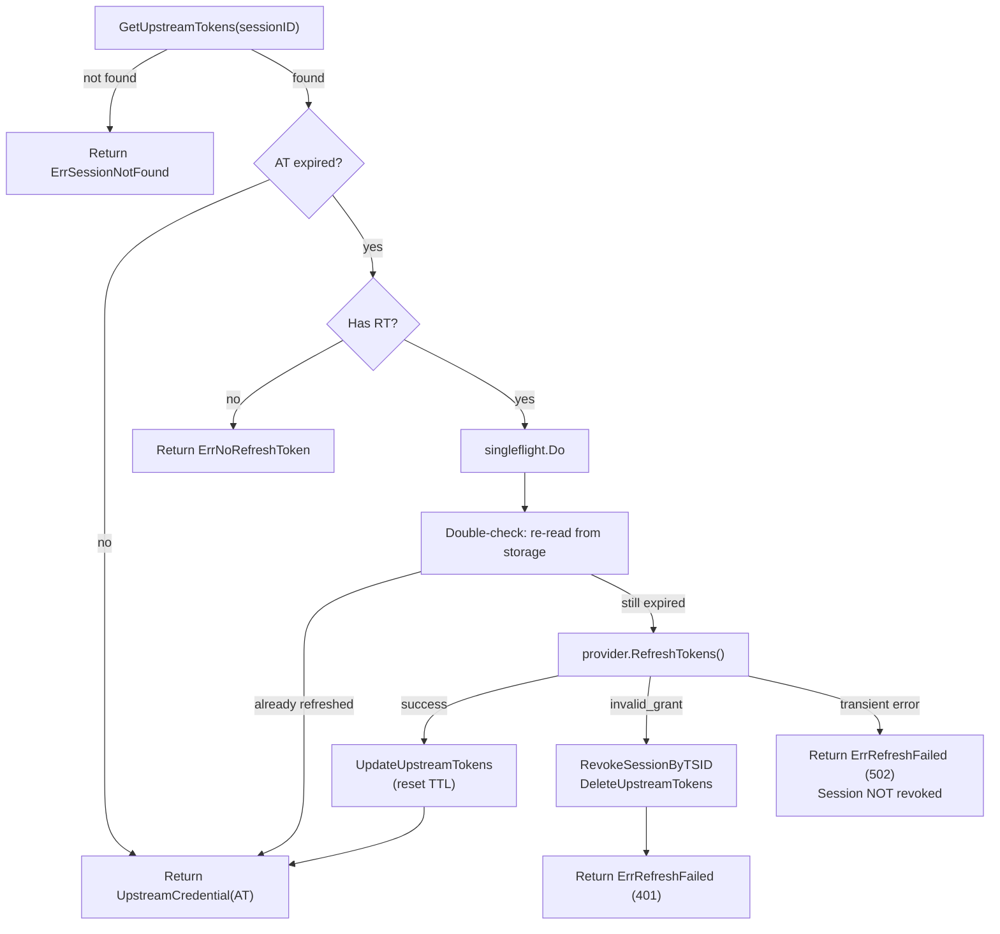

# RFC-XXXX: Upstream Token Refresh for Auth Server

- **Status**: Draft
- **Author(s)**: @tgrunnagle
- **Created**: 2026-02-20
- **Last Updated**: 2026-02-20
- **Target Repository**: toolhive
- **Related Issues**: TBD

## Summary

Add transparent upstream token refresh to the embedded authorization server. When a stored upstream access token expires, the auth server refreshes it via the upstream IdP before returning it to the middleware, extending session lifetime beyond the upstream AT's ~1-hour window. When upstream refresh permanently fails, the service revokes the internal session to force a clean re-authentication.

## Problem Statement

Upstream refresh tokens are stored and `RefreshTokens()` is fully implemented on both OAuth2 and OIDC providers, but no code calls it yet. The upstream swap middleware (`pkg/auth/upstreamswap/middleware.go`) detects expiry but logs a warning and passes the expired token through. This means sessions are effectively limited to the upstream AT lifetime (~1 hour for most IdPs).

To support long-lived sessions, the auth server needs to use stored upstream refresh tokens to obtain fresh access tokens transparently. Additionally, when an upstream refresh token is permanently invalidated by the IdP, the auth server should revoke the internal session so the client is directed into a clean re-authentication rather than retrying with stale credentials.

### Current Token Flow

```
Client -> GET /oauth/authorize -> Internal AS -> 302 to upstream IdP
                                                      |
Client <- redirect with auth code <- Internal AS <- GET /oauth/callback (code)
                                       |
                                ExchangeCode -> upstream AT, RT, IDT stored (keyed by sessionID)
                                Issue internal JWT (with tsid=sessionID claim)
                                Issue internal opaque refresh token
                                       |
Client -> proxied request -> upstream swap middleware
                                |
                           Read upstream tokens by tsid from storage
                           Replace Authorization header with upstream AT
                                |
                           Forward to backend
```

### Current Token Lifetimes

| Token | Default | Configurable Range |
|-------|---------|-------------------|
| Internal access token (JWT) | 1h | 1min-24h |
| Internal refresh token (opaque) | 7d | 1h-30d |
| Auth code | 10min | 30s-10min |
| Upstream AT storage TTL | upstream `ExpiresAt` (or 1h fallback) | - |
| Storage cleanup interval | 5min | - |
| Expiry detection buffer | 30s | - |

### Opportunities

1. **Upstream refresh tokens stored but never used** - `RefreshTokens()` is fully implemented (`pkg/authserver/upstream/oauth2.go`, `oidc.go`) but no code calls it yet
2. **Storage TTL tied to AT expiry** - the upstream token entry expires when the AT expires, which garbage-collects the refresh token even though it may be valid for 30+ days
3. **No session revocation on upstream failure** - when upstream tokens expire, the internal session (7-day RT) continues without a mechanism to direct the client into re-authentication
4. **Direct storage access from middleware** - the middleware calls raw `storage.UpstreamTokenStorage` directly, which is an implementation detail of the AS, not a proper service boundary

## Goals

- Transparently refresh expired upstream access tokens on read, so users never see a 401 due to upstream AT expiry
- Revoke the internal session when upstream refresh permanently fails, forcing the client into a clean re-authentication
- Introduce a service interface (`upstreamtoken.Service`) that encapsulates all upstream token logic behind a clean API boundary
- Decouple storage TTL from upstream AT expiry so refresh tokens are preserved across AT renewal cycles
- Deduplicate concurrent refresh attempts for the same session using singleflight
- Prepare the architecture for out-of-process AS extraction (the service interface becomes a single RPC)

## Non-Goals

- **Background refresh loop** - deferred to a future phase; can be added as an internal optimization without changing the `Service` interface
- **Persisting refresh failure state** - the service handles errors transparently and revokes the session on permanent failure; no persistent failure flag is needed
- **Multi-provider refresh** - the current system supports a single upstream provider per auth server instance
- **Redis storage implementation** - this RFC only modifies the in-memory storage; Redis implementation (THV-0035) will implement the same interface methods
- **Upstream token encryption at rest** - tokens remain in-memory with short TTLs

## Proposed Solution

### High-Level Design

Introduce an `upstreamtoken.Service` interface that the middleware calls instead of raw storage. The service transparently refreshes expired tokens on read, deduplicates concurrent refreshes via singleflight, and revokes the internal session when upstream refresh permanently fails.



### Detailed Design

#### Design Decision: Service Interface with On-Read Refresh

The middleware currently calls `storage.UpstreamTokenStorage.GetUpstreamTokens()` directly. This is the wrong abstraction: storage is an implementation detail of the AS. The middleware should call a service-level interface that represents the business operation: "give me valid upstream tokens for this session."

Three approaches were evaluated: proactive background refresh, lazy on-demand refresh in the middleware, and on-read refresh behind a service interface.

**On-read refresh behind the service interface wins** because:

- **Architecture boundary**: The middleware calls a service, not raw storage. The service owns all IdP interaction. When the AS goes out-of-process, `GetValidTokens()` becomes a single RPC. The middleware code does not change.
- **Simplicity**: No background goroutines, no `Start`/`Stop` lifecycle, no `ListUpstreamTokenSessions()` method. The service is just storage + provider + singleflight.
- **Correctness without optimization**: Every request gets valid tokens or a clear error. No edge cases around idle sessions that the background loop missed.
- **Minimal interface**: One method (`GetValidTokens`) returning an opaque `UpstreamCredential`. Clean for in-process and network use.

**The latency cost is acceptable**: On-read refresh adds ~200ms (one IdP round-trip) to the first request after AT expiry, once per hour per session. MCP tool calls typically take 500ms-2s. The 200ms is imperceptible.

#### Service Interface

**Package**: `pkg/authserver/upstreamtoken/`

```go
package upstreamtoken

type Service interface {
    // GetValidTokens returns a valid upstream credential for the given session.
    // If stored tokens are expired and a refresh token is available, the
    // implementation transparently refreshes them before returning.
    //
    // If refresh permanently fails (e.g. refresh token revoked), the
    // implementation revokes the internal session to force re-authentication.
    GetValidTokens(ctx context.Context, sessionID string) (UpstreamCredential, error)
}

// UpstreamCredential is an opaque type representing a valid upstream token.
// The middleware does not need to know internal structure - it only needs
// a bearer token string to inject into upstream requests.
type UpstreamCredential struct {
    accessToken string
}

// NewUpstreamCredential creates an UpstreamCredential. Only the service
// package should call this.
func NewUpstreamCredential(accessToken string) UpstreamCredential {
    return UpstreamCredential{accessToken: accessToken}
}

// BearerToken returns the access token string for injection into HTTP headers.
func (c UpstreamCredential) BearerToken() string {
    return c.accessToken
}

var (
    ErrSessionNotFound = errors.New("upstreamtoken: session not found")
    ErrRefreshFailed   = errors.New("upstreamtoken: refresh failed")
    ErrNoRefreshToken  = errors.New("upstreamtoken: no refresh token")
)
```

#### In-Process Implementation

```go
type inProcessService struct {
    storage  storage.UpstreamTokenStorage
    provider upstream.OAuth2Provider
    revoker  SessionRevoker
    group    singleflight.Group
}
```

Three dependencies:
- `storage.UpstreamTokenStorage` - read/write upstream token entries
- `upstream.OAuth2Provider` - call IdP to refresh tokens
- `SessionRevoker` - revoke internal session when upstream refresh permanently fails

#### GetValidTokens Flow



The singleflight group ensures that concurrent requests for the same expired session result in a single IdP refresh call. The double-check after acquiring the singleflight lock avoids redundant refreshes when another goroutine has already refreshed the tokens.

When storing refreshed tokens, refresh token rotation is handled via coalesce: if the IdP returns a new refresh token, it is stored; otherwise the existing one is preserved.

#### Session Revocation on Permanent Failure

When upstream refresh fails with `invalid_grant` (RT revoked, expired, or invalidated by the IdP), the service must break the internal session to prevent the user from being stuck in a loop. Without this, the client would:

1. Get 401 from the middleware
2. Use its internal refresh token to get a new internal JWT
3. New JWT has the same `tsid` (fosite preserves session claims on refresh)
4. Next request hits the same dead upstream tokens
5. Infinite loop - user is stuck

The fix: `RevokeSessionByTSID(tsid)` deletes all internal access tokens and refresh tokens where `session.UpstreamSessionID == tsid`. The next time the client tries to use its internal refresh token, fosite returns `invalid_grant`, which is the standard signal that forces the client into a full re-authentication (new OAuth flow, new upstream tokens, new `tsid`).

#### Session Revocation Interface

```go
// SessionRevoker revokes all internal tokens associated with a session.
// The UpstreamTokenService calls this when upstream refresh permanently fails,
// to force the client into re-authentication.
type SessionRevoker interface {
    RevokeSessionByTSID(ctx context.Context, tsid string) error
}
```

Implementation on `MemoryStorage`:

```go
func (s *MemoryStorage) RevokeSessionByTSID(ctx context.Context, tsid string) error {
    s.mu.Lock()
    defer s.mu.Unlock()

    // Delete all refresh tokens for this session
    for sig, entry := range s.refreshTokens {
        session, ok := entry.value.GetSession().(*session.Session)
        if ok && session.UpstreamSessionID == tsid {
            delete(s.refreshTokens, sig)
        }
    }

    // Delete all access tokens for this session
    for sig, entry := range s.accessTokens {
        session, ok := entry.value.GetSession().(*session.Session)
        if ok && session.UpstreamSessionID == tsid {
            delete(s.accessTokens, sig)
        }
    }

    return nil
}
```

This follows the existing pattern. `RevokeRefreshToken(requestID)` and `RevokeAccessToken(requestID)` already do O(n) scans over the same maps. The service never touches fosite internals (signatures, request IDs). It only knows about `tsid`.

#### Storage Layer Changes

**New method on `UpstreamTokenStorage`**:

```go
// UpdateUpstreamTokens atomically updates token values for an existing session
// and resets the sliding-window TTL (2h inactivity timeout). Used by refresh logic.
// Since there is no background refresh loop, every call to UpdateUpstreamTokens
// is triggered by a user request, so resetting the TTL here is correct.
UpdateUpstreamTokens(ctx context.Context, sessionID string, tokens *UpstreamTokens) error
```

**Behavioral change to `StoreUpstreamTokens`**:

This is a change to an existing method's behavior, not just a new method:

```
BEFORE: expiresAt = tokens.ExpiresAt (AT expiry, ~1h)

AFTER:  if tokens.RefreshToken != "" -> expiresAt = now + DefaultUpstreamInactivityTimeout (2h)
        if tokens.RefreshToken == "" -> expiresAt = tokens.ExpiresAt (unchanged)
```

New constant: `DefaultUpstreamInactivityTimeout = 2 * time.Hour`

**Why 2 hours?**
- Long enough that a briefly idle user (lunch, meeting) does not lose their session
- Short enough that abandoned sessions are reaped quickly (not 7 days)
- TTL is reset by `StoreUpstreamTokens` (initial auth) and `UpdateUpstreamTokens` (refresh). Since there is no background loop, every write is user-triggered, so resetting TTL on write correctly tracks user activity
- Without a background refresh loop, there are zero unnecessary IdP refreshes for abandoned sessions: the entry simply expires and gets reaped

No `LastAccessedAt` field is needed. The `timedEntry.expiresAt` sliding window (reset by `UpdateUpstreamTokens`) already tracks user activity. No `RefreshFailed` flag is needed. The service handles errors transparently and returns them to the caller.

#### Error Mapping in Middleware

| Service Error | HTTP | When |
|---|---|---|
| `ErrSessionNotFound` | 401 | No upstream tokens for session |
| `ErrNoRefreshToken` | 401 | AT expired, no RT to refresh with |
| `ErrRefreshFailed` + `invalid_grant` | 401 | RT permanently dead (internal session also revoked) |
| `ErrRefreshFailed` + transient | 502 | IdP temporarily down |

#### Wiring Chain

The `EmbeddedAuthServer` constructs the `upstream.OAuth2Provider` directly (it already builds the upstream config), keeps a reference, and passes it to both the Server and the Service. The `authserver.Server` interface does not change.

```go
// In NewEmbeddedAuthServer:
provider := upstream.NewOAuth2Provider(upstreamConfig)
server := authserver.New(provider, ...)

tokenService := upstreamtoken.NewInProcessService(
    server.IDPTokenStorage(),   // UpstreamTokenStorage
    provider,                   // OAuth2Provider for refresh calls
    server.IDPTokenStorage(),   // SessionRevoker (MemoryStorage implements both)
)
```

**`MiddlewareRunner` interface change**:

```go
// BEFORE:
GetUpstreamTokenStorage() func() storage.UpstreamTokenStorage

// AFTER:
GetUpstreamTokenService() func() upstreamtoken.Service
```

**Middleware change**:

```go
// BEFORE:
stor := storageGetter()
tokens, err := stor.GetUpstreamTokens(ctx, tsid)
if tokens.IsExpired(time.Now()) {
    logger.Warn("upstreamswap: upstream tokens expired")
    // Continue with expired token
}
injectToken(r, tokens.AccessToken)

// AFTER:
svc := serviceGetter()
cred, err := svc.GetValidTokens(r.Context(), tsid)
if err != nil {
    // map error to 401 or 502
    return
}
injectToken(r, cred.BearerToken())
```

### Token Lifecycle Scenarios

#### A. Active user (continuous requests)

```
T+0:00  Auth. AT stored (exp T+1:00). Entry TTL = T+2:00.
T+0:30  Request. GetValidTokens -> AT valid. TTL unchanged (T+2:00).
T+1:00  Request. AT expired. GetValidTokens refreshes via IdP (~200ms).
        UpdateUpstreamTokens stores new AT (exp T+2:00), resets TTL -> T+3:00.
T+1:30  Request. AT valid. TTL unchanged (T+3:00).
T+2:00  Request. AT expired. Refresh again. TTL resets -> T+4:00.
... continues indefinitely.
```

#### B. User idle 30 min, returns

```
T+0:00  Last request. TTL = T+2:00.
T+0:30  User returns. AT still valid (expires T+1:00). TTL unchanged (T+2:00).
```
Result: Seamless. No refresh needed.

#### C. User idle 90 min, returns

```
T+0:00  Last request. TTL = T+2:00.
T+1:30  User returns. AT expired (expired at T+1:00). TTL still alive (T+2:00).
        GetValidTokens refreshes via IdP (~200ms). UpdateUpstreamTokens resets TTL -> T+3:30.
```
Result: 200ms latency on first request. Transparent to user.

#### D. User idle 2+ hours, returns

```
T+0:00  Last request. TTL = T+2:00.
T+2:00  Cleanup loop reaps entry.
T+2:15  User returns. GetValidTokens -> ErrSessionNotFound -> 401. Re-authenticate.
```
Result: Must re-authenticate. Expected for 2h+ idle.

#### E. Abandoned session

```
T+0:00  Last request. TTL = T+2:00.
T+2:00  Entry reaped. Zero unnecessary IdP calls.
```

#### F. Refresh token revoked by IdP

```
T+1:00  User request. AT expired. GetValidTokens attempts refresh.
        IdP returns invalid_grant.
        Service calls revoker.RevokeSessionByTSID(tsid) -> deletes internal AT + RT.
        Service calls storage.DeleteUpstreamTokens(tsid) -> deletes upstream entry.
        Returns ErrRefreshFailed -> middleware returns 401.
T+1:01  Client tries internal refresh token -> fosite returns invalid_grant.
        Client forced into full re-authentication.
        New OAuth flow -> new upstream tokens -> new tsid -> user is recovered.
```
Result: Clean recovery. User re-authenticates and gets a fresh session.

#### G. IdP temporarily down

```
T+1:00  User request. AT expired. GetValidTokens attempts refresh.
        IdP returns connection error.
        Return ErrRefreshFailed wrapping transient error -> middleware returns 502.
        Internal session NOT revoked (transient, not permanent).
        Client retries.
T+1:01  Client retries. GetValidTokens attempts refresh again.
        IdP is back -> refresh succeeds. New AT stored. Request proceeds.
```
Result: Brief 502, then recovery on retry.

#### H. Concurrent requests for same expired session

```
T+1:00  5 requests arrive. All call GetValidTokens(sessionID).
        singleflight deduplicates: 1 actual refresh call to IdP.
        All 5 callers block, all get same result.
```

#### I. IdP rotates refresh token

```
T+1:00  Refresh returns new AT + new RT. UpdateUpstreamTokens stores both.
        Old RT replaced atomically. coalesce() keeps old RT if IdP doesn't rotate.
```

### Future: Out-of-Process AS

When the AS moves to a separate service:

**HTTP endpoint** (on the AS):
```
POST /internal/upstream-tokens/{sessionID}

200: { "access_token": "..." }
404: { "error": "session_not_found" }
401: { "error": "refresh_failed" }
422: { "error": "no_refresh_token" }
```

**Network client**: Implements `upstreamtoken.Service` by making HTTP calls to the AS. `GetValidTokens()` becomes a single HTTP request. Error types are serializable.

**Middleware code does not change** - same interface, different implementation behind it.

**Background refresh loop** (Phase 2 optimization): When added, it lives inside the AS process as an internal optimization of the concrete `Service` implementation. It can be added without changing the `Service` interface.

## Security Considerations

### Threat Model

| Threat | Description | Likelihood | Impact |
|--------|-------------|------------|--------|
| Stolen upstream refresh token | Attacker obtains RT from memory and uses it to get new ATs | Low (requires process memory access) | Access to upstream resources for one user |
| IdP refresh token replay | Attacker replays an old RT after rotation | Low | Blocked by IdP RT rotation policies |
| Stale session exploitation | Attacker uses internal session after upstream RT revocation | Medium (before this fix) | Currently possible; this RFC eliminates it |

### Authentication and Authorization

- No changes to authentication flows. The service operates within an already-authenticated session.
- The service validates that a session exists before attempting refresh. It does not create new sessions.
- Session revocation on permanent failure is an authorization enforcement: if the upstream IdP revokes access, the internal session is terminated.

### Data Security

- Upstream access tokens and refresh tokens remain in-memory only, matching the current storage model
- Refreshed tokens overwrite the previous values atomically; no history is retained
- The `UpstreamCredential` type uses an unexported field (`accessToken`) to prevent accidental logging or serialization

### Input Validation

- `sessionID` is an internal identifier (UUID) generated during the OAuth flow; it is not user-supplied
- The service does not accept external input beyond the session ID
- Upstream IdP responses are validated by the existing `upstream.OAuth2Provider` implementation

### Secrets Management

- No new secrets are introduced
- Upstream refresh tokens are already stored in the existing `UpstreamTokenStorage`
- The 2-hour inactivity TTL ensures tokens are reaped more aggressively than before (previously tied to AT expiry only)

### Audit and Logging

- Token refresh attempts logged at INFO level (session ID, provider, success/failure)
- Permanent refresh failures (invalid_grant) logged at WARN level with session revocation noted
- Transient refresh failures logged at WARN level
- Token values are never logged

### Mitigations

| Threat | Mitigation |
|--------|------------|
| Stolen upstream RT | In-memory storage with 2h inactivity TTL; tokens reaped when session idle |
| Stale session loop | Session revocation on `invalid_grant`; internal RT deleted, forcing re-auth |
| IdP outage causing cascading failures | Transient errors return 502 without revoking session; client retries naturally |
| Concurrent refresh thundering herd | singleflight deduplication; one IdP call per session per expiry window |
| RT replay after rotation | `coalesce()` stores new RT when IdP rotates; old RT is replaced atomically |

## Alternatives Considered

### Alternative 1: Background Refresh Loop

- **Description**: A background goroutine periodically scans all sessions and refreshes tokens before they expire
- **Pros**: Zero latency on requests (tokens always pre-refreshed), IdP outage resilience (grace period with pre-refreshed tokens)
- **Cons**: Requires `Start`/`Stop` lifecycle, `ListUpstreamTokenSessions()` method, background goroutine management, and refreshes tokens for abandoned sessions (unnecessary IdP calls)
- **Why not chosen**: Adds significant complexity for minimal benefit. The ~200ms on-read refresh cost (once per hour per session) is imperceptible given MCP tool call latencies of 500ms-2s. Can be added as a Phase 2 optimization without changing the `Service` interface.

### Alternative 2: Lazy Refresh in Middleware

- **Description**: Add refresh logic directly in the upstream swap middleware
- **Pros**: Simpler, fewer files changed
- **Cons**: The middleware would need to know about IdP providers, storage internals, and session revocation. This violates the architecture boundary: storage and IdP interaction are AS concerns, not middleware concerns. When the AS goes out-of-process, the middleware would need a major rewrite.
- **Why not chosen**: Wrong abstraction layer. The service interface provides a clean boundary that works for both in-process and future out-of-process AS deployments.

### Alternative 3: No Service Interface (Direct Storage Enhancement)

- **Description**: Add refresh logic to the storage layer itself (e.g., auto-refresh on `GetUpstreamTokens`)
- **Pros**: Minimal API change
- **Cons**: Storage should not call IdP providers. It would couple the storage layer to network calls, making testing difficult and violating the single-responsibility principle.
- **Why not chosen**: Storage is a persistence concern; token refresh is a business logic concern. Mixing them creates an untestable, tightly-coupled design.

## Compatibility

### Backward Compatibility

- **`MiddlewareRunner` interface change**: `GetUpstreamTokenStorage()` is renamed to `GetUpstreamTokenService()`. This is an internal interface; no external consumers are affected.
- **`StoreUpstreamTokens` TTL change**: Sessions with refresh tokens now have a 2-hour sliding-window TTL instead of AT-expiry TTL. This is strictly better behavior (tokens live longer, not shorter). Sessions without refresh tokens are unchanged.
- **No client-facing changes**: The middleware still injects a bearer token into upstream requests. Clients see no API changes.

### Forward Compatibility

- The `upstreamtoken.Service` interface is designed for out-of-process AS extraction. `GetValidTokens()` maps directly to a single HTTP endpoint.
- Background refresh can be added to the concrete implementation without changing the interface.
- Redis storage (THV-0035) will implement `UpdateUpstreamTokens` and `RevokeSessionByTSID` using the same interface contracts.

## Implementation Plan

### Phase 1: Storage Layer Extensions

**Files**:
- `pkg/authserver/storage/types.go` - Add `UpdateUpstreamTokens` to `UpstreamTokenStorage` interface. Add `SessionRevoker` interface.
- `pkg/authserver/storage/memory.go` - Implement new methods including `RevokeSessionByTSID`. Change `StoreUpstreamTokens` TTL logic (RT present -> 2h sliding window).
- `pkg/authserver/storage/config.go` - Add `DefaultUpstreamInactivityTimeout = 2h`
- `pkg/authserver/storage/mocks/` - Regenerate

**Tests**: New tests for `UpdateUpstreamTokens` (including TTL reset behavior), `RevokeSessionByTSID`, and the `StoreUpstreamTokens` TTL behavior change.

### Phase 2: Service Package

**Files**:
- `pkg/authserver/upstreamtoken/service.go` - `Service` interface, `UpstreamCredential`, sentinel errors
- `pkg/authserver/upstreamtoken/inprocess.go` - `inProcessService` with `GetValidTokens` (on-read refresh, singleflight, session revocation on permanent failure)
- `pkg/authserver/upstreamtoken/inprocess_test.go` - Unit tests
- `pkg/authserver/upstreamtoken/mocks/` - Generated mock for `Service`

**Tests**:
- Happy path: valid tokens returned as UpstreamCredential
- Expired AT with RT: successful refresh, tokens updated
- Expired AT without RT: `ErrNoRefreshToken`
- Refresh failure (invalid_grant): `ErrRefreshFailed`, internal session revoked, upstream tokens deleted
- Refresh failure (transient): `ErrRefreshFailed`, internal session NOT revoked
- Singleflight dedup: concurrent calls, only one refresh
- RT rotation: new RT stored when IdP rotates

### Phase 3: Wiring Chain

**Files**:
- `pkg/authserver/runner/embeddedauthserver.go` - Construct provider + service, add `UpstreamTokenService()` accessor
- `pkg/transport/types/transport.go` - `GetUpstreamTokenStorage()` -> `GetUpstreamTokenService()`
- `pkg/runner/runner.go` - Updated implementation
- `pkg/transport/types/mocks/` - Regenerate

### Phase 4: Middleware Rewrite

**Files**:
- `pkg/auth/upstreamswap/middleware.go` - Replace `StorageGetter` with `ServiceGetter`, simplify to `GetValidTokens()` + error mapping
- `pkg/auth/upstreamswap/middleware_test.go` - Rewrite tests with mock `upstreamtoken.Service`

### Phase 5: Cleanup and Verification

- Remove dead imports and unused code
- Full test suite (unit + e2e)
- Lint, generate, build

Each phase leaves the codebase compilable. Phases 3+4 should ship together if in separate PRs.

### Dependencies

- No new external dependencies. Uses the standard library's `golang.org/x/sync/singleflight`.
- Depends on existing `pkg/authserver/upstream/` (already implements `RefreshTokens()`)
- Depends on existing `pkg/authserver/storage/` (extended, not replaced)

## Testing Strategy

- **Unit tests**: Service implementation with mocked storage, provider, and revoker. Cover all error paths, singleflight deduplication, and RT rotation.
- **Unit tests**: Storage layer extensions (`UpdateUpstreamTokens`, `RevokeSessionByTSID`, TTL behavior change)
- **Unit tests**: Middleware error mapping (service errors to HTTP status codes)
- **Integration tests**: Full refresh flow with real storage and mocked IdP
- **End-to-end tests**: OAuth flow through token expiry, refresh, and re-authentication
- **Concurrency tests**: Verify singleflight deduplication under concurrent load

## Documentation

- Update `docs/arch/` in toolhive with upstream token refresh design
- GoDoc for new `pkg/authserver/upstreamtoken/` package
- Update operational guides with token lifecycle behavior changes

## Open Questions

None. All design questions resolved.

## References

- [THV-0019: OAuth Authorization Server Design](rfcs/THV-0019-auth-server-design.md) - Auth server architecture
- [THV-0031: Embedded Authorization Server in Proxy Runner](rfcs/THV-0031-auth-server-integration.md) - Auth server integration
- [THV-0035: Redis-Backed Storage for Auth Server](rfcs/THV-0035-auth-server-redis-storage.md) - Redis storage (implements same interfaces)
- [OAuth 2.0 RFC 6749](https://datatracker.ietf.org/doc/html/rfc6749) - Token refresh grant type (Section 6)
- [Fosite OAuth2 Library](https://github.com/ory/fosite) - OAuth2 implementation
- [golang.org/x/sync/singleflight](https://pkg.go.dev/golang.org/x/sync/singleflight) - Request deduplication

---

## RFC Lifecycle

### Review History

| Date | Reviewer | Decision | Notes |
|------|----------|----------|-------|
| 2026-02-20 | TBD | Draft | Initial draft |

### Implementation Tracking

| Repository | PR | Status |
|------------|-----|--------|
| toolhive | TBD | Not Started |
