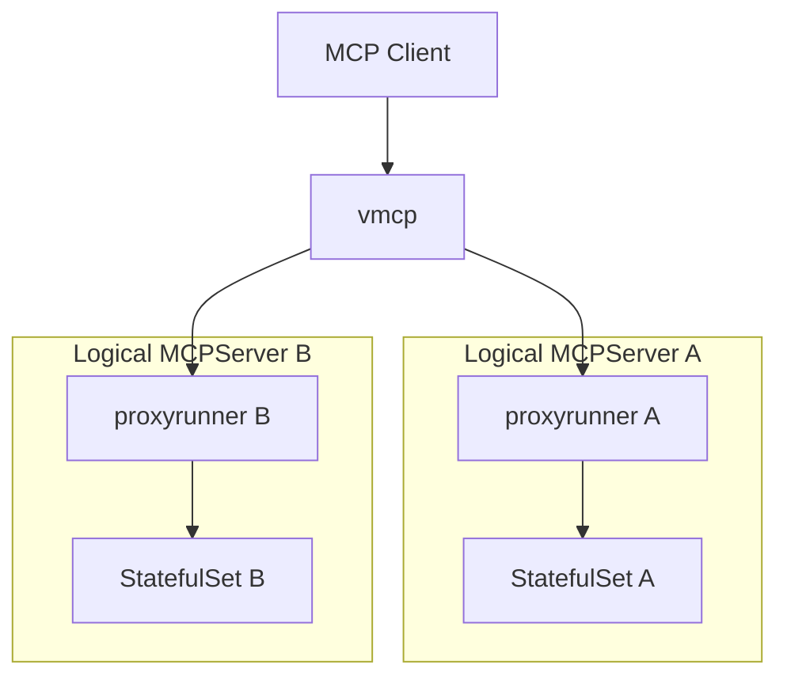
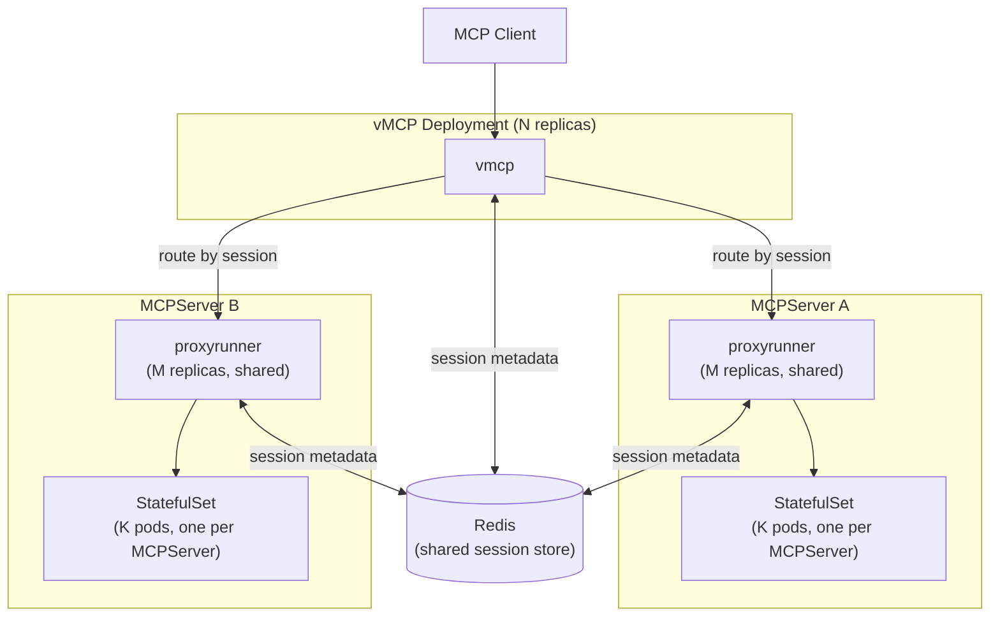

# THV-XXXX: Horizontal Scaling for vMCP and Proxy Runner

- **Status**: Draft
- **Author(s)**: Jeremy Drouillard (@jerm-dro)
- **Created**: 2026-03-04
- **Last Updated**: 2026-03-04
- **Target Repository**: toolhive
- **Related Issues**:
  - [toolhive#3986](https://github.com/stacklok/toolhive/pull/3986) - Enable sticky sessions on operator-created Services
  - [toolhive#3992](https://github.com/stacklok/toolhive/pull/3992) - Add ClusterIP service with SessionAffinity for MCP server backend
  - [THV-0038](https://github.com/stacklok/toolhive-rfcs/blob/main/rfcs/THV-0038-session-scoped-client-lifecycle.md) - Session-Scoped Client Lifecycle for vMCP

## Summary

ToolHive's `vmcp` and `thv-proxyrunner` components cannot currently be scaled horizontally because both hold session state in process-local memory. This RFC defines an approach to enable safe horizontal scale-out of these components by externalizing session state to a shared Redis store and implementing session-aware routing at each layer.

---

## 1. Background

### 1.1 Deployment Architecture

In Kubernetes mode, ToolHive deploys MCP servers using a two-tier model:



The **operator** (`thv-operator`) watches `MCPServer` and `VirtualMCPServer` CRDs and reconciles them into Kubernetes resources. For each `MCPServer`, the operator creates:
- A **Deployment** running `thv-proxyrunner` — which proxies traffic to the MCP server backend
- A **StatefulSet** running the actual MCP server image, created and managed by the proxyrunner via Kubernetes server-side apply
- A **Service** exposing the proxyrunner to clients (or to vMCP)

All replicas of a proxyrunner Deployment share a **single StatefulSet** — on startup, every replica independently applies the same StatefulSet spec using server-side apply with a shared field manager (`toolhive-container-manager`), converging on the same desired state without leader election.

**Replica configurability today**: Neither `MCPServer` nor `VirtualMCPServer` CRDs expose a `replicas` field. Both the proxyrunner Deployment and the vMCP Deployment are created with a hardcoded replica count of 1. The StatefulSet created by the proxyrunner is also hardcoded to 1 pod. See §2 for the constraints this creates.

The **Virtual MCP Server** (`vmcp`) sits above the proxyrunner tier. It presents a unified MCP endpoint to external clients, discovers backends from an `MCPGroup`, aggregates their capabilities, and routes inbound tool calls to the appropriate backend proxyrunner.

### 1.2 Session Management Infrastructure

#### Transport-Layer Sessions (proxyrunner)

The proxyrunner implements session tracking via `pkg/transport/session`. Each MCP session is represented as a `Session` object stored in a `Storage` backend. The `Storage` interface was designed from the outset to support pluggable backends:

```go
type Storage interface {
    Store(ctx context.Context, session Session) error
    Load(ctx context.Context, id string) (Session, error)
    Delete(ctx context.Context, id string) error
    DeleteExpired(ctx context.Context, before time.Time) error
    Close() error
}
```

Today, only `LocalStorage` (in-process memory map) is implemented. The `Storage` interface is the extension point this RFC targets.

#### vMCP Session-Scoped Architecture (THV-0038)

[THV-0038](https://github.com/stacklok/toolhive-rfcs/blob/main/rfcs/THV-0038-session-scoped-client-lifecycle.md) refactored vMCP's session management to introduce explicit session lifecycle: backend HTTP clients are created once at session initialization, reused for all requests within the session, and closed on expiry. The resulting `MultiSession` interface owns the routing table for that session (which tool belongs to which backend), as well as live backend connections.

The `session.go` documentation in the codebase is explicit about the distributed scaling trade-off:

> **Distributed deployment note**: Because MCP clients cannot be serialised, horizontal scaling requires sticky sessions (session affinity at the load balancer). Without sticky sessions, a request routed to a different vMCP instance must recreate backend clients (one-time cost per re-route). This is an accepted trade-off.
>
> A `MultiSession` uses a two-layer storage model:
> - **Runtime layer** (in-process only): backend HTTP connections, routing table, and capability lists. These cannot be serialized and are lost when the process exits. Sessions are therefore node-local.
> - **Metadata layer** (serializable): identity subject, connected backend IDs, and backend session IDs are written to the embedded `transportsession.Session` so that pluggable `transportsession.Storage` backends (e.g. Redis) can persist them.

This two-layer design is the key insight for this RFC: we can persist enough metadata to route any request to the correct pod, even if we cannot migrate the full session runtime.

#### Auth Server Storage (THV-0035)

ToolHive already uses Redis as an external storage backend for the embedded auth server's session and token state (see `MCPExternalAuthConfig.storage.redis`). This establishes Redis as a proven dependency in the ToolHive Kubernetes ecosystem and provides a reference for how to configure and connect to Redis from operator-managed pods.

### 1.3 Client IP Affinity (Current Workaround)

Two recent PRs implement a short-term mitigation:

- **[#3986](https://github.com/stacklok/toolhive/pull/3986)** sets `SessionAffinity: ClientIP` on all operator-created Services (for `MCPServer`, `MCPRemoteProxy`, and `VirtualMCPServer`). This causes kube-proxy to consistently route traffic from the same client IP to the same pod.
- **[#3992](https://github.com/stacklok/toolhive/pull/3992)** adds a dedicated ClusterIP Service (with `SessionAffinity: ClientIP`) for the MCP server StatefulSet backend, so the proxyrunner's connections to the backend are also sticky.

Client IP affinity reduces — but does not eliminate — session breakage. It fails when:
- Multiple clients share an IP (NAT, corporate proxy, load balancer)
- A pod is replaced (rolling update, crash recovery) and kube-proxy routes to a new pod
- The operator scales out and the new pod becomes the affinity target for existing clients
- vMCP itself is deployed behind a load balancer that masks client IPs

This approach is a useful stopgap but is not a foundation for intentional horizontal scaling.

### 1.4 The Inherent Constraint of Stateful Backends

MCP servers that use `stdio` transport are inherently stateful: the MCP protocol conversation is a single long-lived stdin/stdout stream between the proxyrunner and the container. This state cannot be shared or transferred between proxyrunner instances — the stream lives or dies with the process.

Even for `SSE` and `streamable-http` transports, where the backend MCP server speaks HTTP, individual backend connections carry session-specific negotiated state (e.g., the `Mcp-Session-Id` assigned by the backend server and known only to the proxyrunner that initialized the session). This means that *the proxyrunner is always the authoritative router for its sessions* — even with external storage, requests cannot be forwarded from one proxyrunner to another without re-initializing the backend session.

This is a structural constraint of the MCP protocol, not a ToolHive implementation choice, and it shapes the solution described in this RFC.

**A `stdio` backend couples itself to a specific proxyrunner process**: the proxyrunner is the only process attached to the MCP server container's stdin/stdout, and that attachment is exclusive and non-transferable. This coupling is why proxyrunners cannot be made fully fungible (stateless, interchangeable replicas where any replica can handle any request) as long as `stdio` transport is supported. Removing or isolating `stdio` support would be a prerequisite for a fully fungible proxyrunner design; that is a larger architectural change out of scope for this RFC.

---

## 2. Problems

The fundamental problem is that **all requests within an MCP session must be handled by the same process**, at every layer of the stack. Today, with single-replica deployments at each layer, this is automatic. With multiple replicas, it is not.

### 2.1 vMCP: Session-to-Pod Affinity

When `vmcp` runs with more than one replica, an inbound request carrying an `Mcp-Session-Id` may be routed by the Kubernetes Service to any vMCP pod. The pod that receives it may not have the session in its local `Storage`, which means:

1. It cannot look up the routing table (which tool → which proxyrunner)
2. It cannot reuse the backend HTTP clients associated with the session
3. It would have to re-initialize the session from scratch — a destructive operation that creates entirely new backend sessions, discards all in-progress state, and requires the client to restart its workflow

This applies equally to SSE and streamable-http sessions.

### 2.2 Current Scaling Limitations

#### Multiple vMCP replicas

The `VirtualMCPServer` CRD has no `replicas` field. The operator creates the vMCP Deployment with a hardcoded replica count of 1 and there is no declarative way to change it. vMCP therefore runs as a single pod today, and the session affinity problem described in §2.1 is not yet encountered in practice — but it will be as soon as operators need to scale vMCP for availability or load.

#### Multiple proxyrunner replicas per MCPServer

The `MCPServer` CRD has no `replicas` field. The operator creates the proxyrunner Deployment with a hardcoded replica count of 1. The reconciler enforces this: attempting to scale the Deployment (e.g., via `kubectl scale`) is overwritten by the next reconcile cycle. There is therefore no supported path to run multiple proxyrunner replicas for a single `MCPServer` today, regardless of transport.

#### Multiple pods in the backend StatefulSet

The proxyrunner hardcodes the StatefulSet to 1 pod; there is no CRD field to configure it. A user can attach an HPA directly to the StatefulSet outside of the operator's control, and it will create multiple pods — but without session-aware routing, requests are distributed across pods that do not share session state, producing `400 Bad Request: No valid session ID provided` errors. This failure mode was directly observed: a user's HPA experiment on an MCP server StatefulSet caused replicas to scale to three pods, and the error rate spiked immediately. This triggered the client-IP affinity mitigations in §1.3 and motivates the long-term solution in this RFC.

The correct scaling unit for the backend is the proxyrunner+StatefulSet pair (§3.1), not the StatefulSet alone.


### 2.3 The Same Problem at Both Layers

SSE and streamable-http share the same class of horizontal scalability problem:

| Transport | Session Carrier | Affected Layers |
|-----------|----------------|-----------------|
| `stdio` | Process stdin/stdout (unshareable) | Proxyrunner (cannot scale) |
| `sse` | `Mcp-Session-Id` header / SSE connection | vMCP + proxyrunner |
| `streamable-http` | `Mcp-Session-Id` header | vMCP + proxyrunner |

For `stdio`, each proxyrunner holds an exclusive stdin/stdout attachment to a single MCP server container. While it is technically possible to run multiple proxyrunner replicas each attached to their own container, this does not help: `stdio` servers do not support concurrent sessions within a single process, so each container handles exactly one session at a time. Horizontal scaling is about increasing concurrency; `stdio` is fundamentally not designed for it. Scaling `stdio`-backed servers for higher session concurrency would require a different approach (e.g., a pool of single-session containers assigned per client), which is out of scope for this RFC.

For `SSE` and `streamable-http`, the session exists as a logical identifier (`Mcp-Session-Id`) that can be tracked in external storage. Routing by session ID is possible if the right metadata is externalized.

---

## 3. Scope

### 3.1 In Scope

- **CRD replica fields**: Add explicit replica configuration to both CRDs so users can declaratively set the desired scale without bypassing the operator:
  - `VirtualMCPServer.spec.replicas` — number of vMCP Deployment pods.
  - `MCPServer.spec.replicas` — number of proxyrunner Deployment pods (capped at 1 for `stdio` transport).
  - `MCPServer.spec.backendReplicas` — number of pods in the shared MCP server StatefulSet. There is exactly **one StatefulSet per `MCPServer`**, shared by all proxyrunner replicas (see §3.2).
- **Operator reconciler changes**: The operator must respect and preserve the new replica fields rather than hardcoding 1. The reconciler must stop overwriting manually-set replica counts.
- **Horizontal scale-out of `vmcp`**: Multiple vMCP replicas should be able to serve any request, regardless of which replica initialized the session. vMCP reads session routing metadata from shared storage to determine the correct proxyrunner, then proxies the request there.
- **Horizontal scale-out of `thv-proxyrunner`**: A single `MCPServer` is backed by multiple proxyrunner replicas sharing one StatefulSet. Each replica handles new sessions independently; existing sessions remain pinned to the replica that initialized them. Session metadata in shared storage allows any replica to look up which backend pod a given session belongs to.
- **Transport coverage**: `SSE` and `streamable-http` transports at both layers.
- **Manual scale-out without session disruption**: Changing replica counts in either CRD must not disrupt existing sessions. New requests may be routed to new replicas; existing sessions continue to route via the pod that initialized them.
- **Safe vMCP scale-in**: When a vMCP replica is removed, sessions previously handled by it can be served by remaining replicas using session metadata from Redis. vMCP scale-in is safe because the session runtime can be reconstructed from persisted metadata.
- **Proxyrunner scale-in (non-`stdio`)**: For `sse` and `streamable-http` transports, removing a proxyrunner replica is a defined, in-scope operation. Sessions on the removed pod are lost; clients must re-initialize. The system degrades gracefully rather than crashing or corrupting state. `stdio`-transport proxyrunner scale-in is out of scope (the stdin/stdout attachment cannot be transferred).
- **Enabling future auto-scaling**: The session storage mechanism is the prerequisite for HPAs and KEDA-based auto-scaling. This RFC does not define auto-scaling policy, but the design must not preclude it.

### 3.2 Out of Scope

- **`stdio` transport scaling**: The proxyrunner's attachment to the MCP container's stdin/stdout is inherently single-process. Horizontal scaling of stdio-backed servers requires re-initializing the container session and is out of scope for this RFC.
- **One StatefulSet per MCPServer (shared)**: The design maintains exactly one StatefulSet per `MCPServer`. All proxyrunner replicas for a given `MCPServer` share that single StatefulSet, converging on the same spec via server-side apply. Each proxyrunner replica routes its sessions to specific pods within the shared StatefulSet. Note: a 1:1 ratio (one StatefulSet per proxyrunner replica) could be a future direction if enabling `stdio` horizontal scaling were desired, since each proxyrunner would then have its own dedicated backend.
- **Moving MCP server deployment out of the proxyrunner**: The proxyrunner remains responsible for creating, managing, and proxying to the MCP server StatefulSet. Changing this responsibility boundary (e.g., having vMCP manage backends directly) is desirable long-term but is more work and out of scope.
- **Inter-proxyrunner request forwarding**: There is no inter-proxyrunner routing. vMCP routes each request to the proxyrunner pod recorded in the session metadata (best-effort). Proxyrunner pods are Deployment pods with ephemeral addresses — if the target pod is unreachable, the request fails gracefully and the session is lost. The system does not crash or enter a broken state; the client must re-initialize.
- **Auto-scaling policy**: How to trigger scale-out (HPA metrics, KEDA event sources, custom metrics) is deferred to a follow-on RFC. This RFC makes auto-scaling possible; it does not specify when or how to do it.
- **Graceful proxyrunner drain**: Waiting for sessions to expire before removing a proxyrunner pod is a future work item. Session loss on pod removal is accepted behavior for this RFC.
- **Backend StatefulSet scale-in**: Removing pods from the `MCPServer` StatefulSet (reducing `spec.backendReplicas`) is always disruptive — the backend session state lives in the removed process and cannot be reconstructed. Graceful drain of backend pods is out of scope for this RFC.

### 3.3 Scaling Summary

| Component | CRD Field | Scale Out | Scale In |
|-----------|-----------|-----------|---------|
| **vMCP** (`VirtualMCPServer`) | `spec.replicas` | No disruption — new replicas serve new sessions; existing sessions rerouted via Redis | No disruption — remaining replicas pick up sessions from Redis metadata |
| **proxyrunner** (`MCPServer`, non-`stdio`) | `spec.replicas` | No disruption — new replicas share the existing StatefulSet and handle new sessions; existing sessions remain pinned to their originating replica | Sessions on the removed pod are lost; client must re-initialize. System fails gracefully. `stdio` scale-in not supported. |
| **backend** (`MCPServer` StatefulSet) | `spec.backendReplicas` | New pods available for new sessions; proxyrunner routes sessions to specific pods via Redis | **Disruptive** — backend session state on the removed pod is lost and cannot be reconstructed |

---

## 4. High-Level Solution

The solution externalizes session metadata to a shared Redis store at each layer, and introduces session-aware routing logic so that any replica can handle a request by locating the pod that owns the session.

### 4.1 Architecture Overview



### 4.2 What Gets Stored in Redis

Two categories of session metadata are externalized. Neither contains sensitive data; both contain only identifiers and pod addressing information needed for routing.

#### vMCP Session Record

Written by the vMCP pod when a session is initialized (on `initialize` request). Used by any vMCP replica to route subsequent requests for the same session.

A vMCP session spans multiple backends (one per `MCPServer` in the `MCPGroup`). The record therefore carries a `backends` array — one entry per backend connection — alongside top-level identity metadata.

```
Key:   vmcp:session:{mcp-session-id}
TTL:   Configurable (default: matches vMCP session TTL)
Value: {
  "session_id":   "...",            // Mcp-Session-Id assigned to client
  "subject":      "...",            // identity subject for audit
  "created_at":   "...",
  "updated_at":   "...",
  "backends": [
    {
      "backend_id":         "...",  // MCPServer workload ID
      "proxyrunner_url":    "...",  // pod-DNS URL of the owning proxyrunner replica
      "backend_session_id": "..."  // Mcp-Session-Id assigned by the backend server
    }
  ]
}
```

Each `proxyrunner_url` is the pod's internal DNS name (e.g., `http://proxyrunner-pod-0.proxyrunner-svc.namespace.svc.cluster.local:8080`), not the Service ClusterIP — necessary to target a specific replica, not load-balance across them.

#### proxyrunner Session Record

Written by the proxyrunner pod when it initializes a backend session. Serves two purposes: (1) maps a session ID to the backend pod that owns it, enabling routing on a cache miss; (2) stores the identity subject from the originating vMCP session to prevent session hijacking — an attacker who learns a valid `Mcp-Session-Id` cannot use it without also presenting the correct identity.

```
Key:   proxyrunner:{mcpserver-id}:session:{session-id}
TTL:   Configurable (default: matches proxyrunner session TTL)
Value: {
  "session_id":   "...",            // session ID (Mcp-Session-Id)
  "subject":      "...",            // identity subject from originating vMCP session
  "backend_pod":  "...",            // which StatefulSet pod hosts this session
  "backend_url":  "http://...",     // pod-DNS URL of the backend pod
  "created_at":   "...",
  "updated_at":   "..."
}
```

The `subject` field is validated on every request: the proxyrunner rejects requests where the caller's identity does not match the session's stored subject. This requirement is being implemented as part of the session-scoped work (THV-0038).

### 4.3 Request Routing at Each Layer

#### vMCP Routing

A vMCP session spans multiple backends; each backend has its own underlying connection and `backend_session_id`. When vMCP receives a request, it first identifies the target backend from the routing table (which tool/resource/prompt → which `MCPServer`), then finds the correct proxyrunner replica for that backend.

1. **No `Mcp-Session-Id`** (new session / `initialize`): Initialize connections to all backends in the `MCPGroup`. Record the session in Redis with a `backends` array containing each backend's proxyrunner pod URL and assigned `backend_session_id`. Proceed normally.
2. **Known `Mcp-Session-Id`** (session in local storage): Identify the target backend from the routing table. Route the request to the proxyrunner replica that owns that backend's session (existing behavior).
3. **Unknown `Mcp-Session-Id`** (not in local storage, found in Redis): Reconstruct the session runtime from the `backends` array in Redis (re-establish connections to each proxyrunner). Then route as in case 2. This is a one-time cost on first contact after re-route.
4. **Unknown `Mcp-Session-Id`** (not in Redis): Return `400 Bad Request` — client must re-initialize.

Cases 3 handles the "request hits wrong vMCP pod" scenario without re-initializing the session from the client's perspective.

#### proxyrunner Routing

The proxyrunner's sole routing concern is: given a session ID, which backend pod handles it? vMCP is responsible for ensuring each request arrives at the correct proxyrunner replica. With shared storage:

1. **Known session** (exists in local storage): Route to the pinned backend pod (existing behavior).
2. **Unknown session** (not in local storage): Look up in Redis.
   - Found: Route to the `backend_url` from the Redis record.
   - Not found: Return `400 Bad Request`.

Note: **The proxyrunner never forwards requests to another proxyrunner**. If vMCP routes a request to the wrong proxyrunner replica, the proxyrunner rejects it and returns an error. Correctness of vMCP's routing layer is therefore critical.

### 4.4 Redis Configuration

Redis is an opt-in external dependency. When not configured, both vMCP and proxyrunner fall back to local in-memory storage (current behavior), with single-replica semantics.

Configuration is consistent with the existing pattern from THV-0035 (auth server Redis storage):

**For vMCP** (`VirtualMCPServer` CRD):

```yaml
apiVersion: toolhive.stacklok.dev/v1alpha1
kind: VirtualMCPServer
spec:
  replicas: 3                    # new field: vMCP Deployment pod count
  sessionStorage:
    provider: redis
    redis:
      address: "redis:6379"
      db: 0
      keyPrefix: "vmcp:session:"
      passwordRef:
        name: redis-auth
        key: password
```

**For proxyrunner** (`MCPServer` CRD):

```yaml
apiVersion: toolhive.stacklok.dev/v1alpha1
kind: MCPServer
spec:
  replicas: 3                    # new field: proxyrunner Deployment pod count (capped at 1 for stdio)
  backendReplicas: 2             # new field: StatefulSet pod count (one StatefulSet per MCPServer)
  sessionStorage:
    provider: redis
    redis:
      address: "redis:6379"
      db: 0
      keyPrefix: "proxyrunner:"
      passwordRef:
        name: redis-auth
        key: password
```

When `provider` is omitted or set to `memory`, existing local-storage behavior is preserved.

### 4.5 Pod-Addressable Services

For vMCP to route to a specific proxyrunner pod (not just any pod behind the Service), each proxyrunner Deployment needs a **headless Service** (or pod-level DNS) so that individual pod addresses are resolvable. The proxyrunner stores its own pod DNS name in Redis at startup. vMCP constructs the target URL from this stored address.

This is consistent with the existing pattern: proxyrunner already creates a headless Service for the MCP server StatefulSet (used internally for pod-level routing to the backend).

### 4.6 Architectural Note: Why the Proxyrunner Layer Exists

With vMCP taking responsibility for routing each request to the correct proxyrunner replica, it may appear that the proxyrunner is an unnecessary layer. It still provides meaningful value:

1. **stdio protocol translation**: The proxyrunner translates `stdio`-based MCP server communication to SSE/streamable-http for network transport. This translation is unavoidable for `stdio` backends — there is no way to eliminate this layer for them.
2. **Auth standardization**: The proxyrunner enforces authentication and authorization at the backend boundary, providing a consistent security layer regardless of how the backend MCP server handles auth.

For `sse` and `streamable-http` backends, the proxyrunner is a thinner value-add, and it could in theory be conditionally removed for those transports — making those backends directly addressable by vMCP. That is a larger, riskier architectural change deferred to future work.

---

## 5. Requirements

The following requirements define the success criteria for this RFC.

### 5.1 vMCP Requirements

- **R-VMCP-1**: Any incoming MCP request can be handled by any vMCP pod. vMCP reads session routing metadata from the shared session store to locate the correct proxyrunner pod and proxies the request there.
- **R-VMCP-2**: vMCP writes session metadata to the shared session store when a new session is initialized. The record includes the identity subject and a `backends` array with each backend's workload ID, proxyrunner pod URL, and backend-assigned session ID.
- **R-VMCP-3**: vMCP session metadata TTL in Redis must match or exceed the vMCP session TTL. Redis entries are refreshed on session activity.
- **R-VMCP-4**: When Redis is not configured, vMCP operates with local in-memory storage and single-replica semantics (no behavioral regression).
- **R-VMCP-5**: Adding vMCP replicas must not disrupt existing sessions. Existing sessions continue to route through their originating vMCP pod or, if that pod is unavailable, via Redis-based rerouting.

### 5.2 proxyrunner Requirements

- **R-PR-1**: The proxyrunner routes all requests within a session to the backend pod that initialized the session. There is no inter-proxyrunner request forwarding.
- **R-PR-2**: The proxyrunner writes session metadata (session ID, backend pod name, backend pod URL) to the shared session store when a new backend session is initialized.
- **R-PR-3**: The proxyrunner reads session metadata from the shared session store on a cache miss (session not in local memory) and routes accordingly.
- **R-PR-4**: The number of backend StatefulSet replicas (MCPServer pods) per proxyrunner is configurable in the `MCPServer` CRD spec. The proxyrunner uses session-aware routing to distribute sessions across its backends.
- **R-PR-5**: Multiple proxyrunner replicas serve a single `MCPServer`. vMCP is responsible for routing each session's requests to the correct proxyrunner replica.
- **R-PR-6**: When Redis is not configured, the proxyrunner operates with local in-memory storage and single-replica semantics (no behavioral regression).

### 5.3 Operator Requirements

- **R-OP-1**: The operator creates a pod-addressable headless Service (or equivalent DNS mechanism) for each proxyrunner Deployment so that individual pods can be targeted by vMCP. Note: proxyrunner replicas are not fungible — `stdio` transport binds a replica to a specific backend container. Fungible proxyrunners (fully stateless, interchangeable) would require eliminating `stdio` support, which is out of scope.
- **R-OP-2**: When session storage is configured on a `VirtualMCPServer` or `MCPServer`, the operator injects the Redis connection configuration into the vMCP or proxyrunner pods (credentials from Secrets, address/db from CRD spec).
- **R-OP-3**: Scaling out a `VirtualMCPServer` or proxyrunner `Deployment` replica count must not require changes to other resources (no cascading operator reconciliation for scale events).
- **R-OP-4**: The operator adds explicit replica fields to both CRDs: `VirtualMCPServer.spec.replicas` (vMCP pod count), `MCPServer.spec.replicas` (proxyrunner pod count, capped at 1 for `stdio` transport), and `MCPServer.spec.backendReplicas` (StatefulSet pod count). The reconciler must respect these fields and must not overwrite them. There is exactly one StatefulSet per `MCPServer`; `spec.backendReplicas` controls the pod count within that StatefulSet.

### 5.4 Deployment Requirements

- **R-DEP-1**: A single Redis instance (or Redis Sentinel / Cluster configuration) can be shared between vMCP session storage and proxyrunner session storage, as long as key prefixes are distinct.
- **R-DEP-2**: Redis is an optional dependency. ToolHive must remain deployable without Redis, with single-replica semantics.
- **R-DEP-3**: Manual scale-out of vMCP or proxyrunner (e.g., `kubectl scale deployment`) must not cause session disruption for active sessions.
- **R-DEP-4**: Scale-in of backend StatefulSet pods (`spec.backendReplicas` decrease) is inherently disruptive — the backend session state lives in the removed process and cannot be reconstructed on another pod. Documentation must clearly state this. Graceful drain of backend pods is out of scope for this RFC. Proxyrunner scale-in (non-`stdio`) is an accepted, in-scope operation where session loss is the expected outcome.

### 5.5 Security Requirements

- **R-SEC-1**: The proxyrunner session record stores the identity subject from the originating vMCP session. The proxyrunner validates the caller's identity against this stored subject on every request, rejecting requests where the identity does not match. This prevents session hijacking by a caller who has observed a valid `Mcp-Session-Id`.
- **R-SEC-2**: Session hijacking prevention is a hard requirement, not a best-effort check. Any request that fails subject validation must be rejected with an appropriate error (`401 Unauthorized` or `403 Forbidden`) and logged as a security event.
