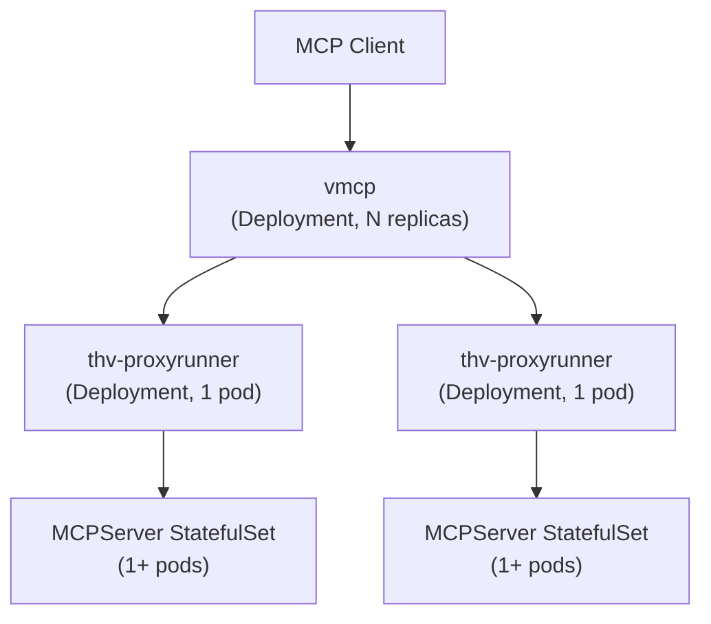
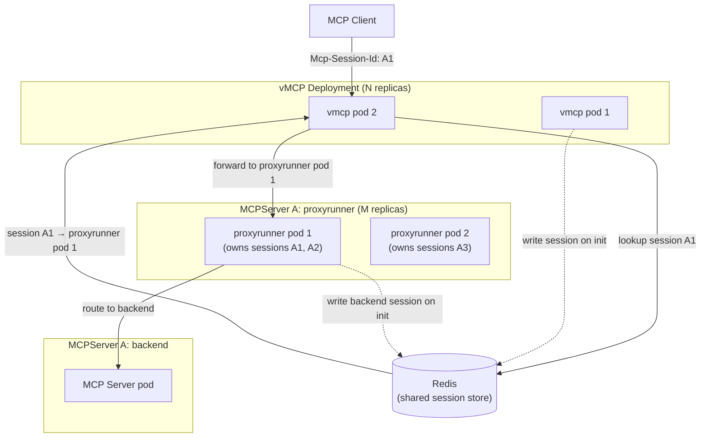

# THV-XXXX: Horizontal Scaling for vMCP and Proxy Runner

- **Status**: Draft
- **Author(s)**: Jeremy Drouillard (@jerm-dro)
- **Created**: 2026-03-04
- **Last Updated**: 2026-03-04
- **Target Repository**: toolhive
- **Related Issues**:
  - [toolhive#3986](https://github.com/stacklok/toolhive/pull/3986) - Enable sticky sessions on operator-created Services
  - [toolhive#3992](https://github.com/stacklok/toolhive/pull/3992) - Add ClusterIP service with SessionAffinity for MCP server backend
  - [THV-0038](https://github.com/stacklok/toolhive-rfcs/blob/main/rfcs/THV-0038-session-scoped-client-lifecycle.md) - Session-Scoped Client Lifecycle for vMCP

## Summary

ToolHive's `vmcp` and `thv-proxyrunner` components cannot currently be scaled horizontally because both hold session state in process-local memory. This RFC defines an approach to enable safe horizontal scale-out of these components by externalizing session state to a shared Redis store and implementing session-aware routing at each layer.

---

## 1. Background

### 1.1 Deployment Architecture

In Kubernetes mode, ToolHive deploys MCP servers using a two-tier model:



The **operator** (`thv-operator`) watches `MCPServer` and `VirtualMCPServer` CRDs and reconciles them into Kubernetes resources. For each `MCPServer`, the operator creates:
- A **Deployment** running `thv-proxyrunner` — which starts the MCP server container and proxies traffic to it
- A **StatefulSet** running the actual MCP server image, managed by the proxyrunner
- A **Service** exposing the proxyrunner to clients (or to vMCP)

The **Virtual MCP Server** (`vmcp`) sits above the proxyrunner tier. It presents a unified MCP endpoint to external clients, discovers backends from an `MCPGroup`, aggregates their capabilities, and routes inbound tool calls to the appropriate backend proxyrunner.

### 1.2 Session Management Infrastructure

#### Transport-Layer Sessions (proxyrunner)

The proxyrunner implements session tracking via `pkg/transport/session`. Each MCP session is represented as a `Session` object stored in a `Storage` backend. The `Storage` interface was designed from the outset to support pluggable backends:

```go
type Storage interface {
    Store(ctx context.Context, session Session) error
    Load(ctx context.Context, id string) (Session, error)
    Delete(ctx context.Context, id string) error
    DeleteExpired(ctx context.Context, before time.Time) error
    Close() error
}
```

Today, only `LocalStorage` (in-process memory map) is implemented. The `Storage` interface is the extension point this RFC targets.

#### vMCP Session-Scoped Architecture (THV-0038)

[THV-0038](https://github.com/stacklok/toolhive-rfcs/blob/main/rfcs/THV-0038-session-scoped-client-lifecycle.md) refactored vMCP's session management to introduce explicit session lifecycle: backend HTTP clients are created once at session initialization, reused for all requests within the session, and closed on expiry. The resulting `MultiSession` interface owns the routing table for that session (which tool belongs to which backend), as well as live backend connections.

The `session.go` documentation in the codebase is explicit about the distributed scaling trade-off:

> **Distributed deployment note**: Because MCP clients cannot be serialised, horizontal scaling requires sticky sessions (session affinity at the load balancer). Without sticky sessions, a request routed to a different vMCP instance must recreate backend clients (one-time cost per re-route). This is an accepted trade-off.
>
> A `MultiSession` uses a two-layer storage model:
> - **Runtime layer** (in-process only): backend HTTP connections, routing table, and capability lists. These cannot be serialized and are lost when the process exits. Sessions are therefore node-local.
> - **Metadata layer** (serializable): identity subject and connected backend IDs are written to the embedded `transportsession.Session` so that pluggable `transportsession.Storage` backends (e.g. Redis) can persist them.

This two-layer design is the key insight for this RFC: we can persist enough metadata to route any request to the correct pod, even if we cannot migrate the full session runtime.

#### Auth Server Storage (THV-0035)

ToolHive already uses Redis as an external storage backend for the embedded auth server's session and token state (see `MCPExternalAuthConfig.storage.redis`). This establishes Redis as a proven dependency in the ToolHive Kubernetes ecosystem and provides a reference for how to configure and connect to Redis from operator-managed pods.

### 1.3 Client IP Affinity (Current Workaround)

Two recent PRs implement a short-term mitigation:

- **[#3986](https://github.com/stacklok/toolhive/pull/3986)** sets `SessionAffinity: ClientIP` on all operator-created Services (for `MCPServer`, `MCPRemoteProxy`, and `VirtualMCPServer`). This causes kube-proxy to consistently route traffic from the same client IP to the same pod.
- **[#3992](https://github.com/stacklok/toolhive/pull/3992)** adds a dedicated ClusterIP Service (with `SessionAffinity: ClientIP`) for the MCP server StatefulSet backend, so the proxyrunner's connections to the backend are also sticky.

Client IP affinity reduces — but does not eliminate — session breakage. It fails when:
- Multiple clients share an IP (NAT, corporate proxy, load balancer)
- A pod is replaced (rolling update, crash recovery) and kube-proxy routes to a new pod
- The operator scales out and the new pod becomes the affinity target for existing clients
- vMCP itself is deployed behind a load balancer that masks client IPs

This approach is a useful stopgap but is not a foundation for intentional horizontal scaling.

### 1.4 The Inherent Constraint of Stateful Backends

MCP servers that use `stdio` transport are inherently stateful: the MCP protocol conversation is a single long-lived stdin/stdout stream between the proxyrunner and the container. This state cannot be shared or transferred between proxyrunner instances — the stream lives or dies with the process.

Even for `SSE` and `streamable-http` transports, where the backend MCP server speaks HTTP, individual backend connections carry session-specific negotiated state (e.g., the `Mcp-Session-Id` assigned by the backend server and known only to the proxyrunner that initialized the session). This means that *the proxyrunner is always the authoritative router for its sessions* — even with external storage, requests cannot be forwarded from one proxyrunner to another without re-initializing the backend session.

This is a structural constraint of the MCP protocol, not a ToolHive implementation choice, and it shapes the solution described in this RFC.

---

## 2. Problems

The fundamental problem is that **all requests within an MCP session must be handled by the same process**, at every layer of the stack. Today, with single-replica deployments at each layer, this is automatic. With multiple replicas, it is not.

### 2.1 vMCP: Session-to-Pod Affinity

When `vmcp` runs with more than one replica, an inbound request carrying an `Mcp-Session-Id` may be routed by the Kubernetes Service to any vMCP pod. The pod that receives it may not have the session in its local `Storage`, which means:

1. It cannot look up the routing table (which tool → which proxyrunner)
2. It cannot reuse the backend HTTP clients associated with the session
3. It would have to re-initialize the session from scratch — a disruptive, expensive operation that may not be semantically safe for the client

This applies equally to SSE and streamable-http sessions.

### 2.2 proxyrunner: Session-to-Pod Affinity

Each proxyrunner manages its own set of MCP server backends (StatefulSets). When a proxyrunner receives a request for an existing session, it must route it to the specific backend pod that owns that session. If the proxyrunner is scaled out to multiple replicas:

1. A request may arrive at a proxyrunner replica that did not initialize the backend session
2. The proxyrunner has no way to forward the request to the correct replica (there is no inter-proxyrunner routing)
3. The session must be re-initialized, which may involve re-connecting to the backend, repeating the MCP `initialize` handshake, and losing in-flight state

This failure mode can be observed in practice when scaling a proxyrunner `Deployment` or the underlying MCP server `StatefulSet` without session affinity: requests land on pods that do not own the session and return `400 Bad Request: No valid session ID provided`.


### 2.3 The Same Problem at Both Layers

SSE and streamable-http share the same class of horizontal scalability problem:

| Transport | Session Carrier | Affected Layers |
|-----------|----------------|-----------------|
| `stdio` | Process stdin/stdout (unshareable) | Proxyrunner (cannot scale) |
| `sse` | `Mcp-Session-Id` header / SSE connection | vMCP + proxyrunner |
| `streamable-http` | `Mcp-Session-Id` header | vMCP + proxyrunner |

For `stdio`, the proxyrunner is the only proxy and holds the exclusive stdin/stdout attachment to the MCP server container. There is no wire format to share this across replicas. Horizontal scaling of stdio-backed MCP servers is **not possible** without re-connecting to a new container, which is equivalent to a new session.

For `SSE` and `streamable-http`, the session exists as a logical identifier (`Mcp-Session-Id`) that can be tracked in external storage. Routing by session ID is possible if the right metadata is externalized.

---

## 3. Scope

### 3.1 In Scope

- **Horizontal scale-out of `vmcp`**: Multiple vMCP replicas should be able to serve any request, regardless of which replica initialized the session. vMCP should read session routing metadata from shared storage to determine the correct proxyrunner, then proxy the request there.
- **Horizontal scale-out of `thv-proxyrunner`**: Multiple proxyrunner replicas should be able to serve requests for the `MCPServer` instances that they own. Session metadata stored externally allows any proxyrunner replica to verify it owns the session and route to the correct backend pod.
- **Transport coverage**: `SSE` and `streamable-http` transports at both layers.
- **Manual scale-out without session disruption**: Adding replicas to either a `vmcp` Deployment or a proxyrunner Deployment must not disrupt existing sessions. New requests may be routed to new replicas; existing sessions continue to route via the pod that initialized them.
- **Enabling future auto-scaling**: The session storage mechanism is the prerequisite for HPAs and KEDA-based auto-scaling. This RFC does not define auto-scaling policy, but the design must not preclude it.

### 3.2 Out of Scope

- **`stdio` transport scaling**: The proxyrunner's attachment to the MCP container's stdin/stdout is inherently single-process. Horizontal scaling of stdio-backed servers requires re-initializing the container session and is out of scope for this RFC.
- **Moving MCP server deployment out of the proxyrunner**: The proxyrunner remains responsible for creating, managing, and proxying to MCP server StatefulSets. This RFC does not change that responsibility boundary.
- **Inter-proxyrunner request forwarding**: Sessions are pinned to the proxyrunner that initialized them. There is no inter-proxyrunner routing. If the owning proxyrunner is unavailable, the session is lost (client must re-initialize).
- **Auto-scaling policy**: How to trigger scale-out (HPA metrics, KEDA event sources, custom metrics) is deferred to a follow-on RFC. This RFC makes auto-scaling possible; it does not specify when or how to do it.
- **Scale-in / pod draining**: Safely removing a proxyrunner replica requires draining active sessions first (waiting for them to expire or be migrated). Draining is complex and out of scope. Operators should expect session loss when forcibly scaling in. Graceful drain is a future work item.

---

## 4. High-Level Solution

The solution externalizes session metadata to a shared Redis store at each layer, and introduces session-aware routing logic so that any replica can handle a request by locating the pod that owns the session.

### 4.1 Architecture Overview



### 4.2 What Gets Stored in Redis

Two categories of session metadata are externalized. Neither contains sensitive data; both contain only identifiers and pod addressing information needed for routing.

#### vMCP Session Record

Written by the vMCP pod when a session is initialized (on `initialize` request). Used by any vMCP replica to route subsequent requests for the same session.

```
Key:   vmcp:session:{mcp-session-id}
TTL:   Configurable (default: matches vMCP session TTL)
Value: {
  "session_id":       "...",            // Mcp-Session-Id assigned to client
  "proxyrunner_url":  "http://...",     // pod-DNS URL of the owning proxyrunner
  "backend_id":       "...",            // the MCPServer workload ID
  "subject":          "...",            // identity subject for audit
  "created_at":       "...",
  "updated_at":       "..."
}
```

The `proxyrunner_url` is the pod's internal DNS name (e.g., `http://proxyrunner-pod-0.proxyrunner-svc.namespace.svc.cluster.local:8080`), not the Service ClusterIP. This is necessary because we need to route to a specific pod, not load-balance across replicas.

#### proxyrunner Session Record

Written by the proxyrunner pod when it initializes a backend session. Used by other proxyrunner replicas to verify they do not own a session (requests for unknown sessions are rejected or forwarded to the owning pod — see §4.3).

```
Key:   proxyrunner:{mcpserver-id}:session:{backend-session-id}
TTL:   Configurable (default: matches proxyrunner session TTL)
Value: {
  "session_id":     "...",             // Mcp-Session-Id from backend
  "pod_name":       "...",             // owning proxyrunner pod name
  "pod_url":        "http://...",      // pod-DNS URL of the owning proxyrunner
  "backend_pod":    "...",             // which StatefulSet pod hosts this session
  "created_at":     "...",
  "updated_at":     "..."
}
```

### 4.3 Request Routing at Each Layer

#### vMCP Routing

When vMCP receives a request:

1. **No `Mcp-Session-Id`** (new session / `initialize`): Assign the request to a backend according to the existing load-balancing strategy. Record the session in Redis with the proxyrunner pod URL. Proceed normally.
2. **Known `Mcp-Session-Id`** (session exists in local storage): The request is for a session this pod initialized. Route normally (existing behavior).
3. **Unknown `Mcp-Session-Id`** (session not in local storage, but found in Redis): Look up the proxyrunner pod URL from Redis. Forward the HTTP request to the correct proxyrunner pod (reverse-proxy). This is a transparent proxy — the client is unaware.
4. **Unknown `Mcp-Session-Id`** (not in Redis): Return `400 Bad Request` (session not found — client must re-initialize). This is the same behavior as today.

Case 3 handles the "request hits wrong vMCP pod" scenario without re-initializing the session.

#### proxyrunner Routing

The proxyrunner's role is to route inbound requests to the correct backend pod. With shared storage:

1. **Known session** (exists in local storage): Route to the appropriate backend pod (existing behavior).
2. **Unknown session** (not in local storage): Look up in Redis.
   - If the session belongs to **this proxyrunner** (the `pod_name` matches): The session was likely evicted from local memory (e.g., pod restart). Re-initialize the backend session from metadata and continue. This is a best-effort recovery path.
   - If the session belongs to **a different proxyrunner**: This should not happen in the nominal flow (vMCP is responsible for routing to the correct proxyrunner). Return an error. Log as a routing inconsistency.
   - If not found in Redis: Return `400 Bad Request`.

Note: **The proxyrunner never forwards requests to another proxyrunner**. If vMCP routes a request to the wrong proxyrunner, the proxyrunner rejects it, and the client sees an error. Correctness of the vMCP routing layer is therefore critical.

### 4.4 Redis Configuration

Redis is an opt-in external dependency. When not configured, both vMCP and proxyrunner fall back to local in-memory storage (current behavior), with single-replica semantics.

Configuration is consistent with the existing pattern from THV-0035 (auth server Redis storage):

**For vMCP** (`VirtualMCPServer` CRD):

```yaml
apiVersion: toolhive.stacklok.dev/v1alpha1
kind: VirtualMCPServer
spec:
  sessionStorage:
    provider: redis
    redis:
      address: "redis:6379"
      db: 0
      keyPrefix: "vmcp:session:"
      passwordRef:
        name: redis-auth
        key: password
```

**For proxyrunner** (`MCPServer` CRD or operator-level configuration):

```yaml
apiVersion: toolhive.stacklok.dev/v1alpha1
kind: MCPServer
spec:
  sessionStorage:
    provider: redis
    redis:
      address: "redis:6379"
      db: 0
      keyPrefix: "proxyrunner:"
      passwordRef:
        name: redis-auth
        key: password
```

When `provider` is omitted or set to `memory`, existing local-storage behavior is preserved.

### 4.5 Pod-Addressable Services

For vMCP to route to a specific proxyrunner pod (not just any pod behind the Service), each proxyrunner Deployment needs a **headless Service** (or pod-level DNS) so that individual pod addresses are resolvable. The proxyrunner stores its own pod DNS name in Redis at startup. vMCP constructs the target URL from this stored address.

This is consistent with the existing pattern: proxyrunner already creates a headless Service for the MCP server StatefulSet (used internally for pod-level routing to the backend).

---

## 5. Requirements

The following requirements define the success criteria for this RFC.

### 5.1 vMCP Requirements

- **R-VMCP-1**: Any incoming MCP request can be handled by any vMCP pod. vMCP reads session routing metadata from the shared session store to locate the correct proxyrunner pod and proxies the request there.
- **R-VMCP-2**: vMCP writes session metadata (proxyrunner pod URL, backend ID, subject) to the shared session store when a new session is initialized.
- **R-VMCP-3**: vMCP session metadata TTL in Redis must match or exceed the vMCP session TTL. Redis entries are refreshed on session activity.
- **R-VMCP-4**: When Redis is not configured, vMCP operates with local in-memory storage and single-replica semantics (no behavioral regression).
- **R-VMCP-5**: Adding vMCP replicas must not disrupt existing sessions. Existing sessions continue to route through their originating vMCP pod or, if that pod is unavailable, via Redis-based rerouting.
- **R-VMCP-6**: vMCP exposes its own pod DNS address (or pod IP) in session metadata so that, in the future, routing between vMCP pods can also be implemented (not required in this RFC, but the data must be present).

### 5.2 proxyrunner Requirements

- **R-PR-1**: The proxyrunner routes all requests within a session to the backend pod that initialized the session. There is no inter-proxyrunner request forwarding.
- **R-PR-2**: The proxyrunner writes session metadata (owning pod name, pod URL, backend pod identity) to the shared session store when a new backend session is initialized.
- **R-PR-3**: The proxyrunner reads session metadata from the shared session store on a cache miss (session not in local memory) and routes accordingly.
- **R-PR-4**: The number of backend StatefulSet replicas (MCPServer pods) per proxyrunner is configurable in the `MCPServer` CRD spec. The proxyrunner uses session-aware routing to distribute sessions across its backends.
- **R-PR-5**: Multiple proxyrunner replicas can serve the same `MCPServer`'s traffic (one proxyrunner per group of sessions). vMCP is responsible for ensuring each session's requests arrive at the correct proxyrunner.
- **R-PR-6**: When Redis is not configured, the proxyrunner operates with local in-memory storage and single-replica semantics (no behavioral regression).
- **R-PR-7**: Adding proxyrunner replicas must not disrupt existing sessions. New sessions may be assigned to new replicas; existing sessions remain pinned to their originating proxyrunner pod.

### 5.3 Operator Requirements

- **R-OP-1**: The operator creates a pod-addressable headless Service (or equivalent DNS mechanism) for each proxyrunner Deployment so that individual pods can be targeted by vMCP.
- **R-OP-2**: When session storage is configured on a `VirtualMCPServer` or `MCPServer`, the operator injects the Redis connection configuration into the vMCP or proxyrunner pods (credentials from Secrets, address/db from CRD spec).
- **R-OP-3**: Scaling out a `VirtualMCPServer` or proxyrunner `Deployment` replica count must not require changes to other resources (no cascading operator reconciliation for scale events).

### 5.4 Deployment Requirements

- **R-DEP-1**: A single Redis instance (or Redis Sentinel / Cluster configuration) can be shared between vMCP session storage and proxyrunner session storage, as long as key prefixes are distinct.
- **R-DEP-2**: Redis is an optional dependency. ToolHive must remain deployable without Redis, with single-replica semantics.
- **R-DEP-3**: Manual scale-out of vMCP or proxyrunner (e.g., `kubectl scale deployment`) must not cause session disruption for active sessions.
- **R-DEP-4**: Manual scale-in of proxyrunner is inherently disruptive (the session lives only on the pod being removed). Documentation must clearly state this limitation. Graceful drain (waiting for sessions to expire before termination) is out of scope for this RFC.
